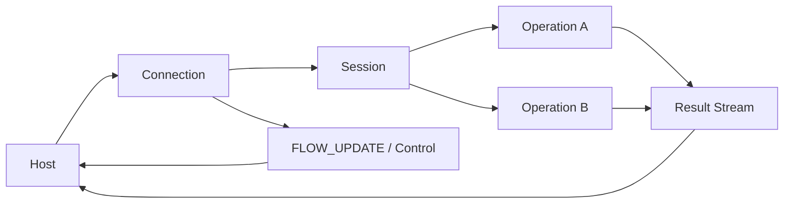
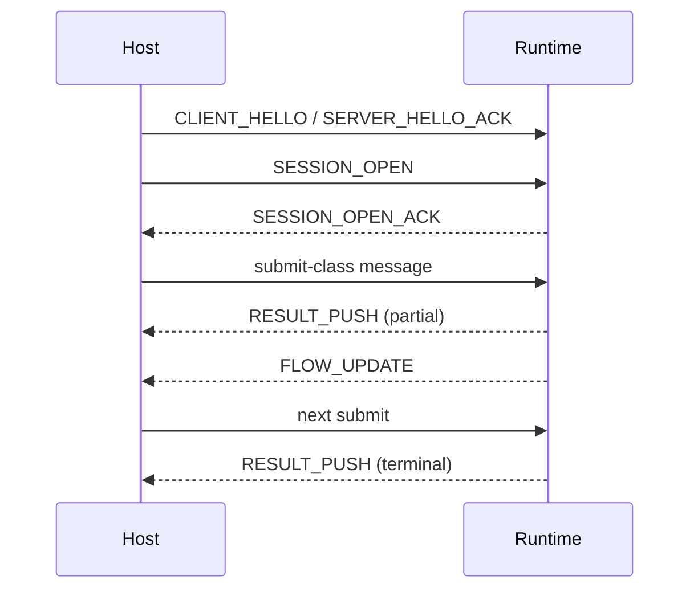

---
prev:
  text: Transport Strategy and Probing
  link: /en/protocol/v1/transport-strategy/
next:
  text: Common Header
  link: /en/common-header/
---

# Core Objects and Flow

This page focuses on the system model: which core objects exist, how they cooperate, and how the minimal interaction path fits together.

## Architecture Diagram

## Minimal Sequence Diagram

## Core participants

### Host

The host is the integrating side. It is responsible for:

1. Establishing the connection and sending work.
2. Tracking local context, cache state, and sending windows.
3. Consuming streamed results and control updates.

### Runtime service

The runtime side is responsible for:

1. Accepting submissions.
2. Returning incremental results, terminal results, hints, and control updates.
3. Adjusting flow control and backpressure based on resource pressure.

## Core objects

### Connection

The transport-level carrier for messages, multi-session containment, and connection-scope flow control.

### Session

The default-context container for profile, schema, budget window, and reusable state.

### Operation

The single execution unit for one submitted workload, its lifecycle, and its result stream.

### Profile and schema

They keep payload interpretation out of the public layer and make it explicit.

## Minimal interaction flow

1. Establish a reliable connection and complete bootstrap.
2. Create a session and declare default context.
3. Submit one or more operations.
4. Receive results, hints, and `FLOW_UPDATE` in parallel.
5. React to credit, backpressure, and terminal states.