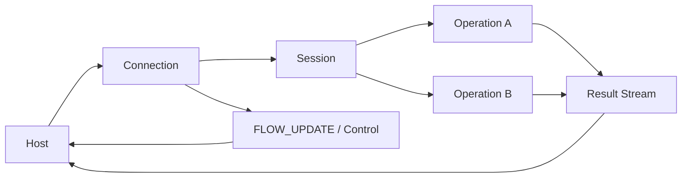
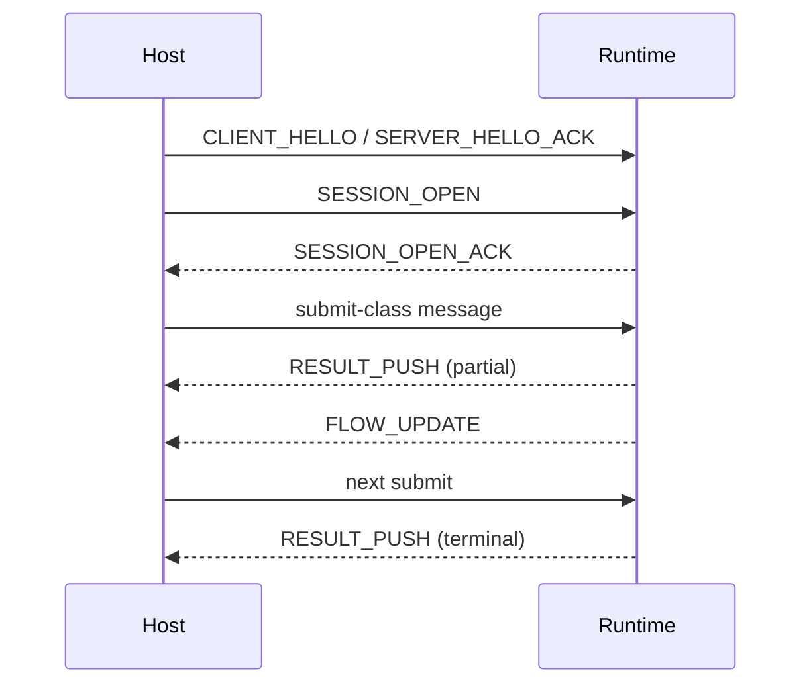

# Core Objects and Flow

This page focuses on the system model: which core objects exist, how they cooperate, and how the minimal interaction path fits together.

## Architecture Diagram

## Minimal Sequence Diagram

## Core participants

### Host

The host is the integrating side—a game engine, application, or agent framework. It establishes the connection, submits work, tracks local cache and session state, and consumes the result stream and control messages from the runtime.

### Runtime service

The runtime is the execution side. It accepts submitted work, returns incremental and terminal results, and adjusts flow control (via `FLOW_UPDATE`) based on available compute resources.

## Core objects

### Connection

The transport-level carrier for messages, multi-session containment, and connection-scope flow control.

### Session

The default-context container for profile, schema, budget window, and reusable state.

### Operation

The single execution unit for one submitted workload, its lifecycle, and its result stream.

### Profile and schema

They keep payload interpretation out of the public layer and make it explicit.

## Minimal interaction flow

1. Establish a reliable connection and complete bootstrap.
2. Create a session and declare default context.
3. Submit one or more operations.
4. Receive results, hints, and `FLOW_UPDATE` in parallel.
5. React to backpressure signals and terminal states—slow down, resume, or cancel as needed.