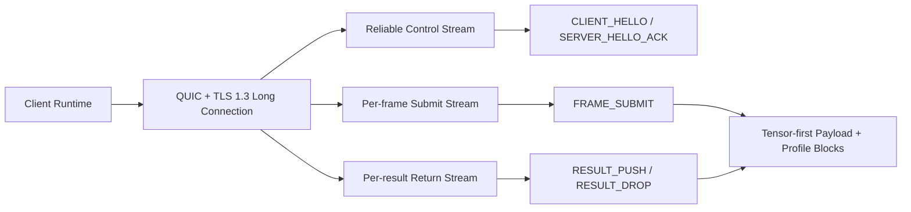

# NNRP/1-preview1 Protocol Design

## 1. Positioning

`NNRP (Neural Network Runtime Protocol)` is the formal protocol abbreviation used in this document. What this document defines is `NNRP/1-preview1`, not the final formal version `NNRP/1`.

`NNRP/1-preview1` is positioned as the first preview-stage wire contract that is implementable, packet-capturable, and replayable. Its goal is to provide a low-latency, securely deployable, domain-level application-layer protocol for lightweight real-time AI runtime long-connection scenarios, with tensor payloads as the primary focus in the first round.

preview1 is still a tensor-first preview version. It preserves the binary hot path, the 40-byte common header, and the tensor-first data plane, while constraining strong profile semantics such as camera, tile, and view to tensor-profile-specific capabilities or extension blocks rather than elevating them into public semantics shared by all scenarios by default.

The protocol boundary of preview1 is as follows:

1. Preserve the 40-byte common header, binary hot path, explicit self-describing lengths via `meta_len + body_len`, and the layered design of a reliable control plane and a high-frequency data plane.
2. The public layer retains only capability negotiation, frame-level budget semantics, result classification, and cache negotiation semantics that hold across profiles.
3. The tensor profile remains a first-class citizen, but camera, tile, and section topology appear as profile-specific structures rather than requiring all non-rendering scenarios to masquerade as tile/frame camera streams.

## 1.1 Overview Diagram

This diagram captures only the core mental model of preview1: a single long connection, a layered control plane and data plane, and a tensor-first data plane.

`NNRP` emphasizes lightweight operation and real time, but it is not a catch-all protocol. It primarily serves neural-network scenarios that require explicit runtime semantics, such as neural inference, neural rendering, multimodal inference, streaming generation, and tool orchestration, rather than generalizing to all real-time networked workloads.

Traditional Web audio/video calls, general video-stream distribution, and cloud gaming over video streams are not target scenarios for `NNRP/1-preview1`. The reason is not that these scenarios "do not need real time," but that their core problems center on browser compatibility, device capture and playback, A/V sync, hardware codec pipelines, jitter buffers, adaptive bitrate, echo cancellation, and mature media-distribution ecosystems. None of these are the protocol problems preview1 intends to solve, and forcefully covering them would only blur the protocol boundary.

It is not a general-purpose RPC, nor is it a transport adaptation layer for an existing framework. The formal version `NNRP/1` is expected to continue adding the following topics:

1. Multi-tenancy and tenant-level routing.
2. Concurrent multi-session / multi-traffic-class scheduling.
3. More complete quota, lease, and audit semantics.
4. Connection migration, recovery, and finer-grained QoS.

Therefore, this document is responsible only for `NNRP/1-preview1`; any capability not frozen by this document must not be misunderstood as already finalized in the formal version.

## 2. Design Goals

1. Carry the real-time AI runtime control plane and high-frequency data plane over a single secure long connection.
2. Negotiate most metadata that changes infrequently once during the initial handshake, and allow a small number of fields to be updated later through dedicated messages.
3. Explicitly separate tensor payloads from metadata to prevent large arrays from entering higher-level object serialization.
4. Make the wire layout regular, aligned, and explicitly sized so that it supports direct location, `memcpy`, block compression, and fast decompression.
5. Support multiple input profiles, optional logical lanes, multi-frame parallelism, and multiple tensor numeric formats.
6. Support session-level cache capability negotiation, low-frequency object caching, and profile-specific object references, leaving room for subsequent cache-reference optimizations.
7. Reserve extension slots for the future formal version `NNRP/1` rather than trying to pack in every capability in preview1.

## 3. Explicit Prohibitions

`NNRP/1-preview1` imposes the following explicit constraints on the high-frequency path:

1. JSON is forbidden on the hot paths of `FRAME_SUBMIT` and `RESULT_PUSH`.
2. Protobuf is forbidden on the hot paths of `FRAME_SUBMIT` and `RESULT_PUSH`.
3. Defining `NNRP` as an alias for a gRPC service, method, or message schema is forbidden.
4. Generic object serialization on the hot path that relies on field tags, varint scanning, or string-key lookup is forbidden.

If an implementation needs debugging, packet recording, or offline packaging, auxiliary formats may be defined on the tooling side, but they are not part of the online wire contract of `NNRP`.

## 4. Terminology

1. `connection`: a transport-layer long connection. The normative transport of preview1 is QUIC; the pluggable transport design is formalized in preview2.
2. `session`: an active AI runtime session instance on a connection; preview1 carries only one active session per connection.
3. `view`: an optional logical lane identifier, carried by `view_id`; in the tensor rendering profile it can map to a camera/viewpoint, and in other profiles it may also remain constantly `0`.
4. `frame`: one input or result exchange under a given `session_id + frame_id`; if a protocol implementation needs lane-level splitting, it can be further refined in combination with `view_id`.
5. `section`: a contiguous encoded semantic block of payload; in the tensor profile it usually corresponds to a tensor section, while in other profiles it may be replaced by the corresponding payload frame.
6. `codec`: the compression/encoding method for a single section, a single payload frame, or a single profile-specific block.

## 5. Transport Baseline and Connection Model

### 5.1 Secure Deployment Baseline

The normative transport of `NNRP/1-preview1` is fixed as:

1. `QUIC v1`
2. `TLS 1.3`
3. ALPN `nnrp/1-preview1`
4. Recommended secure URI scheme `nnrps://`

preview1 does not define a bare UDP plaintext mode.

The wire codec of preview1 (common header, message metadata, and body-block layout) is designed to be transport-independent. The header already contains self-describing lengths via `meta_len + body_len`, so it can be fully parsed on any reliable byte stream. `QUIC` is the only frozen transport binding in preview1; the normative definition of alternative transport bindings such as `TCP+TLS`, as well as the automatic transport-selection mechanism, is formalized by `NNRP/1-preview2`.

### 5.2 Responsibilities of the Connection and Streams

preview1 is fixed to a single-long-connection model, with QUIC as the normative transport:

1. One client runtime instance typically corresponds to one long connection.
2. In preview1, one connection carries only one active session.
3. One bidirectional reliable control stream carries handshake, acknowledgments, errors, and low-frequency control messages.
4. The client uses one unidirectional submit stream per frame to carry a complete `FRAME_SUBMIT`.
5. The server uses one unidirectional result stream per result to carry a complete `RESULT_PUSH` or `RESULT_DROP`.
6. Datagram is used only for small, discardable, non-reassembled coarse hints, such as `FRAME_CANCEL`, `PING`, and lightweight expiration notifications; large tensors must not go over datagram.

## 6. Initial Handshake and Low-Frequency Configuration Negotiation

### 6.1 Handshake Flow

The minimum handshake flow of preview1 is frozen as:

1. `CLIENT_HELLO`
2. `SERVER_HELLO_ACK`
3. Optional `SESSION_PATCH`
4. Optional `SESSION_PATCH_ACK`
5. Enter normal `FRAME_SUBMIT / RESULT_PUSH` exchange

Among them:

1. `CLIENT_HELLO` is used to declare client capabilities, constraints, and authentication material in one shot.
2. `SERVER_HELLO_ACK` is used to confirm the version, assign or confirm `session_id`, and return the negotiation result and server capabilities.
3. `SESSION_PATCH` is allowed to modify only a small number of low-frequency fields, so as to avoid repeating static metadata on every frame.

### 6.2 Required Information in `CLIENT_HELLO`

`CLIENT_HELLO` must cover the following low-frequency metadata:

1. Protocol version candidates and compatibility window.
2. The set of tensor codec / compression algorithms supported by the client.
3. Supported input profiles, payload kinds, object-reference capabilities, and the corresponding capability bitmaps.
4. Supported numeric formats and tensor layouts, such as `FP16 / FP8 / INT8 / UINT8` and `NHWC / NCHW`.
5. Optional logical-lane / profile-local topology capabilities; if a profile requires camera, tile, or other topology blocks, they should be declared through profile-specific capabilities rather than assumed as public fields by default.
6. Client cache capabilities, such as available cache budget, supported digest algorithms, and the number of supported cache namespaces.
7. The session-policy window expected by the client, such as resolution/shape range, target cadence, quality tier, latency priority, or degradation preference.
8. Authentication-related content such as `uid`, `token`, resume token, session-key material, or other opaque authentication blocks.
9. Optional `requested_session_id`; if it is `0`, the server assigns it.

#### 6.2.1 `CLIENT_HELLO` Fixed Metadata

The fixed metadata of `CLIENT_HELLO` is fixed at 64 bytes in the first round:

| Field | Type | Description |
| --- | --- | --- |
| `min_version_major` | `u8` | Minimum acceptable major version |
| `max_version_major` | `u8` | Maximum acceptable major version |
| `supported_stage_bitmap` | `u16` | Bitmap of supported stages; preview1 must at least set the `preview1` bit |
| `supported_profile_bitmap` | `u32` | Bitmap of supported profiles; the first round must at least declare the tensor profile |
| `supported_payload_kind_bitmap` | `u32` | Bitmap of supported payload kinds; the first round of preview1 is fixed to include `tensor` |
| `supported_codec_bitmap` | `u32` | Bitmap of supported codecs |
| `supported_compression_bitmap` | `u32` | Bitmap of supported compression methods |
| `supported_dtype_bitmap` | `u32` | Bitmap of supported dtypes |
| `supported_layout_bitmap` | `u32` | Bitmap of supported tensor layouts |
| `cache_digest_bitmap` | `u16` | Bitmap of supported cache digest algorithms |
| `cache_object_bitmap` | `u16` | Bitmap of cacheable object types |
| `cache_namespace_count` | `u16` | Number of supported cache namespaces |
| `max_lane_count` | `u16` | Maximum supported number of logical lanes; if only a single lane is supported, this is `1` |
| `max_cache_entries` | `u32` | Maximum number of cache objects acceptable to the client |
| `max_cache_bytes` | `u32` | Maximum cache footprint acceptable to the client |
| `target_cadence_x100` | `u16` | Desired cadence/FPS multiplied by 100 |
| `latency_budget_ms` | `u16` | Desired latency budget |
| `quality_tier` | `u16` | Desired quality tier |
| `degrade_policy` | `u16` | Desired degradation preference |
| `requested_session_id` | `u32` | Optional requested session id; if `0`, the server assigns it |
| `auth_bytes` | `u32` | Logical length of `auth_block` |
| `control_extension_bytes` | `u32` | Logical length of `control_extension_block`; `0` if absent |

Among them:

1. Profile-local topology capabilities, such as camera/tile capabilities in the tensor profile, do not enter the public fixed metadata, but are declared through the corresponding profile's control-plane extensions.
2. `quality_tier` and `degrade_policy` express only client preferences and do not mean the server must accept them unconditionally.
3. Both `auth_block` and `control_extension_block` belong to the body region; the fixed metadata provides only explicit length indexes.

### 6.3 Required Information in `SERVER_HELLO_ACK`

`SERVER_HELLO_ACK` must return the following confirmation results:

1. The selected protocol version and stage.
2. The effective `session_id`.
3. The actually accepted combination of profile / payload / codec / compression / dtype / layout / object-reference capabilities.
4. The effective cache policy, such as whether session-level caching is enabled, the maximum cache footprint, digest algorithm, object namespaces, and invalidation policy.
5. The effective session-policy window, active profile constraints, and optional logical-lane limits.
6. Server capabilities and limits, such as the maximum number of concurrent frames, maximum body size, maximum number of sections, and supported extension blocks or typed-payload limits.
7. Authentication result, token TTL, or session-renewal policy.

#### 6.3.1 `SERVER_HELLO_ACK` Fixed Metadata

The fixed metadata of `SERVER_HELLO_ACK` is fixed at 80 bytes in the first round:

| Field | Type | Description |
| --- | --- | --- |
| `selected_version_major` | `u8` | Major version selected by the server |
| `selected_version_stage` | `u8` | Stage selected by the server |
| `auth_status` | `u8` | Authentication-result enum |
| `reserved0` | `u8` | Reserved |
| `session_id` | `u32` | Effective session id |
| `accepted_profile_bitmap` | `u32` | Bitmap of profiles accepted by the server |
| `accepted_payload_kind_bitmap` | `u32` | Bitmap of payload kinds accepted by the server |
| `accepted_codec_bitmap` | `u32` | Bitmap of codecs accepted by the server |
| `accepted_compression_bitmap` | `u32` | Bitmap of compression methods accepted by the server |
| `accepted_dtype_bitmap` | `u32` | Bitmap of dtypes accepted by the server |
| `accepted_layout_bitmap` | `u32` | Bitmap of tensor layouts accepted by the server |
| `cache_digest_bitmap` | `u32` | Bitmap of effective cache digest algorithms |
| `cache_object_bitmap` | `u32` | Bitmap of effective cacheable object types |
| `max_cache_entries` | `u32` | Maximum number of cache objects allowed by the server |
| `max_cache_bytes` | `u32` | Maximum cache footprint allowed by the server |
| `max_lane_count` | `u16` | Maximum logical-lane count allowed by the server |
| `max_concurrent_frames` | `u16` | Maximum concurrent-frame count allowed by the server |
| `target_cadence_x100` | `u16` | Server-accepted cadence/FPS |
| `latency_budget_ms` | `u16` | Server-accepted budget |
| `quality_tier` | `u16` | Server-accepted quality tier |
| `degrade_policy` | `u16` | Server-accepted degradation policy |
| `max_body_bytes` | `u32` | Maximum body size of a single message |
| `token_ttl_ms` | `u32` | Validity period of the authentication result; `0` if absent |
| `retry_after_ms` | `u32` | Recommended retry time if the request cannot be accepted currently |
| `control_extension_bytes` | `u32` | Logical length of `control_extension_block`; `0` if absent |
| `server_flags` | `u32` | Server capability flags |

`server_flags` defines the following bits in the first round:

1. `0x00000001 = cache_enabled`
2. `0x00000002 = session_resume_supported`
3. `0x00000004 = profile_patch_required_for_shape_clamp`
4. All others reserved

Among them:

1. Profile-local topology limits, such as tile/section limits in the tensor profile, do not enter the public fixed metadata, but are declared through the corresponding profile's control-plane extensions or profile-patch semantics.
2. `accepted_profile_bitmap` allows the server to retain multiple profiles as the negotiable set; which profile is actually used on a per-frame basis is specified later by `FRAME_SUBMIT.profile_id`.
3. If `auth_status` indicates rejection, the sender may instead send `ERROR(auth_failed)` and close the connection; retaining this field allows a limited amount of structured rejection information to be carried in the ack.

### 6.4 Fields That May Be Changed Later

preview1 allows the following low-frequency fields to be modified through `SESSION_PATCH`:

1. Target cadence / FPS.
2. Quality tier or degradation preference.
3. Resolution or shape clamp.
4. Active logical-lane mask or profile-specific low-frequency policy.
5. Preferred codec / compression / payload policy.

The following content must not be modified in `SESSION_PATCH`; if it must change, the session should be rebuilt:

1. Authentication identity.
2. The base object namespace and the primary profile contract.
3. Incompatible primary contracts for dtype / tensor layout / payload.

### 6.5 `SESSION_PATCH` Metadata

`SESSION_PATCH` is used to update public session policy and the low-frequency policy of the current profile. Its fixed metadata is fixed at 36 bytes in the first round:

| Field | Type | Description |
| --- | --- | --- |
| `profile_id` | `u16` | Profile targeted by this patch; `0` means the current active profile |
| `reserved0` | `u16` | Reserved |
| `patch_mask` | `u32` | Bitmap of low-frequency fields, declaring which public fields or profile patch fields this patch intends to modify |
| `target_cadence_x100` | `u32` | Target cadence/FPS multiplied by 100; ignored if not set in the mask |
| `quality_tier` | `u16` | Target quality tier; ignored if not set in the mask |
| `degrade_policy` | `u16` | Degradation preference; ignored if not set in the mask |
| `active_lane_mask` | `u64` | Active logical-lane mask; ignored if not set in the mask |
| `preferred_codec_bitmap` | `u32` | Preferred codec bitmap; ignored if not set in the mask |
| `preferred_compression_bitmap` | `u32` | Preferred compression bitmap; ignored if not set in the mask |
| `profile_patch_bytes` | `u32` | Length of the profile-specific patch block immediately following metadata; `0` if absent |

`patch_mask` defines the following bits in the first round:

1. `0x00000001 = target_cadence`
2. `0x00000002 = quality_tier`
3. `0x00000004 = degrade_policy`
4. `0x00000008 = active_lane_mask`
5. `0x00000010 = preferred_codec`
6. `0x00000020 = preferred_compression`
7. `0x00000040 = profile_patch`

`degrade_policy` is frozen in the first round as:

1. `0 = server_default`
2. `1 = prefer_quality`
3. `2 = prefer_latency`
4. `3 = allow_aggressive_fallback`

### 6.6 `SESSION_PATCH_ACK` Metadata

`SESSION_PATCH_ACK` is used to confirm the application result of `SESSION_PATCH`. Its fixed metadata is fixed at 48 bytes in the first round:

| Field | Type | Description |
| --- | --- | --- |
| `status` | `u16` | `accepted / partial / rejected` |
| `reason` | `u16` | Stable reason code for rejection or partial acceptance |
| `applied_patch_mask` | `u32` | Bitmap of fields actually applied by the server |
| `rejected_patch_mask` | `u32` | Bitmap of fields rejected by the server |
| `retry_after_ms` | `u32` | If a retry is needed later, gives the recommended wait time |
| `effective_profile_id` | `u16` | Currently effective profile |
| `reserved0` | `u16` | Reserved |
| `effective_target_cadence_x100` | `u32` | Currently effective cadence/FPS |
| `effective_quality_tier` | `u16` | Currently effective quality tier |
| `effective_degrade_policy` | `u16` | Currently effective degradation preference |
| `effective_lane_mask` | `u64` | Currently effective logical-lane mask |
| `effective_codec_bitmap` | `u32` | Currently effective codec policy |
| `effective_compression_bitmap` | `u32` | Currently effective compression policy |
| `profile_patch_ack_bytes` | `u32` | Length of the profile-specific ack block immediately following metadata; `0` if absent |

`reason` defines the following stable values in the first round:

1. `0 = none`
2. `1 = invalid_field_mask`
3. `2 = immutable_field`
4. `3 = unsupported_value`
5. `4 = out_of_range`
6. `5 = server_busy`

### 6.7 Tensor Profile Patch Block

When `profile_id` points to the tensor profile and `patch_mask` contains `profile_patch`, the body of `SESSION_PATCH` starts with a fixed 16-byte `tensor_profile_patch_block`:

| Field | Type | Description |
| --- | --- | --- |
| `min_width` | `u32` | Minimum width for tensor-profile resolution/shape clamp |
| `min_height` | `u32` | Minimum height for tensor-profile resolution/shape clamp |
| `max_width` | `u32` | Maximum width for tensor-profile resolution/shape clamp |
| `max_height` | `u32` | Maximum height for tensor-profile resolution/shape clamp |

Correspondingly, the body of `SESSION_PATCH_ACK` may return a `tensor_profile_patch_ack_block` with the same 16-byte layout to indicate the currently effective tensor-profile clamp.

## 7. Reliability and Frame Classes

### 7.1 Content That Must Be Reliable

The following content must go over a reliable stream:

1. `CLIENT_HELLO / SERVER_HELLO_ACK / SESSION_PATCH / SESSION_PATCH_ACK / CLOSE / ERROR`.
2. The common header, fixed metadata, profile-specific block, and payload-descriptor region of `FRAME_SUBMIT`.
3. The common header, fixed metadata, profile-specific block, and payload-descriptor region of `RESULT_PUSH`.

### 7.2 Discardable Content and Header Adaptation

The following content is allowed to not be retransmitted:

1. `FRAME_CANCEL`.
2. Old results superseded by updated frames.
3. Frame results explicitly marked as `DISCARDABLE`.

The application rules of the `CAN_DROP` flag are as follows:

1. `RESULT_PUSH` and `RESULT_DROP` messages may set the `CAN_DROP = 1` flag to indicate that the message does not require retransmission.
2. After a message with `CAN_DROP = 1` is lost, the receiver must not request retransmission.
3. For all results of a `FRAME_SUBMIT` whose `frame_class = DISCARDABLE`, the server may automatically mark them with `CAN_DROP`.
4. Critical frames (`keyframe`) with `frame_class != DISCARDABLE` must not be marked `CAN_DROP`, and should always use a reliable stream.
5. More fine-grained discardability-policy negotiation, such as declaration of loss-tolerance levels, is formalized by `NNRP/1-preview2 §5.6`; preview1 does not define this negotiation mechanism.

### 7.3 Frame Classes

Every frame must explicitly carry `frame_class`, frozen in the first round as:

1. `0 = keyframe`: a key frame; subsequent frames may depend on it.
2. `1 = delta`: a regular delta frame.
3. `2 = retransmit`: a retransmitted frame with the same content or re-encoded content.
4. `3 = discardable`: a frame that is allowed to be proactively dropped and does not require retransmission.

If higher priority or finer-grained durability needs to be expressed, use additional bits in the common-header `flags` rather than introducing a nested object layer.

## 8. Common Message Header

All `NNRP/1-preview1` messages use a unified 40-byte common header, little-endian, with header length fixed to 8-byte alignment:

| Offset | Size | Field | Meaning |
| --- | --- | --- | --- |
| 0 | 4 | `magic` | ASCII `NNRP` |
| 4 | 1 | `version_major` | Currently fixed to `1` |
| 5 | 1 | `version_stage` | Currently fixed to `1`, meaning `preview1` |
| 6 | 1 | `msg_type` | Message type |
| 7 | 1 | `header_len` | Currently fixed to `40` |
| 8 | 4 | `flags` | Common flags |
| 12 | 4 | `meta_len` | Logical metadata length |
| 16 | 4 | `body_len` | Logical body length |
| 20 | 4 | `session_id` | Session number; may be `0` in the first `CLIENT_HELLO` |
| 24 | 4 | `frame_id` | Frame number; `0` for control messages |
| 28 | 2 | `view_id` | Logical lane number; `0` if there is no lane or for non-frame messages |
| 30 | 2 | `route_id` | Reserved in preview1 for subsequent tenant/routing extensions |
| 32 | 8 | `trace_id` | 64-bit trace identifier |

`flags` is frozen in the first round as follows:

1. `0x00000001 = ACK_REQUIRED`
2. `0x00000002 = CAN_DROP`
3. `0x00000004 = STALE`
4. `0x00000008 = EOS`
5. `0x00000010 = RETRANSMIT`
6. `0x00000020 = KEYFRAME`
7. All others reserved

## 9. First-Round Message Types

| Value | Name | Direction | Description |
| --- | --- | --- | --- |
| `0x01` | `CLIENT_HELLO` | C -> S | Initial handshake, capability declaration, authentication input |
| `0x02` | `SERVER_HELLO_ACK` | S -> C | Version confirmation, negotiation result, capability return |
| `0x03` | `SESSION_PATCH` | C -> S | Low-frequency parameter update |
| `0x04` | `SESSION_PATCH_ACK` | S -> C | Parameter-update acknowledgment |
| `0x05` | `CLOSE` | Bidirectional | Proactively close session / connection |
| `0x06` | `ERROR` | Bidirectional | Error and rejection |
| `0x10` | `FRAME_SUBMIT` | C -> S | Single-frame submission; logical lanes can be distinguished by `view_id` |
| `0x11` | `FRAME_CANCEL` | C -> S | Cancel an old frame or notify supersede |
| `0x12` | `RESULT_PUSH` | S -> C | Asynchronous result return |
| `0x13` | `RESULT_DROP` | S -> C | Result was dropped, expired, or superseded |
| `0x14` | `CACHE_PUT` | Bidirectional | Install a low-frequency cache object |
| `0x15` | `CACHE_ACK` | Bidirectional | Cache-object acknowledgment |
| `0x16` | `CACHE_INVALIDATE` | Bidirectional | Cache invalidation or eviction notification |
| `0x20` | `PING` | Bidirectional | Latency probe |
| `0x21` | `PONG` | Bidirectional | Latency-probe reply |

## 10. Alignment, Length, and Parsing Rules

### 10.1 Basic Rules

1. All metadata and body blocks must be described by explicit length fields.
2. The starting position of every block must be aligned to 8 bytes.
3. All padding bytes must be filled with `0`, and padding is not counted into the logical length.
4. On the hot path, parsing must not depend on varint, terminator scanning, or string-key matching.

### 10.2 Direct-Location Rules

After reading the common header, the parser must be able to perform the following actions directly based on `meta_len`, `body_len`, and the section descriptors:

1. Locate the profile-specific block region.
2. Locate a specific payload-descriptor region.
3. If `payload_kind=tensor`, further locate `tile_index_block`, `codec_table`, and `length_table`.
4. Locate the `payload_blob` of a specific payload.

This means the hot-path layout of preview1 must satisfy three constraints: fixed-size descriptors, explicit offsets, and contiguous payloads.

### 10.3 Control-Plane Extension Compatibility Rules

To avoid being forced into a destructive `1 -> 2` version migration merely to add extension capabilities after preview1 is frozen, preview1 formally reserves a constrained extension mechanism on the control plane, but this mechanism is used only for low-frequency control messages, not for the hot-path data plane.

1. `FRAME_SUBMIT` and `RESULT_PUSH` must not carry general custom request headers, string-key metadata, or other open-ended application extension blocks.
2. The only general extension entry in preview1 is reserved for the control plane; among standard messages, only `CLIENT_HELLO / SERVER_HELLO_ACK / SESSION_PATCH / SESSION_PATCH_ACK / CLOSE / ERROR` are allowed to use this entry first.
3. If `CLIENT_HELLO` carries a body, the body order is frozen as: `auth_block` first, optional `control_extension_block` second; the boundary between them is determined by `auth_bytes` and `control_extension_bytes` in the fixed metadata.
4. If `SERVER_HELLO_ACK` carries a body, the whole body is parsed as `control_extension_block`, and its length is determined by `control_extension_bytes` in the fixed metadata.
5. For other control messages, if no dedicated body semantics are defined, `body_len = 0` means no extension, and `body_len > 0` means the entire body is parsed as `control_extension_block`.
6. `control_extension_block` consists of zero or more TLV entries in order; each entry header is fixed at 8 bytes: `ext_type:u16`, `ext_flags:u16`, `ext_len:u32`, followed by `ext_len` bytes of payload and zero-padding to the next 8-byte boundary.
7. `ext_flags` reserves `0x0001` for `CRITICAL`; the sender may set it only when the receiver cannot safely continue processing if it does not recognize the extension.
8. Upon receiving an unknown extension with `CRITICAL=0`, the receiver must ignore that entry; upon receiving an unknown extension with `CRITICAL=1`, the receiver must return `ERROR(unsupported_capability)` and must not silently degrade.
9. If the TLV header, length, alignment, or tail truncation is invalid, the receiver must return `ERROR(malformed_body)`.
10. `ext_type` reserves the following ranges in the first round: `0x0001-0x3FFF` for protocol-standard extensions, `0x4000-0x7FFF` for experimental extensions in the current preview series, `0x8000-0xBFFF` for vendor/private extensions, and `0xC000-0xFFFF` for local debugging and non-interoperable purposes; `0x0000` is reserved and unused.
11. `route_id` in the common header, reserved `flags` bits, and `reserved` fields in all fixed metadata belong to protocol-level reservation and must not serve as custom-field entry points for business logic.
12. If per-frame customized capabilities need to be carried in the future, the protocol must first define constrained numeric extension blocks or a new preview stage, and must not fall back to an HTTP-style open header map.

## 11. `FRAME_SUBMIT` Layout

### 11.1 `FRAME_SUBMIT` Metadata

The public fixed metadata of `FRAME_SUBMIT` is fixed at 32 bytes in the first round:

| Field | Type | Description |
| --- | --- | --- |
| `profile_id` | `u16` | Current input profile |
| `payload_kind` | `u8` | In the first round of the preview1 data plane, fixed to `0=tensor` |
| `frame_class` | `u8` | Frame-class enum |
| `submit_flags` | `u16` | Public submit flags; reserved in the first round |
| `profile_flags` | `u16` | Profile-specific flags; interpreted by the corresponding profile |
| `latency_budget_ms` | `u16` | Latency budget |
| `cadence_hint_x100` | `u16` | Target cadence/FPS multiplied by 100 |
| `dependency_frame_id` | `u32` | If this frame depends on the context of an old frame, points to the dependency frame id; otherwise `0` |
| `profile_block_bytes` | `u32` | Total length of the profile-specific block immediately following metadata |
| `payload_descriptor_bytes` | `u32` | Total length of the payload-descriptor region |
| `payload_data_bytes` | `u32` | Total length of the payload-data region |
| `reserved0` | `u32` | Reserved |

### 11.2 Tensor Submit Block

When `profile_id` is the tensor profile, the body of `FRAME_SUBMIT` starts with a fixed 32-byte `tensor_submit_block`:

| Field | Type | Description |
| --- | --- | --- |
| `src_width` | `u16` | Input width |
| `src_height` | `u16` | Input height |
| `tile_width` | `u16` | Tile width |
| `tile_height` | `u16` | Tile height |
| `tile_count` | `u16` | Number of tiles in this frame |
| `section_count` | `u16` | Number of tensor sections |
| `tile_index_mode` | `u8` | Tile-index mode |
| `tensor_flags` | `u8` | Tensor-profile flags; reserved in the first round |
| `reserved0` | `u16` | Reserved |
| `tile_base_id` | `u32` | Starting tile id in `dense_range` mode |
| `camera_bytes` | `u32` | Length of the camera block |
| `tile_index_bytes` | `u32` | Length of the tile-index block |
| `reserved1` | `u32` | Reserved |

### 11.3 Multi-View Rules

The lane rules of preview1 are as follows:

1. `view_id` serves as an optional logical lane identifier at the public layer; in the tensor rendering profile it can map to a camera viewpoint.
2. The tensor rendering profile may still express multi-view input using the same `session_id + frame_id` with different `view_id` values.
3. Non-rendering profiles may keep `view_id` fixed at `0`, and the protocol layer must not require them to fabricate extra viewpoint-mapping tables.

### 11.4 Body Order

The organizational principle of the `FRAME_SUBMIT` body is:

1. `profile_block` region.
2. `payload_descriptor` region.
3. `payload_data` region.

For the tensor profile, the order of the `profile_block` region is frozen as:

1. `tensor_submit_block`
2. Optional `camera_block`
3. Optional `tile_index_block`

The `payload_descriptor` region and `payload_data` region continue to be organized in the order of `tensor_section[0..n]`.

### 11.5 Tile Index Modes

For the tensor profile, the first round reserves the following four encodings for tile-index mode:

1. `0 = dense_range`
2. `1 = raw_u16`
3. `2 = delta_u16`
4. `3 = bitset`

The wire uniformly uses `tile_id` and does not repeatedly send `tile_x / tile_y`.

## 12. `TensorSectionDesc` and Numeric Formats

### 12.1 Descriptor Layout

The descriptor of each `tensor_section` is fixed at 32 bytes:

| Offset | Size | Field | Meaning |
| --- | --- | --- | --- |
| 0 | 2 | `role_id` | Section semantic identifier |
| 2 | 1 | `codec_id` | Default codec |
| 3 | 1 | `dtype_id` | Numeric format |
| 4 | 1 | `layout_id` | Memory layout, such as `NHWC / NCHW` |
| 5 | 1 | `scale_policy` | Fixed-point / quantization scaling policy |
| 6 | 2 | `flags` | Section flags |
| 8 | 4 | `element_count_per_tile` | Number of elements per tile |
| 12 | 4 | `codec_table_bytes` | Length of the codec table |
| 16 | 4 | `length_table_bytes` | Length of the length table |
| 20 | 4 | `payload_bytes` | Length of the payload blob |
| 24 | 4 | `payload_stride_bytes` | Stride for fixed-length encoding; `0` for variable-length |
| 28 | 4 | `reserved` | Reserved |

### 12.2 Reserved Values of `dtype_id` in the First Round

1. `0 = fp16`
2. `1 = fp32`
3. `2 = fp8_e4m3`
4. `3 = fp8_e5m2`
5. `4 = int8`
6. `5 = uint8`
7. `6 = int16`
8. `7 = uint16`

preview1 must reserve `FP16 / FP8 / INT8`, and must not hard-code dtype semantics into section names.

### 12.3 Internal Order Within a Section

The internal order of `tensor_section` is fixed as:

1. `TensorSectionDesc`
2. Optional `codec_table`
3. `length_table`
4. `payload_blob`

Among them:

1. `codec_table` allows specifying the codec per tile; it may be omitted if all tiles use the same codec.
2. In the first round, `length_table` uniformly uses `u32` length items to avoid overflow with large payloads.
3. `payload_blob` must be concatenated contiguously in tile-index order.

## 13. `RESULT_PUSH` Layout

### 13.1 `RESULT_PUSH` Metadata

The public fixed metadata of `RESULT_PUSH` is fixed at 32 bytes in the first round:

| Field | Type | Description |
| --- | --- | --- |
| `status_code` | `u16` | Status such as success, degraded, or rejected |
| `result_flags` | `u16` | Flags such as stale, fallback, and partial |
| `active_profile_id` | `u16` | Effective server-side configuration identifier |
| `payload_kind` | `u8` | Results in the first round of preview1 are fixed to `0=tensor` |
| `reserved0` | `u8` | Reserved |
| `inference_ms` | `u16` | Inference duration |
| `queue_ms` | `u16` | Queueing duration |
| `server_total_ms` | `u16` | Total server-side duration |
| `reserved1` | `u16` | Reserved |
| `profile_block_bytes` | `u32` | Total length of the profile-specific block immediately following metadata |
| `payload_descriptor_bytes` | `u32` | Total length of the payload-descriptor region |
| `payload_data_bytes` | `u32` | Total length of the payload-data region |
| `reserved2` | `u32` | Reserved |

### 13.2 Tensor Result Block

When `active_profile_id` is the tensor profile, the body of `RESULT_PUSH` starts with a fixed 16-byte `tensor_result_block`:

| Field | Type | Description |
| --- | --- | --- |
| `section_count` | `u16` | Number of result sections |
| `tile_count` | `u16` | Number of returned tiles |
| `tile_index_mode` | `u8` | Tile-index mode |
| `tensor_flags` | `u8` | Tensor-profile flags; reserved in the first round |
| `reserved0` | `u16` | Reserved |
| `tile_base_id` | `u32` | Starting tile id in `dense_range` mode |
| `tile_index_bytes` | `u32` | Length of the tile-index block |

### 13.3 Body Order

The organizational principle of the `RESULT_PUSH` body is:

1. `profile_block` region.
2. `payload_descriptor` region.
3. `payload_data` region.

For the tensor profile, the order of the `profile_block` region is frozen as:

1. `tensor_result_block`
2. Optional `tile_index_block`

The `payload_descriptor` region and `payload_data` region continue to be organized in the order of `tensor_section[0..n]`.

Whether a result is discardable, stale, or a fallback is still expressed through the common-header `flags` and result metadata, without introducing text fields.

### 13.4 Reserved-Field Boundary of the preview1 Tensor Profile

preview1 explicitly retains the following render-oriented / topology-related semantics in the tensor profile, because they are still the fixed information required for the current tensor-first hot path to be independently parsed:

1. `src_width / src_height / tile_width / tile_height`.
2. `tile_count / section_count / tile_index_mode / tile_base_id`.
3. `camera_bytes / tile_index_bytes` and the corresponding inline `camera_block / tile_index_block`.
4. `view_id` as a public lane identifier, and the tensor rendering profile's viewpoint-mapping rule for it.
5. The clamp semantics of `min_width / min_height / max_width / max_height` in `tensor_profile_patch_block / tensor_profile_patch_ack_block`.

The following capabilities are no longer pushed back into the preview1 tensor profile. If reference mode, mixed mode, or non-tensor unified expression is needed, they are all moved uniformly to preview2:

1. Object-reference-first submission or result-return paths for `camera_block / tile_index_block / tensor section table / codec table`.
2. Typed payload descriptor / frame semantics for non-tensor payloads such as token, audio, video, structured event, tool delta, and opaque bytes.
3. Coverage, ordering, and profile-specific extension-frame semantics for non-tensor payloads.
4. Additional render-oriented detail fields that can be interpreted only through the object-reference or typed-payload body model.

Therefore, preview1 continues to maintain the boundary of being "tensor-first and independently fall-backable to full inline"; object-reference-first, mixed typed payload, and a broader multimodal body organization are formally handled by preview2.

## 14. Authentication and Session-Key Material

### 14.1 Principles of the Authentication Block

preview1 does not mandate a specific identity system, but requires that:

1. `CLIENT_HELLO` must reserve an independent `auth_block` for authentication material.
2. `auth_block` may carry `uid`, `token`, resume token, opaque attestation blob, session-key negotiation material, and so on.
3. `SERVER_HELLO_ACK` must return the authentication result, validity period, or rejection reason.

### 14.2 Session-Key Semantics

If the deployment side requires application-layer session-key semantics, it should follow the principles below:

1. Transport-layer confidentiality and forward secrecy are still provided by `TLS 1.3` / QUIC.
2. The application-layer session key is used only for authorization, resumption, or upper-layer payload protection policy, and must not replace TLS.
3. No key material may appear in high-frequency per-frame metadata.

## 15. State Machines

### 15.1 Connection and Session States

The connection / session state machine of preview1 is frozen as:

1. `INIT`: QUIC has been established, but `CLIENT_HELLO` has not yet completed.
2. `NEGOTIATING`: `CLIENT_HELLO` has been sent and `SERVER_HELLO_ACK` is pending.
3. `ACTIVE`: negotiation is complete, and `SESSION_PATCH`, `FRAME_SUBMIT`, and `RESULT_PUSH` are allowed.
4. `DRAINING`: one side has sent `CLOSE` or a fatal `ERROR`, and new frames are no longer accepted.
5. `CLOSED`: the connection or session has terminated.

State-transition rules:

1. `INIT -> NEGOTIATING`: send or receive `CLIENT_HELLO`.
2. `NEGOTIATING -> ACTIVE`: successfully receive `SERVER_HELLO_ACK`.
3. `NEGOTIATING -> CLOSED`: negotiation failure, authentication failure, or version incompatibility.
4. `ACTIVE -> ACTIVE`: low-frequency `SESSION_PATCH`, `CACHE_PUT`, and `CACHE_INVALIDATE` are allowed.
5. `ACTIVE -> DRAINING`: either side sends `CLOSE`, or a fatal `ERROR` is received.
6. `DRAINING -> CLOSED`: in-flight frames are drained, or forced closure occurs after timeout.

Sending `FRAME_SUBMIT` before `ACTIVE` is forbidden; after `DRAINING`, new `FRAME_SUBMIT` and `SESSION_PATCH` must not be accepted.

### 15.2 Single-Frame Lifecycle

The state machine of each `session_id + view_id + frame_id` is frozen as:

1. `ANNOUNCED`: the frame id has been generated locally but not yet sent.
2. `SUBMITTED`: `FRAME_SUBMIT` has been sent and the stream has been established.
3. `PROCESSING`: the peer has accepted it and started processing.
4. `READY`: the result has been generated and is waiting to be sent or applied.
5. `DELIVERED`: the corresponding `RESULT_PUSH` has been delivered successfully.
6. `DROPPED`: `RESULT_DROP` has been received or the frame has been superseded.
7. `CANCELLED`: explicitly canceled locally or by the peer.
8. `EXPIRED`: dropped after exceeding the deadline.

Among them:

1. If a `retransmit` frame depends on the context of an old frame, it must point to the original frame through `dependency_frame_id`.
2. Different `view_id` values under the same `frame_id` are treated as different logical lanes at the public layer and do not share lifecycle; the tensor rendering profile may map them to different viewpoints.
3. `DELIVERED / DROPPED / CANCELLED / EXPIRED` are all terminal states.

## 16. Error Handling

### 16.1 Principles of the `ERROR` Message

`ERROR` is a structured control message, not a free-text log. preview1 requires:

1. It must carry a stable `error_code`.
2. It may carry short diagnostic text, but the text is for debugging only and does not participate in protocol judgment.
3. It must mark the error scope: connection-level, session-level, or frame-level.

### 16.2 First-Round Error Codes

preview1 freezes the following error codes in the first round:

1. `0x0001 = unsupported_version`
2. `0x0002 = auth_failed`
3. `0x0003 = invalid_state`
4. `0x0004 = malformed_header`
5. `0x0005 = malformed_body`
6. `0x0006 = unsupported_capability`
7. `0x0007 = limit_exceeded`
8. `0x0008 = frame_expired`
9. `0x0009 = frame_cancelled`
10. `0x000A = cache_miss`
11. `0x000B = server_busy`
12. `0x000C = internal_error`

### 16.3 Error-Handling Rules

1. `unsupported_version`, `auth_failed`, and `malformed_header` are fatal errors by default and must transition into `DRAINING` or `CLOSED`.
2. `invalid_state`, `unsupported_capability`, and `limit_exceeded` may be handled as session-level rejections and do not require immediate disconnection.
3. `frame_expired`, `frame_cancelled`, and `cache_miss` are frame-level recoverable errors by default.
4. `server_busy` is allowed to carry retry advice; whether to retry is decided by the application side.
5. If `internal_error` cannot be scoped to a single frame, it is handled as a connection-level fatal error.

### 16.4 Relationship with the State Machine

1. After receiving a connection-level fatal `ERROR`, the receiver must stop sending new frames and enter `DRAINING`.
2. Receiving a frame-level `ERROR` must not affect the normal handling of other `view_id` or other `frame_id` values.
3. When `CACHE_PUT` fails, `cache_miss` or `limit_exceeded` should be returned preferentially rather than silently ignored.

## 17. Cache Semantics

### 17.1 Principles of Cache Design

The cache semantics of `NNRP/1-preview1` serve only the reuse of low-frequency objects within the protocol itself. The following principles are frozen in the first round:

1. Whether an object is cacheable.
2. Object identity is uniquely identified by a stable digest.
3. Invalidation, eviction, and revalidation policy.
4. Avoid resending low-frequency objects when the cache hits.

### 17.2 The Cache Boundary of preview1

What preview1 freezes is a "session-level low-frequency object cache":

1. The default cache scope is a single `session`.
2. Cache keys must be content-addressed stable digests, such as a 128-bit digest.
3. Cache objects are used preferentially for low-frequency, highly repetitive, and slowly changing blocks.
4. preview1 does not forcibly require hot-path frame payloads to become cache-reference-first; in the first round, `FRAME_SUBMIT` and `RESULT_PUSH` must still remain independently parseable.

### 17.3 Objects Suitable for Caching

1. `camera_block` templates or stable camera calibration blocks under the tensor profile.
2. Fixed tile-layout templates, bitset templates, or index templates under the tensor profile.
3. Low-frequency dictionaries, lookup tables, quantization parameters, and static codec-assistance blocks.
4. Certain stable result templates or fallback resources, but only when the sender explicitly declares them cacheable.

The following content should not be cached by default:

1. `auth_block`.
2. Per-frame dynamic tensors that change at high frequency.
3. Temporary detailed text used for a one-time transmission only.

### 17.4 Cache Negotiation and Control Messages

1. `CLIENT_HELLO` declares the client cache budget, digest support, and maximum number of cache objects.
2. `SERVER_HELLO_ACK` returns whether caching is enabled, the allowed cache object types, the maximum TTL, and the invalidation policy.
3. `CACHE_PUT` is used to install low-frequency cache objects and must go over the reliable control stream.
4. `CACHE_ACK` is used to confirm successful installation or the reason for rejection.
5. `CACHE_INVALIDATE` is used to evict a specified `cache_key`, namespace, or the entire session cache.

### 17.5 Cache Constraints and Trade-Offs

1. preview1 caches only binary blocks that can be independently named, independently invalidated, and independently reused.
2. preview1 does not require shared caches, nor reuse of cache objects across sessions.
3. preview1 prioritizes optimizing repeatedly sent template blocks, index templates, and low-frequency auxiliary blocks, rather than high-frequency dynamic tensors.
4. preview1 does not make cache hits a prerequisite for hot-path correctness; even when the cache misses, the sender should still be able to fall back to directly sending the full object.

## 18. Version Evolution and Reservation for the Formal Version

1. The ALPN of preview1 is fixed as `nnrp/1-preview1`.
2. If the formal version is released stably, it may converge to `nnrp/1`.
3. `route_id`, reserved `flags`, and several message-type ranges in the common header are reserved for later multi-tenancy, scheduling class, quota, and routing extensions.
4. Wire changes incompatible with preview1 must not silently overwrite preview1; they must be exposed through a new preview sequence number or a new major version.
5. For compatibility enhancements, optional capabilities, or new error codes, priority should be given to extension through capability bits, the control-plane `control_extension_block`, reserved flag bits, and new optional message types, rather than rewriting existing fixed-size headers.
6. If future hot-path cache references, concurrent multi-session semantics, or multi-tenant semantics are introduced, they should be explicitly exposed through a new preview stage rather than retroactively modifying the existing semantics of preview1.

## 19. First-Round Conclusion

The core of `NNRP/1-preview1` is not "moving some existing framework onto QUIC," but rather:

1. Clarify low-frequency static information during the initial handshake.
2. Send only the data that actually changes for each frame.
3. Large tensors travel only through regular binary sections, not higher-level object serialization.
4. Use fixed-width headers, explicit lengths, and 8-byte alignment to keep implementation simple, location direct, and compression-friendly.
5. First make preview1 a stable wire contract, then enter subsequent preview iterations, and only finally converge to the formal version `NNRP/1`.