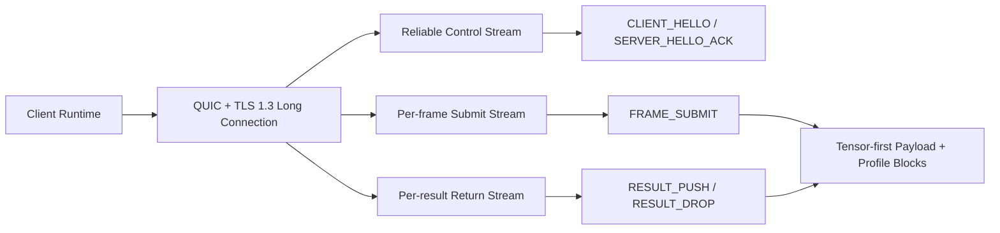

# NNRP/1-preview1 Design Summary

This page is the English counterpart of the archived `v1-preview1` design document.

It mainly captures the first runnable protocol skeleton:

1. A fixed common-header shape.
2. Basic control-plane and data-plane message families.
3. The original assumptions behind sessions, submit paths, and result return paths.

Use it when you need to understand the earliest baseline before preview2 and preview3 widened the protocol surface.