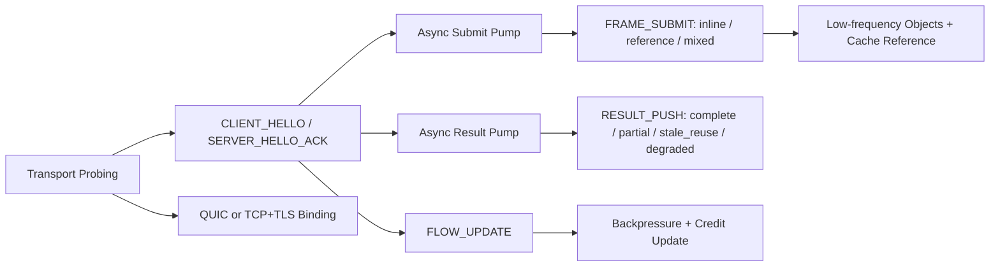

# NNRP/1-preview2 Design Summary

This page is the English counterpart of the archived `v1-preview2` design document.

preview2 is where the protocol froze the richer data-plane building blocks:

1. The 40-byte common header remained unchanged.
2. Typed payload descriptors and extension frames became first-class packet regions.
3. Multi-transport binding and asynchronous result pumping were formalized.

Use it when you need the historical rationale for typed payload tables, low-frequency objects, result-side hints, or flow-control evolution.