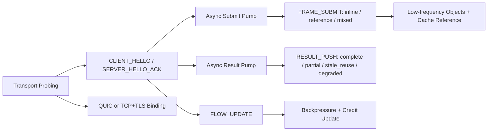

# NNRP/1-preview2 Protocol Design

## 1. Positioning

`NNRP` in this document has the formal full name `Neural Network Runtime Protocol`. `NNRP/1-preview2` is the second preview-stage design document on top of `NNRP/1-preview1`. Its goal is not to treat preview2 as a separate major-version track, but to fill in the protocol semantics that truly determine end-to-end latency while keeping the existing long-connection model, fixed header, and lower-level binary hot-path principles unchanged, and to elevate the positioning of the protocol from a "neural-rendering-specific link" to a "lightweight real-time AI domain-level application-layer protocol oriented toward neural-network runtime scenarios."

preview2 is no longer concerned only with "whether a connection can be established," but with the following four matters:

1. Allow the client and server to reuse low-frequency objects, avoiding full retransmission of stable content on every hot-path exchange.
2. Allow the protocol to explicitly express typed payload / extension frame semantics so that tensor, token, audio/video chunks, structured events, and tool deltas can all flow through unified real-time session semantics.
3. Allow the protocol to explicitly express runtime semantics required by low-latency scenarios, such as partial / stale / degrade / supersede.
4. Prevent endpoints and local integration layers from privately inventing their own rules for flow control, budgeting, degradation, object reference, and transport switching.

Here, too, "lightweight real time" does not mean `NNRP` is intended to become a general real-time media protocol. What it primarily solves are runtime problems in neural-network scenarios, such as semantic objects, inference budgets, result degradation, object reference, and transport switching, rather than the problems of browser media stacks or video-distribution stacks themselves.

What this document freezes is the design direction, first-order message semantics, and implementation boundary of `NNRP/1-preview2` as a development-stage document inside the NNRP/1 line. The code-level on-wire identity frozen by this document is `NNRP/1.0`.

## 1.1 Overview Diagram



This diagram corresponds to the reading thread of preview2: it is not merely adding fields, but pulling object references, an asynchronous result pump, explicit flow control, and transport probing into the protocol layer at the same time.

## 2. Topics Explicitly Covered by preview2

`NNRP/1-preview2` explicitly covers the following topics:

1. Semantics for installation, reference, invalidation, and reclamation of low-frequency objects within a session.
2. The three submission modes of `FRAME_SUBMIT`: inline / reference / mixed.
3. The semantics of complete results, partial results, stale results, and degraded results in `RESULT_PUSH`.
4. End-to-end budget negotiation, server-side degradation acknowledgments, and result latency metrics.
5. Explicit flow control and observability for limiting in-flight work, expressing server congestion, and guiding client backpressure.
6. Pluggable transport-layer design: define the TCP+TLS transport binding and introduce a throughput-probing-based automatic transport-selection mechanism (Transport Probing Phase).
7. Typed payload and extension-frame design: without changing the common header, incorporate tensor, token, audio/video chunks, structured events, and tool deltas into a unified data-plane model.

preview2 does not cover the following topics:

1. Multi-tenancy and aggregated scheduling across multiple connections.
2. Connection migration, resumable recovery, and formalization of resume tokens.
3. GPU-side zero-copy, specific rendering pipelines, or internal runtime thread models.
4. Final-formal-version multi-class QoS categorization and priority arbitration.
5. Browser-media capabilities for traditional Web audio/video calls, such as ICE/NAT traversal, device capture, A/V sync, AEC/NS/AGC, and SFU/MCU.
6. Continuous media-transport stacks for general video-stream distribution or cloud gaming over video streams, such as hardware codecs, jitter buffers, ABR, frame pacing, and display-chain optimization.

Therefore, traditional Web audio/video calls, general video live/VOD distribution, and cloud gaming over video streams must not be treated as the primary target business for `NNRP/1-preview2`. Even though these scenarios also emphasize real time, their principal contradiction remains media processing and distribution rather than neural-network runtime semantics; `NNRP` is better suited as an AI semantic-layer protocol than as a direct replacement for mature media protocol stacks.

## 3. Design Principles

preview2 keeps the following principles unchanged:

1. JSON and Protobuf remain forbidden on the hot path.
2. The common header remains fixed-length, little-endian, explicitly sized, and directly locatable in binary layout.
3. Low-frequency object negotiation continues over the reliable control stream; high-frequency typed payloads continue over submit/result streams.
4. Any latency-beneficial semantics must first become protocol concepts and then land in concrete implementations, rather than existing only as local private tricks.
5. Tensor remains the first standard payload profile, but preview2 no longer constrains the data plane to be "tensor only."
6. The normative session shape of preview2 is "an asynchronous submit pump + result pump + control side-channel on a single-session long connection," not "each `FRAME_SUBMIT` implicitly forms a synchronous request-response transaction."
7. `FRAME_SUBMIT` is responsible for expressing submission, budget, dependency, and payload semantics, and must not be interpreted at the protocol-semantics level as "submit this frame and wait for the matching result before continuing to send later frames."
8. If the host side still offers convenience calls such as `submit_and_wait`, they may be regarded only as smoke / demo conveniences and must not inversely define the standard invocation model of preview2.

## 4. Current NNRP/1 Code-Level Identity and Retained Messages

### 4.1 Code-Level Version Identity

preview2 freezes the emitted code-level wire identity as `NNRP/1.0`:

1. `version_major = 1`
2. `wire_format = 0`
3. ALPN `nnrp/1`

This does not mean the design-stage name stops being preview2. It means preview2, as a development-stage document inside NNRP/1, freezes the emitted wire identity to `NNRP/1.0`, where `wire_format = 0`, rather than keeping a preview-only code value such as `2` or a preview-only ALPN.

### 4.2 Common Header

preview2 continues to use the 40-byte common header and does not change the basic header shape:

1. It continues to retain `magic / version_major / wire_format / msg_type / header_len / flags / meta_len / body_len / session_id / frame_id / view_id / route_id / trace_id`.
2. `header_len` remains fixed at `40`.
3. The main evolution points of preview2 lie in message types, metadata field tables, body-block organization rules, and flag-semantic extensions rather than replacing the common header.

### 4.3 Retained Existing Messages

The following existing messages continue to be retained:

1. `CLIENT_HELLO`
2. `SERVER_HELLO_ACK`
3. `SESSION_PATCH`
4. `SESSION_PATCH_ACK`
5. `FRAME_SUBMIT`
6. `FRAME_CANCEL`
7. `RESULT_PUSH`
8. `RESULT_DROP`
9. `CACHE_PUT`
10. `CACHE_ACK`
11. `CACHE_INVALIDATE`
12. `PING`
13. `CLOSE`
14. `ERROR`

preview2 gives priority to extending the fields and semantics of existing messages, and adds new message types only when preview1 messages cannot carry the new semantics.

## 5. Protocol Capabilities That preview2 Must Add

### 5.1 Low-Frequency Object References

preview2 introduces the constraint that "object-level reference is a first-class citizen on the hot path."

Low-frequency objects cover at least the following categories:

1. Camera block templates, stable camera blocks, or other submission-context templates.
2. Tile-index blocks, payload-layout templates, or other reusable index objects.
3. Tensor section descriptor tables, or schema descriptors for token/audio/video/event payloads.
4. Low-frequency codec tables / length tables, tokenizer fragments, media chunk templates, or other encoding-assistance objects.
5. Reusable layout / residual objects on the result side, prompt segments, tool schemas, or other stable intra-session objects.

preview2 imposes the following constraints:

1. Low-frequency objects continue to be lifecycle-managed through `CACHE_PUT / CACHE_ACK / CACHE_INVALIDATE`.
2. `FRAME_SUBMIT` and `RESULT_PUSH` must allow inline blocks and cache-reference blocks to be carried at the same time.
3. Within the same frame, "some objects referenced, some objects inlined" is allowed; all-or-nothing must not be required.
4. Cache objects must have stable object-type, namespace, and version constraints; cache misses must be explicitly reported and must not silently fall back.

### 5.2 mixed Submit Mode

preview2 freezes the submission modes of `FRAME_SUBMIT` into three modes:

1. `inline`: inline all object blocks and typed payload frames in full.
2. `reference`: the main body sends only reference handles and a small amount of dynamic fields, without resending stable objects.
3. `mixed`: some blocks are inlined, and some blocks use cache references.

At the protocol layer, the server must be explicitly told:

1. Which blocks are newly inlined objects.
2. Which blocks are references to existing cache objects.
3. Which blocks are superseded or replaced by this frame.

### 5.3 partial / stale / degrade Result Semantics

preview2 no longer divides results simply into "there is a result" and "the result is dropped."

`RESULT_PUSH` must explicitly express the following result categories:

1. `complete`: a complete result.
2. `partial`: only part of the tiles, sections, token/audio/video chunks, or a lower-quality result is returned.
3. `stale_reuse`: the result reused an old frame or old object but is still displayable.
4. `degraded`: the server proactively degraded due to budget, congestion, or resource limits.

The corresponding constraints are:

1. `RESULT_PUSH` must be able to indicate which tiles are covered by this result.
2. `RESULT_PUSH` must be able to indicate whether the result references old objects, old frames, or old cache objects.
3. The client must be able to distinguish "a degraded result that is still displayable" from "a dropped result that is not displayable."

### 5.4 Budget and Degradation Negotiation

preview2 takes "budget is not a hint, but a runtime contract that the server must be able to acknowledge" as an explicit constraint.

At minimum, the protocol layer should cover:

1. The frame latency budget submitted by the client.
2. The execution strategy actually adopted by the server, such as `full / partial / stale / drop`.
3. Stable reason codes for server rejection or degradation.
4. The actual queue / compute / server_total metrics spent on the current result.

In low-latency scenarios, the client must know not only that it was "slow," but also why it was slow and whether the server has already proactively degraded.

### 5.5 Explicit Flow Control

preview2 formalizes "how many frames can be simultaneously in flight on a single connection, and when the server advises backpressure."

Minimum requirements:

1. Continue to negotiate `max_concurrent_frames` during the handshake.
2. Add a runtime flow-update mechanism so the server can dynamically tighten or relax credit.
3. The client must be able to distinguish different rejection reasons such as `queue_full`, `server_busy`, `budget_exceeded`, and `superseded`.

### 5.5A Continuous Asynchronous Stream Semantics

preview2 additionally freezes the following session-level constraints:

1. The client may continuously submit multiple `FRAME_SUBMIT` messages within the same session, provided the current `max_concurrent_frames` and runtime credit are not exceeded.
2. The server may complete results for different `frame_id` values out of order, as long as result metadata can explicitly declare `frame_id / dependency_frame_id / reused_frame_id / result_class`.
3. The client must allow `RESULT_PUSH / RESULT_DROP / FLOW_UPDATE / RESULT_HINT` to be received independently on the same long connection, rather than coupling result reading tightly to the return path of a specific submit call.
4. The purpose of `stale / superseded / degraded / drop` semantics is precisely to decouple result consumption from submission; old results may be explicitly invalidated, but this should not block updated frames from continuing to be submitted.
5. Therefore, the default interaction shape of preview2 should be a background result pump, explicit in-flight tracking, and deadline-based consumption, rather than per-frame synchronous waiting.
6. These constraints are runtime semantics that preview2 should land in the current stage and do not belong to version-level topics that must be postponed to preview3. Only when later wire-visible priority classes, recovery semantics, or more fine-grained multi-queue scheduling are needed should they enter later-version discussion.

### 5.6 Loss Tolerance Declaration

preview2 introduces session-level and frame-level **Loss Tolerance Declaration**, allowing the client to explicitly tell the server, "under current link quality, what content I allow to be not retransmitted," thereby avoiding the transport layer's infinite retry behavior in high-loss scenarios from blowing up RTT budgets, blocking server inference queues, or flooding the client receive buffer.

#### Design Goals

1. The client declares a global loss-tolerance policy during the handshake, and the server adjusts retransmission priority and `RESULT_DROP` timing accordingly.
2. When submitting a single frame, the client may override the global policy and further lower or raise the retransmission requirement of that frame.
3. The policy affects only the threshold by which the server decides whether dropping is allowed; it does not change the wire format and does not replace QUIC or TCP transport-layer retransmission control.

#### Loss-Tolerance Level Enum

preview2 freezes the following `loss_tolerance` enum values:

| Value | Name | Semantics |
| --- | --- | --- |
| `0` | `strict` | Dropping is not allowed; all results must be retransmitted until delivered or timed out |
| `1` | `best_effort` | Results exceeding the latency budget may be dropped without mandatory retransmission (default) |
| `2` | `low_latency` | Prioritize latency; as soon as RTT exceeds 50% of `latency_budget_ms`, the result may be dropped early |
| `3` | `fire_and_forget` | Retransmission is not required at all; each frame result is sent once on the server side and stops there, regardless of whether an ACK is received |

In `strict` mode, the server is still constrained by `latency_budget_ms`. Once over budget, it may only return `RESULT_DROP` rather than wait indefinitely. `fire_and_forget` is suitable only for high-frame-rate scenarios that can tolerate frame-to-frame jumps, and must not be used for key frames with `frame_class = keyframe`.

#### Session-Level Declaration (Handshake)

`CLIENT_HELLO` gains a new extension field `session_loss_tolerance: u8`, meaning the global default loss-tolerance level of the session. If this extension is absent, server behavior is equivalent to `best_effort`.

`SERVER_HELLO_ACK` gains a new extension field `accepted_loss_tolerance: u8`, returning the level actually accepted by the server. If the server does not support the level requested by the client, it should align conservatively and declare the actually effective value in this field.

#### Frame-Level Override (During Submission)

`FRAME_SUBMIT` v2 metadata adds a `loss_tolerance_policy: u8` field with the same enum semantics. If the value is `0xFF`, it means to inherit the session-level policy with no frame-level override.

#### Relationship with Existing Mechanisms

1. `frame_class = discardable` and the `CAN_DROP` flag remain valid; `loss_tolerance` is a more fine-grained policy on top of them.
2. `latency_budget_ms` takes precedence over `loss_tolerance`: even in `strict` mode, once the server exceeds the budget, it must return `RESULT_DROP` rather than continue waiting.
3. In `fire_and_forget` scenarios, the server must not put unacknowledged `RESULT_PUSH` messages into the retransmission queue, but it must still emit `RESULT_PUSH` once.
4. Loss-tolerance declaration does not affect the reliability requirements of control messages (`CLIENT_HELLO`, `SESSION_PATCH`, `CLOSE`, and so on), which must always be delivered reliably.

### 5.7 Typed Payloads and Extension Frames

preview2 no longer assumes that the request body and result body can carry only tensors. The protocol layer must allow multiple high-frequency payload kinds to be carried under the same session semantics, while maintaining the design principles of fixed layout, explicit lengths, and fast skipping of unknown non-critical blocks.

In the first round, preview2 reserves at least the following `payload_kind` values:

1. `tensor`
2. `token_chunk`
3. `audio_chunk`
4. `video_chunk`
5. `structured_event`
6. `tool_delta`
7. `opaque_bytes`

To avoid different implementations numbering bitmaps independently, preview2 freezes `payload_kind_bitmap` as `u32`, with the following bit definitions:

| bit | Mask | `payload_kind` |
| --- | --- | --- |
| 0 | `0x00000001` | `tensor` |
| 1 | `0x00000002` | `token_chunk` |
| 2 | `0x00000004` | `audio_chunk` |
| 3 | `0x00000008` | `video_chunk` |
| 4 | `0x00000010` | `structured_event` |
| 5 | `0x00000020` | `tool_delta` |
| 6 | `0x00000040` | `opaque_bytes` |

The high bits (bit 7-31) of `payload_kind_bitmap` are reserved in preview2. The sender must clear them, and the receiver must reject unknown set bits. In the first round, `critical_extension_frame_bitmap` is likewise frozen as `u32`, but no specific bits are assigned yet. Before the first batch of standard extension-frame kinds is released, this bitmap must be `0`, and reserved bits must not be privately occupied.

The constraints are as follows:

1. The bodies of `FRAME_SUBMIT` and `RESULT_PUSH` must allow a typed payload descriptor table plus one or more typed payload frames; each descriptor must at least declare `payload_kind / flags / offset / length / profile_id`.
2. Tensor remains the first standard profile; camera blocks, tile-index blocks, and tensor-section tables continue to be reused as standard object kinds under the tensor profile.
3. Token, audio/video chunks, structured events, and tool deltas must not masquerade as tensor sections; they must use explicit `payload_kind` markers.
4. The extension-frame design borrows the idea of "typed frames + skippable extensions" from HTTP and WebRTC, but does not introduce text header maps, SDP-style negotiation, or bulky media-stack dependencies.
5. `CLIENT_HELLO` / `SERVER_HELLO_ACK` must negotiate the supported `payload_kind` bitmap and critical extension-frame set. Upon receiving an unknown and critical payload/extension frame, the endpoint must explicitly return `ERROR` rather than silently degrade.

## 6. Evolution of the Message Layer in preview2

### 6.1 New Message Types

preview2 adds the following message types:

| Value | Name | Direction | Description |
| --- | --- | --- | --- |
| `0x17` | `FLOW_UPDATE` | Bidirectional | Dynamically adjust scoped credit, backpressure windows, and pause/resume state |
| `0x18` | `RESULT_HINT` | S -> C | Return the server's current budget policy, congestion state, and suggested degradation mode |

preview2 does not add new hot-path large-payload message types. `FRAME_SUBMIT` and `RESULT_PUSH` remain the only major data-plane messages. New payload kinds enter these two message types through typed payload frames rather than continuing to multiply top-level `msg_type` values.

### 6.1.1 `FLOW_UPDATE` Fixed Metadata

In the first round, `FLOW_UPDATE` is fixed to 32 bytes of metadata so the control path can explicitly express credit, backpressure, and pause/resume state. The field order is frozen as follows:

| Field | Type | Description |
| --- | --- | --- |
| `scope_kind` | `u8` | Update scope |
| `update_reason` | `u8` | Reason for the update |
| `backpressure_level` | `u8` | Current backpressure level |
| `reserved0` | `u8` | Reserved; sender clears to `0` |
| `connection_credit` | `u16` | Connection-level concurrent credit |
| `session_credit` | `u16` | Session-level concurrent credit |
| `operation_credit` | `u16` | Operation-level concurrent credit |
| `reserved1` | `u16` | Reserved; sender clears to `0` |
| `operation_id` | `u64` | Points to the target operation when `scope_kind=operation`; otherwise `0` |
| `retry_after_ms` | `u32` | Suggested wait window; `0` if absent |
| `credit_epoch` | `u32` | Monotonically increasing credit-update sequence within the same scope |
| `flow_flags` | `u32` | Flow-control behavior bitmap |

The first-round `scope_kind:u8` values are frozen as:

| Value | Name | Meaning |
| --- | --- | --- |
| `0` | `connection` | Updates the total credit or backpressure state of the whole connection |
| `1` | `session` | Updates the credit or backpressure state of one session |
| `2` | `operation` | Updates the credit or backpressure state of a finer-grained in-flight work unit |

The first-round `update_reason:u8` values are frozen as:

| Value | Name | Meaning |
| --- | --- | --- |
| `0` | `grant` | Newly grants credit or loosens limits |
| `1` | `reduce` | Tightens the credit window |
| `2` | `pause` | Pauses further submission of new work |
| `3` | `resume` | Resumes from a paused state |
| `4` | `congestion` | Enters rate-limiting or backpressure due to congestion |

The first-round `backpressure_level:u8` values are frozen as:

| Value | Name | Meaning |
| --- | --- | --- |
| `0` | `none` | No backpressure |
| `1` | `soft` | The sender is advised to slow down voluntarily |
| `2` | `hard` | The sender should stop submitting new in-flight work |

The first-round `flow_flags:u32` bitmap freezes the following bits:

| bit | Mask | Meaning |
| --- | --- | --- |
| 0 | `0x00000001` | `credit_valid`: the credit field for the current scope is valid |
| 1 | `0x00000002` | `retry_after_valid`: `retry_after_ms` is valid |
| 2 | `0x00000004` | `background_only`: only background or lower-priority work may continue |
| 3 | `0x00000008` | `drain_in_flight_only`: only existing in-flight work may drain; no new submissions are accepted |
| 4-31 | Reserved | Sender clears to `0`; receiver must reject unknown set bits |

First-round constraints:

1. When `scope_kind=connection`, header `session_id` must be `0`; the sender reads only `connection_credit`, and `session_credit / operation_credit / operation_id` must all be `0`.
2. When `scope_kind=session`, header `session_id` must be the target session; the sender reads only `session_credit`, and `connection_credit / operation_credit / operation_id` must all be `0`.
3. When `scope_kind=operation`, header `session_id` must be the target session and `operation_id` must be non-zero; the sender reads only `operation_credit`.
4. If `retry_after_ms != 0`, then `flow_flags.retry_after_valid` must be set.
5. `credit_epoch` must increase monotonically within the same scope; the receiver must not accept an older update.

### 6.1.2 `RESULT_HINT` Fixed Metadata

In the first round, `RESULT_HINT` is fixed to 16 bytes of metadata with the following frozen field order:

| Field | Type | Description |
| --- | --- | --- |
| `applied_budget_policy` | `u32` | Budget policy the server currently recommends |
| `congestion_state` | `u32` | Current congestion state |
| `reason` | `u32` | Primary reason for the hint |
| `retry_after_ms` | `u32` | Suggested wait window; `0` if absent |

The first-round `applied_budget_policy:u32` values are frozen as:

| Value | Name |
| --- | --- |
| `0` | `none` |
| `1` | `full` |
| `2` | `partial` |
| `3` | `stale_reuse` |
| `4` | `drop` |

The first-round `congestion_state:u32` values are frozen as:

| Value | Name |
| --- | --- |
| `0` | `none` |
| `1` | `steady` |
| `2` | `elevated` |
| `3` | `saturated` |

The first-round `reason:u32` values are frozen as:

| Value | Name |
| --- | --- |
| `0` | `none` |
| `1` | `queue_full` |
| `2` | `server_busy` |
| `3` | `budget_exceeded` |
| `4` | `superseded` |

First-round constraints:

1. `RESULT_HINT` carries no body, so `body_len` must be `0`.
2. `frame_id` may point to the frame primarily associated with this hint; if the hint applies to the whole session, `frame_id` may be `0`.
3. `retry_after_ms == 0` means the hint does not require an explicit wait window.

### 6.2 `FRAME_SUBMIT` v2 Metadata

preview2 expands the `FRAME_SUBMIT` metadata from the fixed layout of preview1 into a v2 version. Newly added fields include at least:

1. `submit_mode`: `inline / reference / mixed`.
2. `object_ref_mask`: declares which body blocks in this frame use references.
3. `budget_policy`: declares the degradation boundary allowed by the client, such as whether partial / stale / drop is accepted.
4. `dependency_frame_id`: if this frame depends on an object from an old frame, explicitly marks the dependency source.
5. `loss_tolerance_policy`: frame-level loss-tolerance level (`u8`); `0xFF` means inherit the session-level policy.
6. `payload_kind_bitmap`: declares which `payload_kind` values are included in the body of this frame.
7. `payload_frame_count`: declares how many typed payload frames are carried by this frame.

Before the full v2 metadata layout is frozen, preview2 first freezes the following field-encoding constraints, to avoid different implementations encoding local fields with different bit widths:

1. `submit_mode: u8`, with enum values fixed to `0=inline`, `1=reference`, `2=mixed`.
2. `budget_policy: u8`, encoded as a bitmask: `0x01=allow_partial`, `0x02=allow_stale_reuse`, `0x04=allow_degraded`, `0x08=allow_drop`; all remaining bits are reserved and must be `0`.
3. `loss_tolerance_policy: u8`, reusing the `loss_tolerance` enum frozen in `5.6`; `0xFF` means inherit the session-level policy.
4. `payload_kind_bitmap: u32`, reusing the bit definitions frozen in `5.7`.
5. `payload_frame_count: u16`.
6. `object_ref_mask: u32`, where only the standard low-frequency object slots on the submit side are assigned bits in the first round: `bit0=camera_block`, `bit1=tile_index_block`, `bit2=tensor_section_table`, `bit3=payload_layout_template`; `bit4-31` are reserved and must be `0`.
7. `inline` mode requires `object_ref_mask == 0`; `reference` mode requires `object_ref_mask != 0`, and standard slots that are referenced must not be resent as inline object blocks; `mixed` mode requires `object_ref_mask != 0` and at least one standard slot to remain sent as an inline object block.
8. `object_ref_mask` is only a summary of standard submit-side slots and is not a substitute for body decoding; the actual referenced-object set is still determined by the object-reference block in the body.

### 6.3 `RESULT_PUSH` v2 Metadata

preview2 expands the `RESULT_PUSH` metadata from the fixed layout of preview1 into a v2 version. Newly added fields include at least:

1. `result_class`: `complete / partial / stale_reuse / degraded`.
2. `applied_budget_policy`: the actual processing strategy applied by the server for this frame.
3. `reused_frame_id`: explicitly marks the source if the result reused an old frame.
4. `covered_tile_count`: the number of tiles actually covered by this result.
5. `dropped_tile_count`: the number of tiles proactively dropped or not computed.
6. `payload_kind_bitmap`: declares which `payload_kind` values were actually returned in this result.
7. `payload_frame_count`: declares how many typed payload frames are carried in this result.

Before the full v2 metadata layout is frozen, preview2 simultaneously freezes the following result-side field-encoding constraints:

1. `result_class: u8`, with enum values fixed to `0=complete`, `1=partial`, `2=stale_reuse`, `3=degraded`.
2. `applied_budget_policy: u8`, reusing the `budget_policy` bitmask frozen in `6.2`; the value returned by the server must be a subset of the client-declared strategy, or it must explicitly fail through `RESULT_DROP / ERROR`.
3. `covered_tile_count: u16`.
4. `dropped_tile_count: u16`.
5. `payload_kind_bitmap: u32`, reusing the bit definitions frozen in `5.7`.
6. `payload_frame_count: u16`.

Among them, `covered_tile_count / dropped_tile_count` continue to be valid under the tensor profile. For non-tensor payloads such as token, audio/video chunks, and structured events, coverage and ordering information are expressed through typed payload descriptors and the corresponding profile-specific extension frames.

### 6.4 `CACHE_*` v2 Constraints

preview2 does not change the roles of `CACHE_PUT / CACHE_ACK / CACHE_INVALIDATE`, but strengthens the following requirements:

1. Cache objects must carry stable `object_kind`.
2. `CACHE_ACK` must indicate whether the object can immediately enter hot-path reference use.
3. `CACHE_INVALIDATE` must support invalidation at four granularities: `namespace / object_kind / object_key / whole_session`.

To avoid cache semantics drifting across implementations, preview2 first freezes the following basic enums and bit widths:

1. `object_kind: u16`, with first-round standard values: `0x0001=camera_block`, `0x0002=tile_index_block`, `0x0003=tensor_section_table`, `0x0004=codec_table`, `0x0005=reusable_result_object`, `0x0006=payload_layout_template`, `0x0007=prompt_segment`, `0x0008=tool_schema`, `0x0009=structured_event_schema`.
2. `invalidate_scope: u8`, fixed as: `0=whole_session`, `1=namespace`, `2=object_kind`, `3=object_key`.
3. Unassigned `object_kind` and `invalidate_scope` values are all reserved. The sender must reject private placeholders. If extension is needed later, numbering should be appended by the protocol document rather than by local private convention.

## 7. Body-Block Organization Rules

In the first round, preview2 freezes the data-plane body into a unified model of "fixed prelude + fixed-order regions." The bodies of both `FRAME_SUBMIT` and `RESULT_PUSH` are organized in the following region order:

1. `BodyRegionPrelude`
2. inline low-frequency object region
3. low-frequency object reference region
4. typed payload descriptor table
5. inline typed payload frame region
6. extension frame descriptor table
7. extension frame payload region

Among them, in tensor-centric sessions, camera blocks, tile-index blocks, and tensor-section tables are only concrete instances of standard object kinds / payload profiles. Token, audio/video chunks, structured events, and tool deltas are expressed through `payload_kind` and profile-specific payload interpretation. In the first round, preview2 no longer retains a separate "typed payload reference block region"; reference-style transport of payload data itself is outside the scope frozen this time, and if it needs to be introduced later, a new explicit fixed layout must be added in the protocol document rather than being privately devised in local implementations.

### 7.1 Fixed Layout of `BodyRegionPrelude`

Each preview2 data-plane body must begin with a 32-byte `BodyRegionPrelude`, with field order frozen as follows:

1. `inline_object_bytes: u32`
2. `object_reference_bytes: u32`
3. `typed_payload_descriptor_bytes: u32`
4. `typed_payload_frame_bytes: u32`
5. `extension_descriptor_bytes: u32`
6. `extension_payload_bytes: u32`
7. `body_flags: u32`
8. `reserved: u32`

The constraints are as follows:

1. Each region must be concatenated strictly contiguously in the body, and their lengths are given respectively by the fields above; implementations must not decide offsets by "guessing whether a certain kind of block exists."
2. In the first round of preview2, `body_flags` must be `0`; `reserved` must be `0`.
3. If `payload_frame_count == 0`, then both `typed_payload_descriptor_bytes` and `typed_payload_frame_bytes` must be `0`.
4. `typed_payload_descriptor_bytes` must equal `payload_frame_count * 16`.
5. `extension_descriptor_bytes` must be an integer multiple of `16`.

### 7.2 inline object blocks and object reference blocks

preview2 freezes two low-frequency object-block headers in the first round:

1. `InlineObjectBlockHeader`, fixed at 16 bytes: `object_kind:u16 + object_flags:u16 + profile_id:u16 + reserved0:u16 + object_bytes:u32 + reserved1:u32`.
2. `ObjectReferenceBlock`, fixed at 16 bytes: `object_kind:u16 + ref_flags:u16 + cache_namespace:u32 + cache_key_hi:u32 + cache_key_lo:u32`.

The constraints are as follows:

1. `InlineObjectBlockHeader.object_flags`, `reserved0`, and `reserved1` must all be `0` in the first round of preview2.
2. `ObjectReferenceBlock.ref_flags` must be `0` in the first round of preview2.
3. The inline object payload immediately follows `InlineObjectBlockHeader`, and the end of the payload is zero-padded to the next 8-byte boundary.
4. The normative order of standard low-frequency object slots on the submit side is fixed as: `camera_block`, `tile_index_block`, `tensor_section_table`, `payload_layout_template`.
5. If a standard slot on the submit side is set in `object_ref_mask`, then exactly one `ObjectReferenceBlock` for that slot must appear in the object-reference region in the order above, and the same slot must not appear again as an inline object in the inline-object region.
6. If a standard slot on the submit side is not set and the frame needs to send that object, then the corresponding `InlineObjectBlockHeader + payload` must appear in the inline-object region in the order above.
7. The result side does not reuse `object_ref_mask`; low-frequency object blocks or object-reference blocks appearing in the result body are self-described by their own headers and are strictly sorted in ascending order by `(object_kind, cache_namespace, cache_key_hi, cache_key_lo)`.

### 7.3 Fixed Layout of `TypedPayloadDescriptor`

preview2 freezes `TypedPayloadDescriptor` at 16 bytes in the first round:

1. `payload_kind: u8`
2. `descriptor_flags: u8`
3. `profile_id: u16`
4. `payload_offset: u32`
5. `payload_length: u32`
6. `reserved: u32`

The constraints are as follows:

1. `payload_frame_count` counts the number of logical typed payload frames, that is, the number of `TypedPayloadDescriptor` entries. It does not count the number of tensor sections, nor the number of extension frames.
2. The typed payload descriptor table is located after the low-frequency object region and object-reference region, and before the inline typed payload frame region.
3. `descriptor_flags` must be `0` in the first round of preview2; `reserved` must be `0`.
4. The `payload_kind` in a descriptor must belong to the `payload_kind_bitmap` declared in metadata; a payload kind not declared in metadata must not appear secretly only in the body.
5. The `profile_id` in a descriptor indicates the profile-specific interpretation adopted by that payload frame; `0` means no additional profile-specific semantics are bound. If a standard profile is later defined for a certain payload, numbering should be appended by the protocol document.
6. The semantics of `payload_offset / payload_length` are frozen as "byte offset and byte length relative to the start of the inline typed payload frame region"; frame ranges within the same descriptor table must be strictly increasing by offset and must not overlap.
7. Tensor payloads continue to use tensor-profile semantics; token, audio, video, structured event, tool delta, and opaque bytes must no longer masquerade as tensor sections, tile coverage, or tensor-specific body blocks.

### 7.4 Fixed Layout of `ExtensionFrameDescriptor`

preview2 freezes `ExtensionFrameDescriptor` at 16 bytes in the first round:

1. `extension_kind: u16`
2. `extension_flags: u16`
3. `profile_id: u16`
4. `reserved0: u16`
5. `payload_offset: u32`
6. `payload_length: u32`

The constraints are as follows:

1. `extension_flags.bit0` is frozen as `critical`; all remaining bits are reserved and must be `0`.
2. `reserved0` must be `0`.
3. `payload_offset / payload_length` are interpreted relative to the start of the extension-frame payload region; descriptor entries must be strictly increasing by offset and must not overlap.
4. If `critical == 0` and the caller does not recognize the `extension_kind`, the receiver must be able to skip it quickly without decoding the payload.
5. If `critical == 1`, then the `extension_kind` must already have been negotiated through `critical_extension_frame_bitmap` during the handshake; otherwise it must explicitly fail.
6. Before standard extension-frame kinds are assigned in the first round of preview2, `critical_extension_frame_bitmap` must remain `0`, so all landed extension frames must use `critical == 0`.

### 7.5 First-Round Implementation Boundary

What preview2 freezes in the first round is the fixed byte layout of the body prelude above, low-frequency object blocks/reference blocks, typed payload descriptors, extension-frame descriptors, as well as the order of each region and the semantics of the offsets. The following content is outside the scope frozen this time:

1. An independent reference-block form for typed payload data itself; if introduced later, it must add a clear new region or descriptor rule.
2. Semantic extension of `TypedPayloadDescriptor.descriptor_flags`; in the first round of preview2 it must be `0`.
3. Specific numbering of standard extension-frame kinds; before numbering is assigned, critical extensions must not be privately defined.

Within this boundary, implementations can continue landing inline typed payloads, low-frequency object references, fast-skipping of unknown non-critical extensions, and explicit body ordering. Payload-data reference designs beyond this boundary must not continue as local private work.

## 8. Success Criteria of preview2

The success criterion of preview2 is not "more fields," but the following results being established:

1. Endpoints can implement mixed submit / partial result without changing the common header.
2. Stable low-frequency objects can be referenced on the hot path rather than retransmitted.
3. `partial / stale / degraded / drop` can be explicitly distinguished by the protocol and reflected in client behavior.
4. Runtime flow control is no longer completely dependent on local private implementation, but becomes wire-visible semantics.
5. The same protocol can carry tensor, token, audio/video chunks, structured events, and tool deltas, without needing to reinvent a transport link for each AI workload.
6. The default protocol interaction shape should support multiple in-flight frames and an independent result pump, rather than freezing `FRAME_SUBMIT -> RESULT_PUSH` into a per-frame synchronous API.

## 9. Protocol Boundary

preview2 freezes protocol objects, message semantics, metadata field tables, body layout, transport probing, and result vocabulary.

Concrete implementations may provide asynchronous submit pumps, result pumps, replay tooling, and host integration within this boundary, but they must not change the frozen byte layout, state machines, or error vocabulary.

If the existing submit/result/control semantics of preview2 are merely being landed into a truly asynchronous continuous-stream invocation model, that work still belongs within the scope of preview2. It should not be postponed to preview3 simply because existing convenience layers still preserve a per-frame `submit_and_wait` style.

## 10. Pluggable Transport-Layer Design and Transport Probing

### 10.1 Design Principles

The wire codec of preview1 (common header, metadata, and body blocks) is already transport-neutral by design: the header is self-describing in length and can be fully parsed on any reliable byte stream. preview2 formalizes this design intent into a single-protocol multi-transport binding specification.

At the endpoint-semantic level, preview2 retains only one secure URI scheme: `nnrps://`. The scheme expresses only that this is an NNRP endpoint protected by TLS; it does not express the concrete underlying transport binding. Whether the path uses QUIC, TCP, or future alternatives should be jointly determined by the client selection policy and server capabilities, rather than continuing to invent a new scheme for each path.

preview2 freezes two transport bindings in the first round:

1. **QUIC binding**: ALPN `nnrp/1`.
2. **TCP binding**: a TLS single long connection, ALPN `nnrp/1-tcp`.

The two bindings are fully equivalent at the protocol layer. The client should choose the path with better throughput and responsiveness through the Transport Probing Phase, rather than presetting QUIC as the preferred option. This differs from preview1's "fixed QUIC" and is also a core difference from WebRTC: **we probe RTT, jitter, throughput, and throttling before the handshake, and choose the transport layer based on measured performance rather than hard-coded configuration**. The handshake (`CLIENT_HELLO / SERVER_HELLO_ACK`) may occur over whichever transport path is selected by probing.

If the client already knows that one path must be forced, it should directly choose that binding through local dial policy before sending the first packet, rather than relying on a new URI scheme. To make this intent visible at the protocol layer, preview2 requires the `CLIENT_HELLO` extension field to carry `transport_policy` (for example `auto / prefer_quic / prefer_tcp / force_quic / force_tcp`) and an optional `preferred_transport_id`; `SERVER_HELLO_ACK` returns `active_transport_id`, and when necessary echoes the accepted or downgraded policy. This preserves automatic route selection while still allowing explicit transport selection, without hard-coding transport enums into the endpoint scheme.

To avoid implementations inventing extension numbers for `control_extension_block` handshake extensions independently, preview2 freezes the following extension types in `CLIENT_HELLO / SERVER_HELLO_ACK`:

| `ext_type` | Carrier Message | Name | Payload Description |
| --- | --- | --- | --- |
| `0x0101` | `CLIENT_HELLO` | `transport_policy` | `transport_policy:u8 + reserved:u8 + reserved:u16 + preferred_transport_id:u32` |
| `0x0102` | `SERVER_HELLO_ACK` | `transport_policy_ack` | `transport_policy:u8 + accepted_transport_policy:u8 + reserved:u16 + active_transport_id:u32` |
| `0x0103` | `CLIENT_HELLO` | `loss_tolerance` | `session_loss_tolerance:u8 + reserved:u8 + reserved:u16 + reserved:u32` |
| `0x0104` | `SERVER_HELLO_ACK` | `loss_tolerance_ack` | `accepted_loss_tolerance:u8 + reserved:u8 + reserved:u16 + reserved:u32` |
| `0x0105` | `CLIENT_HELLO` | `payload_capabilities` | `payload_kind_bitmap:u32 + critical_extension_frame_bitmap:u32` |
| `0x0106` | `SERVER_HELLO_ACK` | `payload_capabilities_ack` | `accepted_payload_kind_bitmap:u32 + accepted_critical_extension_frame_bitmap:u32` |

Among them, `0x0103 / 0x0104` freeze only the `ext_type` and the minimum payload shape, without introducing additional new semantic fields. If more negotiation information needs to be added later, a new `ext_type` should be added rather than reinterpreting these reserved bits.

`preferred_transport_id / active_transport_id / old_transport_id / new_transport_id` uniformly reuse the same `transport_id: u32` numbering: `0=unspecified`, `1=quic`, `2=tcp`. Except that `preferred_transport_id` may use `0` to mean "no additional binding preference," all other actually effective transport ids must not be `0`.

The two bindings share the same wire codec and do not introduce new common-header fields. Transport policy is placed in the extension fields of `CLIENT_HELLO / SERVER_HELLO_ACK` rather than the common header, and a separate scheme is not created for each path.

### 10.2 Semantic Constraints of the TCP binding

The main differences between the TCP binding and the QUIC binding are:

1. All messages share a single TLS byte stream and are routed at the application layer by `header.msg_type + header.frame_id`.
2. There is no QUIC stream-level concurrent isolation, and Head-of-Line blocking reappears. This is a known trade-off rather than a defect.
3. Datagram semantics (`FRAME_CANCEL`, `PING`, and so on) are still sent over a reliable stream under the TCP binding, and no separate packet-loss semantics are defined.
4. The session state machine, frame lifecycle, and error mapping are completely consistent between the two bindings.

### 10.3 Transport Probing Phase

preview2 introduces Transport Probing as an optional pre-stage before `CLIENT_HELLO`.

#### Probing Objective

The client cannot rely only on average RTT from ICMP ping to decide transport selection, because ISP throttling policies for UDP/QUIC apply to bulk flow while small packets are unaffected. Probe packets must carry data volume close to real payload size in order to return meaningful throughput metrics.

#### Probe Message Types

preview2 adds two message types:

| Value | Name | Direction | Description |
| --- | --- | --- | --- |
| `0x19` | `TRANSPORT_PROBE` | C -> S | The client initiates transport-layer probing; the body is filled with padding bytes whose size is close to a real submission payload |
| `0x1a` | `TRANSPORT_PROBE_ACK` | S -> C | The server acknowledges the probe and includes the receive timestamp |

The metadata of `TRANSPORT_PROBE` is frozen at 16 bytes:

| Field | Type | Description |
| --- | --- | --- |
| `probe_id` | `u32` | Single probe identifier generated by the client |
| `probe_payload_bytes` | `u32` | Actual byte size of the body in this probe |
| `client_send_ts_us` | `u64` | Timestamp when the client sent the probe (microseconds) |

The metadata of `TRANSPORT_PROBE_ACK` is frozen at 16 bytes:

| Field | Type | Description |
| --- | --- | --- |
| `probe_id` | `u32` | Reflected `probe_id` from the client |
| `reserved` | `u32` | Reserved |
| `server_recv_ts_us` | `u64` | Timestamp when the server received the probe packet (microseconds) |

#### Probing Flow

```
1. The client concurrently sends multi-sample probes to the server:
   - QUIC probes: at least 3 scored `TRANSPORT_PROBE` packets (body approx. 32KB, over the QUIC binding)
   - TCP probes: at least 3 scored `TRANSPORT_PROBE` packets (body approx. 32KB, over the TCP binding)
   - The implementation may additionally send 1 warm-up probe, but warm-up samples do not participate in final scoring

2. The server listens on both paths and replies with `TRANSPORT_PROBE_ACK` whenever it receives `TRANSPORT_PROBE`

3. The client computes for each successful sample:
   - `rtt_us = ack_recv_at - client_send_ts`
   - `throughput = probe_payload_bytes / rtt_us`

4. The client aggregates probe results by binding. The default ranking rule is frozen as:
   - Compare `success_count` first (the binding with more successful samples wins)
   - Then compare `median_throughput` (the binding with higher median effective throughput wins)
   - If still tied, compare `median_rtt_us` (the binding with lower median RTT wins)

5. If only one binding has successful samples, choose that path directly; if both bindings have successful samples, choose the winner by the ranking rule above and initiate the formal `CLIENT_HELLO` on that path

6. If neither binding has successful samples, return a connection-failure error
```

What is frozen above is the default client route-selection policy of preview2 rather than a new wire field. All client implementations should maintain the same default ranking logic so that they do not make different transport decisions under the same network conditions.

#### Optionality and Backward Compatibility

1. The Transport Probing Phase is optional. If the client already knows the platform and network situation, or local dial policy has already forced a binding, the probing stage may be skipped and `CLIENT_HELLO` may be sent directly.
2. preview1 does not define `TRANSPORT_PROBE`, and a preview1 client must not send this message.
3. A preview2 server must support probe listeners for both bindings, but it may reject probe packets and return `ERROR`.

### 10.4 No-reconnect fallback when the path breaks mid-session

preview2 needs to cover the recovery path for "after a session has already been established, the current transport path degrades or breaks during runtime." The goal is to reduce user-visible interruption rather than forcing the entire business state to be rebuilt.

#### Design Goals

1. When the QUIC path is throttled or interrupted by the carrier, the client may switch to the TCP binding under the same business-session semantics.
2. During the switch, keep recently displayable results as much as possible and avoid resubmitting already acknowledged frames.
3. Keep the semantics of `FRAME_SUBMIT / RESULT_PUSH / RESULT_DROP` consistent during migration, without introducing a new data-plane format.

#### New Control Messages

| Value | Name | Direction | Description |
| --- | --- | --- | --- |
| `0x1b` | `SESSION_MIGRATE` | C -> S | The client declares migration from the old transport path to the new path and requests continuation of the same `session_id` |
| `0x1c` | `SESSION_MIGRATE_ACK` | S -> C | The server confirms the migration window and the resume cursor |

`SESSION_MIGRATE` metadata is frozen at 24 bytes:

| Field | Type | Description |
| --- | --- | --- |
| `old_transport_id` | `u32` | Old transport-path identifier (for example QUIC) |
| `new_transport_id` | `u32` | New transport-path identifier (for example TCP) |
| `last_result_frame_id` | `u64` | The last `frame_id` whose result the client successfully received |
| `client_migrate_ts_us` | `u64` | Client migration timestamp |

`SESSION_MIGRATE_ACK` metadata is frozen at 24 bytes:

| Field | Type | Description |
| --- | --- | --- |
| `accept_code` | `u32` | `0=accepted`, non-zero means a rejection reason |
| `resume_from_frame_id` | `u64` | Resume starting point confirmed by the server |
| `grace_window_ms` | `u32` | Keepalive grace period for the old path |
| `server_migrate_ts_us` | `u64` | Server confirmation timestamp |

#### Migration Flow

```
1. The client continuously performs lightweight health checks on the active path (RTT, timeout rate, effective throughput).

2. When degradation thresholds are triggered for N consecutive windows (for example effective throughput below threshold, or ACK timeout rate above limit), the client concurrently starts an alternate path:
   - First perform Transport Probing (if there are no recent valid probe results)
   - Establish a new connection on the candidate path and send SESSION_MIGRATE

3. After validating the `session_id` and migration token, the server returns SESSION_MIGRATE_ACK and provides `resume_from_frame_id`.

4. The client continues sending `FRAME_SUBMIT` on the new path; frames with `frame_id < resume_from_frame_id` must not be replayed.

5. The old path enters a grace period:
   - Only already in-flight `RESULT_PUSH/RESULT_DROP` may be received
   - Close the old path after the grace period ends or after the new path becomes stable

6. If migration is rejected, the client may fall back to "create a new session + full handshake" as the final fallback.
```

#### Behavioral Constraints

1. At any given time there is at most one primary transport path, avoiding order ambiguity caused by double writes.
2. The monotonic-increase rule of `frame_id` remains unchanged before and after migration.
3. During migration, an increase in `RESULT_DROP(reason=superseded|expired)` is allowed, but migration failure must not be silently mapped to ordinary frame loss.
4. The client and server must record migration telemetry events: migration trigger reason, switch duration, resume frame cursor, and whether migration succeeded.