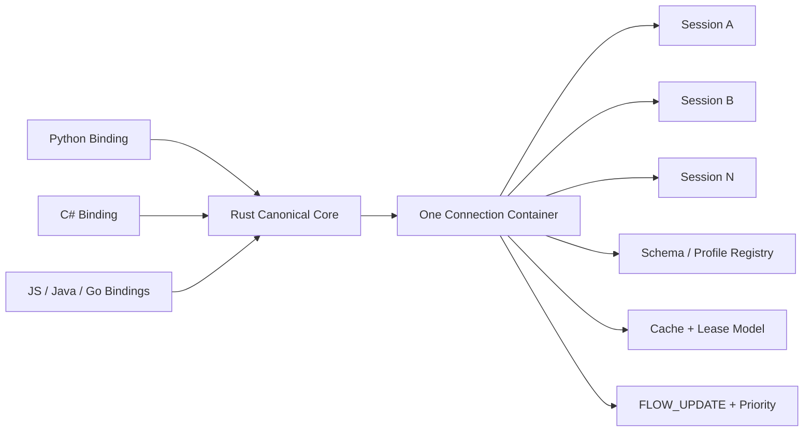

# NNRP/1-preview3 Design Summary

This page is the English counterpart of the archived `v1-preview3` design document.

preview3 freezes the current canonical direction:

1. A profile-neutral public layer with `tensor` and `token` as peer standard profiles.
2. A multi-session connection model with explicit `SESSION_OPEN / SESSION_OPEN_ACK`.
3. Stable common layouts for schema descriptors, typed payload descriptors, and `FLOW_UPDATE` metadata.
4. A Rust canonical SDK baseline for cross-language behavior.

Use the full Chinese design document when you need every frozen byte layout and every detailed rationale; use this page when you need the English entry point and the main freeze themes.