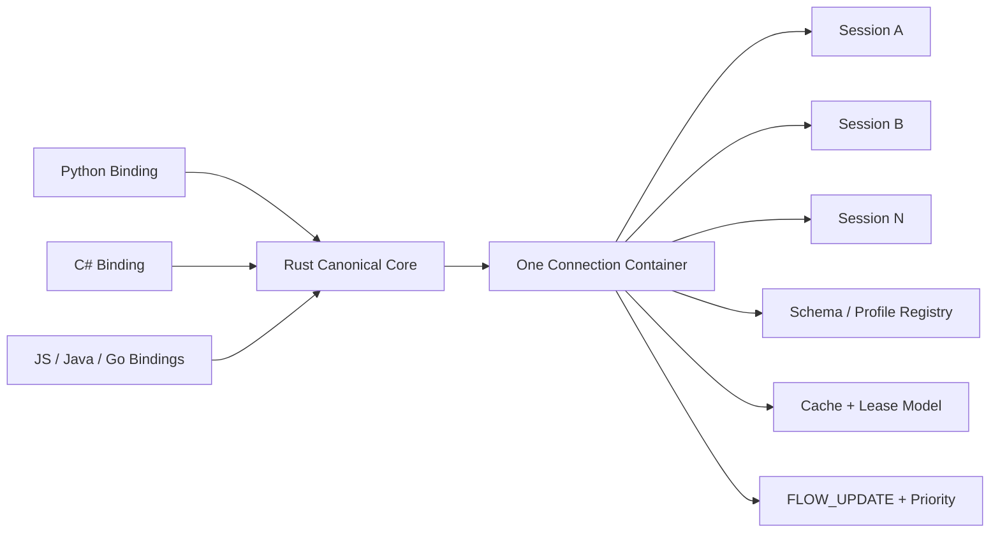

# NNRP/1-preview3 Protocol Design

## 1. Positioning

`NNRP/1-preview3` is not a simple incremental patch over preview2. Its goal is to advance `NNRP` from a preview-stage wire contract implemented separately by two SDKs to a real-time AI runtime protocol driven by a single canonical SDK and stably extensible to a multi-language ecosystem.

The problems preview3 needs to solve are no longer merely "support a few more payload kinds," but the following three higher-priority problems:

1. Unify the semantic source: avoid Python, C#, and future JS/Java/Go SDKs each maintaining their own wire codec, state machine, and cache semantics, causing cross-language behavior drift.
2. Unify the session model: further generalize the asynchronous submit/result/control semantics already validated in preview2 to scenarios with multiple sessions, multiple priorities, and concurrent workflows.
3. Unify the extension mechanism: upgrade typed payloads, cache objects, and host-side helpers from "extended per language" to being uniformly governed by a schema/profile registry and a Rust canonical implementation.

Therefore, preview3 defines two boundaries at the same time:

1. Protocol-layer boundary: the connection model, session model, cache model, schema/profile extension model, and agent/workflow runtime semantics of `NNRP/1-preview3`.
2. SDK-layer boundary: a Rust common library serves as the canonical implementation, responsible for the wire codec, state machines, cache lifecycle, flow control, and consistency validation. Python, C#, and future multi-language SDKs should prioritize building bindings and host-facing control-plane wrappers rather than rewriting the hot path themselves.

The formal positioning of preview3 is therefore: a canonical protocol + canonical SDK baseline for a multi-language real-time AI runtime ecosystem, rather than continuing to let "protocol consensus rely on documents and implementation consensus rely on manual synchronization."

## 1.1 Overview Diagram

This diagram compresses the three hardest things in preview3 into one view: the connection has become a multi-session container, the extension mechanism is controlled by the registry, and cross-language consistency is consolidated by the canonical core.

## 2. Topics Explicitly Covered by preview3

`NNRP/1-preview3` explicitly covers the following topics:

1. Define the responsibility boundary of the Rust canonical SDK, and the standard interaction surface between multi-language bindings and the Rust core.
2. Upgrade the connection model from preview2's primary mental model of a single active session into a unified connection container capable of carrying multiple active sessions, multiple priority streams, and multi-workflow operations.
3. Upgrade preview2's object cache into an AI runtime cache with lease, versioning, dependency, and observability.
4. Upgrade typed payloads from static enums to a negotiable type system driven by a schema/profile registry.
5. Elevate tool deltas, structured events, and multi-step inference results into explicit operation / workflow runtime semantics, rather than treating them only as payload frames.
6. Define cross-language conformance, golden vectors, error codes, and compatibility windows so that new-language bindings no longer maintain alignment by "copying test constants from another SDK."

preview3 still keeps the core constraints of preview1/preview2:

1. The hot path remains binary, fixed-layout, explicitly sized, and directly locatable.
2. The protocol continues to serve real-time AI runtime semantics rather than browser media stacks or general-purpose RPC.
3. The public layer remains profile-neutral in preview3. The first-round standard profiles include at least `tensor` and `token`; tensor is no longer treated as the default privileged profile.

## 3. Topics Not Covered by preview3

preview3 explicitly does not cover the following content:

1. Traditional media-stack problems such as browser media capture, playback, A/V sync, AEC, ABR, and SFU/MCU.
2. Private GPU memory-page layout, KV-cache page encoding, or runtime internal thread models of a specific model or inference framework.
3. UI / game-engine / notebook / web-framework wrapping conventions of Python, C#, JS, Java, and Go.
4. Hard-coding all upper-layer AI business semantics into public protocol enums; preview3 defines only public runtime semantics and standard extension mechanisms.

The mistake preview3 must avoid is misunderstanding "making multi-language integration easier" as "the protocol layer must freeze all upper-layer business objects at once." What should actually be frozen are extension boundaries, object lifecycle, and cross-language consistency requirements, rather than the upper-layer object tree of a single product form.

## 4. Design Principles

preview3 adopts the following design principles:

1. Single semantic source: the Rust canonical SDK is the only implementation source for the wire codec, state machine, cache semantics, and conformance.
2. Thin binding layers: Python, C#, and future multi-language SDKs should prioritize reusing the Rust core and expose only host-facing control plane, callbacks, buffer views, and a small number of language-friendly models, rather than rewriting the hot path independently.
3. No text on the hot path: `FRAME_SUBMIT`, `RESULT_PUSH`, typed payload frames, cache objects, and schema descriptions all continue to follow fixed-layout binary paths, with no JSON/Protobuf hot-path fallback.
4. Protocol concepts first: once multi-session, priority, cache lease, schema registry, operation lifecycle, and similar concepts affect cross-language interoperability, they must first become protocol concepts rather than being left to private extensions in a single SDK.
5. Profile/schema layering: the public layer freezes connection, session, cache, budget, priority, and operation semantics; concrete payload structures are extended through the profile/schema registry rather than continuously bloating public enums.
6. Gradual migration: preview3 must allow host runtimes to keep preview2-compatible paths and preview3 canonical-SDK paths side by side for a period of time, avoiding a one-shot hard cutover.

## 5. Boundary of the Rust Canonical SDK

preview3 defines the Rust common library as a standard deliverable, not merely as an internal implementation detail of some SDK.

At minimum, the Rust core is responsible for the following capabilities:

1. Pack/unpack of the common header, fixed metadata, body regions, typed payload descriptors, and extension frames.
2. Connection-level and session-level state machines, including handshake, session open/patch/close, flow control, result correlation, migration, and recovery semantics.
3. Cache objects, schema objects, lease lifecycle, and dependency validation.
4. Standard preview3 error codes, invalid-combination validation, and strict parsing.
5. Golden-vector generation, conformance-fixture export, and cross-language replay/regression baselines.

The language binding layer must obey at least the following boundaries:

1. Do not reimplement preview3 hot-path codecs and state machines.
2. Higher-level host-facing APIs may be provided at the language layer, but these APIs must not change the underlying protocol semantics.
3. Prioritize exposing the control plane and session orchestration. On the data plane, transfer data from the Rust core through buffer views, descriptor handles, callbacks, or stream readers as much as possible rather than rematerializing an entire intermediate object system in the language layer.
4. If the language layer provides convenience helpers for host experience, such as synchronous wrappers, Unity main-thread dispatch, or Python async iterators, these helpers may only be built on top of the Rust canonical session model and must not redefine the default protocol behavior of preview3.

preview3 explicitly opposes the following practices:

1. Python and C# each maintaining an independent preview3 packet builder / parser.
2. Language bindings privately inventing new object kinds, payload kinds, error codes, or flow-control meanings.
3. For local optimization in a single runtime, directly freezing model-private cache-page layouts into mandatory public protocol fields.

## 6. Compatibility Boundary with preview2

### 6.1 Version and Stage

preview3 is fixed as:

1. `version_major = 1`
2. `version_stage = 3`
3. ALPN `nnrp/1-preview3`

preview3 does not silently interoperate with preview2. If both sides only commonly support preview2, they must fall back to `nnrp/1-preview2`. Although the connection and session model of preview3 reuses some concepts of preview2, the new semantics of multiple sessions, multiple priorities, and schema registry added by preview3 must not be disguised as preview2-private extensions.

### 6.2 Common Header and Length Model

preview3 continues to retain the 40-byte common header and the self-describing length model of `meta_len + body_len`. The main evolution points of preview3 still lie in:

1. Upgrading the field semantics of the metadata table.
2. Dividing responsibilities across control-plane message families.
3. The extension capability of body regions and the binding relationship between typed payloads and schema.
4. Connection and session state-machine semantics.

### 6.3 Inheritance Principles for Topics Already Frozen in preview2

The following design principles of preview2 continue to hold in preview3:

1. The normative host shape remains `submit pump + result pump + control path`, rather than synchronous request-response.
2. The distinction among `partial / stale_reuse / degraded / drop` must still be explicitly preserved at the protocol layer.
3. Low-frequency object caching and object references continue to be first-class citizens and do not fall back to "stable objects fully inlined on every frame."
4. Typed payloads and extension frames continue to be retained, but the extension mechanism no longer primarily proceeds by "continuing to expand the payload-kind bitmap."

## 7. preview3 Connection and Session Model

### 7.1 Connection-Level Bootstrap and Multi-Session Container

preview3 explicitly treats a connection as a session container rather than a dedicated channel for a single active session.

Minimum requirements:

1. A single connection may carry multiple active sessions.
2. `CLIENT_HELLO / SERVER_HELLO_ACK` are responsible for connection-level capability negotiation, authentication, Rust canonical feature window, and declaration of baseline cache and schema capabilities.
3. Add `SESSION_OPEN / SESSION_OPEN_ACK` as an explicit session-creation flow for declaring profile, schema, budget window, priority class, and cache/lease requirements.
4. `SESSION_PATCH / SESSION_PATCH_ACK` continue to be retained as the low-frequency session-update path.
5. `CLOSE` can still be used for connection-level closure. preview3 additionally requires explicit session-close semantics so that the preview1/2 habit of "closing one session equals closing the whole connection" does not continue leaking into the multi-session model.

### 7.1A Freezing of `SESSION_OPEN` / `SESSION_OPEN_ACK` Fixed Metadata

In the first round, preview3 freezes `SESSION_OPEN` and `SESSION_OPEN_ACK` as minimally implementable yet extensible session-open metadata, rather than letting each language binding privately assemble its own session-open body.

The fixed metadata of `SESSION_OPEN` is fixed at 48 bytes in the first round:

| Field | Type | Description |
| --- | --- | --- |
| `requested_session_id` | `u32` | Session id desired by the client; `0` means assigned by the server |
| `profile_id` | `u16` | Requested standard or extension profile |
| `priority_class` | `u8` | Session priority class; values are frozen later in this document |
| `session_flags` | `u8` | Session-level capability/behavior flags |
| `schema_id` | `u32` | Default schema id; `0` if absent |
| `schema_version` | `u32` | Default schema version; `0` if absent |
| `default_deadline_ms` | `u32` | Default operation deadline or latency budget |
| `max_in_flight_operations` | `u16` | Maximum number of parallel operations expected by the client |
| `reserved0` | `u16` | Reserved; sender clears to `0` |
| `lease_ttl_hint_ms` | `u32` | Default lease TTL expected by the client; `0` if unspecified |
| `resume_token_bytes` | `u32` | Length of `resume_token_block`; `0` if absent |
| `auth_bytes` | `u32` | Length of `auth_block`; `0` if absent |
| `session_extension_bytes` | `u32` | Length of `session_extension_block`; `0` if absent |
| `client_session_tag` | `u64` | Client-local observable tag for logs and cross-layer correlation |

The fixed metadata of `SESSION_OPEN_ACK` is fixed at 56 bytes in the first round:

| Field | Type | Description |
| --- | --- | --- |
| `session_id` | `u32` | Actually allocated or confirmed session id |
| `accepted_profile_id` | `u16` | Profile id accepted by the server |
| `accepted_priority_class` | `u8` | Priority class accepted by the server |
| `session_status` | `u8` | Session-open result status |
| `schema_id` | `u32` | Default schema id confirmed by the server |
| `schema_version` | `u32` | Default schema version confirmed by the server |
| `granted_operation_credit` | `u16` | Initially granted operation credit |
| `max_in_flight_operations` | `u16` | Maximum number of parallel operations allowed by the server |
| `lease_ttl_ms` | `u32` | Default lease TTL accepted by the server |
| `resume_window_ms` | `u32` | Resume window; `0` if absent |
| `resume_token_bytes` | `u32` | Length of `resume_token_block`; `0` if absent |
| `session_extension_bytes` | `u32` | Length of `session_extension_block`; `0` if absent |
| `server_session_tag` | `u64` | Server-local observable tag |
| `route_scope_id` | `u32` | Minimum routing scope confirmed by the server |
| `session_error_code` | `u32` | Stable error code returned if `session_status` is not success |
| `session_flags_ack` | `u32` | Session flags accepted by the server |

Additional constraints in the first round:

1. `SESSION_OPEN` is responsible only for establishing the default session context; it does not carry the body of the first operation submission.
2. `schema_id / schema_version` indicate the default schema of the session rather than forbidding later operation-level overrides.
3. Higher-level profile-private session parameters still enter through `session_extension_block` or schema/profile object extensions rather than continuing to bloat fixed metadata.

### 7.1B Freezing of session-open status bits and error codes

preview3 freezes the following `session_flags:u8` bit definitions in the first round:

| bit | Mask | Meaning |
| --- | --- | --- |
| 0 | `0x01` | `allow_resume`: the client requests that the session support resume tokens / resume windows |
| 1 | `0x02` | `allow_background_results`: background result/event pumps are allowed to continue delivering outside submit calls |
| 2 | `0x04` | `allow_cache_leases`: the session is allowed to create or renew cache/schema leases |
| 3 | `0x08` | `allow_schema_override`: operation-level override of the session default schema is allowed |
| 4-7 | Reserved | The sender clears them to `0`; the receiver must reject non-zero reserved bits |

preview3 freezes the following `session_status:u8` enum values in the first round:

| Value | Name | Meaning |
| --- | --- | --- |
| `0` | `opened` | Session established successfully |
| `1` | `rejected` | The server rejected establishing the session |
| `2` | `retry_later` | The session cannot currently be established; it may be retried later according to retry/reuse-related policy |
| `3` | `resumed` | The session was established successfully in resume mode |

preview3 freezes the following `session_flags_ack:u32` bit definitions in the first round:

| bit | Mask | Meaning |
| --- | --- | --- |
| 0 | `0x00000001` | `resume_enabled`: resume is allowed by the server |
| 1 | `0x00000002` | `background_results_enabled`: background result/event pumps are allowed by the server |
| 2 | `0x00000004` | `cache_leases_enabled`: cache/schema leases are allowed by the server |
| 3 | `0x00000008` | `schema_override_enabled`: operation-level schema override is allowed by the server |
| 4 | `0x00000010` | `priority_downgraded`: the requested priority was downgraded by the server |
| 5-31 | Reserved | The sender clears them to `0`; the receiver must reject unknown set bits |

preview3 freezes the following `session_error_code:u32` family in the first round:

| Value | Name | Meaning |
| --- | --- | --- |
| `0x00000000` | `none` | No error |
| `0x00010001` | `auth_failed` | Authentication failed |
| `0x00010002` | `profile_unsupported` | The requested profile is unsupported |
| `0x00010003` | `schema_unsupported` | The requested schema or version is unsupported |
| `0x00010004` | `priority_rejected` | The requested priority class is not allowed |
| `0x00010005` | `lease_policy_rejected` | The requested lease policy is not allowed |
| `0x00010006` | `resume_rejected` | The requested resume mode or token is not allowed |
| `0x00010007` | `session_limit_reached` | The current connection or server session limit has been reached |

Constraints in the first round:

1. `session_error_code` returns a non-zero value only when `session_status != opened` or when there is a downgrade/recovery-related abnormality.
2. `session_flags_ack` may only confirm or downgrade what the client requested, and may not privately introduce new capabilities that were not requested.
3. If this error-code family needs to be extended later, it must continue to expand according to a high-bit family-reservation strategy and must not reorder already frozen values.

### 7.2 Priorities and Stream Classes

preview3 introduces explicit priority and stream-class semantics for scheduling multiple sessions on the same connection and multiple operations within the same session.

At minimum, the protocol layer must be able to express:

1. Session priority classes, such as `interactive / balanced / background`.
2. Operation priorities and deadline windows.
3. The dual-layer constraints of dynamic credit at the session level and the connection level.
4. Explicit acknowledgments from the server for priority downgrade, rate limiting, or preemption.

preview3 does not require any specific scheduling algorithm to be hard-coded as the only implementation, but it must freeze these semantic objects and error vocabularies so that different language bindings no longer diverge in their interpretation of "backpressure," "preemption," and "expiration."

### 7.2A Freezing of standard scheduling enums

preview3 freezes the following standard enum values in the first round:

`session_priority_class:u8`

| Value | Name | Semantics |
| --- | --- | --- |
| `0` | `interactive` | For foreground low-latency interaction, prioritizing deadlines and responsiveness |
| `1` | `balanced` | Default priority, balancing throughput and latency |
| `2` | `background` | For background tasks or prefetch work, which may be preempted by higher priorities |

`operation_state:u8`

| Value | Name | Semantics |
| --- | --- | --- |
| `0` | `accepted` | Accepted and entered the scheduling system |
| `1` | `running` | Execution has started |
| `2` | `partial` | Consumable but non-terminal partial results have been produced |
| `3` | `waiting_tool` | Waiting for a tool or external dependency before continuing |
| `4` | `superseded` | Superseded by a new operation or new context |
| `5` | `cancelled` | Explicitly cancelled |
| `6` | `failed` | Terminated with an error |
| `7` | `completed` | Completed normally |

`cancel_scope:u8`

| Value | Name | Semantics |
| --- | --- | --- |
| `0` | `operation` | Cancel only a single operation |
| `1` | `subtree` | Cancel that operation and its child-operation tree |
| `2` | `group` | Cancel all operations under the same `operation_group_id` |
| `3` | `session` | Cancel all still-active operations under the entire session |

Constraints in the first round:

1. All language bindings must treat these numeric values as protocol enums rather than private local SDK status codes.
2. `partial` and `completed` may appear in sequence within the same operation lifecycle; `failed / cancelled / superseded / completed` are terminal states.
3. `interactive` expresses only scheduling priority and credit preference, and does not guarantee absolute resource exclusivity.

## 8. preview3 Advanced Cache Model

preview2 already has cache objects and object references; preview3 needs to upgrade them into a lease-capable, versioned, dependency-trackable AI runtime cache.

The preview3 cache model contains at least the following capabilities:

1. lease: cache objects or schema objects must be able to declare TTL, renewal, expiration policy, and owner scope.
2. version: object references must distinguish `object_id` from `object_version`, no longer leaving "changed content but reused old key" to host-private conventions.
3. dependency: objects, results, and schemas must be able to declare dependency relationships for result reuse, cache invalidation, and consistency checks.
4. observability: the protocol layer must be able to express stable error reasons such as cache miss, lease expired, dependency invalid, and schema mismatch.
5. host-visible policy: the client may proactively declare preferences such as prefetch, touch, lease renew, eviction hints, or result reuse.

preview3 does not require the public layer to directly freeze private model KV-cache page encodings; such objects should still exist as profile-local or runtime-private object kinds. The public layer is responsible for freezing the lease contract, version semantics, dependency semantics, and error behavior.

## 9. preview3 Schema / Profile Registry

preview3 no longer treats "continuing to add payload-kind enums" as the primary extension path, but introduces a standard schema/profile registry.

Design goals:

1. The public layer does not presuppose a single default profile. The first-round standard profiles include at least `tensor` and `token`, and continue to allow payload families such as `structured_event`, `tool_delta`, and `opaque_bytes` to hang off the schema/profile registry.
2. Concrete payload semantics are bound through `schema_id + schema_version + profile_id + stream_semantics` rather than adding a new public payload kind every time a new data type appears.
3. Schema objects enter the cache / lease lifecycle and may be preinstalled, referenced, invalidated, and version-rolled back.
4. Language bindings no longer interpret descriptor-private fields themselves, but uniformly go through the Rust canonical schema registry.

preview3 therefore needs to standardize at least the following information:

1. The common header of schema descriptor objects.
2. Negotiation, installation, invalidation, and version-conflict handling of the schema registry.
3. Standard fields related to schema/profile binding in typed payload descriptors.
4. Error handling for unknown schema, unknown version, and critical schema incompatibility.

### 9.3 Freezing of the common header of schema descriptors

preview3 fixes the common header of schema descriptors to 32 bytes in the first round, so version, compatibility, and routing decisions can be completed without parsing the profile-private body.

| Field | Type | Description |
| --- | --- | --- |
| `schema_id` | `u32` | Schema identifier |
| `schema_version` | `u32` | Schema version |
| `profile_id` | `u16` | Profile to which this schema belongs |
| `schema_flags` | `u16` | Schema behavior flags |
| `compat_min_stage` | `u8` | Minimum compatible stage |
| `compat_max_stage` | `u8` | Maximum compatible stage |
| `reserved0` | `u16` | Reserved; sender clears to `0` |
| `body_bytes` | `u32` | Length of the schema body |
| `dependency_count` | `u16` | Number of dependent schema/object entries |
| `default_stream_semantics` | `u16` | Default stream semantics |
| `schema_hash` | `u64` | Stable digest of the schema body |

Constraints in the first round:

1. The common header addresses only public questions such as "what this schema is, which profile it belongs to, which stage it is compatible with, how long the body is, and how many objects it depends on."
2. Any profile-private interpretation fields must enter the schema body and must not continue to bloat the common header.
3. `schema_hash` is used for cross-language consistency checks and cache deduplication; it does not directly replace the logical identity of `schema_id + schema_version`.
4. `default_stream_semantics` provides only default semantics; a payload descriptor may still override it on a per-frame or per-operation basis.

### 9.1 Freezing of the first-round standard profiles

In the first round, preview3 first freezes the standard profiles as `tensor profile` and `token profile`, both of which are equally valid at the public layer.

The minimum standard semantics of `tensor profile` remain:

1. It is oriented toward blockized or regionized numeric payloads rather than being forcibly bound to rendering scenarios.
2. It allows shape, dtype, layout, section/layout interpretation, and coverage semantics to be declared through schema/profile descriptors.
3. `partial / degraded / stale_reuse` under the tensor profile may still carry coverage semantics, but coverage is no longer the default requirement for all profiles.

The minimum standard semantics of `token profile` are frozen as:

1. It is oriented toward incremental output of discrete tokens or token chunks and does not require token sequences to masquerade as tensor sections.
2. The standard result path must at least be able to express incremental token fragments, sequence position/range, completion status, and stop/reason vocabulary.
3. In the first round, `token profile` does not require logits, full candidate distributions, or model-private sampling state to enter mandatory public fields; such content may only enter through schema/profile extensions.
4. Under the token profile, the default meaning of `partial` is "the sequence is not yet complete but the current chunk is consumable," rather than a tensor-style coverage gap.

### 9.2 Boundary of minimal fields in the first-round descriptors

In the first round, preview3 requires typed payload descriptors to be able to stably bind at least the following public fields:

1. `profile_id`
2. `schema_id`
3. `schema_version`
4. `stream_semantics`
5. `offset`
6. `length`
7. `flags`

On top of that, the minimum semantic-field boundary of different standard profiles is frozen as follows:

1. A tensor-profile descriptor must be able to uniquely determine the numeric interpretation of the payload, including the entry point for shape/layout interpretation, the entry point for dtype interpretation, and whether profile-local coverage/section semantics exist.
2. A token-profile descriptor must be able to uniquely determine the sequence interpretation of the payload, including token units, position/range vocabulary, incremental/terminal semantics, and whether stop-reason is explicitly given in this frame.
3. Beyond the minimal fields above, any higher-level profile-private field must enter through schema/profile extensions, and must not directly elevate a private sampling or tensor-layout field of a single runtime into a mandatory public field.

### 9.2A Freezing of the fixed layout of typed payload descriptors

preview3 fixes the public layout of typed payload descriptors to 24 bytes in the first round:

| Field | Type | Description |
| --- | --- | --- |
| `profile_id` | `u16` | The profile to which this payload belongs |
| `descriptor_flags` | `u16` | Descriptor behavior flags |
| `schema_id` | `u32` | The schema id that interprets this payload |
| `schema_version` | `u32` | The schema version that interprets this payload |
| `stream_semantics` | `u16` | The stream semantics of this payload |
| `reserved0` | `u16` | Reserved; sender clears to `0` |
| `offset` | `u32` | Byte offset relative to the typed-payload frame region |
| `length` | `u32` | Byte length of the payload |

`descriptor_flags:u16` freezes the following bit definitions in the first round:

| bit | Mask | Meaning |
| --- | --- | --- |
| 0 | `0x0001` | `terminal`: this payload carries the terminal fragment of the current profile/operation |
| 1 | `0x0002` | `partial`: this payload is an incremental fragment that is consumable but non-terminal |
| 2 | `0x0004` | `schema_override`: this descriptor explicitly overrides the session default schema |
| 3 | `0x0008` | `profile_hint_present`: additional hints required for profile-local interpretation are present in the schema/profile body |
| 4-15 | Reserved | The sender clears them to `0`; the receiver must reject unknown set bits |

Constraints in the first round:

1. All standard profiles must use the same 24B descriptor public header and must not independently change byte layout by language or profile.
2. The minimum interpretation entry of tensor and token is jointly determined by `profile_id + schema_id + schema_version + stream_semantics + descriptor_flags`; finer-grained fields continue to go through the schema/profile body.
3. `offset / length` are always interpreted relative to the typed-payload frame region. No binding may change them to be relative to the entire packet body or some private subregion.
4. `terminal` and `partial` may both be zero, but they must not simultaneously express mutually conflicting terminal semantics; profile-private terminal detail continues to be interpreted through schema/profile.

This allows preview3 to support more data types without needing to freeze an ever-expanding public bitmap table each time.

## 10. preview3 Agent / Workflow Runtime Semantics

preview2 can already carry `structured_event` and `tool_delta`; what preview3 adds is their lifecycle semantics at runtime.

preview3 needs to express at least the following objects:

1. `operation_id`: the unique identifier of an inference, generation, tool call, or multi-step workflow operation.
2. `parent_operation_id`: used to express operation trees, subtasks, and dependency chains.
3. `operation_group_id`: used for scheduling, canceling, or subscribing to results of a group of operations.
4. `operation_state`: such as `accepted / running / partial / waiting_tool / superseded / cancelled / failed / completed`.
5. `cancel_scope`: allows canceling a single operation, a subtree, a group, or an entire session.

The goal of these semantics is not to write all agent frameworks into a unified DSL, but to provide a cross-language unified lifecycle semantics for "multi-step AI workflows running in a single long-lived connection session."

### 10.1 Freezing the ownership boundary of `structured_event` / `tool_delta`

preview3 explicitly freezes the following boundaries in the first round:

1. `structured_event` and `tool_delta` still belong to payload families by default and are not automatically elevated into standalone profiles.
2. Only when an event affects an operation lifecycle that must interoperate across languages does its minimum semantics enter the public operation model; otherwise it remains in the schema/profile payload layer.
3. `operation_id`, `parent_operation_id`, `operation_group_id`, `operation_state`, and `cancel_scope` belong to public lifecycle semantics and must be interpretable independently of concrete payloads.
4. Higher-level content such as tool-call parameters, tool-result bodies, and rich event payloads continue by default to remain in `structured_event` / `tool_delta` payloads and are interpreted through the schema/profile registry.
5. Therefore, preview3 does not hard-code tool-call bodies or event bodies into public fixed metadata; the public layer freezes only lifecycle, routing, cancellation, and state-transition semantics.

## 11. preview3 Flow Control, Recovery, and Observability

preview3 needs to push the flow control and migration of preview2 one level further.

At minimum, it should add:

1. Dual-layer acknowledgment of connection-level credit and session-level credit.
2. Priority-aware `FLOW_UPDATE`, allowing the server to adjust windows independently for different sessions / operations.
3. Recovery, resume token, and `resume_from_operation` semantics under multi-session scenarios.
4. Unified result / event / control observability fields so multi-language hosts can stably record queue, compute, transport, backpressure, cache-hit, and lease events.

preview3 does not need to freeze the full detail of disconnection recovery in the first round, but it must upgrade the question of "whether the recovery object is a frame, operation, or session" from an implicit preview2 convention into an explicit protocol concept.

### 11.1 Freezing the three-scope `FLOW_UPDATE` and its metadata

In the first round, preview3 fixes `FLOW_UPDATE` to 32 bytes of fixed metadata for uniformly expressing connection-, session-, and operation-level credit and backpressure updates, rather than allowing different language bindings to define private credit packets independently.

| Field | Type | Description |
| --- | --- | --- |
| `scope_kind` | `u8` | Update scope; values are frozen below |
| `update_reason` | `u8` | Reason for the update; values are frozen below |
| `backpressure_level` | `u8` | Current backpressure level; values are frozen below |
| `reserved0` | `u8` | Reserved; sender clears to `0` |
| `connection_credit` | `u16` | Connection-level parallel credit |
| `session_credit` | `u16` | Session-level parallel credit |
| `operation_credit` | `u16` | Operation-level parallel credit |
| `reserved1` | `u16` | Reserved; sender clears to `0` |
| `operation_id` | `u64` | Points to the target operation when `scope_kind=operation`; otherwise `0` |
| `retry_after_ms` | `u32` | Suggested retry or reprobe window; `0` if absent |
| `credit_epoch` | `u32` | Monotonically increasing credit-update epoch |
| `flow_flags` | `u32` | Flow-control behavior bitmap |

`scope_kind:u8` is frozen in the first round as:

| Value | Name | Semantics |
| --- | --- | --- |
| `0` | `connection` | Update the total credit or total backpressure state of the entire connection |
| `1` | `session` | Update the credit or backpressure state of a specific session |
| `2` | `operation` | Update the credit or backpressure state of a specific operation |

`update_reason:u8` is frozen in the first round as:

| Value | Name | Semantics |
| --- | --- | --- |
| `0` | `grant` | Newly grant credit or relax restrictions |
| `1` | `reduce` | Tighten the credit window |
| `2` | `pause` | Pause sending new operations |
| `3` | `resume` | Resume from the paused state |
| `4` | `congestion` | Enter rate limiting or backpressure due to congestion |

`backpressure_level:u8` is frozen in the first round as:

| Value | Name | Semantics |
| --- | --- | --- |
| `0` | `none` | No backpressure |
| `1` | `soft` | The sender is advised to slow down proactively, but is not forced to stop |
| `2` | `hard` | The sender should stop submitting new operations until a later relaxed update is received |

`flow_flags:u32` freezes the following bit definitions in the first round:

| bit | Mask | Meaning |
| --- | --- | --- |
| 0 | `0x00000001` | `credit_valid`: the credit field for the corresponding scope is valid |
| 1 | `0x00000002` | `retry_after_valid`: `retry_after_ms` is valid |
| 2 | `0x00000004` | `background_only`: only background or low-priority operations may continue progressing |
| 3 | `0x00000008` | `drain_in_flight_only`: only existing in-flight operations may drain; no new operations are accepted |
| 4-31 | Reserved | The sender clears them to `0`; the receiver must reject unknown set bits |

Constraints in the first round:

1. When `scope_kind=connection`, header `session_id` must be `0`, `operation_id` must be `0`, and the sender reads only `connection_credit`.
2. When `scope_kind=session`, header `session_id` must be the target session, `operation_id` must be `0`, and the sender prioritizes reading `session_credit`.
3. When `scope_kind=operation`, header `session_id` must be the target session, `operation_id` must be non-zero, and the sender prioritizes reading `operation_credit`.
4. `credit_epoch` must be monotonically increasing on the same scope; the receiver must not accept updates older than the current epoch.
5. `hard` backpressure is not an error. It indicates that the new submission window has been temporarily tightened; the sender should wait for a later `grant / resume` or a `FLOW_UPDATE` with a higher epoch.
6. This fixed metadata solves only unified routing and control of credit/backpressure and does not carry profile-private queueing metrics. More fine-grained observability data should still be extended through schema/profile or dedicated observability paths.

## 12. Rust FFI and Binding Contract

preview3 requires the Rust canonical SDK to provide at least a stable FFI contract reusable across languages.

Minimum requirements:

1. A stable C ABI or another stable ABI boundary across languages.
2. Explicit handle lifecycle: connection handles, session handles, operation handles, buffer handles, and schema handles.
3. Dual callback and polling modes: allowing Unity/C#, Python async, Node.js event loops, JVM runtimes, and Go runtimes to choose the driving mode that suits them.
4. Clear buffer view / slice lifecycle rules so the language layer does not copy the entire payload segment and then parse it again.
5. All language bindings share the same set of golden vectors, error codes, and conformance suites.

The binding contract of preview3 explicitly requires:

1. The Python side should prioritize exposing async control/session APIs, buffer views, and result-subscription interfaces.
2. The C# side should prioritize exposing Unity / .NET-friendly session orchestration, callbacks, and memory-safe wrappers, but must not rewrite the wire codec.
3. When a new language SDK enters the ecosystem, it should by default start from the Rust canonical FFI rather than copying a pure-language implementation from Python or C#.

## 13. Implementation Order

preview3 is recommended to proceed in the following phases:

1. Phase A: land the Rust canonical SDK first, and migrate the semantics already frozen in preview1/preview2 into Rust, implementing a cross-language shared wire codec, state machine, golden vectors, and conformance.
2. Phase B: complete the foundational semantics of multi-session, priority, cache lease, and schema registry in the Rust core and protocol document.
3. Phase C: converge Python and C# bindings onto the Rust core, retaining only host-facing control plane and language-friendly wrappers.
4. Phase D: expand new payload families, workflow events, and ecosystem language bindings on top of the schema/profile registry.

The first priority of preview3 is not "continue piling on more payload kinds," but rather "freeze the canonical SDK, the connection/session model, and the advanced cache/registry boundary first." Only after these three things are stable will subsequent ecosystem bindings in JS, Java, Go, and beyond avoid reproducing the semantic-drift problems of the preview1/preview2 stage.

## 14. Items That Must Be Frozen First in the First Round of preview3

To avoid once again following the drift path of "two SDKs implement independently first, then come back later to freeze semantics," the following items must be frozen before the first-round implementation of preview3. Before they are frozen, Python/C# must not begin implementing the preview3 hot path.

### 14.1 Canonical SDK ownership

1. `nnrp-rs` is the only canonical implementation of the preview3 wire codec, state machine, cache/registry semantics, golden vectors, and conformance.
2. Python/C# may implement only the binding layer, host APIs, wrapper models, and loading/scheduling logic, and must not each implement a second preview3 packet builder / parser / state machine.
3. Any cross-language public semantic change in preview3 must land first in the Rust repository and the protocol document, and only then enter the Python/C# binding layer.

### 14.2 FFI contract

The following FFI boundaries must be frozen first:

1. Handle families: `connection / session / operation / schema / buffer_view`.
2. Handle lifecycle: creation, borrowing, release, and recoverability after errors.
3. Event-driving modes: callback-driven, polling-driven, or dual-mode coexistence.
4. Buffer-view rules: when zero-copy views are allowed, when explicit copying is required, and when the host must complete release.
5. Stable error-code families: protocol errors, state-machine errors, cache errors, schema errors, and binding-contract errors.

### 14.3 Connection/session lifecycle

The following connection and session semantics must be frozen first:

1. The layered boundary between connection-level handshake and session-level open flow.
2. `SESSION_OPEN / SESSION_OPEN_ACK` are introduced as standard messages, and in the first round their fixed metadata are frozen at 48B / 56B respectively.
3. Whether session close has an explicit control message or dedicated metadata semantics, rather than continuing the implicit habit of reusing connection `CLOSE`.
4. The minimum routing fields required by control/data/result messages when multiple sessions share one connection.
5. The bit definitions and numeric families of `session_flags / session_status / session_flags_ack / session_error_code`.

### 14.4 Scheduling semantics

The following scheduling semantics must be frozen first:

1. The standard enum values of `session_priority_class`: `interactive=0 / balanced=1 / background=2`.
2. The standard enum values of `operation_state`: `accepted=0 / running=1 / partial=2 / waiting_tool=3 / superseded=4 / cancelled=5 / failed=6 / completed=7`.
3. The standard enum values of `cancel_scope`: `operation=0 / subtree=1 / group=2 / session=3`.
4. `FLOW_UPDATE` fixed metadata is fixed at 32B, and `scope_kind / update_reason / backpressure_level / flow_flags` as well as connection/session/operation three-layer credit semantics are frozen.

### 14.5 Advanced cache contract

The following cache semantics must be frozen first:

1. The division of responsibilities between `object_id` and `object_version`.
2. Lease identity, expiration, renewal, and eviction-hint semantics.
3. The minimum stable reason codes of dependency invalidation.
4. The observable relationship among result reuse, schema reference, and object invalidation.

### 14.6 Schema/profile registry

The following schema/profile registry items must be frozen first:

1. The first-round standard profile set; at minimum it must clarify that `tensor profile` and `token profile` stand in parallel, and the public layer must no longer treat tensor as the default privileged profile.
2. The minimum standard semantic boundary of `token profile`, especially the public vocabulary of token chunks, position ranges, completion status, and stop-reason.
3. The common header of schema descriptors is fixed at 32B, and its minimum field set is frozen.
4. Typed payload descriptors are fixed at 24B, and their minimum public field set and `descriptor_flags` bit definitions are frozen.
5. The standard process for schema install / update / invalidate / version conflict.
6. The binding rule between typed payload descriptors and `schema_id / schema_version / profile_id`.
7. The standard error behavior for unknown schema, version conflicts, and critical schema incompatibility.

### 14.7 Payload family vs lifecycle boundary

The following items must be frozen first:

1. `structured_event` and `tool_delta` belong to payload families by default, rather than standalone profiles.
2. Only when they affect cross-language interoperable operation-lifecycle state, routing, or cancellation semantics do the corresponding minimum fields enter the public lifecycle model.
3. Tool bodies, rich event bodies, and other higher-level payloads are interpreted by default through the schema/profile registry and do not enter public fixed metadata.

### 14.8 Conformance ownership

1. preview3 canonical golden vectors may only be generated by Rust.
2. Python/C# may only import Rust fixtures for binding validation, and must not maintain "peer canonical vectors" in parallel.
3. The enum values, message values, metadata lengths, and error codes of preview3 must be frozen first in Rust conformance before entering language-binding tests.