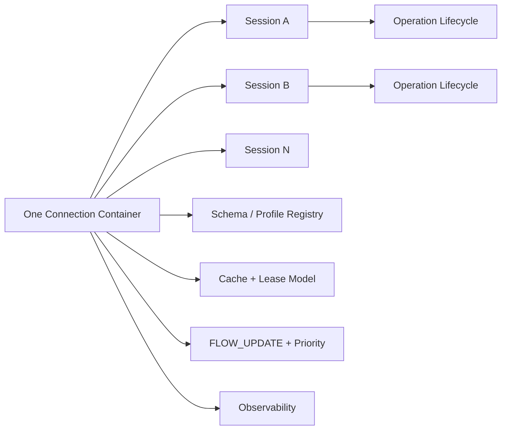

# NNRP/1-preview3 Protocol Design

## 1. Positioning

`NNRP/1-preview3` does not continue the `NNRP/1` line by piling on isolated capabilities. Its purpose is to freeze the protocol topics that are still missing from the next stage of `NNRP/1`: a multi-session connection container, a profile-neutral schema/profile registry, and unified runtime semantics for operation/workflow lifecycles.

preview3 focuses on three protocol problems:

1. Connection and session model: upgrade the single-active-session mental model into a unified container that can carry multiple sessions, multiple priorities, and multiple concurrent operations.
2. Extension and data semantics: bring typed payloads, schema/profile interpretation, and cache/lease behavior into one stable public protocol boundary rather than continuing to patch them per implementation.
3. Lifecycle and observability: freeze operation/workflow lifecycle, flow-control, recovery, and observability semantics so they remain consistent across implementations.

Therefore, this document defines only protocol-layer boundaries: message types, fixed metadata, body layout, error vocabulary, state-machine semantics, and the conformance baseline.

The formal role of preview3 is therefore: the next protocol-freeze document for `NNRP/1`, not a place to prescribe any concrete implementation shape.

## 1.1 Overview Diagram

This diagram compresses the core protocol objects of preview3 into one view: the connection is now a multi-session container, operations become explicit lifecycle objects, and extensibility is governed by the schema/profile registry.

## 2. Topics Explicitly Covered by preview3

`NNRP/1-preview3` explicitly covers the following topics:

1. Upgrade the connection model from preview2's primary mental model of a single active session into a unified connection container capable of carrying multiple active sessions, multiple priority streams, and multi-workflow operations.
2. Upgrade preview2's object cache into an AI runtime cache with lease, versioning, dependency, and observability.
3. Upgrade typed payloads from static enums to a negotiable type system driven by a schema/profile registry.
4. Elevate tool deltas, structured events, and multi-step inference results into explicit operation / workflow runtime semantics, rather than treating them only as payload frames.
5. Freeze cross-implementation conformance, golden vectors, error codes, descriptor layouts, and state-machine vocabulary so all implementations consume the same protocol baseline.
6. Define the public boundary of flow control, recovery, and observability fields so implementations do not invent a second runtime semantics in parallel.

preview3 still keeps the core constraints of preview1/preview2:

1. The hot path remains binary, fixed-layout, explicitly sized, and directly locatable.
2. The protocol continues to serve real-time AI runtime semantics rather than browser media stacks or general-purpose RPC.
3. The public layer remains profile-neutral in preview3. The first-round standard profiles include at least `tensor` and `token`; tensor is no longer treated as the default privileged profile.

## 3. Topics Not Covered by preview3

preview3 explicitly does not cover the following content:

1. Traditional media-stack problems such as browser media capture, playback, A/V sync, AEC, ABR, and SFU/MCU.
2. Private GPU memory-page layout, KV-cache page encoding, or runtime internal thread models of a specific model or inference framework.
3. UI / game-engine / notebook / web-framework wrapping conventions of specific host environments.
4. Concrete implementation-facing API shape, handle management, callback/polling drive modes, packaging, and release strategy.
5. Hard-coding all upper-layer AI business semantics into public protocol enums; preview3 defines only public runtime semantics and standard extension mechanisms.

The mistake preview3 must avoid is misunderstanding "making multi-language integration easier" as "the protocol layer must freeze all upper-layer business objects at once." What should actually be frozen are extension boundaries, object lifecycle, and cross-language consistency requirements, rather than the upper-layer object tree of a single product form.

## 4. Design Principles

preview3 adopts the following design principles:

1. Single protocol semantic source: cross-implementation public semantics must be frozen first in the protocol document and conformance baseline; no implementation may privately redefine them.
2. No text on the hot path: `FRAME_SUBMIT`, `RESULT_PUSH`, typed payload frames, cache objects, and schema descriptions all continue to follow fixed-layout binary paths, with no JSON/Protobuf hot-path fallback.
3. Protocol concepts first: once multi-session, priority, cache lease, schema registry, operation lifecycle, and similar concepts affect cross-language interoperability, they must first become protocol concepts rather than being left to private extensions in a single implementation.
4. Profile/schema layering: the public layer freezes connection, session, cache, budget, priority, and operation semantics; concrete payload structures are extended through the profile/schema registry rather than continuously bloating public enums.
5. Overwrite-in-place evolution within one major line: preview iterations inside the same major line directly overwrite the current `NNRP/1` semantics and do not preserve parallel preview-compatibility paths.
6. Implementation neutrality: the protocol constrains messages, metadata, error vocabulary, state machines, and descriptor boundaries, not concrete implementation shape.

## 5. Implementation Boundary

This document freezes only protocol objects, fixed layouts, state machines, error codes, and the conformance vocabulary.

Concrete implementation-facing API shape, handle management, callback/polling drive modes, packaging, and release strategy are not frozen in this protocol document.

The cross-version design of the protocol conformance suite itself, including its layering, case-status model, and integration boundary for implementations, is specified separately in the `conformance-suite` design document. preview3 only declares here that it must consume one shared public conformance baseline rather than redefining the whole testing framework inline.

## 6. NNRP/1 Code-Level Identity and Inherited Constraints

### 6.1 Code-Level Version Identity

preview3, as a development-stage document inside the NNRP/1 line, freezes the emitted code-level identity as `NNRP/1.0`:

1. `version_major = 1`
2. `wire_format = 0`
3. ALPN `nnrp/1`

This does not mean the design-stage name stops being preview3. It means preview3 must not introduce a new preview-only code-level stage byte or preview-only ALPN. Although the connection and session model of preview3 reuses some concepts of preview2, the new semantics of multiple sessions, multiple priorities, and schema registry added by preview3 must be negotiated through explicit protocol concepts and capability windows rather than being encoded as a preview-only version number.

### 6.2 Common Header and Length Model

preview3 continues to retain the 40-byte common header and the self-describing length model of `meta_len + body_len`. The main evolution points of preview3 still lie in:

1. Upgrading the field semantics of the metadata table.
2. Dividing responsibilities across control-plane message families.
3. The extension capability of body regions and the binding relationship between typed payloads and schema.
4. Connection and session state-machine semantics.

### 6.3 Continued Principles from Earlier Frozen Work

The following design principles of preview2 continue to hold in preview3:

1. The normative host shape remains `submit pump + result pump + control path`, rather than synchronous request-response.
2. The distinction among `partial / stale_reuse / degraded / drop` must still be explicitly preserved at the protocol layer.
3. Low-frequency object caching and object references continue to be first-class citizens and do not fall back to "stable objects fully inlined on every frame."
4. Typed payloads and extension frames continue to be retained, but the extension mechanism no longer primarily proceeds by "continuing to expand the payload-kind bitmap."

## 7. preview3 Connection and Session Model

### 7.1 Connection-Level Bootstrap and Multi-Session Container

preview3 explicitly treats a connection as a session container rather than a dedicated channel for a single active session.

Minimum requirements:

1. A single connection may carry multiple active sessions.
2. `CLIENT_HELLO / SERVER_HELLO_ACK` are responsible for connection-level capability negotiation, authentication, feature window negotiation, and declaration of baseline cache and schema capabilities.
3. Add `SESSION_OPEN / SESSION_OPEN_ACK` as an explicit session-creation flow for declaring profile, schema, budget window, priority class, and cache/lease requirements.
4. `SESSION_PATCH / SESSION_PATCH_ACK` continue to be retained as the low-frequency session-update path.
5. `CLOSE` can still be used for connection-level closure. preview3 additionally requires explicit session-close semantics so that the preview1/2 habit of "closing one session equals closing the whole connection" does not continue leaking into the multi-session model.

### 7.1A Freezing of `SESSION_OPEN` / `SESSION_OPEN_ACK` Fixed Metadata

In the first round, preview3 freezes `SESSION_OPEN` and `SESSION_OPEN_ACK` as minimally implementable yet extensible session-open metadata, rather than letting implementations privately assemble their own session-open body.

The fixed metadata of `SESSION_OPEN` is fixed at 48 bytes in the first round:

| Field | Type | Description |
| --- | --- | --- |
| `requested_session_id` | `u32` | Session id desired by the client; `0` means assigned by the server |
| `profile_id` | `u16` | Requested standard or extension profile |
| `priority_class` | `u8` | Session priority class; values are frozen later in this document |
| `session_flags` | `u8` | Session-level capability/behavior flags |
| `schema_id` | `u32` | Default schema id; `0` if absent |
| `schema_version` | `u32` | Default schema version; `0` if absent |
| `default_deadline_ms` | `u32` | Default operation deadline or latency budget |
| `max_in_flight_operations` | `u16` | Maximum number of parallel operations expected by the client |
| `reserved0` | `u16` | Reserved; sender clears to `0` |
| `lease_ttl_hint_ms` | `u32` | Default lease TTL expected by the client; `0` if unspecified |
| `resume_token_bytes` | `u32` | Length of `resume_token_block`; `0` if absent |
| `auth_bytes` | `u32` | Length of `auth_block`; `0` if absent |
| `session_extension_bytes` | `u32` | Length of `session_extension_block`; `0` if absent |
| `client_session_tag` | `u64` | Client-local observable tag for logs and cross-layer correlation |

The fixed metadata of `SESSION_OPEN_ACK` is fixed at 56 bytes in the first round:

| Field | Type | Description |
| --- | --- | --- |
| `session_id` | `u32` | Actually allocated or confirmed session id |
| `accepted_profile_id` | `u16` | Profile id accepted by the server |
| `accepted_priority_class` | `u8` | Priority class accepted by the server |
| `session_status` | `u8` | Session-open result status |
| `schema_id` | `u32` | Default schema id confirmed by the server |
| `schema_version` | `u32` | Default schema version confirmed by the server |
| `granted_operation_credit` | `u16` | Initially granted operation credit |
| `max_in_flight_operations` | `u16` | Maximum number of parallel operations allowed by the server |
| `lease_ttl_ms` | `u32` | Default lease TTL accepted by the server |
| `resume_window_ms` | `u32` | Resume window; `0` if absent |
| `resume_token_bytes` | `u32` | Length of `resume_token_block`; `0` if absent |
| `session_extension_bytes` | `u32` | Length of `session_extension_block`; `0` if absent |
| `server_session_tag` | `u64` | Server-local observable tag |
| `route_scope_id` | `u32` | Minimum routing scope confirmed by the server |
| `session_error_code` | `u32` | Stable error code returned if `session_status` is not success |
| `session_flags_ack` | `u32` | Session flags accepted by the server |

Additional constraints in the first round:

1. `SESSION_OPEN` is responsible only for establishing the default session context; it does not carry the body of the first operation submission.
2. `schema_id / schema_version` indicate the default schema of the session rather than forbidding later operation-level overrides.
3. Higher-level profile-private session parameters still enter through `session_extension_block` or schema/profile object extensions rather than continuing to bloat fixed metadata.

### 7.1B Freezing of session-open status bits and error codes

preview3 freezes the following `session_flags:u8` bit definitions in the first round:

| bit | Mask | Meaning |
| --- | --- | --- |
| 0 | `0x01` | `allow_resume`: the client requests that the session support resume tokens / resume windows |
| 1 | `0x02` | `allow_background_results`: background result/event pumps are allowed to continue delivering outside submit calls |
| 2 | `0x04` | `allow_cache_leases`: the session is allowed to create or renew cache/schema leases |
| 3 | `0x08` | `allow_schema_override`: operation-level override of the session default schema is allowed |
| 4-7 | Reserved | The sender clears them to `0`; the receiver must reject non-zero reserved bits |

preview3 freezes the following `session_status:u8` enum values in the first round:

| Value | Name | Meaning |
| --- | --- | --- |
| `0` | `opened` | Session established successfully |
| `1` | `rejected` | The server rejected establishing the session |
| `2` | `retry_later` | The session cannot currently be established; it may be retried later according to retry/reuse-related policy |
| `3` | `resumed` | The session was established successfully in resume mode |

preview3 freezes the following `session_flags_ack:u32` bit definitions in the first round:

| bit | Mask | Meaning |
| --- | --- | --- |
| 0 | `0x00000001` | `resume_enabled`: resume is allowed by the server |
| 1 | `0x00000002` | `background_results_enabled`: background result/event pumps are allowed by the server |
| 2 | `0x00000004` | `cache_leases_enabled`: cache/schema leases are allowed by the server |
| 3 | `0x00000008` | `schema_override_enabled`: operation-level schema override is allowed by the server |
| 4 | `0x00000010` | `priority_downgraded`: the requested priority was downgraded by the server |
| 5-31 | Reserved | The sender clears them to `0`; the receiver must reject unknown set bits |

preview3 freezes the following `session_error_code:u32` family in the first round:

| Value | Name | Meaning |
| --- | --- | --- |
| `0x00000000` | `none` | No error |
| `0x00010001` | `auth_failed` | Authentication failed |
| `0x00010002` | `profile_unsupported` | The requested profile is unsupported |
| `0x00010003` | `schema_unsupported` | The requested schema or version is unsupported |
| `0x00010004` | `priority_rejected` | The requested priority class is not allowed |
| `0x00010005` | `lease_policy_rejected` | The requested lease policy is not allowed |
| `0x00010006` | `resume_rejected` | The requested resume mode or token is not allowed |
| `0x00010007` | `session_limit_reached` | The current connection or server session limit has been reached |

Constraints in the first round:

1. `session_error_code` returns a non-zero value only when `session_status != opened` or when there is a downgrade/recovery-related abnormality.
2. `session_flags_ack` may only confirm or downgrade what the client requested, and may not privately introduce new capabilities that were not requested.
3. If this error-code family needs to be extended later, it must continue to expand according to a high-bit family-reservation strategy and must not reorder already frozen values.

### 7.1C Freezing of `SESSION_CLOSE` / `SESSION_CLOSE_ACK` and the minimum routing fields

In the first round, preview3 freezes session close as a standard control-message pair rather than reusing the implicit habit of connection `CLOSE`.

`SESSION_CLOSE` fixed metadata is frozen to 24 bytes in the first round:

| Field | Type | Description |
| --- | --- | --- |
| `close_reason` | `u16` | Close reason; values are frozen below |
| `in_flight_policy` | `u8` | How existing in-flight operations are handled |
| `reserved0` | `u8` | Reserved; sender clears to `0` |
| `drain_timeout_ms` | `u32` | Timeout window for draining existing operations; `0` means apply immediately |
| `last_operation_id` | `u64` | The last operation watermark acknowledged by the sender; `0` if absent |
| `session_error_code` | `u32` | Stable error code when the session is being closed because of an error; otherwise `0` |
| `session_close_tag` | `u32` | Local observability correlation tag for the close |

`SESSION_CLOSE_ACK` fixed metadata is frozen to 16 bytes in the first round:

| Field | Type | Description |
| --- | --- | --- |
| `close_status` | `u8` | Close-ack status; values are frozen below |
| `reserved0` | `u8` | Reserved; sender clears to `0` |
| `reserved1` | `u16` | Reserved; sender clears to `0` |
| `last_operation_id` | `u64` | Operation watermark confirmed by the server |
| `session_error_code` | `u32` | Stable error code if closing itself encountered an error; otherwise `0` |

`close_reason:u16` is frozen in the first round as:

| Value | Name | Semantics |
| --- | --- | --- |
| `0` | `normal` | Normal close |
| `1` | `client_shutdown` | Client-initiated shutdown |
| `2` | `server_shutdown` | Server-initiated shutdown |
| `3` | `idle_timeout` | Closed because of idle timeout |
| `4` | `protocol_error` | Closed because of a stable protocol error |
| `5` | `auth_revoked` | Closed because authentication was revoked or expired |

`in_flight_policy:u8` is frozen in the first round as:

| Value | Name | Semantics |
| --- | --- | --- |
| `0` | `drain` | Allow existing in-flight operations to drain within `drain_timeout_ms` |
| `1` | `abort` | Abort existing in-flight operations immediately |

`close_status:u8` is frozen in the first round as:

| Value | Name | Semantics |
| --- | --- | --- |
| `0` | `acknowledged` | The close request has been accepted and is being executed |
| `1` | `draining` | Existing operations are still being drained |
| `2` | `closed` | The session is fully closed |
| `3` | `rejected` | The close request was rejected |

Additional first-round constraints:

1. Connection-scope control messages must use `header.session_id = 0`.
2. Session-scope control, data, and result messages must use `header.session_id = target session`.
3. Operation-scope messages must carry both `header.session_id` and an `operation_id` in their fixed metadata.
4. `SESSION_CLOSE` closes only one session and does not imply closing the whole connection.
5. If `SESSION_CLOSE_ACK.close_status = draining`, the sender must continue processing subsequent terminal events against the known operation watermark until `closed` or a later close acknowledgment is received.

### 7.2 Priorities and Stream Classes

preview3 introduces explicit priority and stream-class semantics for scheduling multiple sessions on the same connection and multiple operations within the same session.

At minimum, the protocol layer must be able to express:

1. Session priority classes, such as `interactive / balanced / background`.
2. Operation priorities and deadline windows.
3. The dual-layer constraints of dynamic credit at the session level and the connection level.
4. Explicit acknowledgments from the server for priority downgrade, rate limiting, or preemption.

preview3 does not require any specific scheduling algorithm to be hard-coded as the only implementation, but it must freeze these semantic objects and error vocabularies so that different implementations no longer diverge in their interpretation of "backpressure," "preemption," and "expiration."

### 7.2A Freezing of standard scheduling enums

preview3 freezes the following standard enum values in the first round:

`session_priority_class:u8`

| Value | Name | Semantics |
| --- | --- | --- |
| `0` | `interactive` | For foreground low-latency interaction, prioritizing deadlines and responsiveness |
| `1` | `balanced` | Default priority, balancing throughput and latency |
| `2` | `background` | For background tasks or prefetch work, which may be preempted by higher priorities |

`operation_state:u8`

| Value | Name | Semantics |
| --- | --- | --- |
| `0` | `accepted` | Accepted and entered the scheduling system |
| `1` | `running` | Execution has started |
| `2` | `partial` | Consumable but non-terminal partial results have been produced |
| `3` | `waiting_tool` | Waiting for a tool or external dependency before continuing |
| `4` | `superseded` | Superseded by a new operation or new context |
| `5` | `cancelled` | Explicitly cancelled |
| `6` | `failed` | Terminated with an error |
| `7` | `completed` | Completed normally |

`cancel_scope:u8`

| Value | Name | Semantics |
| --- | --- | --- |
| `0` | `operation` | Cancel only a single operation |
| `1` | `subtree` | Cancel that operation and its child-operation tree |
| `2` | `group` | Cancel all operations under the same `operation_group_id` |
| `3` | `session` | Cancel all still-active operations under the entire session |

Constraints in the first round:

1. All implementations must treat these numeric values as protocol enums rather than private local status codes.
2. `partial` and `completed` may appear in sequence within the same operation lifecycle; `failed / cancelled / superseded / completed` are terminal states.
3. `interactive` expresses only scheduling priority and credit preference, and does not guarantee absolute resource exclusivity.

## 8. preview3 Advanced Cache Model

preview2 already has cache objects and object references; preview3 needs to upgrade them into a lease-capable, versioned, dependency-trackable AI runtime cache.

The preview3 cache model contains at least the following capabilities:

1. lease: cache objects or schema objects must be able to declare TTL, renewal, expiration policy, and owner scope.
2. version: object references must distinguish `object_id` from `object_version`, no longer leaving "changed content but reused old key" to host-private conventions.
3. dependency: objects, results, and schemas must be able to declare dependency relationships for result reuse, cache invalidation, and consistency checks.
4. observability: the protocol layer must be able to express stable error reasons such as cache miss, lease expired, dependency invalid, and schema mismatch.
5. host-visible policy: the client may proactively declare preferences such as prefetch, touch, lease renew, eviction hints, or result reuse.

preview3 does not require the public layer to directly freeze private model KV-cache page encodings; such objects should still exist as profile-local or runtime-private object kinds. The public layer is responsible for freezing the lease contract, version semantics, dependency semantics, and error behavior.

### 8.1 Freezing of lease, version, and cache-error vocabulary

In the first round, preview3 further freezes the following cache-level public semantics:

1. `object_id` is the logical object identity; it remains stable when content changes but the logical identity does not.
2. `object_version` is the content-revision number under the same `object_id`; it must increase monotonically on semantic changes.
3. `lease_id:u64` is the stable identity of one granted lease; renewal preserves the same `lease_id`, while a new grant creates a new `lease_id`.
4. `lease_owner_scope:u8` is frozen as `connection=0 / session=1 / operation=2`.
5. Host-visible policy hints such as `prefetch / touch / renew / evict_hint / reuse_preference` are explicit hints and must not be interpreted as mandatory overrides of version, dependency, or schema validation.

`cache_error_code:u32` is frozen in the first round as:

| Value | Name | Meaning |
| --- | --- | --- |
| `0x00030000` | `none` | No cache error |
| `0x00030001` | `cache_miss` | The referenced object does not exist |
| `0x00030002` | `lease_expired` | The referenced lease has expired |
| `0x00030003` | `version_mismatch` | The requested `object_version` does not match the current available version |
| `0x00030004` | `dependency_invalid` | A dependent object or schema has become invalid |
| `0x00030005` | `schema_mismatch` | The object is incompatible with the required schema/profile interpretation |

First-round constraints:

1. `cache_miss / lease_expired / version_mismatch / dependency_invalid / schema_mismatch` must stay as stable error vocabulary across implementations and must not be rewritten into local private string errors.
2. If result reuse depends on a specific `object_id + object_version` or schema version, that dependency must enter the observable dependency graph; invalidation must return either a stable error code or an explicit invalidation event.
3. Runtime-private object kinds may still exist, but they may not bypass the public `object_id / object_version / lease_id / cache_error_code` semantics above.

## 9. preview3 Schema / Profile Registry

preview3 no longer treats "continuing to add payload-kind enums" as the primary extension path, but introduces a standard schema/profile registry.

Design goals:

1. The public layer does not presuppose a single default profile. The first-round standard profiles include at least `tensor` and `token`, and continue to allow payload families such as `structured_event`, `tool_delta`, and `opaque_bytes` to hang off the schema/profile registry.
2. Concrete payload semantics are bound through `schema_id + schema_version + profile_id + stream_semantics` rather than adding a new public payload kind every time a new data type appears.
3. Schema objects enter the cache / lease lifecycle and may be preinstalled, referenced, invalidated, and version-rolled back.
4. Different implementations must not interpret descriptor-private fields independently; they must follow one unified schema-registry contract.

preview3 therefore needs to standardize at least the following information:

1. The common header of schema descriptor objects.
2. Negotiation, installation, invalidation, and version-conflict handling of the schema registry.
3. Standard fields related to schema/profile binding in typed payload descriptors.
4. Error handling for unknown schema, unknown version, and critical schema incompatibility.

### 9.3 Freezing of the common header of schema descriptors

preview3 fixes the common header of schema descriptors to 32 bytes in the first round, so version, applicability, and routing decisions can be completed without parsing the profile-private body.

| Field | Type | Description |
| --- | --- | --- |
| `schema_id` | `u32` | Schema identifier |
| `schema_version` | `u32` | Schema version |
| `profile_id` | `u16` | Profile to which this schema belongs |
| `schema_flags` | `u16` | Schema behavior flags |
| `min_version_major` | `u8` | Minimum applicable major version |
| `max_version_major` | `u8` | Maximum applicable major version |
| `reserved0` | `u16` | Reserved; sender clears to `0` |
| `body_bytes` | `u32` | Length of the schema body |
| `dependency_count` | `u16` | Number of dependent schema/object entries |
| `default_stream_semantics` | `u16` | Default stream semantics |
| `schema_hash` | `u64` | Stable digest of the schema body |

Constraints in the first round:

1. The common header addresses only public questions such as "what this schema is, which profile it belongs to, which major version it applies to, how long the body is, and how many objects it depends on."
2. Any profile-private interpretation fields must enter the schema body and must not continue to bloat the common header.
3. `schema_hash` is used for consistency checks and cache deduplication; it does not directly replace the logical identity of `schema_id + schema_version`.
4. `default_stream_semantics` provides only default semantics; a payload descriptor may still override it on a per-frame or per-operation basis.

`schema_flags:u16` freezes the following bit definitions in the first round:

| bit | Mask | Meaning |
| --- | --- | --- |
| 0 | `0x0001` | `cacheable`: this schema may enter the cache / lease lifecycle |
| 1 | `0x0002` | `critical`: unknown or incompatible handling must reject |
| 2 | `0x0004` | `default_bindable`: this schema may be used as a session default schema |
| 3 | `0x0008` | `hash_stable`: the same `schema_id + schema_version` must bind to the same `schema_hash` |
| 4-15 | Reserved | The sender clears them to `0`; the receiver must reject unknown set bits |

`stream_semantics:u16` / `default_stream_semantics:u16` are frozen in the first round as:

| Value | Name | Semantics |
| --- | --- | --- |
| `0` | `default` | Inherit the default profile/schema interpretation |
| `1` | `snapshot` | The current payload is a full snapshot |
| `2` | `append` | The current payload appends to an existing sequence or stream |
| `3` | `replace` | The current payload replaces an existing logical segment |
| `4` | `event` | The current payload carries discrete event semantics |
| `5` | `tool_update` | The current payload carries tool-call or tool-result incremental semantics |

### 9.1 Freezing of the first-round standard profiles

In the first round, preview3 first freezes the standard profiles as `tensor profile` and `token profile`, both of which are equally valid at the public layer.

The minimum standard semantics of `tensor profile` remain:

1. It is oriented toward blockized or regionized numeric payloads rather than being forcibly bound to rendering scenarios.
2. It allows shape, dtype, layout, section/layout interpretation, and coverage semantics to be declared through schema/profile descriptors.
3. `partial / degraded / stale_reuse` under the tensor profile may still carry coverage semantics, but coverage is no longer the default requirement for all profiles.

The minimum standard semantics of `token profile` are frozen as:

1. It is oriented toward incremental output of discrete tokens or token chunks and does not require token sequences to masquerade as tensor sections.
2. The standard result path must at least be able to express incremental token fragments, sequence position/range, completion status, and stop/reason vocabulary.
3. In the first round, `token profile` does not require logits, full candidate distributions, or model-private sampling state to enter mandatory public fields; such content may only enter through schema/profile extensions.
4. Under the token profile, the default meaning of `partial` is "the sequence is not yet complete but the current chunk is consumable," rather than a tensor-style coverage gap.

### 9.2 Boundary of minimal fields in the first-round descriptors

In the first round, preview3 requires typed payload descriptors to be able to stably bind at least the following public fields:

1. `profile_id`
2. `schema_id`
3. `schema_version`
4. `stream_semantics`
5. `offset`
6. `length`
7. `flags`

On top of that, the minimum semantic-field boundary of different standard profiles is frozen as follows:

1. A tensor-profile descriptor must be able to uniquely determine the numeric interpretation of the payload, including the entry point for shape/layout interpretation, the entry point for dtype interpretation, and whether profile-local coverage/section semantics exist.
2. A token-profile descriptor must be able to uniquely determine the sequence interpretation of the payload, including token units, position/range vocabulary, incremental/terminal semantics, and whether stop-reason is explicitly given in this frame.
3. Beyond the minimal fields above, any higher-level profile-private field must enter through schema/profile extensions, and must not directly elevate a private sampling or tensor-layout field of a single runtime into a mandatory public field.

### 9.2A Freezing of the fixed layout of typed payload descriptors

preview3 fixes the public layout of typed payload descriptors to 24 bytes in the first round:

| Field | Type | Description |
| --- | --- | --- |
| `profile_id` | `u16` | The profile to which this payload belongs |
| `descriptor_flags` | `u16` | Descriptor behavior flags |
| `schema_id` | `u32` | The schema id that interprets this payload |
| `schema_version` | `u32` | The schema version that interprets this payload |
| `stream_semantics` | `u16` | The stream semantics of this payload |
| `reserved0` | `u16` | Reserved; sender clears to `0` |
| `offset` | `u32` | Byte offset relative to the typed-payload frame region |
| `length` | `u32` | Byte length of the payload |

`descriptor_flags:u16` freezes the following bit definitions in the first round:

| bit | Mask | Meaning |
| --- | --- | --- |
| 0 | `0x0001` | `terminal`: this payload carries the terminal fragment of the current profile/operation |
| 1 | `0x0002` | `partial`: this payload is an incremental fragment that is consumable but non-terminal |
| 2 | `0x0004` | `schema_override`: this descriptor explicitly overrides the session default schema |
| 3 | `0x0008` | `profile_hint_present`: additional hints required for profile-local interpretation are present in the schema/profile body |
| 4-15 | Reserved | The sender clears them to `0`; the receiver must reject unknown set bits |

Constraints in the first round:

1. All standard profiles must use the same 24B descriptor public header and must not independently change byte layout by language or profile.
2. The minimum interpretation entry of tensor and token is jointly determined by `profile_id + schema_id + schema_version + stream_semantics + descriptor_flags`; finer-grained fields continue to go through the schema/profile body.
3. `offset / length` are always interpreted relative to the typed-payload frame region. No binding may change them to be relative to the entire packet body or some private subregion.
4. `terminal` and `partial` may both be zero, but they must not simultaneously express mutually conflicting terminal semantics; profile-private terminal detail continues to be interpreted through schema/profile.

This allows preview3 to support more data types without needing to freeze an ever-expanding public bitmap table each time.

### 9.4 Freezing of schema-registry flow and error behavior

In the first round, preview3 freezes the minimum schema-registry flow as:

1. `install`: install a new schema when `schema_id + schema_version + schema_hash` is not yet present.
2. `update`: install a higher `schema_version` under the same `schema_id`; policy may decide whether old versions remain available, but it must not mutate the `schema_hash` of an already installed version.
3. `invalidate`: explicitly invalidate a schema by `schema_id + schema_version` or through dependency invalidation.
4. `version_conflict`: if the same `schema_id + schema_version` arrives with a different `schema_hash`, the receiver must reject it and return a stable error.

`schema_error_code:u32` is frozen in the first round as:

| Value | Name | Meaning |
| --- | --- | --- |
| `0x00040000` | `none` | No schema error |
| `0x00040001` | `schema_unknown` | The requested `schema_id` does not exist |
| `0x00040002` | `schema_version_unknown` | The requested `schema_version` does not exist |
| `0x00040003` | `schema_hash_conflict` | The same `schema_id + schema_version` was presented with a different `schema_hash` |
| `0x00040004` | `schema_incompatible` | The schema is incompatible with the current profile, major version, or critical constraints |
| `0x00040005` | `schema_dependency_missing` | A schema dependency is missing or unavailable |
| `0x00040006` | `schema_update_rejected` | A schema update or invalidation request was rejected by policy |

First-round constraints:

1. When `schema_flags.critical` is set and the receiver cannot recognize the schema, version, or dependency, it must return a stable `schema_error_code` and must not silently skip the schema.
2. The binding between a typed payload descriptor and `schema_id / schema_version / profile_id` is strict; implementations must not rewrite it into a "looks close enough" heuristic.
3. The standard `install / update / invalidate / version_conflict` flow must remain consistent across implementations; local integration layers must not privately reinterpret conflict outcomes.

## 10. preview3 Agent / Workflow Runtime Semantics

preview2 can already carry `structured_event` and `tool_delta`; what preview3 adds is their lifecycle semantics at runtime.

preview3 needs to express at least the following objects:

1. `operation_id`: the unique identifier of an inference, generation, tool call, or multi-step workflow operation.
2. `parent_operation_id`: used to express operation trees, subtasks, and dependency chains.
3. `operation_group_id`: used for scheduling, canceling, or subscribing to results of a group of operations.
4. `operation_state`: such as `accepted / running / partial / waiting_tool / superseded / cancelled / failed / completed`.
5. `cancel_scope`: allows canceling a single operation, a subtree, a group, or an entire session.

The goal of these semantics is not to write all agent frameworks into a unified DSL, but to provide a cross-language unified lifecycle semantics for "multi-step AI workflows running in a single long-lived connection session."

### 10.1 Freezing the ownership boundary of `structured_event` / `tool_delta`

preview3 explicitly freezes the following boundaries in the first round:

1. `structured_event` and `tool_delta` still belong to payload families by default and are not automatically elevated into standalone profiles.
2. Only when an event affects an operation lifecycle that must interoperate across languages does its minimum semantics enter the public operation model; otherwise it remains in the schema/profile payload layer.
3. `operation_id`, `parent_operation_id`, `operation_group_id`, `operation_state`, and `cancel_scope` belong to public lifecycle semantics and must be interpretable independently of concrete payloads.
4. Higher-level content such as tool-call parameters, tool-result bodies, and rich event payloads continue by default to remain in `structured_event` / `tool_delta` payloads and are interpreted through the schema/profile registry.
5. Therefore, preview3 does not hard-code tool-call bodies or event bodies into public fixed metadata; the public layer freezes only lifecycle, routing, cancellation, and state-transition semantics.

## 11. preview3 Flow Control, Recovery, and Observability

preview3 needs to push the flow control and migration of preview2 one level further.

At minimum, it should add:

1. Dual-layer acknowledgment of connection-level credit and session-level credit.
2. Priority-aware `FLOW_UPDATE`, allowing the server to adjust windows independently for different sessions / operations.
3. Recovery, resume token, and `resume_from_operation` semantics under multi-session scenarios.
4. Unified result / event / control observability fields so multi-language hosts can stably record queue, compute, transport, backpressure, cache-hit, and lease events.

In the first round, preview3 explicitly freezes the recovery object as the session; a frame is not a recovery object, and an operation is only a watermark and observability boundary within session recovery.

### 11.1 Freezing the three-scope `FLOW_UPDATE` and its metadata

In the first round, preview3 fixes `FLOW_UPDATE` to 32 bytes of fixed metadata for uniformly expressing connection-, session-, and operation-level credit and backpressure updates, rather than allowing different implementations to define private credit packets independently.

| Field | Type | Description |
| --- | --- | --- |
| `scope_kind` | `u8` | Update scope; values are frozen below |
| `update_reason` | `u8` | Reason for the update; values are frozen below |
| `backpressure_level` | `u8` | Current backpressure level; values are frozen below |
| `reserved0` | `u8` | Reserved; sender clears to `0` |
| `connection_credit` | `u16` | Connection-level parallel credit |
| `session_credit` | `u16` | Session-level parallel credit |
| `operation_credit` | `u16` | Operation-level parallel credit |
| `reserved1` | `u16` | Reserved; sender clears to `0` |
| `operation_id` | `u64` | Points to the target operation when `scope_kind=operation`; otherwise `0` |
| `retry_after_ms` | `u32` | Suggested retry or reprobe window; `0` if absent |
| `credit_epoch` | `u32` | Monotonically increasing credit-update epoch |
| `flow_flags` | `u32` | Flow-control behavior bitmap |

`scope_kind:u8` is frozen in the first round as:

| Value | Name | Semantics |
| --- | --- | --- |
| `0` | `connection` | Update the total credit or total backpressure state of the entire connection |
| `1` | `session` | Update the credit or backpressure state of a specific session |
| `2` | `operation` | Update the credit or backpressure state of a specific operation |

`update_reason:u8` is frozen in the first round as:

| Value | Name | Semantics |
| --- | --- | --- |
| `0` | `grant` | Newly grant credit or relax restrictions |
| `1` | `reduce` | Tighten the credit window |
| `2` | `pause` | Pause sending new operations |
| `3` | `resume` | Resume from the paused state |
| `4` | `congestion` | Enter rate limiting or backpressure due to congestion |

`backpressure_level:u8` is frozen in the first round as:

| Value | Name | Semantics |
| --- | --- | --- |
| `0` | `none` | No backpressure |
| `1` | `soft` | The sender is advised to slow down proactively, but is not forced to stop |
| `2` | `hard` | The sender should stop submitting new operations until a later relaxed update is received |

`flow_flags:u32` freezes the following bit definitions in the first round:

| bit | Mask | Meaning |
| --- | --- | --- |
| 0 | `0x00000001` | `credit_valid`: the credit field for the corresponding scope is valid |
| 1 | `0x00000002` | `retry_after_valid`: `retry_after_ms` is valid |
| 2 | `0x00000004` | `background_only`: only background or low-priority operations may continue progressing |
| 3 | `0x00000008` | `drain_in_flight_only`: only existing in-flight operations may drain; no new operations are accepted |
| 4-31 | Reserved | The sender clears them to `0`; the receiver must reject unknown set bits |

Constraints in the first round:

1. When `scope_kind=connection`, header `session_id` must be `0`, `operation_id` must be `0`, and the sender reads only `connection_credit`.
2. When `scope_kind=session`, header `session_id` must be the target session, `operation_id` must be `0`, and the sender prioritizes reading `session_credit`.
3. When `scope_kind=operation`, header `session_id` must be the target session, `operation_id` must be non-zero, and the sender prioritizes reading `operation_credit`.
4. `credit_epoch` must be monotonically increasing on the same scope; the receiver must not accept updates older than the current epoch.
5. `hard` backpressure is not an error. It indicates that the new submission window has been temporarily tightened; the sender should wait for a later `grant / resume` or a `FLOW_UPDATE` with a higher epoch.
6. This fixed metadata solves only unified routing and control of credit/backpressure and does not carry profile-private queueing metrics. More fine-grained observability data should still be extended through schema/profile or dedicated observability paths.

### 11.2 Freezing of the recovery object and `resume_from_operation`

In the first round, preview3 freezes the following recovery semantics:

1. `resume_token` is always bound to a session rather than a connection or frame.
2. `resume_from_operation_id` is an optional watermark within session recovery and declares "resume terminal results and events after this operation".
3. On successful recovery, `SESSION_OPEN_ACK.session_status` must return `resumed`, and the server must continue delivering unfinished or unacknowledged operation lifecycle events on the resumed session.
4. If the `resume_token` is invalid, expired, unauthorized, or incompatible with the requested profile/schema/session capabilities, the server must return `session_error_code = resume_rejected`.
5. Recovery must not treat historical frames as independent recovery objects; any frame-level or packet-level compensation remains subordinate to session recovery semantics.

## 12. Protocol Freeze Summary

This document currently freezes the following protocol topics:

1. The `NNRP/1.0` code-level identity, the 40-byte common header, and the `meta_len + body_len` length model.
2. The layered boundary among connection, session, and operation, including `SESSION_OPEN / SESSION_OPEN_ACK`, explicit session close, recovery objects, and routing semantics.
3. Runtime semantics such as `FLOW_UPDATE`, priority, cancel scope, operation lifecycle, and recovery watermarks.
4. Cache lease, schema/profile registry, the 32-byte schema descriptor, the 24-byte typed payload descriptor, and their standard error vocabulary.
5. The boundary between `structured_event` / `tool_delta` payload families and the public lifecycle model, as well as the cross-implementation baseline of conformance, golden vectors, enum values, and error codes.

Concrete implementation-facing API shape, packaging, and release strategy are outside the freeze scope of this document.