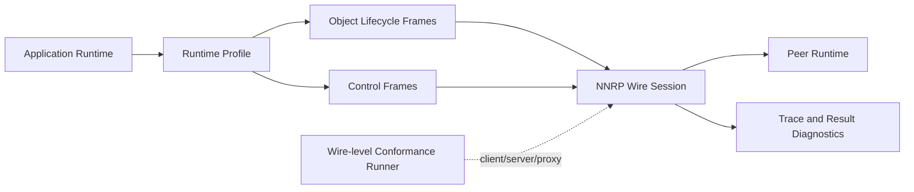
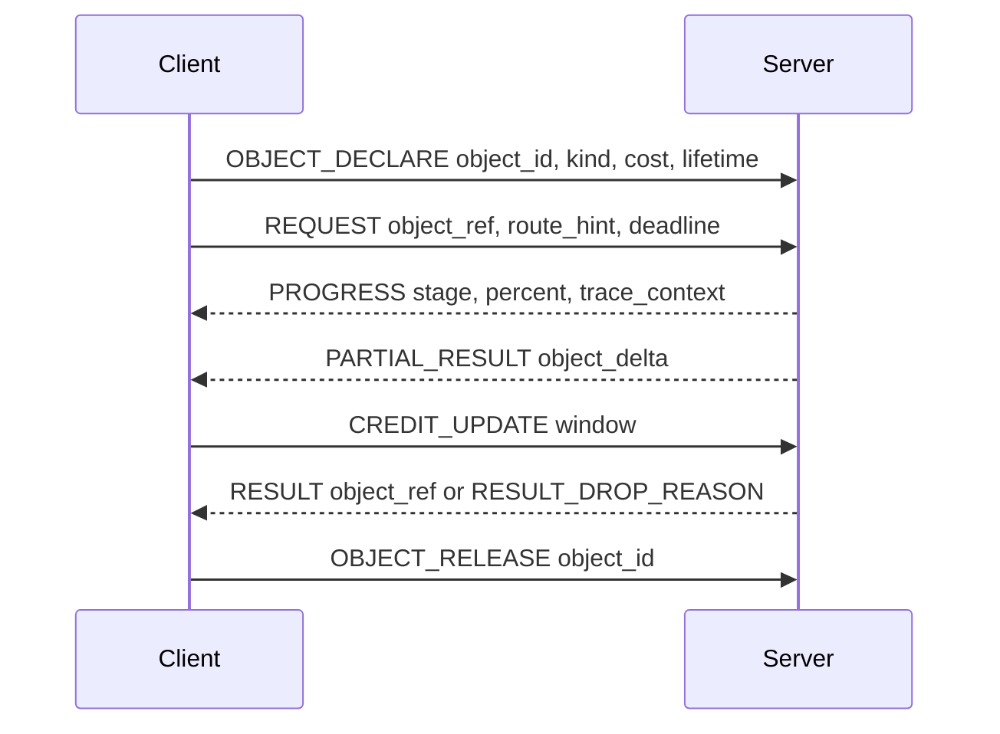

# NNRP/1-preview4 Design: Runtime Object and Control Protocol

NNRP/1-preview3 proved that SDKs can share Rust-backed protocol artifacts and publish consistent
preview packages. It did not prove that every workload benefits from replacing HTTP or SSE. The
preview4 design therefore moves the center of gravity from transport replacement to runtime object
efficiency: keep large or fast-changing runtime state out of repeatedly parsed JSON, make scheduling
decisions explicit, and let conformance verify protocol semantics at the wire level.

## Positioning

Preview4 is for workloads where the protocol boundary carries meaningful runtime state:

- AI coding agents that schedule subagents, tool calls, artifact streams, and multimodal context.
- Neural rendering or runtime services that need partial results, deadlines, drop reasons, and trace
  timing instead of all-or-nothing responses.
- Adapter ecosystems where inference engines should not block NNRP adoption even when the model
  compute path dominates total latency.

It is not a claim that token streaming, vLLM chat completions, or cache lookups are automatically
faster than mature HTTP paths. Cache is one lifecycle tool, not the central promise.

## Architecture

Preview4 keeps the coarse FFI and runtime boundaries introduced in preview3. The new work adds
semantics above those boundaries, not more per-field boundary calls.

Preview4 also closes operation identity on the submit hot path. The fixed 72-byte `FRAME_SUBMIT`
metadata carries a non-zero `operation_id: u64` at offset 40, while the common header keeps the
independent `frame_id: u32`. The complete layout and correlation rules are frozen in
[Data Plane and Operation Identity](/en/protocol/v1/data-plane).

## Runtime Object Lifecycle

Heavy payloads should be named, referenced, patched, and released. A token-oriented JSON profile is
still valid for small responses, but it must not be the only representation for tensors, image
regions, tool artifacts, or reusable context.

## Control Frame Families

| Family | Purpose |
| --- | --- |
| `CANCEL` / `ABORT` | Stop obsolete work. `CANCEL` is cooperative; `ABORT` allows hard teardown when the operation is no longer useful. |
| `SUPERSEDE` | Replace an older operation with a newer one while preserving trace continuity. |
| `PRIORITY_UPDATE` | Change priority after admission so urgent work can move ahead of stale work. |
| `DEADLINE` / `EXPIRE_AT` | Declare when work becomes useless and may be dropped. |
| `PROGRESS` / `PARTIAL_RESULT` | Return usable progress and partial artifacts before the final result. |
| `BACKPRESSURE` / `CREDIT_UPDATE` | Let either side shrink or expand send windows without inventing an out-of-band throttle. |
| `CAPABILITY_NEGOTIATION` | Include support, cost, preference, limits, and downgrade behavior, not only boolean flags. |
| `ROUTE_HINT` / `EXECUTION_HINT` | Carry scheduling hints for subagents and runtime dispatch without heavy JSON or protobuf wrappers. |
| `CACHE_REFERENCE` / `CACHE_MISS` / `CACHE_INVALIDATE` | Formalize cache references and invalidation where reuse is real, without assuming every scene or prompt is cache-friendly. |
| `TRACE_CONTEXT` | Carry end-to-end timing and correlation IDs across frames. |
| `RESULT_DROP_REASON` | Explain why a result was dropped, such as deadline expiry, supersession, backpressure, or peer cancellation. |
| `DEGRADE_PROFILE` | Negotiate a cheaper profile when the preferred one is not available or too expensive. |
| `BUDGET_UPDATE` | Update compute, token, memory, or bandwidth budgets during a session. |
| `ERROR_RECOVERABLE` / `RETRY_AFTER` | Distinguish retryable pressure from terminal failure. |

Preview4 also replaces every cache-key representation with one canonical identity:
`(cache_namespace:u32, cache_key_hi:u64, cache_key_lo:u64)`. Control-plane cache messages,
hot-path object-reference blocks, runtime cache-reference frames, conformance vectors, and SDK APIs
must preserve all 128 key bits; no previous-preview cache wire layout remains valid.

## Profile Expansion

Preview4 should add profile families before forcing every workload through the token stream profile:

- `runtime.control`: common control frames, deadlines, priority, progress, backpressure, trace, and
  drop reasons.
- `runtime.object`: object declaration, object references, deltas, release, and cost metadata.
- `coding.agent`: subagent routing, tool-call artifacts, execution hints, and cancellation policy.
- `multimodal.artifact`: image/audio/video/tool artifacts with typed descriptors and partial result
  channels.
- `render.runtime`: frame deadlines, partial region results, result drop reasons, and trace stages.
- `cache.reference`: cache reference, miss, invalidation, and lease semantics for workloads that can
  actually reuse state.

## Transport Provider Selection Closure

Preview4 closes provider selection as a cross-SDK contract rather than leaving each language with a private weighted
score. Official native and browser artifacts carry structured cost, preference, frame-limit, and limitation metadata.
Rust, Python, JavaScript/TypeScript, and C# expose the same provider observations, probe metrics, candidate diagnostics,
rejection reasons, and deterministic comparator. The normative fields, manifest encoding, public type mapping, and
ordering rules are frozen in [Transport Strategy and Probing](/en/protocol/v1/transport-strategy).

## Wire-level Conformance

Preview4 conformance must include an active wire-level runner. SDK adapter tests are still useful,
but they can hide semantic drift because the implementation controls both the adapter and local
runtime calls.

The wire runner can:

- act as an NNRP client and connect to an implementation server;
- act as an NNRP server and accept an implementation client;
- act as a proxy to inject frame ordering, timeout, backpressure, and close behavior;
- assert frame-level events, terminal states, trace propagation, and drop reasons.

This makes semantic compatibility observable before a higher-level SDK or adapter masks it.

## Non-goals

- Do not optimize vLLM chat completion by adding another wrapper around the same HTTP/SSE path.
- Do not promise cache wins for dynamic scenes or prompts without measured reuse.
- Do not split coarse Rust FFI work into many tiny boundary calls.
- Do not make transport packages or profile packages act as empty switches over hidden behavior.

## Exit Criteria

- Runtime control and object profile baselines exist in the protocol documentation.
- Wire-level conformance schemas, target manifests, execution plans, and result reports exist.
- The low-code conformance generator can emit wire target manifests.
- At least one SDK/runtime can be tested by the wire runner without using its own adapter as the
  semantic oracle.
