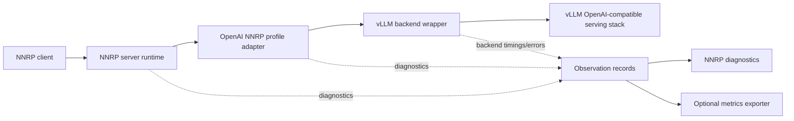
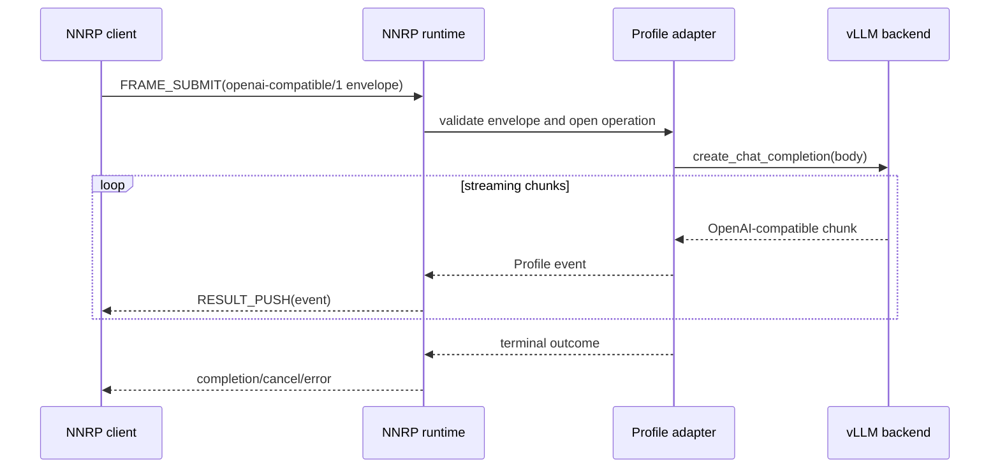
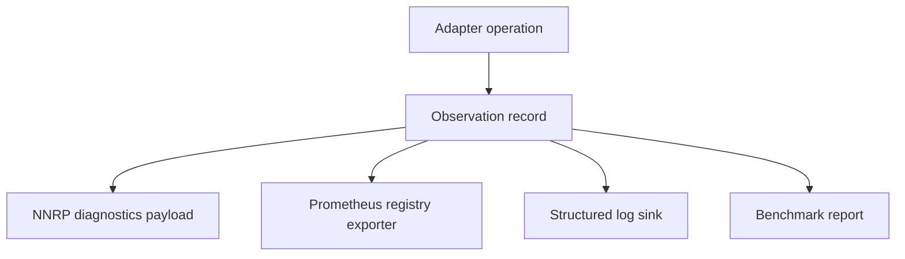

# vLLM NNRP Adapter Design

## 1. Positioning

The vLLM NNRP adapter is the first concrete implementation target for the frozen
`openai-compatible/1` API profile.

The adapter does not create another OpenAI HTTP server. It binds vLLM's OpenAI-compatible serving
surface to NNRP sessions, frame submissions, result streams, cancellation, diagnostics, and
profile-level conformance.

The adapter must preserve three boundaries:

1. **NNRP runtime boundary**: NNRP owns session lifecycle, flow control, cancellation, result push,
   transport probing, and diagnostics delivery.
2. **OpenAI-compatible API boundary**: the frozen `openai-compatible/1` profile owns request
   envelopes, operation names, streaming event shapes, error bodies, usage events, and capability
   documents.
3. **vLLM backend boundary**: vLLM owns model loading, token generation, batching, scheduling, model
   policy, tokenizer behavior, and backend-specific limits.



## 2. Support Line

The first support band is:

| Field                       | Value                                               |
| --------------------------- | --------------------------------------------------- |
| Declared vLLM range         | `vllm>=0.18.0,<0.23`                                |
| First lower-bound CI target | `0.18.1`                                            |
| Current-line CI target      | Latest stable vLLM supported by the adapter release |
| Profile baseline            | `openai-compatible/1` Level 1                       |

`0.18.0` remains in the declared range because it starts the selected support band. `0.18.1` is the
preferred lower-bound CI target because it is the first patch in that band.

## 3. Implementation Slice

The first release implements Level 1 only:

1. `chat.completions.create` request envelopes.
2. Streaming text deltas.
3. Non-streaming completion bodies.
4. Cancellation and timeout mapping.
5. OpenAI-compatible error bodies.
6. Usage summary events.
7. Tool-call event pass-through when vLLM and the selected model expose tool-call data.
8. Capability document generation for SDK feature probes and conformance selection.

Level 2 `responses.create` and Level 3 `models.list` / `embeddings.create` are follow-up
capabilities. They must be advertised only after the adapter has real behavior and conformance
recipes for those operations.

## 4. Module Design

| Module          | Responsibility                                                                                                   |
| --------------- | ---------------------------------------------------------------------------------------------------------------- |
| `profile`       | Frozen profile constants, request envelope validation, event builders, capability document helpers.              |
| `adapter`       | Async profile-level request handler that maps backend responses into profile events.                             |
| `vllm_backend`  | vLLM serving-object wrapper, method probing, streaming chunk normalization, and backend error mapping.           |
| `nnrp_server`   | NNRP server/session binding, frame submit handling, result push emission, cancellation, and diagnostics routing. |
| `conformance`   | Adapter command entry point for suite-owned API profile recipes.                                                 |
| `benchmark`     | Throughput, latency, cancellation, and backend overhead measurement.                                             |
| `observability` | Shared observation records, diagnostics builders, and optional metrics exporters.                                |

The adapter package should keep vLLM as an optional runtime extra. Normal lint, type check, package
build, and profile mapping tests must run without installing a GPU-serving environment.

## 5. vLLM Integration Mode

The production path is explicit package integration, not automatic process mutation.

```mermaid
flowchart TD
  install[pip install vllm-nnrp-adapter[vllm]]
  config[Adapter config or CLI entrypoint]
  plugin[vLLM plugin registration when stable]
  serving[vLLM serving object]
  adapter[vLLM NNRP adapter]

  install --> config
  config --> adapter
  plugin --> adapter
  adapter --> serving
```

Integration priority:

1. **Explicit package / CLI / config entrypoint**: the default path. The user installs the adapter
   and enables NNRP serving intentionally.
2. **vLLM plugin registration**: supported when the selected vLLM version exposes a stable plugin
   discovery path.
3. **Monkeypatch path**: reserved for scheduler-center experiments or emergency compatibility, not
   the default adapter architecture.
4. **`.pth` auto-injection**: not a default path. It is too implicit for normal releases and should
   only be considered for a separately documented deployment mode.

The adapter must be debuggable from Python import state and process configuration. Hidden startup
mutation is not acceptable for the release path.

## 6. Request Flow

1. An NNRP client submits a frame carrying an `openai-compatible/1` request envelope.
2. The NNRP server binding validates the envelope and opens an adapter operation context.
3. The profile adapter checks operation support against the capability document.
4. The vLLM backend wrapper calls the selected vLLM serving method.
5. Streaming chunks are converted into profile events.
6. The NNRP runtime pushes those events as ordered result payloads.
7. Completion, cancellation, or error state closes the operation context.

The adapter must not hide NNRP-specific policy inside the OpenAI-compatible `body` object. Timeout,
diagnostics, cache, transport, and cancellation policy stay in the envelope or NNRP runtime
metadata.



## 7. Streaming Event Mapping

| vLLM / OpenAI-compatible chunk       | Profile event                |
| ------------------------------------ | ---------------------------- |
| `choices[].delta.content`            | `response.output_text.delta` |
| `choices[].delta.tool_calls[]`       | `response.tool_call.delta`   |
| `usage`                              | `response.usage`             |
| final non-streaming body             | `response.completed`         |
| invalid request or backend rejection | `response.error`             |
| observed cancellation                | `response.cancelled`         |

Adapters may include the original OpenAI-compatible streaming chunk in `openai_chunk`, but consumers
must not require that field for normal operation.

## 8. Observability And Metrics

The adapter should not open an HTTP `/metrics` endpoint by default. vLLM deployments often already
run a metrics server, sidecar exporter, or third-party exporter, and the adapter must not silently
claim another port.

The adapter instead owns observation records and optional exporters.



Observation records should include:

1. selected model id
2. selected operation
3. NNRP connection, session, operation, and frame identifiers when available
4. queue delay when available
5. first event latency
6. output event count
7. backend error family
8. cancellation reason
9. selected transport
10. backend timing and token usage when available

Diagnostics are extension-friendly. Unknown diagnostic fields must be ignored by clients unless a
client opts into an adapter-specific schema.

Metrics export rules:

1. The default package exposes collectors and observation records, not a bound HTTP server.
2. A Prometheus exporter may register metrics into an existing registry.
3. A standalone `/metrics` server is opt-in deployment behavior.
4. NNRP diagnostics and exported metrics should be derived from the same observation record to avoid
   split-brain reporting.
5. Conformance may validate diagnostic shape, but metrics are release diagnostics and benchmark
   material rather than correctness gates.

## 9. Cancellation And Diagnostics

Cancellation maps from NNRP frame cancellation into the active vLLM request path. If vLLM cannot
abort immediately, the adapter must still stop emitting late result events for the cancelled NNRP
operation.

Cancellation diagnostics should include the cancellation source, reason, operation id, and whether
the backend accepted the abort.

## 10. API Profile Conformance

OpenAI-compatible providers often extend or bend the OpenAI HTTP API. The adapter conformance layer
therefore validates the frozen NNRP API profile semantics, not a full clone of OpenAI HTTP behavior.

The conformance shape mirrors the SDK adapter conformance model: adapters declare capabilities with
a manifest, and the suite selects readable recipes that match those capabilities.

### 10.1 Capability Manifest

Each adapter provides a manifest:

```json
{
  "adapter": "vllm-nnrp-adapter",
  "profile": "openai-compatible",
  "schema_version": "openai-compatible/1",
  "compatibility_levels": [1],
  "operations": [
    {
      "name": "chat.completions.create",
      "streaming": true,
      "non_streaming": true,
      "tool_calls": true
    }
  ],
  "extensions": [
    {
      "name": "vllm.diagnostics",
      "critical": false
    }
  ]
}
```

The manifest is optional for repositories that do not implement this profile. It is required for any
repository that wants the conformance suite to run OpenAI NNRP API tests.

### 10.2 Recipe Source

Recipes are parameterized and readable:

```json
{
  "id": "openai-compatible.chat.streaming-text",
  "profile": "openai-compatible",
  "schema_version": "openai-compatible/1",
  "operation": "chat.completions.create",
  "request": {
    "body": {
      "model": "${MODEL_ID}",
      "messages": [
        { "role": "user", "content": "Say hello." }
      ],
      "stream": true
    }
  },
  "expect": {
    "events": [
      { "type": "response.output_text.delta" },
      { "type": "response.usage", "optional": true },
      { "type": "response.completed", "optional": true }
    ],
    "terminal": "success"
  }
}
```

The suite may compile recipes into machine-readable execution plans, but the recipe remains the
source of truth.

### 10.3 Extension Rules

Provider-specific fields are allowed when they follow these rules:

1. Standard request and event fields keep their profile-defined meaning.
2. Extension fields are declared in the manifest.
3. Non-critical extension fields are ignorable by clients and tests.
4. Critical extensions require explicit test selection.
5. Extension behavior must not be required for Level 1 baseline success.

This gives providers room for model-specific policy without letting custom fields corrupt the shared
profile contract.

### 10.4 Required Level 1 Cases

Level 1 conformance should cover:

1. valid streaming chat request
2. valid non-streaming chat request
3. invalid body rejection
4. unsupported operation rejection
5. usage summary shape
6. text delta event ordering
7. tool-call delta pass-through when advertised
8. cancellation behavior
9. backend error mapping
10. capability document validation

## 11. Benchmark Strategy

Benchmarking must separate adapter overhead from model generation time.

| Benchmark                 | Purpose                                                                     |
| ------------------------- | --------------------------------------------------------------------------- |
| Profile mapper throughput | Measures request/event mapping overhead without vLLM generation.            |
| Streaming event latency   | Measures p50/p95 delay from backend chunk to NNRP result push.              |
| Cancellation latency      | Measures cancellation request to adapter stop-emitting latency.             |
| End-to-end vLLM smoke     | Confirms that real vLLM integration still emits the profile event sequence. |

The first release must record baseline results before publication.

## 12. Release Gate

The adapter is release-ready only when:

1. Level 1 adapter behavior is implemented.
2. API profile conformance recipes pass.
3. Benchmark baselines are recorded.
4. vLLM lower-bound and current-line smoke tests are documented.
5. README and install docs explain the vLLM version band and optional dependency model.
