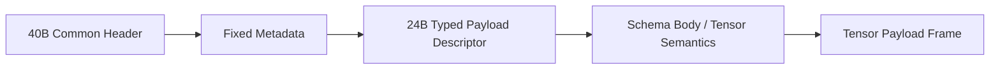

---
prev:
  text: Typed Payload Descriptor
  link: /en/typed-payload-descriptor/
next:
  text: Tensor Descriptor Common Header
  link: /en/profiles/tensor/descriptor-header/
---

# Tensor Profile

The tensor profile targets numeric blocks, region-oriented payloads, and structured numeric results.

## Good-fit scenarios

1. Real-time enhanced rendering.
2. Image or video enhancement pipelines with structured numeric output.
3. Any result that needs shape, layout, and dtype together for interpretation.

## Reading path

1. Start with [Descriptor Common Header](./descriptor-header) to understand shared fields such as `profile_id`, `schema_id`, `stream_semantics`, `offset`, and `length`.
2. Continue with [Schema and Body](./schema-body) to see which fields tensor adds on top of the shared descriptor.
3. Finish with [Payload Frame](./payload-frame) to see how the real binary tensor chunk is anchored by the descriptor and body.

## Packet skeleton



## Mock Dump Example

This is not a byte-accurate wire dump. It is a JSON-style mock dump that keeps the whole structure readable while the child pages break down each part in more detail.

```json
{
  "message_type": "RESULT_PUSH",
  "common_header": {
    "version_major": 1,
    "wire_format": 0,
    "msg_type": "RESULT_PUSH",
    "header_len": 40,
    "meta_len": 32,
    "body_len": 80,
    "session_id": "0x00000012",
    "frame_id": "0x0000048a",
    "view_id": "0x00000007",
    "route_id": "0x00000002",
    "trace_id": "0x4f9c9b31b26d40d2"
  },
  "fixed_metadata": {
    "result_status": "partial",
    "flow_scope": "operation",
    "flow_credit_delta": 2
  },
  "typed_payload_descriptor": {
    "profile_id": "tensor",
    "schema_id": "im.render.tile.v1",
    "schema_version": 1,
    "stream_semantics": "region_partial",
    "offset": 0,
    "length": 3145728,
    "descriptor_flags": ["degraded_allowed", "coverage_present"]
  },
  "profile_body": {
    "tensor": {
      "dtype": "f16",
      "shape": [1, 3, 512, 512],
      "layout": "nchw",
      "coverage": {
        "tile_x": 12,
        "tile_y": 7,
        "width": 512,
        "height": 512
      }
    }
  },
  "payload_frame": {
    "tensor_chunk": "<1536 KiB binary tensor payload>"
  }
}
```

## Semantics people care about first

1. `partial` means the current numeric result is already usable but not final.
2. `degraded` means the result is still consumable but quality, precision, or provenance changed.
3. `stale_reuse` means the result comes from reused older context rather than a fresh full computation.