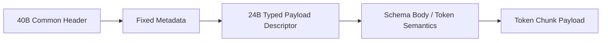

---
prev:
  text: Tensor Payload Frame
  link: /en/profiles/tensor/payload-frame/
next:
  text: Token Descriptor Common Header
  link: /en/profiles/token/descriptor-header/
---

# Token Profile

The token profile targets discrete token or token-chunk output.

## Good-fit scenarios

1. AI NPC dialogue.
2. AI coding and multi-agent collaboration.
3. Interactive agent outputs that must stream incrementally.

## Reading path

1. Start with [Descriptor Common Header](./descriptor-header) to understand how profile, schema, and logical offsets anchor token chunks.
2. Continue with [Schema and Body](./schema-body) to understand token units, sequence ranges, terminal semantics, and stop reasons.
3. Finish with [Payload Frame](./payload-frame) to understand what the actual token chunk looks like on the wire.

## Packet skeleton



## Mock Dump Example

This keeps a readable JSON-style mock dump at the overview layer. The child pages then break down the descriptor, schema/body, and payload responsibilities.

```json
{
  "message_type": "RESULT_PUSH",
  "common_header": {
    "version_major": 1,
    "wire_format": 0,
    "msg_type": "RESULT_PUSH",
    "header_len": 40,
    "meta_len": 24,
    "body_len": 96,
    "session_id": "0x00000034",
    "frame_id": "0x00000c21",
    "view_id": "0x00000000",
    "route_id": "0x00000009",
    "trace_id": "0x8e6a6e6db54a11af"
  },
  "fixed_metadata": {
    "result_status": "partial",
    "flow_scope": "session",
    "flow_credit_delta": 1
  },
  "typed_payload_descriptor": {
    "profile_id": "token",
    "schema_id": "llm.chat.delta.v1",
    "schema_version": 1,
    "stream_semantics": "ordered_incremental",
    "offset": 128,
    "length": 36,
    "descriptor_flags": ["stop_reason_present"]
  },
  "profile_body": {
    "token": {
      "token_unit": "bpe",
      "sequence_start": 128,
      "sequence_end": 136,
      "terminal": false,
      "stop_reason": "none"
    }
  },
  "payload_frame": {
    "token_chunk": " and then retries over TCP"
  }
}
```

## Semantics people care about first

1. `partial` means the current token chunk is already consumable but the sequence is not finished.
2. `terminal` means the current operation or profile output reached its stopping point.
3. Whether `stop_reason` is present is controlled by schema/profile interpretation rather than hard-coded into the common header.