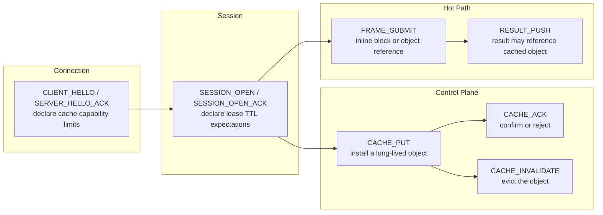
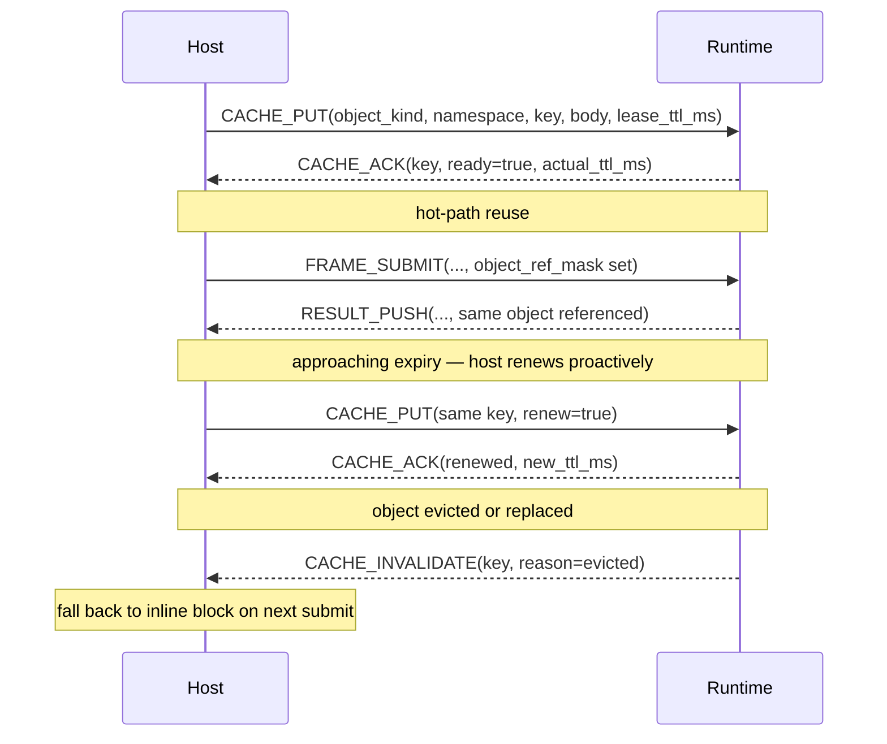

# NNRP/1 Cache Capabilities and Leases

Caching is not a private runtime optimization trick. It is a public capability boundary that the protocol needs to describe explicitly.

## Where this fits in the protocol stack

During the handshake both sides negotiate a cache capability ceiling. When the session opens the host declares lease expectations. Long-lived objects are then installed via the control plane. Hot-path frames reference them by key instead of retransmitting the body.

## Object lifecycle sequence

This shows a long-lived object going from installation to active reference and then expiry:

## Why leases are necessary

"Can be cached" is not enough. An object pool without expiry creates three problems:

- The server cannot safely reclaim memory even when objects have not been used for a long time.
- The host does not know which objects are still valid and must worry about cache miss on every submit.
- When a model is updated or the context switches, stale objects have no clear decommission path.

Leases give every object a visible TTL and a renewal path so that both sides can act on protocol events rather than guessing from timeouts.

## What the public layer freezes vs what belongs to profiles

| Public layer (shared by all profiles) | Profile / Runtime private |
|---|---|
| Lease contract (TTL, renewal, expiry policy) | Object body byte layout |
| Object identity (kind, namespace, version) | KV-cache page encoding |
| Dependency relation semantics | GPU memory page layout |
| cache_miss / lease_expired / dependency_invalid errors | Model-private index structures |

## Best practices

**When to install**: Only put objects in the cache if they will actually be referenced multiple times. Single-use small blocks should be inlined. As a rule of thumb, objects larger than 1 KB that will be reused more than twice in the same session are worth caching.

**Choosing TTL**: Set `lease_ttl_hint_ms` to 20–30 % shorter than the expected session duration. If the session is expected to last 60 seconds, set TTL to 40 seconds and renew proactively while the object is still in use rather than reinstalling it after expiry.

**Handling invalidation**: When you receive `CACHE_INVALIDATE`, immediately mark the local reference invalid and switch back to an inline block on the next submit. Never assume the same key is still live.

**Version management**: When object content changes, use a new `cache_key` instead of overwriting the old one. This prevents the server and host from disagreeing about which version of content a key currently refers to.

**Observability**: Record `actual_ttl_ms` from every `CACHE_ACK`, the reason field from every `CACHE_INVALIDATE`, and the hit/miss ratio. These are the only stable signals for evaluating whether your caching strategy is working.

## Boundaries with other pages

1. Responsibility boundaries for connection, session, and operation — see "Session and Operation Model".
2. Fixed layout of descriptors and payloads — see "Typed Payload Descriptors" and the profile pages.
3. How schema becomes the standard extension mechanism — see the next page, "Schema / Profile Registry".