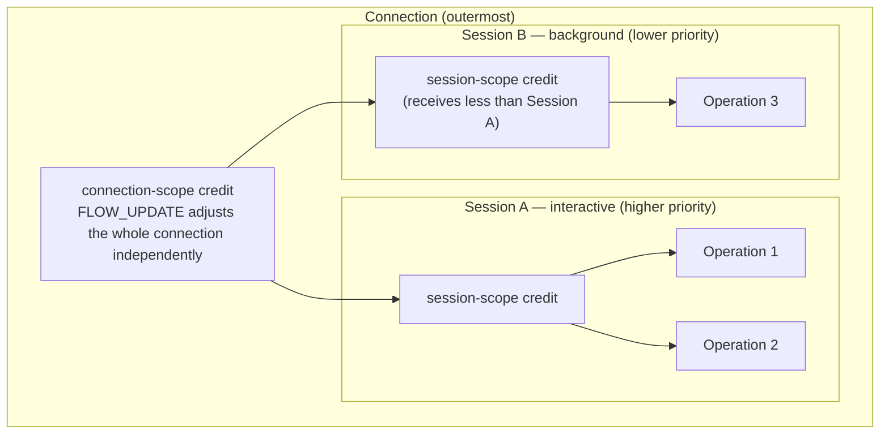

# NNRP/1 Flow Control and Priority

`FLOW_UPDATE` is not an internal side channel invented by one local implementation to run faster. It is the protocol-level surface for backpressure, credit, and scheduling semantics.

## Three-scope architecture

Flow control is not a single global window value. Credit is managed at three distinct scopes:



Each scope can receive a `FLOW_UPDATE` independently. The server can tighten only the background session without affecting the interactive session.

## Priority classes and their meaning

| Priority class | Typical use case | Scheduling meaning |
|---|---|---|
| `interactive` (0) | Real-time inference triggered directly by a user | Credit allocated first; most sensitive to latency |
| `balanced` (1) | Batch jobs, background sync | Default; balances throughput and latency |
| `background` (2) | Offline preprocessing, warm-up | Runs when capacity is available; may be preempted |

Priority expresses a scheduling preference, not a resource reservation. An `interactive` session is not guaranteed to never queue — it only gets priority when competing for credit.

## Backpressure and recovery sequence

```mermaid
sequenceDiagram
  participant H as Host
  participant R as Runtime

  H->>R: SESSION_OPEN(priority_class=interactive)
  R-->>H: SESSION_OPEN_ACK(accepted_priority_class=interactive)

  H->>R: FRAME_SUBMIT(op_1)
  H->>R: FRAME_SUBMIT(op_2)
  R-->>H: RESULT_PUSH(op_1, partial)

  note over R: server-side compute backpressure
  R-->>H: FLOW_UPDATE(session_scope, new_credit=0, reason=compute_backpressure)
  note over H: pause new submits; wait for credit

  R-->>H: RESULT_PUSH(op_1, completed)
  R-->>H: FLOW_UPDATE(session_scope, new_credit=4)
  note over H: credit restored; continue with op_3
  H->>R: FRAME_SUBMIT(op_3)
```

## Priority downgrade notification

```mermaid
sequenceDiagram
  participant H as Host
  participant R as Runtime

  H->>R: SESSION_OPEN(priority_class=interactive)
  R-->>H: SESSION_OPEN_ACK(accepted_priority_class=balanced, flags=priority_downgraded)
  note over H: server downgraded the priority; host may accept or reconnect

  note over H,R: downgrade during an active session
  R-->>H: FLOW_UPDATE(priority_class=background, flags=priority_downgraded)
  note over H: log the event; may send SESSION_PATCH to request restore
```

## Best practices

**Do not treat flow control as error handling**: Receiving `FLOW_UPDATE(new_credit=0)` is not an error. It is a normal backpressure signal. The host should pause submitting and wait for credit to be restored, not immediately reconnect or throw an exception.

**Set priority at session granularity**: Group operations with the same priority into the same session rather than declaring priority per operation. This lets the server schedule the entire session consistently.

**Distinguish the three backpressure sources**: The reason field of `FLOW_UPDATE` tells you whether the cause is `compute_backpressure`, `queue_full`, or `transport_congestion`. Log the reason. Do not handle all three cases identically as "wait and retry" — they have different recovery implications.

**Do not request interactive priority without cause**: If most sessions declare `interactive`, server scheduling becomes meaningless. Reserve interactive only for tasks where latency is directly visible to an end user.

**Monitor `priority_downgraded` events**: If your interactive sessions are frequently downgraded to balanced, the server is overloaded. Reduce concurrent submission volume or scale out at the application layer rather than retrying for high priority.

## Boundaries with other pages

1. Why connection, session, and operation are layered — see "Session and Operation Model".
2. Transport probing and migration — see "Transport Strategy and Probing".
3. Why cache miss, lease events, and schema mismatch also appear on the observability surface — see "Cache Capabilities and Leases" and "Schema / Profile Registry".