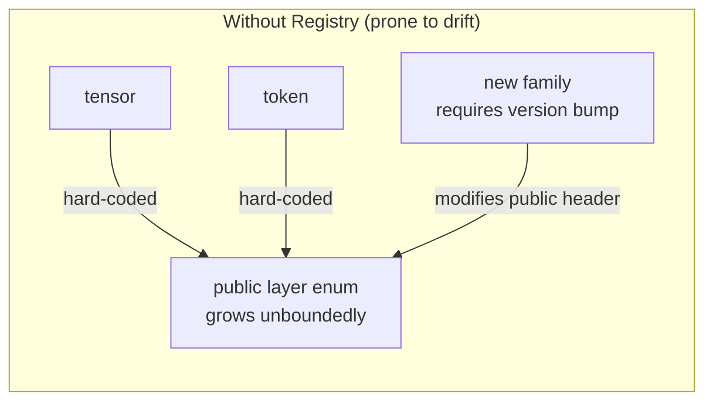
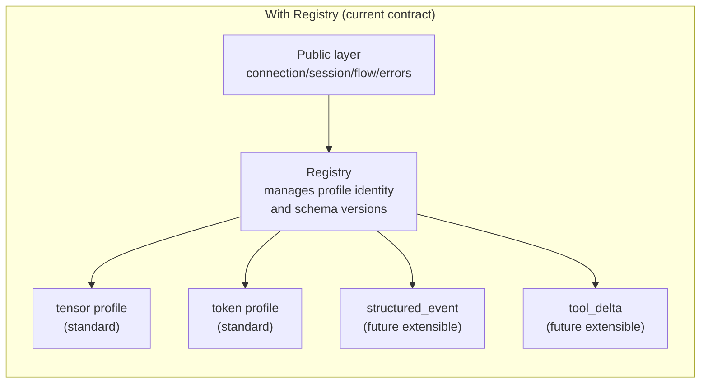
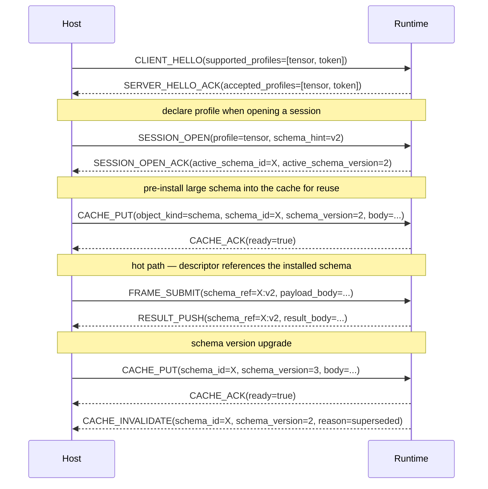

# NNRP/1 Schema / Profile Registry

Typed payloads should not grow by endlessly appending new public enums. The registry separates "what the public layer freezes" from "how specific payloads extend the protocol".

## The problem without a registry vs the structure with one

Without a registry, every new payload family forces changes to the public layer:

With a registry, the public layer is frozen and new payload families plug in through the registry:

## Where the registry appears in the protocol exchange

## Public layer vs Registry responsibilities

| Public layer (shared by all profiles) | Registry / Profile private |
|---|---|
| connection / session / operation semantics | Profile logical identity and version |
| Flow control, budget, priority, error boundaries | How descriptor fields are interpreted |
| Cache / lease lifecycle for schema objects | Payload body format |
| schema_mismatch / schema_miss error types | Business-specific parameters and tool call bodies |

## Best practices

**Pre-install large schemas**: Schema definitions larger than a few hundred bytes should be pre-installed via `CACHE_PUT` at session start rather than inlined with every frame. Install once; all subsequent frames use `schema_ref`.

**Keep version identifiers stable**: `schema_id + schema_version` is the logical identity. `schema_hash` is only a consistency check. Do not use hash as identity — different receivers may compute different hashes for the same schema, causing false mismatch errors.

**Record the negotiated result**: The `active_schema_id` and `active_schema_version` fields in `SESSION_OPEN_ACK` are the ground truth for the current session's schema. Record them on the host side. When a mismatch occurs, check against this record before retrying.

**Install before switching**: Before the current schema is invalidated, pre-install the new version with `CACHE_PUT` and wait for `CACHE_ACK(ready=true)` before switching references in subsequent frames. This avoids a window where the old schema is gone but the new one is not yet ready.

**Extend with the registry, not the public header**: To support a new payload family, use the profile/schema registry extension path rather than adding constants to the public enum. Implementations that do not support the new family can then safely skip it rather than failing with a parse error.

## Boundaries with other pages

1. Fixed layout of the descriptor itself — see "Typed Payload Descriptors".
2. tensor / token specific field definitions — see the standard profile pages.
3. How cache and leases work — see the previous page "Cache Capabilities and Leases".
4. Expressing backpressure and priority across multiple sessions — see the next page "Flow Control and Priority".