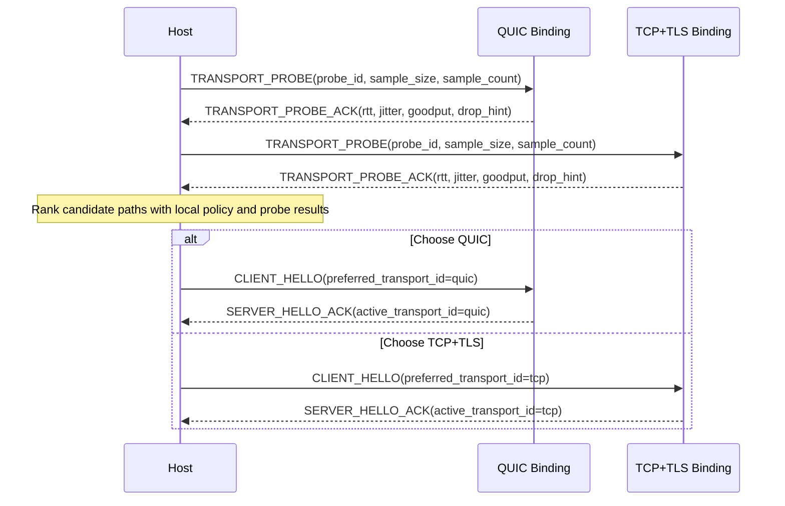

# NNRP/1 Transport Strategy and Probing

This is not a private SDK optimization. It is a protocol capability boundary that needs to be explained explicitly.

## Why the transport layer cannot be hard-wired

Real networks do not always reward UDP or QUIC. In China, for example, some operators are reluctant to accommodate UDP-heavy services and may classify large amounts of UDP traffic as PCDN traffic, leading to throttling, penalties, or even blocking. Similar commercial, regulatory, or device-compatibility constraints can exist in other regions as well.

If a modern application-layer protocol hard-binds itself to one transport, its reachability, throughput, and stability become hostages of local network policy. NNRP aims for the opposite: keep submission, result, flow-control, and status semantics stable at the application layer, then choose the most suitable transport binding for the network that actually exists.

## What this looks like in the protocol

NNRP does not express path selection by inventing one URI scheme per transport. Instead, transport strategy is part of the protocol surface:

1. The endpoint keeps one secure entry form, `nnrps://`, rather than encoding QUIC, TCP, and future bindings in separate schemes.
2. Before the main handshake, implementations may run `TRANSPORT_PROBE / TRANSPORT_PROBE_ACK` using samples close to real payload size to measure RTT, jitter, and throughput.
3. `CLIENT_HELLO` can carry `transport_policy` and `preferred_transport_id`, expressing automatic choice, path preference, or a forced path.
4. `SERVER_HELLO_ACK` returns the accepted policy and final `active_transport_id`, making the outcome protocol-visible instead of private local state.
5. If path quality changes later, `SESSION_MIGRATE / SESSION_MIGRATE_ACK` can continue the same session across bindings instead of forcing a full reconnect and full context rebuild.

## Minimal probing sequence

## How probing should actually run

The minimum implementation does not need a complex benchmarking subsystem, but it should still follow this order:

1. Filter candidate bindings with the local dial policy first. For example, when `force_tcp` is active, skip QUIC instead of probing a path that can never be selected.
2. Send a set of `TRANSPORT_PROBE` messages on each remaining path, each carrying at least a `probe_id`, a `sample_size` close to real work, and a `sample_count` that avoids making decisions from one lucky sample.
3. Wait for `TRANSPORT_PROBE_ACK` on each path and collect round-trip time, jitter, effective throughput, and any drop or throttling hints returned by the server.
4. Compare all candidates with one consistent ranking rule and select the binding that should enter the main handshake.
5. Carry the selected `preferred_transport_id` into `CLIENT_HELLO`, then treat the `active_transport_id` returned by `SERVER_HELLO_ACK` as the final protocol fact.

## What probing needs to compare

Probe decisions should not be based on RTT alone. At minimum they should compare four classes of signals:

1. Reachability: whether the path can exchange probes reliably rather than succeeding once by accident.
2. Latency stability: not only average RTT but also jitter and tail latency, so the client does not choose a path with a pretty mean and unstable behavior.
3. Effective throughput at near-real payload size: the samples should resemble real submissions, otherwise the result only measures small-packet friendliness.
4. Degradation signals: timeouts, retransmission behavior, explicit `drop_hint`, server throttling hints, and the success rate across repeated probes.

## Why probing cannot be just ping

ICMP ping or tiny-packet RTT is not enough. Many networks are permissive to tiny packets while aggressively shaping larger UDP flows or sustained bulk traffic.

So the real question is not just “can this path respond”. The real question is “when the payload size is close to actual work, which path gives better throughput, jitter, and recovery behavior”. That is why `TRANSPORT_PROBE` should use bodies close to realistic submission sizes instead of a trivial heartbeat-sized sample.

## What the host side actually sees

From the host or client perspective, the typical path is:

1. Local dial policy decides whether the mode is `auto`, `prefer_quic`, `prefer_tcp`, or one of the `force_*` variants.
2. If the policy allows automatic selection, the client probes the candidate bindings first.
3. After choosing the better path, it runs `CLIENT_HELLO / SERVER_HELLO_ACK` and establishes sessions on that binding.
4. If the network degrades later, the client can probe again and initiate `SESSION_MIGRATE`; if migration fails, it can still fall back to “new connection + new session”.

## Why this must be a protocol feature

This cannot stay inside one repository helper because it creates at least four protocol-level consistency requirements:

1. Both client and server need to see the transport policy and final outcome instead of inferring it locally.
2. Different language implementations should make similar decisions under similar network conditions, rather than exposing SDK-dependent behavior.
3. Observability, auditing, and failure analysis need standard semantics for “what was probed, what was selected, and why migration happened”.
4. Transport is only the first strategy boundary. More internal components may also become policy-driven later, and this layering stays cleaner if transport is already placed correctly at the protocol layer.