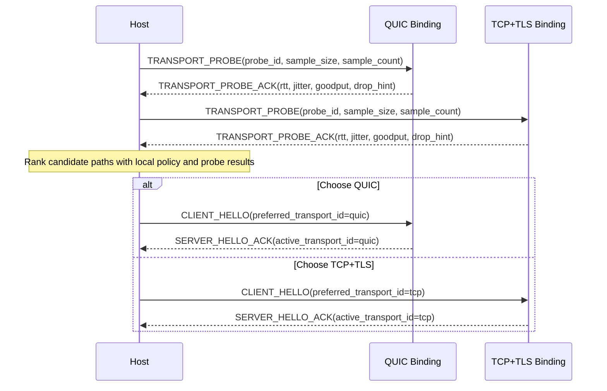

# NNRP/1 Transport Strategy and Probing

This is not a private local optimization. It is a protocol capability boundary that needs to be explained explicitly.

In NNRP, "transport" names the frame-carrier boundary below the NNRP wire protocol. It is not a claim that every
carrier is an OSI transport-layer protocol. TCP, QUIC, IPC, and WebSocket are different carrier bindings that can move
ordered NNRP frames with the reliability, flow-control, and observability properties required by the protocol.

## Why the carrier boundary cannot be hard-wired

Real networks do not always reward UDP or QUIC. In China, for example, some operators are reluctant to accommodate UDP-heavy services and may classify large amounts of UDP traffic as PCDN traffic, leading to throttling, penalties, or even blocking. Similar commercial, regulatory, local-process, browser-runtime, or device-compatibility constraints can exist in other regions and deployment environments as well.

If a modern application-layer protocol hard-binds itself to one carrier, its reachability, throughput, and stability become hostages of local network policy and host runtime constraints. NNRP aims for the opposite: keep submission, result, flow-control, and status semantics stable at the application layer, then choose the most suitable carrier binding for the environment that actually exists.

## What this looks like in the protocol

NNRP does not express path selection by inventing one user-facing URI scheme per carrier. Instead, transport strategy is part of the protocol surface:

1. The endpoint keeps one secure entry form, `nnrps://`, rather than encoding QUIC, TCP, IPC, WebSocket, and future bindings in separate user-facing schemes.
2. Before the main handshake, implementations may run `TRANSPORT_PROBE / TRANSPORT_PROBE_ACK` using samples close to real payload size to measure RTT, jitter, and throughput.
3. `CLIENT_HELLO` can carry `transport_policy` and `preferred_transport_id`, expressing automatic choice, path preference, or a forced path.
4. `SERVER_HELLO_ACK` returns the accepted policy and final `active_transport_id`, making the outcome protocol-visible instead of private local state.
5. If path quality changes later, `SESSION_MIGRATE / SESSION_MIGRATE_ACK` can continue the same session across bindings instead of forcing a full reconnect and full context rebuild.

Provider-local locators such as `unix://`, `npipe://`, `ws://`, and `wss://` are implementation locators for specific
carrier providers. They may appear in diagnostics, conformance fixtures, or explicit provider overrides, but the
application-facing NNRP endpoint should remain `nnrp://` or `nnrps://` unless an SDK deliberately exposes a lower-level
provider API.

## Minimal probing sequence



## How probing should actually run

The minimum implementation does not need a complex benchmarking subsystem, but it should still follow this order:

1. Filter candidate bindings with the local dial policy first. For example, when `force_tcp` is active, skip QUIC instead of probing a path that can never be selected.
2. Send a set of `TRANSPORT_PROBE` messages on each remaining path, each carrying at least a `probe_id`, a `sample_size` close to real work, and a `sample_count` that avoids making decisions from one lucky sample.
3. Wait for `TRANSPORT_PROBE_ACK` on each path and collect round-trip time, jitter, effective throughput, and any drop or throttling hints returned by the server.
4. Compare all candidates with one consistent ranking rule and select the binding that should enter the main handshake.
5. Carry the selected `preferred_transport_id` into `CLIENT_HELLO`, then treat the `active_transport_id` returned by `SERVER_HELLO_ACK` as the final protocol fact.

## What probing needs to compare

Probe decisions should not be based on RTT alone. At minimum they should compare four classes of signals:

1. Reachability: whether the path can exchange probes reliably rather than succeeding once by accident.
2. Latency stability: not only average RTT but also jitter and tail latency, so the client does not choose a path with a pretty mean and unstable behavior.
3. Effective throughput at near-real payload size: the samples should resemble real submissions, otherwise the result only measures small-packet friendliness.
4. Degradation signals: timeouts, retransmission behavior, explicit `drop_hint`, server throttling hints, and the success rate across repeated probes.

## Frozen provider metadata

Transport-provider metadata is local artifact metadata. It is not the session-level
`CAPABILITY_NEGOTIATION` payload, and implementations must not derive one from the other. Every official native or
WASM provider artifact carries one required `provider` object in its artifact manifest:

```json
{
  "provider": {
    "id": "nnrp.transport.quic.native",
    "cost": { "model_id": 0, "units": "0" },
    "preference_rank": 1,
    "limits": { "max_frame_bytes": "67108864" },
    "limitations": ["requires-udp", "native-host-only"]
  }
}
```

| Field | Type | Rule |
|---|---|---|
| `id` | non-empty ASCII string | Stable provider identity. Official ids are `nnrp.transport.<transport>.native` and `nnrp.transport.websocket.browser-wasm`. |
| `cost.model_id` | `u16` | Uses the frozen `cost_model_id` registry. `0` means unspecified. |
| `cost.units` | canonical decimal `u64` string | Static cost in the declared model. It must be `"0"` when `model_id` is `0`. |
| `preference_rank` | `u16` | Lower values are preferred after path quality and comparable cost. Official defaults are IPC `0`, QUIC `1`, TCP `2`, and WebSocket `3`. |
| `limits.max_frame_bytes` | positive canonical decimal `u64` string | Largest complete NNRP packet accepted by the provider. It is `"67108864"` for Preview4 official artifacts. |
| `limitations` | array of registered strings | Stable deployment constraints; unknown values make the artifact invalid. |

A canonical decimal `u64` string is `"0"` or an ASCII digit sequence beginning with `1`; signs, whitespace, decimal
points, exponent notation, and leading zeroes are invalid, and the parsed value must not exceed `18446744073709551615`.

The Preview4 limitation registry is exact: `requires-udp`, `requires-tcp`, `local-host-only`,
`native-host-only`, `browser-host-only`, `unix-domain-socket`, and `windows-named-pipe`. An SDK may
apply a deployment override to cost or preference, but it must retain the artifact values in diagnostics and must not
silently increase `max_frame_bytes` beyond the artifact limit.

Official artifacts use these exact defaults; all use cost `{ "model_id": 0, "units": "0" }` and
`max_frame_bytes = "67108864"`:

| Artifact | Provider id | Preference rank | Limitations |
|---|---|---:|---|
| Native TCP | `nnrp.transport.tcp.native` | 2 | `requires-tcp`, `native-host-only` |
| Native QUIC | `nnrp.transport.quic.native` | 1 | `requires-udp`, `native-host-only` |
| Native IPC on Unix | `nnrp.transport.ipc.native` | 0 | `local-host-only`, `native-host-only`, `unix-domain-socket` |
| Native IPC on Windows | `nnrp.transport.ipc.native` | 0 | `local-host-only`, `native-host-only`, `windows-named-pipe` |
| Native WebSocket | `nnrp.transport.websocket.native` | 3 | `requires-tcp`, `native-host-only` |
| Browser WASM WebSocket | `nnrp.transport.websocket.browser-wasm` | 3 | `requires-tcp`, `browser-host-only` |

## Frozen candidate diagnostics

Every SDK exposes the same candidate information, with language-idiomatic casing only:

| Canonical field | Type | Meaning |
|---|---|---|
| `transport_id` | `tcp | quic | ipc | websocket` | Carrier being considered. |
| `provider` | provider metadata | The complete metadata object above. |
| `local_available` | boolean | The artifact loaded and its runtime prerequisites passed. |
| `peer_supported` | boolean | Peer capability intersection includes this carrier. |
| `within_limits` | boolean | Requested maximum frame size does not exceed `limits.max_frame_bytes`. |
| `probe_state` | `not-run | succeeded | failed | missing` | Probe lifecycle for this selection. |
| `probe.sample_count` | `u32` | Number of scored samples. |
| `probe.success_count` | `u32` | Number of successful scored samples. |
| `probe.median_throughput_bytes_per_sec` | `u64` | Median effective throughput. |
| `probe.median_rtt_us` | `u64` | Median RTT of successful samples. |
| `selection_rank` | optional `u32` | Zero-based position among eligible candidates after deterministic ordering. |
| `rejection_reason` | registered string or absent | Why the candidate cannot be selected. |
| `diagnostic` | typed diagnostic or absent | Structured implementation diagnostic. |

`probe` is present only when `probe_state = succeeded`. `selection_rank` is present only for eligible, successfully
ordered candidates. Rejected candidates have no rank. `sample_count` must be positive, `success_count` must be in
`1..sample_count`, and both median values are computed from successful scored samples only.

The rejection registry is exact: `policy-disallowed`, `local-unavailable`, `peer-unsupported`,
`limit-exceeded`, `probe-missing`, and `probe-failed`. Public SDK APIs must not expose a language-specific opaque
`score`; identical observations must produce identical ordering and diagnostics across implementations.

### Cross-SDK type mapping

| Canonical model | Rust | Python | JavaScript / TypeScript | C# |
|---|---|---|---|---|
| Provider cost | `ProviderCost` | `NativeTransportProviderCost` | `NnrpTransportProviderCost` | `NnrpTransportProviderCost` |
| Provider limits | `ProviderLimits` | `NativeTransportProviderLimits` | `NnrpTransportProviderLimits` | `NnrpTransportProviderLimits` |
| Provider limitation | `ProviderLimitation` | `NativeTransportProviderLimitation` | `NnrpTransportProviderLimitation` | `NnrpTransportProviderLimitation` |
| Provider metadata | `TransportProviderMetadata` | `NativeTransportProviderMetadata` | `NnrpTransportProviderMetadata` | `NnrpTransportProviderMetadata` |
| Provider observation | `TransportProviderDescriptor` | `NativeTransportProvider` | `NnrpTransportProviderObservation` | `NnrpTransportProviderDescriptor` |
| Probe state | `ProbeState` | `NativeTransportProbeState` | `NnrpTransportProbeState` | `NnrpTransportProbeState` |
| Probe metrics | `ProbeMetrics` | `NativeTransportProbeMetrics` | `NnrpTransportProbeMetrics` | `NnrpTransportProbeMetrics` |
| Candidate diagnostic | `TransportCandidateDiagnostic` | `NativeTransportCandidateDiagnostic` | `NnrpTransportCandidate` | `NnrpTransportCandidate` |
| Rejection reason | `TransportRejectionReason` | `NativeTransportRejectionReason` | `NnrpTransportRejectionReason` | `NnrpTransportRejectionReason` |

The names in this table are binding public API names. A TODO item is not considered frozen unless every public field it
requires maps to this canonical model or another explicit SDK API table.

## Frozen deterministic ordering

Selection follows this sequence:

1. Reject candidates that fail policy, local availability, peer support, or provider limits.
2. Select the sole eligible candidate directly and report `probe_state = not-run`.
3. For two or more eligible candidates, probe all of them unless a `force-*` policy leaves only one.
4. Order successful candidates by `success_count` descending, median throughput descending, then median RTT ascending.
5. When the preceding values tie, compare `cost.units` ascending only when both non-zero `cost.model_id` values are equal.
6. Break remaining ties by the explicit `prefer-*` target, then `provider.preference_rank` ascending,
   `transport_id` numeric value ascending, and `provider.id` bytewise ascending.
7. Assign `selection_rank` after ordering and select rank `0`.

`force-*` never falls back. `prefer-*` is a deterministic tie-break rather than permission to choose a measurably
failed or inferior path. This comparator, not a private weighted formula, is the Preview4 cross-SDK contract.

## Why probing cannot be just ping

ICMP ping or tiny-packet RTT is not enough. Many networks are permissive to tiny packets while aggressively shaping larger UDP flows or sustained bulk traffic.

So the real question is not just “can this path respond”. The real question is “when the payload size is close to actual work, which path gives better throughput, jitter, and recovery behavior”. That is why `TRANSPORT_PROBE` should use bodies close to realistic submission sizes instead of a trivial heartbeat-sized sample.

## What the host side actually sees

From the host or client perspective, the typical path is:

1. Local dial policy decides whether the mode is `auto`, `prefer_quic`, `prefer_tcp`, or one of the `force_*` variants.
2. If the policy allows automatic selection, the client probes the candidate bindings first.
3. After choosing the better path, it runs `CLIENT_HELLO / SERVER_HELLO_ACK` and establishes sessions on that binding.
4. If the network degrades later, the client can probe again and initiate `SESSION_MIGRATE`; if migration fails, it can still fall back to “new connection + new session”.

## Why this must be a protocol feature

This cannot stay inside local route-selection logic because it creates at least four protocol-level consistency requirements:

1. Both client and server need to see the transport policy and final outcome instead of inferring it locally.
2. All client implementations should make similar decisions under similar network conditions, rather than exposing implementation-dependent behavior.
3. Observability, auditing, and failure analysis need standard semantics for “what was probed, what was selected, and why migration happened”.
4. Transport is only the first strategy boundary. More internal components may also become policy-driven later, and this layering stays cleaner if transport is already placed correctly at the protocol layer.
