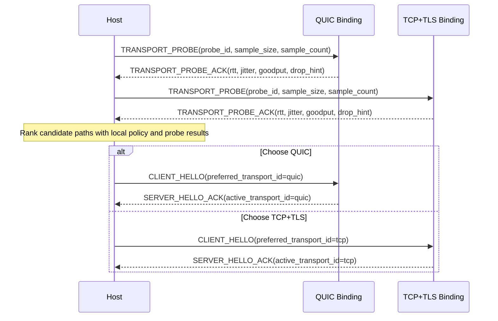

# NNRP/1 Transport Strategy and Probing

This is not a private local optimization. It is a protocol capability boundary that needs to be explained explicitly.

In NNRP, "transport" names the frame-carrier boundary below the NNRP wire protocol. It is not a claim that every
carrier is an OSI transport-layer protocol. TCP, QUIC, IPC, and WebSocket are different carrier bindings that can move
ordered NNRP frames with the reliability, flow-control, and observability properties required by the protocol.

## Why the carrier boundary cannot be hard-wired

Real networks do not always reward UDP or QUIC. In China, for example, some operators are reluctant to accommodate UDP-heavy services and may classify large amounts of UDP traffic as PCDN traffic, leading to throttling, penalties, or even blocking. Similar commercial, regulatory, local-process, browser-runtime, or device-compatibility constraints can exist in other regions and deployment environments as well.

If a modern application-layer protocol hard-binds itself to one carrier, its reachability, throughput, and stability become hostages of local network policy and host runtime constraints. NNRP aims for the opposite: keep submission, result, flow-control, and status semantics stable at the application layer, then choose the most suitable carrier binding for the environment that actually exists.

## What this looks like in the protocol

NNRP does not express path selection by inventing one user-facing URI scheme per carrier. Instead, transport strategy is part of the protocol surface:

1. The application endpoint stays in the carrier-neutral `nnrp://` / `nnrps://` scheme family rather than encoding QUIC, TCP, IPC, WebSocket, and future bindings in separate user-facing schemes.
2. Before the main handshake, implementations may run `TRANSPORT_PROBE / TRANSPORT_PROBE_ACK` using samples close to real payload size to measure RTT, jitter, and throughput.
3. `CLIENT_HELLO` can carry `transport_policy` and `preferred_transport_id`, expressing automatic choice, path preference, or a forced path.
4. `SERVER_HELLO_ACK` returns the accepted policy and final `active_transport_id`, making the outcome protocol-visible instead of private local state.
5. If path quality changes later, `SESSION_MIGRATE / SESSION_MIGRATE_ACK` can continue the same session across bindings instead of forcing a full reconnect and full context rebuild.

Provider-local locators such as `unix://`, `npipe://`, `ws://`, and `wss://` are implementation locators for specific
carrier providers. They may appear in diagnostics, conformance fixtures, or explicit provider overrides, but the
application-facing NNRP endpoint should remain `nnrp://` or `nnrps://` unless an SDK deliberately exposes a lower-level
provider API.

## Frozen host route contract

An application endpoint is not enough to configure every carrier. A host role therefore owns a **provider route set**,
not one provider-local locator and not one security object shared by every provider. The route set is keyed by
`transport_id`; each key occurs at most once and resolves to the locally registered provider for that transport.

| Canonical field | Type | Rule |
|---|---|---|
| `transport_id` | `tcp | quic | ipc | websocket` | Route identity and lookup key. It must match the registered provider descriptor. |
| `locator` | optional provider-local locator | TCP and QUIC may derive host and port from the application endpoint. IPC and WebSocket require an explicit locator. |
| `security` | optional role-specific security object | Client routes use peer-verification material; server routes use certificate and private-key material. Security is never shared implicitly between routes. |

Every installed provider allowed by policy enters diagnostics. Omitting a route does not disable an installed package.
A client may reject a candidate as `route-unresolved` when its locator cannot be derived, then continue evaluating other
Auto/Prefer candidates. A forced unresolved route fails without fallback. A server using Auto/Prefer must resolve and
bind every allowed installed provider; an unresolved route is a configuration error because silently dropping a
listener would make the advertised logical server incomplete.

Route normalization is exact. Unknown transport keys are invalid. A route for a known but uninstalled transport creates
a `local-unavailable` candidate; it does not install or synthesize a provider. An installed TCP or QUIC provider may
derive its locator when its route or route locator is absent. Installed IPC and WebSocket providers cannot derive a
locator. Registries reject more than one provider for the same transport ID, so one host role has at most one candidate
per canonical transport.

Provider registration has two independent uniqueness constraints: `transport_id` is unique because a host role owns at
most one provider for each canonical carrier, and `provider.id` is unique because diagnostics and probe evidence use it
as a stable provider identity. Duplicate registration is an error; implementations must not silently replace the
earlier provider.

Client Auto/Prefer probes every resolved, security-compatible candidate and adopts only the selected carrier into the
runtime connection. Server Auto/Prefer atomically opens one logical listener set over every allowed provider route;
Force restricts that set to the named transport. If any required bind or runtime adoption fails, the server closes all
listeners opened by that operation and reports the failure. Preference affects deterministic metadata and tie-breaking;
it does not prevent an already-open lower-preference listener from accepting a connection.

The host route layer and the runtime carrier layer are deliberately separate. Selection and multi-listener ownership
belong to the SDK host API. `NnrpClient`, `NnrpServer`, and the native FFI continue to adopt one selected connection or
one provider listener per runtime handle. Implementations must not introduce per-frame calls across several native
libraries to implement the route set.

### Role cardinality invariants

The singular native handle is an implementation boundary, not the public role cardinality. Every SDK must preserve
the following distinction:

| Surface | Client cardinality | Server cardinality |
|---|---|---|
| Host role API | One application endpoint plus a route set; Auto/Prefer may evaluate many routes. | One application endpoint plus a route set; Auto/Prefer owns one atomic set of all eligible listeners. |
| Selected runtime session | Exactly one adopted carrier connection. | Exactly one accepted carrier connection for each session. |
| Native FFI handle | Exactly one carrier connection per client handle. | Exactly one provider listener per low-level listener handle and one carrier connection per accepted session handle. |

A logical server exposes the actual bound provider endpoint for every opened listener. Accept waits across the complete
set. If several listeners become ready in the same scheduling turn, the policy's stable provider order breaks the tie.
A peer handshake or session rejection affects only that accepted carrier; a terminal provider-listener failure fails
the logical server, cancels pending accepts, and closes the remaining listener set. A running server must never silently
shrink to fewer carriers. Closing the logical server is idempotent and closes every listener and accepted session it
owns.

Python, JavaScript, C#, and Rust must not expose a singular route override on their production client or server host
options. A low-level provider `connect` or `listen` call still accepts one locator because it operates on exactly one
provider. That low-level singular form must not leak upward and collapse the host route set.

### Application security intent

`nnrps://` declares a minimum authenticated-encryption requirement. `nnrp://` does not require encryption, but it does
not forbid a route from using it. Candidate validation happens before probing:

The canonical client security object contains exactly a non-empty `server_name` string and non-empty owned
`trusted_certificate_der` bytes. The canonical server security object contains exactly non-empty owned
`certificate_der` and `private_key_pkcs8_der` bytes. SDKs use language-idiomatic casing but must not add role-wide
credentials or silently substitute an ambient native trust store. Browser WebSocket is the explicit exception described
below.

| Carrier route | Satisfies `nnrps://` when |
|---|---|
| QUIC | QUIC TLS peer/server credentials are present and valid. |
| TCP | The TCP provider uses TLS and the route carries matching peer/server credentials. Plain TCP does not qualify. |
| IPC | It does not qualify in Preview4; local filesystem or pipe access alone is not the frozen authenticated-encryption contract. |
| Native WebSocket | The provider locator is `wss://` and matching peer/server credentials are present. `ws://` does not qualify. |
| Browser WebSocket | The provider locator is `wss://` and the browser completes normal platform TLS verification. The route does not accept native DER credential fields. |

A security-incompatible candidate remains visible with `security-unsatisfied`. Supplying security to plain TCP, IPC,
or `ws://`, supplying client material to a server route, or supplying server material to a client route is invalid.
Browser WebSocket trust remains host-owned, but the browser route must still use `wss://` for an `nnrps://` endpoint.

Security filtering is part of eligibility. A server using Auto/Prefer binds every route that remains eligible after
policy, availability, locator, platform, limit, and security checks. Security-incompatible installed providers remain
in diagnostics but are not opened. A missing locator for an otherwise eligible server provider is still a hard
configuration error and triggers atomic rollback.

### Cross-SDK route type mapping

| Canonical model | Rust | Python | JavaScript / TypeScript | C# |
|---|---|---|---|---|
| Client provider route | `ClientProviderRoute` | `NativeClientProviderRoute` | `NnrpClientProviderRoute` | `NnrpClientProviderRoute` |
| Server provider route | `ServerProviderRoute` | `NativeServerProviderRoute` | `NnrpServerProviderRoute` | `NnrpServerProviderRoute` |
| Client route set | `ClientProviderRoutes` | `Mapping[str, NativeClientProviderRoute]` | `NnrpClientProviderRoutes` | `IReadOnlyDictionary<TransportId, NnrpClientProviderRoute>` |
| Server route set | `ServerProviderRoutes` | `Mapping[str, NativeServerProviderRoute]` | `NnrpServerProviderRoutes` | `IReadOnlyDictionary<TransportId, NnrpServerProviderRoute>` |

| Canonical field | Rust | Python | JavaScript / TypeScript | C# |
|---|---|---|---|---|
| Route locator | `provider_endpoint` | `provider_endpoint` | `endpoint` | `ProviderEndpoint` |
| Client security | `security: Option<ClientTransportSecurity>` | `security: NativeTransportClientSecurity \| None` | `security?: NnrpTransportClientSecurity` | `Security: NnrpTransportClientSecurity?` |
| Server security | `security: Option<ServerTransportSecurity>` | `security: NativeTransportServerSecurity \| None` | `security?: NnrpTransportServerSecurity` | `Security: NnrpTransportServerSecurity?` |
| Accepted-session carrier | `active_transport_id()` | `active_transport_name` | `activeTransport` | `ActiveTransportId` |
| Bound provider endpoints | `bound_provider_endpoints()` | `bound_provider_endpoints` | `boundProviderEndpoints` | `BoundProviderEndpoints` |

Python mapping keys use the canonical transport names. JavaScript route sets are readonly partial records keyed by
`NnrpTransportKind`. Rust and C# use `TransportId`. Language-idiomatic casing is allowed; singular public
`provider_endpoint` / `providerEndpoint` / `ProviderEndpoint` and role-wide `security` options are not the Preview4
host API.

### Required host-level conformance

Transport conformance is incomplete when it only proves that each provider can connect and listen by itself. Every
production SDK must run host-level E2E scenarios that verify:

1. A client with at least two resolved routes probes and selects according to the frozen comparator, then adopts only
   the selected carrier into the runtime session.
2. A forced client route never falls back, and unresolved or security-incompatible routes remain visible with the
   frozen rejection reason.
3. A server with at least two eligible routes binds both, reports both actual bound provider endpoints, accepts a real
   session through each listener, and reports the active transport for each accepted session.
4. A failing server bind rolls back every listener opened by the same logical listen operation.
5. Route-local security does not leak between TCP, QUIC, IPC, and WebSocket routes.
6. `nnrps://` rejects plain TCP, IPC, and `ws://`, while native TLS routes and browser `wss://` follow their respective
   credential ownership rules.
7. A terminal failure of one running provider listener fails and closes the complete logical listener set instead of
   silently reducing server cardinality.

The reference side of these scenarios is suite-owned wire behavior. An SDK must not satisfy the gate by connecting its
own client and server adapters to each other only.

## Minimal probing sequence



## How probing should actually run

The minimum implementation does not need a complex benchmarking subsystem, but it should still follow this order:

1. Filter candidate bindings with the local dial policy first. For example, when `force_tcp` is active, skip QUIC instead of probing a path that can never be selected.
2. Send a set of `TRANSPORT_PROBE` messages on each remaining path, each carrying at least a `probe_id`, a `sample_size` close to real work, and a `sample_count` that avoids making decisions from one lucky sample.
3. Wait for `TRANSPORT_PROBE_ACK` on each path and collect round-trip time, jitter, effective throughput, and any drop or throttling hints returned by the server.
4. Compare all candidates with one consistent ranking rule and select the binding that should enter the main handshake.
5. Carry the selected `preferred_transport_id` into `CLIENT_HELLO`, then treat the `active_transport_id` returned by `SERVER_HELLO_ACK` as the final protocol fact.

## What probing needs to compare

Probe decisions should not be based on RTT alone. At minimum they should compare four classes of signals:

1. Reachability: whether the path can exchange probes reliably rather than succeeding once by accident.
2. Latency stability: not only average RTT but also jitter and tail latency, so the client does not choose a path with a pretty mean and unstable behavior.
3. Effective throughput at near-real payload size: the samples should resemble real submissions, otherwise the result only measures small-packet friendliness.
4. Degradation signals: timeouts, retransmission behavior, explicit `drop_hint`, server throttling hints, and the success rate across repeated probes.

## Frozen provider metadata

Transport-provider metadata is local artifact metadata. It is not the session-level
`CAPABILITY_NEGOTIATION` payload, and implementations must not derive one from the other. Every official native or
WASM provider artifact carries one required `provider` object in its artifact manifest:

```json
{
  "provider": {
    "id": "nnrp.transport.quic.native",
    "cost": { "model_id": 0, "units": "0" },
    "preference_rank": 1,
    "limits": { "max_frame_bytes": "67108864" },
    "limitations": ["requires-udp", "native-host-only"]
  }
}
```

| Field | Type | Rule |
|---|---|---|
| `id` | non-empty ASCII string | Stable provider identity. Official ids are `nnrp.transport.<transport>.native` and `nnrp.transport.websocket.browser-wasm`. |
| `cost.model_id` | `u16` | Uses the frozen `cost_model_id` registry. `0` means unspecified. |
| `cost.units` | canonical decimal `u64` string | Static cost in the declared model. It must be `"0"` when `model_id` is `0`. |
| `preference_rank` | `u16` | Lower values are preferred after path quality and comparable cost. Official defaults are IPC `0`, QUIC `1`, TCP `2`, and WebSocket `3`. |
| `limits.max_frame_bytes` | positive canonical decimal `u64` string | Largest complete NNRP packet accepted by the provider. It is `"67108864"` for Preview4 official artifacts. |
| `limitations` | array of registered strings | Stable deployment constraints; unknown values make the artifact invalid. |

A canonical decimal `u64` string is `"0"` or an ASCII digit sequence beginning with `1`; signs, whitespace, decimal
points, exponent notation, and leading zeroes are invalid, and the parsed value must not exceed `18446744073709551615`.

The Preview4 limitation registry is exact: `requires-udp`, `requires-tcp`, `local-host-only`,
`native-host-only`, `browser-host-only`, `unix-domain-socket`, and `windows-named-pipe`. An SDK may
apply a deployment override to cost or preference, but it must retain the artifact values in diagnostics and must not
silently increase `max_frame_bytes` beyond the artifact limit.

Official artifacts use these exact defaults; all use cost `{ "model_id": 0, "units": "0" }` and
`max_frame_bytes = "67108864"`:

| Artifact | Provider id | Preference rank | Limitations |
|---|---|---:|---|
| Native TCP | `nnrp.transport.tcp.native` | 2 | `requires-tcp`, `native-host-only` |
| Native QUIC | `nnrp.transport.quic.native` | 1 | `requires-udp`, `native-host-only` |
| Native IPC on Unix | `nnrp.transport.ipc.native` | 0 | `local-host-only`, `native-host-only`, `unix-domain-socket` |
| Native IPC on Windows | `nnrp.transport.ipc.native` | 0 | `local-host-only`, `native-host-only`, `windows-named-pipe` |
| Native WebSocket | `nnrp.transport.websocket.native` | 3 | `requires-tcp`, `native-host-only` |
| Browser WASM WebSocket | `nnrp.transport.websocket.browser-wasm` | 3 | `requires-tcp`, `browser-host-only` |

## Frozen candidate diagnostics

Every SDK exposes the same candidate information, with language-idiomatic casing only:

| Canonical field | Type | Meaning |
|---|---|---|
| `transport_id` | `tcp | quic | ipc | websocket` | Carrier being considered. |
| `provider` | provider metadata | The complete metadata object above. |
| `local_available` | boolean | The artifact loaded and its runtime prerequisites passed. |
| `peer_supported` | boolean | Peer capability intersection includes this carrier. |
| `within_limits` | boolean | Requested maximum frame size does not exceed `limits.max_frame_bytes`. |
| `probe_state` | `not-run | succeeded | failed | missing` | Probe lifecycle for this selection. |
| `probe.sample_count` | `u32` | Number of scored samples. |
| `probe.success_count` | `u32` | Number of successful scored samples. |
| `probe.median_throughput_bytes_per_sec` | `u64` | Median effective throughput. |
| `probe.median_rtt_us` | `u64` | Median RTT of successful samples. |
| `selection_rank` | optional `u32` | Zero-based position among eligible candidates after deterministic ordering. |
| `rejection_reason` | registered string or absent | Why the candidate cannot be selected. |
| `diagnostic` | typed diagnostic or absent | Structured implementation diagnostic. |

`probe` is present only when `probe_state = succeeded`. `selection_rank` is present only for eligible, successfully
ordered candidates. Rejected candidates have no rank. `sample_count` must be positive, `success_count` must be in
`1..sample_count`, and both median values are computed from successful scored samples only.

### Frozen selection evidence

The host resolves provider-local routes and executes probes before invoking the deterministic selector. Those results
cross the selector boundary through two explicit evidence records; SDKs must not hide them in an implementation-private
closure, mutate candidates after selection, or collapse failed probes into missing metrics.

| Record | Canonical field | Type | Rule |
|---|---|---|---|
| Candidate readiness | `transport_id` | registered transport ID | Must identify the candidate provider's carrier. |
| Candidate readiness | `provider_id` | non-empty ASCII string | Must equal the candidate provider metadata id. |
| Candidate readiness | `route_resolved` | boolean | False produces `route-unresolved`. |
| Candidate readiness | `security_satisfied` | boolean | False produces `security-unsatisfied` after route resolution succeeds. |
| Candidate readiness | `diagnostic` | optional typed diagnostic | Preserved on the candidate. |
| Probe observation | `transport_id` | registered transport ID | Must identify the observed candidate's carrier. |
| Probe observation | `provider_id` | non-empty ASCII string | Must equal the observed candidate provider metadata id. |
| Probe observation | `state` | `succeeded | failed` | `missing` is represented by no matching observation; `not-run` is selector output only. |
| Probe observation | `metrics` | optional probe metrics | Required for `succeeded` and forbidden for `failed`. |
| Probe observation | `diagnostic` | optional typed diagnostic | Preserved for failed observations and may accompany successful observations. |

Evidence is matched by `(transport_id, provider_id)`. Duplicate or unmatched readiness and probe observations are
invalid input. A role-level selection supplies one readiness record for every registered provider. A missing readiness
record is not permission to assume a route exists. Lower-level diagnostic/conformance APIs may construct an explicit
ready record when route and security checks are outside their scope.

`peer_supported_transports` has set semantics: duplicates and input order have no effect on eligibility or ordering.
`requested_max_frame_bytes = 0` is a valid requested size. Implementations must not reject it or reinterpret it as an
absent limit.

Invalid evidence is rejected before candidate selection with the language's typed transport-selection contract error.
Because selection has not run, that contract error does not fabricate candidate diagnostics. The complete-candidate-list
requirement applies to valid evidence that reaches selection but leaves no selectable provider.

When filtering leaves one eligible candidate, the selector chooses it directly and emits `probe_state = not-run`; probe
observations are ignored for ranking. When two or more candidates remain, each eligible candidate needs one probe
observation. No observation produces `probe-missing`; a failed observation produces `probe-failed`; a succeeded
observation contributes its metrics to deterministic ordering.

A raw probe sample belongs to `provider.id`, not a package display name. It is successful exactly when `failed` and
`timed_out` are both false, `rtt_us` is present, and `elapsed_us` is positive. Its effective throughput is
`floor(saturating_add(bytes_sent, bytes_received) * 1_000_000 / elapsed_us)`, saturated to `u64`. To compute either
median, sort successful per-sample values ascending; use the middle value for an odd count and
`lower + floor((upper - lower) / 2)` for an even count. Implementations must not aggregate bytes and elapsed time before
computing the throughput median.

`TransportProviderDescriptor.name` is owned by the provider and may be a package name or display name. It is not a
protocol carrier identifier. Discovery, readiness, probing, selection, route lookup, and active-carrier reporting must
use `transport_id`; implementations must not derive transport identity from `name`.

The rejection registry is exact: `policy-disallowed`, `local-unavailable`, `peer-unsupported`,
`limit-exceeded`, `route-unresolved`, `security-unsatisfied`, `probe-missing`, and `probe-failed`. Public SDK APIs must not expose a language-specific opaque
`score`; identical observations must produce identical ordering and diagnostics across implementations.

Each candidate carries at most one rejection reason. When several conditions fail, the first applicable reason in the
registry order above wins. Locator resolution therefore precedes security validation: an IPC or WebSocket candidate
whose required locator is absent is `route-unresolved`; once its route resolves, an IPC or plain-WS route under
`nnrps://` is `security-unsatisfied`. `probe-missing` and `probe-failed` are considered only after every pre-probe check
passes.

### Cross-SDK type mapping

| Canonical model | Rust | Python | JavaScript / TypeScript | C# |
|---|---|---|---|---|
| Provider cost | `ProviderCost` | `NativeTransportProviderCost` | `NnrpTransportProviderCost` | `NnrpTransportProviderCost` |
| Provider limits | `ProviderLimits` | `NativeTransportProviderLimits` | `NnrpTransportProviderLimits` | `NnrpTransportProviderLimits` |
| Provider limitation | `ProviderLimitation` | `NativeTransportProviderLimitation` | `NnrpTransportProviderLimitation` | `NnrpTransportProviderLimitation` |
| Provider metadata | `TransportProviderMetadata` | `NativeTransportProviderMetadata` | `NnrpTransportProviderMetadata` | `NnrpTransportProviderMetadata` |
| Provider observation | `TransportProviderDescriptor` | `NativeTransportProvider` | `NnrpTransportProviderObservation` | `NnrpTransportProviderDescriptor` |
| Candidate readiness | `TransportCandidateReadiness` | `NativeTransportCandidateReadiness` | `NnrpTransportCandidateReadiness` | `NnrpTransportCandidateReadiness` |
| Probe observation | `TransportProbeObservation` | `NativeTransportProbeObservation` | `NnrpTransportProbeObservation` | `NnrpTransportProbeObservation` |
| Probe state | `ProbeState` | `NativeTransportProbeState` | `NnrpTransportProbeState` | `NnrpTransportProbeState` |
| Probe metrics | `ProbeMetrics` | `NativeTransportProbeMetrics` | `NnrpTransportProbeMetrics` | `NnrpTransportProbeMetrics` |
| Candidate diagnostic | `TransportCandidateDiagnostic` | `NativeTransportCandidateDiagnostic` | `NnrpTransportCandidate` | `NnrpTransportCandidate` |
| Rejection reason | `TransportRejectionReason` | `NativeTransportRejectionReason` | `NnrpTransportRejectionReason` | `NnrpTransportRejectionReason` |
| Selection failure | `TransportSelectionError` | `NativeTransportSelectionError` | `NnrpTransportSelectionError` | `NnrpTransportSelectionException` |

The names in this table are binding public API names. A TODO item is not considered frozen unless every public field it
requires maps to this canonical model or another explicit SDK API table.

## Frozen deterministic ordering

Selection follows this sequence:

1. Reject candidates that fail policy, local availability, peer support, provider limits, route resolution, or application security intent.
2. Select the sole eligible candidate directly and report `probe_state = not-run`.
3. For two or more eligible candidates, probe all of them unless a `force-*` policy leaves only one.
4. Order successful candidates by `success_count` descending, median throughput descending, then median RTT ascending.
5. When the preceding values tie, compare `cost.units` ascending only when both non-zero `cost.model_id` values are equal.
6. Break remaining ties by the explicit `prefer-*` target, then `provider.preference_rank` ascending,
   `transport_id` numeric value ascending, and `provider.id` bytewise ascending.
7. Assign `selection_rank` after ordering and select rank `0`.

Probe observations and raw samples are matched by the tuple `(transport_id, provider.id)`. Candidate output lists successfully ordered
candidates first, then rejected candidates ordered by numeric `transport_id` and bytewise `provider.id`. Selection
errors carry that complete candidate list, including local, peer, limit, missing-probe, and failed-probe diagnostics.

`force-*` never falls back. `prefer-*` is a deterministic tie-break rather than permission to choose a measurably
failed or inferior path. This comparator, not a private weighted formula, is the Preview4 cross-SDK contract.

## Why probing cannot be just ping

ICMP ping or tiny-packet RTT is not enough. Many networks are permissive to tiny packets while aggressively shaping larger UDP flows or sustained bulk traffic.

So the real question is not just “can this path respond”. The real question is “when the payload size is close to actual work, which path gives better throughput, jitter, and recovery behavior”. That is why `TRANSPORT_PROBE` should use bodies close to realistic submission sizes instead of a trivial heartbeat-sized sample.

## What the host side actually sees

From the host or client perspective, the typical path is:

1. Local dial policy decides whether the mode is `auto`, `prefer_quic`, `prefer_tcp`, or one of the `force_*` variants.
2. If the policy allows automatic selection, the client probes the candidate bindings first.
3. After choosing the better path, it runs `CLIENT_HELLO / SERVER_HELLO_ACK` and establishes sessions on that binding.
4. If the network degrades later, the client can probe again and initiate `SESSION_MIGRATE`; if migration fails, it can still fall back to “new connection + new session”.

## Why this must be a protocol feature

This cannot stay inside local route-selection logic because it creates at least four protocol-level consistency requirements:

1. Both client and server need to see the transport policy and final outcome instead of inferring it locally.
2. All client implementations should make similar decisions under similar network conditions, rather than exposing implementation-dependent behavior.
3. Observability, auditing, and failure analysis need standard semantics for “what was probed, what was selected, and why migration happened”.
4. Transport is only the first strategy boundary. More internal components may also become policy-driven later, and this layering stays cleaner if transport is already placed correctly at the protocol layer.
