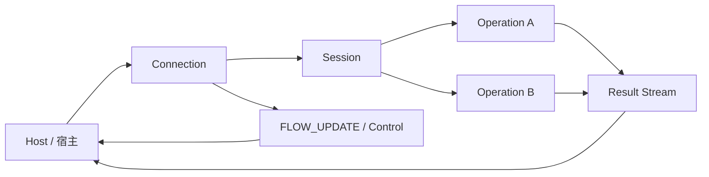
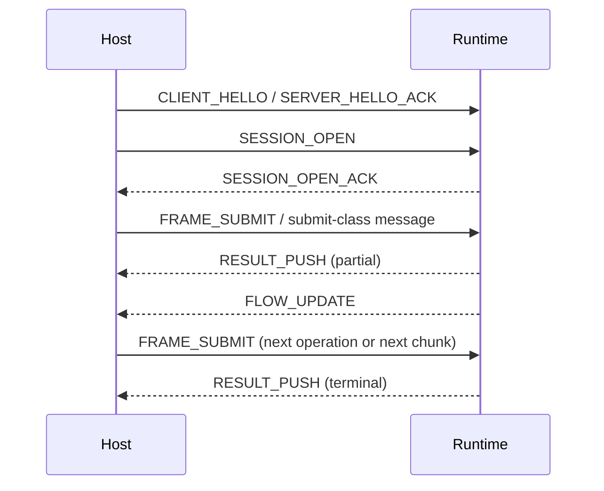

# 核心对象与流程

这一页讲的是协议里有哪些核心对象、它们各自负责什么，以及一条最小交互链路从头到尾是怎么跑起来的。

## 架构图

## 最小交互时序图

## 核心参与方

### Host

Host（宿主）是使用协议的一侧，也就是游戏引擎、应用或代理框架等集成方。它负责建立连接、发送任务、维护本地缓存状态，以及消费 runtime 返回的结果流和控制消息。

### Runtime Service

Runtime service 是实际执行任务的一侧，负责接收提交、返回增量或终态结果，并根据当前资源状况通过 `FLOW_UPDATE` 调整流控和信用额度。

## 核心对象

### Connection

连接是传输层的容器，负责在字节流上收发消息，并同时容纳多个 session。连接级的 `FLOW_UPDATE` 作用于这条连接上的所有会话。

### Session

session 是默认上下文容器，记录了当前会话的 profile、schema、预算窗口、优先级类和缓存策略，让其中的每个 operation 都不必重复声明这些参数。

### Operation

operation 是单次工作单元，对应一次具体的提交任务。它有自己的生命周期——从提交、接收结果流，到最终完成、取消或被丢弃。operation 也可以独立收到自己作用域的 `FLOW_UPDATE`。

### Profile 与 Schema

profile 和 schema 负责描述 payload 的含义，而不是把业务字段焊进公共协议头。profile 声明高层语义类别（比如 tensor、token），schema 进一步描述具体字段格式和版本。

## 最小交互流程

1. 建立可靠连接并完成握手。
2. 建立 session，声明默认上下文。
3. 提交一个或多个 operation。
4. 并行接收结果流、提示和 `FLOW_UPDATE`。
5. 根据背压信号和结果状态，决定继续提交、降速、恢复或取消。

  

    <h3>先认清角色</h3>
    
先理解 host、runtime、连接和缓存各自扮演什么角色，再去看具体字段。

  

  

    <h3>看长期会话</h3>
    
NNRP 不是“一发一收就结束”的短连接接口，它更接近持续协作式的实时会话。

  

  

    <h3>看状态与流</h3>
    
连接、session、operation 都可能拥有各自的状态和控制更新，不能被揉成一个对象。

  

