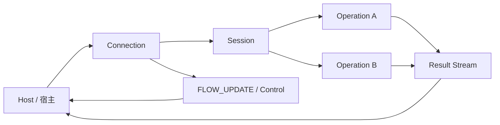
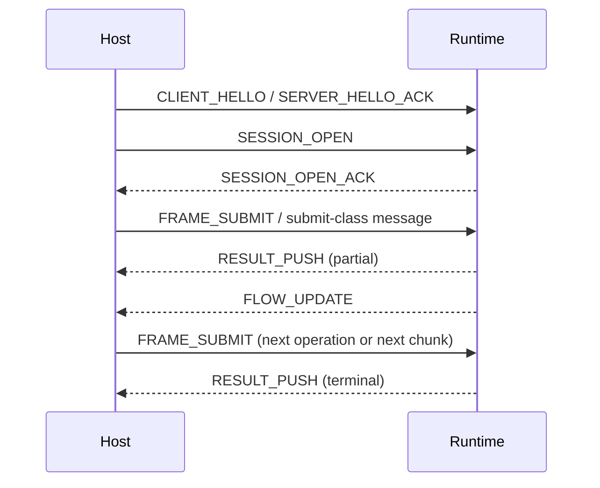

---
prev:
  text: 传输策略与探测
  link: /zh/protocol/v1/transport-strategy/
next:
  text: 公共头
  link: /zh/common-header/
---

# 核心对象与流程

这一页讲的不是版本冻结表，而是系统里有哪些核心对象、它们怎样协作，以及一条最小交互链路如何走通。

## 架构图

## 最小交互时序图

## 核心参与方

### Host

Host 是使用协议的一侧，也可以理解成宿主或客户端侧集成方。它负责：

1. 建立连接并发送任务。
2. 维护本地上下文、缓存命中和发送窗口。
3. 消费 runtime 返回的结果流与控制消息。

### Runtime Service

Runtime service 是执行模型任务、数据处理或增强逻辑的一侧。它负责：

1. 接收提交。
2. 返回增量结果、终态结果、提示和控制更新。
3. 根据资源状况调整流控、背压和 credit。

## 核心对象

### Connection

连接是 transport 级承载。它关注：

1. 字节流上的消息收发。
2. 多个 session 的容纳。
3. 连接级流控与背压边界。

### Session

session 是默认上下文容器。它关注：

1. 默认 profile / schema / 预算窗口。
2. 可复用的会话级缓存和策略。
3. 一组 operation 的共享上下文。

### Operation

operation 是单次工作单元。它关注：

1. 某次提交对应的 payload 与语义解释。
2. 自己的生命周期、结果流与终止状态。
3. 可能独立收到的 operation 级流控更新。

### Profile 与 Schema

它们负责把“payload 究竟表示什么”从公共层剥离出去：

1. profile 决定高层语义类别。
2. schema 决定更细的解释方式、版本和依赖关系。
3. 公共头不再替某个单一业务场景硬编码这些细节。

## 最小交互流程

1. 建立可靠连接并完成握手。
2. 建立 session，声明默认上下文。
3. 提交一个或多个 operation。
4. 并行接收结果流、提示和 `FLOW_UPDATE`。
5. 根据 backpressure、credit 和结果状态，决定继续提交、降速、恢复或取消。

  

    <h3>先认清角色</h3>
    
先理解 host、runtime、连接和缓存各自扮演什么角色，再去看具体字段。

  

  

    <h3>看长期会话</h3>
    
NNRP 不是“一发一收就结束”的短连接接口，它更接近持续协作式的实时会话。

  

  

    <h3>看状态与流</h3>
    
连接、session、operation 都可能拥有各自的状态和控制更新，不能被揉成一个对象。

  

