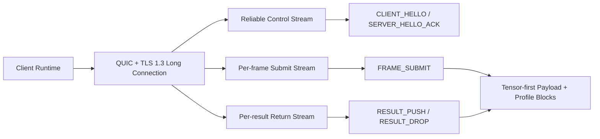

# NNRP/1-preview1 协议设计

## 1. 定位

`NNRP (Neural Network Runtime Protocol)` 是本文采用的正式协议简称。本文定义的是 `NNRP/1-preview1`，即 NNRP/1 这条线内的第一份预览阶段设计文档；但本文冻结的代码层发包身份是 `NNRP/1.0`。

`NNRP/1-preview1` 的定位是首个可实现、可抓包、可回放的预览期 wire contract，目标是为轻量实时 AI 运行时长连接场景提供一套低时延、可安全部署、首轮以 tensor 载荷为主的领域级应用层协议。

preview1 仍然是一个 tensor-first 的预览版本。它保留二进制热路径、40 字节公共头与 tensor-first 数据面，同时将 camera、tile、view 等强 profile 语义约束在 tensor profile 专属能力或扩展块内，而不是提升为所有场景默认共享的公共语义。

preview1 的协议边界如下：

1. 保留 40 字节公共头、二进制热路径、显式 `meta_len + body_len` 自描述长度，以及可靠控制面 / 高频数据面的分层设计。
2. 公共层只保留跨 profile 都成立的能力协商、帧级预算、结果分类与缓存协商语义。
3. tensor profile 仍然是一等公民，但 camera、tile、section 拓扑作为 profile-specific 结构出现，而不是要求所有非渲染场景伪装成 tile/frame 相机流。

## 1.1 总览图

这张图只抓 preview1 最核心的心智模型：单长连接、控制面与数据面分层、tensor-first 数据面。

`NNRP` 强调轻量与实时，但它不是万金油协议。它主要服务于神经网络推理、神经渲染、多模态推断、流式生成和工具协同这类“需要显式表达运行时语义”的神经网络场景，而不是泛化到所有实时联网业务。

传统 Web 音视频通话、泛视频流分发和视频流云游戏并不是 `NNRP/1-preview1` 的目标场景。原因不是这些场景“不需要实时性”，而是它们的核心问题集中在浏览器兼容、设备采集与回放、A/V sync、硬件编解码、jitter buffer、码率自适应、回声消除以及成熟媒体分发生态；这些都不是 preview1 想解决的协议问题，强行覆盖只会让协议边界失焦。

它不是通用 RPC，也不是某个现有框架的传输适配层。正式版 `NNRP/1` 预计还会继续补入以下主题：

1. 多租户与租户级路由。
2. 并发多 session / 多流量等级调度。
3. 更完整的配额、租约与审计语义。
4. 连接迁移、恢复与更细粒度 QoS。

因此，本文档只对 `NNRP/1-preview1` 负责；任何未被本文冻结的能力，都不应被误解为正式版已最终定案。

## 2. 设计目标

1. 用单条安全长连接承载实时 AI 运行时控制面与高频数据面。
2. 在首次握手中一次性协商绝大部分“低频变化”的元数据，并允许少量字段在后续通过专用报文更新。
3. 明确将 tensor payload 与元数据分层，避免大数组进入高层对象序列化。
4. 让 wire 布局规整、字段对齐、长度明确，便于直接定位、`memcpy`、块压缩与快速解压。
5. 支持多种输入 profile、可选逻辑 lane、多帧并行，以及多种张量数值格式。
6. 支持会话级缓存能力协商、低频对象缓存与 profile-specific 对象引用，为后续 cache reference 优化预留路径。
7. 为未来的 `NNRP/1` 正式版保留扩展槽位，而不是在 preview1 里一次塞满全部能力。

## 3. 明确禁止项

`NNRP/1-preview1` 对高频链路做以下明确约束：

1. 禁止在 `FRAME_SUBMIT` 和 `RESULT_PUSH` 热路径上使用 JSON。
2. 禁止在 `FRAME_SUBMIT` 和 `RESULT_PUSH` 热路径上使用 Protobuf。
3. 禁止把 `NNRP` 定义成 gRPC service、method 或 message schema 的别名。
4. 禁止在热路径中使用依赖字段 tag、varint 扫描、字符串键查找的通用对象序列化。

如果实现需要调试、录包或离线封装，可以定义工具链侧的辅助格式，但那不属于 `NNRP` 线上 wire contract。

## 4. 术语

1. `connection`：一条传输层长连接。preview1 的规范传输为 QUIC；传输层可插拔设计由 preview2 正式化。
2. `session`：连接上的一个活跃 AI 运行时会话实例；preview1 一条连接只承载一个活跃 session。
3. `view`：一个可选的逻辑 lane 标识，以 `view_id` 承载；在 tensor 渲染 profile 中可映射到相机/视角，在其他 profile 中也可以恒定为 `0`。
4. `frame`：某个 `session_id + frame_id` 下的一次输入或结果交换；若协议实现需要 lane 级拆分，可再结合 `view_id` 细分。
5. `section`：一种连续编码的 payload 语义块；在 tensor profile 中它通常对应 tensor section，在其他 profile 中可以由对应的 payload frame 取代。
6. `codec`：单 section、单 payload frame 或单 profile-specific block 的压缩/编码方式。

## 5. 传输基线与连接模型

### 5.1 安全部署基线

preview1 在代码层冻结的传输基线为：

1. `QUIC v1`
2. `TLS 1.3`
3. ALPN `nnrp/1`
4. 推荐安全 URI 方案 `nnrps://`

preview1 不定义裸 UDP 明文模式。

preview1 的 wire codec（公共头、消息 metadata、body block 布局）设计上与传输层无关，header 中已有 `meta_len + body_len` 自描述长度，可在任意可靠字节流上完整解析。`QUIC` 是 preview1 唯一冻结的传输绑定；`TCP+TLS` 等替代传输绑定的规范定义及传输层自动选择机制由 `NNRP/1-preview2` 正式化。

### 5.2 连接与 stream 分工

preview1 固定为单长连接模型，规范传输为 QUIC：

1. 一个客户端运行实例通常对应一条长连接。
2. 一条连接在 preview1 只承载一个活跃 session。
3. 一条双向可靠 control stream 承载握手、确认、错误与低频控制消息。
4. 客户端每帧使用一条单向 submit stream 承载完整 `FRAME_SUBMIT`。
5. 服务端每结果使用一条单向 result stream 承载完整 `RESULT_PUSH` 或 `RESULT_DROP`。
6. Datagram 仅用于小型、可丢弃、无需重组的大局提示，例如 `FRAME_CANCEL`、`PING`、轻量过期通知；大 tensor 不得走 datagram。

## 6. 首次握手与低频配置协商

### 6.1 握手流程

preview1 的最小握手流程冻结为：

1. `CLIENT_HELLO`
2. `SERVER_HELLO_ACK`
3. 可选 `SESSION_PATCH`
4. 可选 `SESSION_PATCH_ACK`
5. 进入 `FRAME_SUBMIT / RESULT_PUSH` 正常收发

其中：

1. `CLIENT_HELLO` 用于一次性声明客户端能力、约束和鉴权材料。
2. `SERVER_HELLO_ACK` 用于确认版本、分配或确认 `session_id`、返回协商结果与服务端能力。
3. `SESSION_PATCH` 只允许修改少量低频字段，避免每帧重复携带静态元数据。

### 6.2 `CLIENT_HELLO` 必含信息

`CLIENT_HELLO` 必须覆盖以下低频元数据：

1. 协议版本候选与版本范围。
2. 客户端支持的 tensor codec / compression 算法集合。
3. 支持的输入 profile、payload kind、对象引用能力，以及对应的能力位图。
4. 支持的数值格式与 tensor layout，例如 `FP16 / FP8 / INT8 / UINT8` 与 `NHWC / NCHW`。
5. 可选的逻辑 lane / profile-local 拓扑能力；若某个 profile 需要 camera、tile 或其他拓扑块，应通过 profile-specific 能力声明，而不是把其默认为公共字段。
6. 客户端缓存能力，例如可用缓存预算、支持的 digest 算法、支持的缓存命名空间数量。
7. 客户端期望的会话策略窗口，例如分辨率/形状范围、目标 cadence、质量等级、延迟优先级或降级偏好。
8. 鉴权相关内容，例如 `uid`、`token`、resume token、session key 材料或其他不透明认证块。
9. 可选的 `requested_session_id`；若为 `0`，表示由服务端分配。

#### 6.2.1 `CLIENT_HELLO` fixed metadata

`CLIENT_HELLO` 的 fixed metadata 首轮固定为 64 字节：

| 字段 | 类型 | 说明 |
| --- | --- | --- |
| `min_version_major` | `u8` | 可接受的最小主版本 |
| `max_version_major` | `u8` | 可接受的最大主版本 |
| `supported_stage_bitmap` | `u16` | 支持的 stage 位图；preview1 至少置位 `preview1` |
| `supported_profile_bitmap` | `u32` | 支持的 profile 位图；首轮至少声明 tensor profile |
| `supported_payload_kind_bitmap` | `u32` | 支持的 payload kind 位图；preview1 首轮固定包含 `tensor` |
| `supported_codec_bitmap` | `u32` | 支持的 codec 位图 |
| `supported_compression_bitmap` | `u32` | 支持的 compression 位图 |
| `supported_dtype_bitmap` | `u32` | 支持的 dtype 位图 |
| `supported_layout_bitmap` | `u32` | 支持的 tensor layout 位图 |
| `cache_digest_bitmap` | `u16` | 支持的缓存摘要算法位图 |
| `cache_object_bitmap` | `u16` | 支持缓存的对象类型位图 |
| `cache_namespace_count` | `u16` | 支持的缓存命名空间数量 |
| `max_lane_count` | `u16` | 支持的最大逻辑 lane 数量；若只支持单 lane，则为 `1` |
| `max_cache_entries` | `u32` | 客户端可接受的最大缓存对象数 |
| `max_cache_bytes` | `u32` | 客户端可接受的最大缓存占用 |
| `target_cadence_x100` | `u16` | 期望 cadence/FPS，放大 100 倍 |
| `latency_budget_ms` | `u16` | 期望延迟预算 |
| `quality_tier` | `u16` | 期望质量档 |
| `degrade_policy` | `u16` | 期望降级偏好 |
| `requested_session_id` | `u32` | 可选请求的 session id；若为 `0` 由服务端分配 |
| `auth_bytes` | `u32` | `auth_block` 逻辑长度 |
| `control_extension_bytes` | `u32` | `control_extension_block` 逻辑长度；无则为 `0` |

其中：

1. profile-local 拓扑能力，例如 tensor profile 的 camera/tile 能力，不进入公共 fixed metadata，而是通过对应 profile 的控制面扩展声明。
2. `quality_tier` 与 `degrade_policy` 仅表达客户端偏好，不代表服务端必须无条件接受。
3. `auth_block` 与 `control_extension_block` 都属于 body 区；fixed metadata 只提供显式长度索引。

### 6.3 `SERVER_HELLO_ACK` 必含信息

`SERVER_HELLO_ACK` 必须返回以下确认结果：

1. 选定的协议版本与 stage。
2. 生效的 `session_id`。
3. 实际接受的 profile / payload / codec / compression / dtype / layout / object-reference 组合。
4. 生效的缓存策略，例如是否启用会话级缓存、最大缓存占用、digest 算法、对象命名空间和失效策略。
5. 生效的会话策略窗口、活动 profile 约束，以及可选逻辑 lane 上限。
6. 服务端能力与限制，例如最大并发帧数、最大 body 大小、最大 section 数、支持的扩展块或 typed payload 上限。
7. 鉴权结果、token TTL 或会话续期策略。

#### 6.3.1 `SERVER_HELLO_ACK` fixed metadata

`SERVER_HELLO_ACK` 的 fixed metadata 首轮固定为 80 字节：

| 字段 | 类型 | 说明 |
| --- | --- | --- |
| `selected_version_major` | `u8` | 服务端选定的主版本 |
| `selected_wire_format` | `u8` | 服务端选定的 wire format |
| `auth_status` | `u8` | 鉴权结果枚举 |
| `reserved0` | `u8` | 保留 |
| `session_id` | `u32` | 生效的 session id |
| `accepted_profile_bitmap` | `u32` | 服务端接受的 profile 位图 |
| `accepted_payload_kind_bitmap` | `u32` | 服务端接受的 payload kind 位图 |
| `accepted_codec_bitmap` | `u32` | 服务端接受的 codec 位图 |
| `accepted_compression_bitmap` | `u32` | 服务端接受的 compression 位图 |
| `accepted_dtype_bitmap` | `u32` | 服务端接受的 dtype 位图 |
| `accepted_layout_bitmap` | `u32` | 服务端接受的 tensor layout 位图 |
| `cache_digest_bitmap` | `u32` | 生效的缓存摘要算法位图 |
| `cache_object_bitmap` | `u32` | 生效的可缓存对象类型位图 |
| `max_cache_entries` | `u32` | 服务端允许的最大缓存对象数 |
| `max_cache_bytes` | `u32` | 服务端允许的最大缓存占用 |
| `max_lane_count` | `u16` | 服务端允许的最大逻辑 lane 数量 |
| `max_concurrent_frames` | `u16` | 服务端允许的最大并发帧数 |
| `target_cadence_x100` | `u16` | 服务端接受后的 cadence/FPS |
| `latency_budget_ms` | `u16` | 服务端接受后的预算 |
| `quality_tier` | `u16` | 服务端接受后的质量档 |
| `degrade_policy` | `u16` | 服务端接受后的降级策略 |
| `max_body_bytes` | `u32` | 单条消息最大 body 大小 |
| `token_ttl_ms` | `u32` | 鉴权结果的有效期；无则为 `0` |
| `retry_after_ms` | `u32` | 若当前无法接受请求，建议重试时间 |
| `control_extension_bytes` | `u32` | `control_extension_block` 逻辑长度；无则为 `0` |
| `server_flags` | `u32` | 服务端能力标志位 |

`server_flags` 首轮定义以下位：

1. `0x00000001 = cache_enabled`
2. `0x00000002 = session_resume_supported`
3. `0x00000004 = profile_patch_required_for_shape_clamp`
4. 其余保留

其中：

1. profile-local 拓扑限制，例如 tensor profile 的 tile/section 上限，不进入公共 fixed metadata，而是通过对应 profile 的控制面扩展或 profile patch 语义声明。
2. `accepted_profile_bitmap` 允许服务端保留多个 profile 作为可协商集合；逐帧实际使用哪个 profile 由后续 `FRAME_SUBMIT.profile_id` 指定。
3. `auth_status` 若表示拒绝，发送端可改发 `ERROR(auth_failed)` 并关闭连接；保留该字段是为了允许 ack 中携带有限的结构化拒绝信息。

### 6.4 可后续变更的字段

preview1 允许通过 `SESSION_PATCH` 修改以下低频字段：

1. 目标 cadence / FPS。
2. 质量等级或降级偏好。
3. 分辨率或形状 clamp。
4. 活跃逻辑 lane 掩码或 profile-specific 低频策略。
5. 首选 codec / compression / payload 策略。

以下内容不得在 `SESSION_PATCH` 中修改，若必须变化，应重建 session：

1. 鉴权身份。
2. 基础对象命名空间与 profile 主契约。
3. 不兼容的 dtype / tensor layout / payload 主契约。

### 6.5 `SESSION_PATCH` metadata

`SESSION_PATCH` 用于更新公共会话策略以及当前 profile 的低频策略。其 fixed metadata 首轮固定为 36 字节：

| 字段 | 类型 | 说明 |
| --- | --- | --- |
| `profile_id` | `u16` | 本次 patch 面向的 profile；`0` 表示当前活动 profile |
| `reserved0` | `u16` | 保留 |
| `patch_mask` | `u32` | 低频字段位图，声明本次 patch 需要修改哪些公共字段或 profile patch |
| `target_cadence_x100` | `u32` | 目标 cadence/FPS，放大 100 倍；未置位则忽略 |
| `quality_tier` | `u16` | 目标质量档；未置位则忽略 |
| `degrade_policy` | `u16` | 降级偏好；未置位则忽略 |
| `active_lane_mask` | `u64` | 活跃逻辑 lane 掩码；未置位则忽略 |
| `preferred_codec_bitmap` | `u32` | 首选 codec 位图；未置位则忽略 |
| `preferred_compression_bitmap` | `u32` | 首选 compression 位图；未置位则忽略 |
| `profile_patch_bytes` | `u32` | 紧随 metadata 的 profile-specific patch block 长度；无则为 `0` |

`patch_mask` 首轮定义以下位：

1. `0x00000001 = target_cadence`
2. `0x00000002 = quality_tier`
3. `0x00000004 = degrade_policy`
4. `0x00000008 = active_lane_mask`
5. `0x00000010 = preferred_codec`
6. `0x00000020 = preferred_compression`
7. `0x00000040 = profile_patch`

`degrade_policy` 首轮冻结为：

1. `0 = server_default`
2. `1 = prefer_quality`
3. `2 = prefer_latency`
4. `3 = allow_aggressive_fallback`

### 6.6 `SESSION_PATCH_ACK` metadata

`SESSION_PATCH_ACK` 用于确认 `SESSION_PATCH` 的应用结果。其 fixed metadata 首轮固定为 48 字节：

| 字段 | 类型 | 说明 |
| --- | --- | --- |
| `status` | `u16` | `accepted / partial / rejected` |
| `reason` | `u16` | 拒绝或部分接受的稳定原因码 |
| `applied_patch_mask` | `u32` | 服务端实际应用的字段位图 |
| `rejected_patch_mask` | `u32` | 服务端拒绝的字段位图 |
| `retry_after_ms` | `u32` | 若需要稍后重试，则给出建议等待时间 |
| `effective_profile_id` | `u16` | 当前生效 profile |
| `reserved0` | `u16` | 保留 |
| `effective_target_cadence_x100` | `u32` | 当前生效 cadence/FPS |
| `effective_quality_tier` | `u16` | 当前生效质量档 |
| `effective_degrade_policy` | `u16` | 当前生效降级偏好 |
| `effective_lane_mask` | `u64` | 当前生效逻辑 lane 掩码 |
| `effective_codec_bitmap` | `u32` | 当前生效 codec 策略 |
| `effective_compression_bitmap` | `u32` | 当前生效 compression 策略 |
| `profile_patch_ack_bytes` | `u32` | 紧随 metadata 的 profile-specific ack block 长度；无则为 `0` |

`reason` 首轮定义以下稳定值：

1. `0 = none`
2. `1 = invalid_field_mask`
3. `2 = immutable_field`
4. `3 = unsupported_value`
5. `4 = out_of_range`
6. `5 = server_busy`

### 6.7 Tensor Profile Patch Block

当 `profile_id` 指向 tensor profile 且 `patch_mask` 包含 `profile_patch` 时，`SESSION_PATCH` body 以固定 16 字节 `tensor_profile_patch_block` 开头：

| 字段 | 类型 | 说明 |
| --- | --- | --- |
| `min_width` | `u32` | tensor profile 分辨率/形状 clamp 最小宽 |
| `min_height` | `u32` | tensor profile 分辨率/形状 clamp 最小高 |
| `max_width` | `u32` | tensor profile 分辨率/形状 clamp 最大宽 |
| `max_height` | `u32` | tensor profile 分辨率/形状 clamp 最大高 |

对应地，`SESSION_PATCH_ACK` body 可返回同样 16 字节布局的 `tensor_profile_patch_ack_block`，表示当前生效的 tensor profile clamp。

## 7. 可靠性与帧类型

### 7.1 必须可靠的内容

以下内容必须走可靠 stream：

1. `CLIENT_HELLO / SERVER_HELLO_ACK / SESSION_PATCH / SESSION_PATCH_ACK / CLOSE / ERROR`。
2. `FRAME_SUBMIT` 的公共头、fixed metadata、profile-specific block 与 payload 描述符区。
3. `RESULT_PUSH` 的公共头、fixed metadata、profile-specific block 与 payload 描述符区。

### 7.2 可丢弃内容与协议头适配

以下内容允许不补传：

1. `FRAME_CANCEL`。
2. 被更新帧 supersede 的旧结果。
3. 明确标记为 `DISCARDABLE` 的帧结果。

`CAN_DROP` 标志位应用规则如下：

1. `RESULT_PUSH` 与 `RESULT_DROP` 消息可以设置 `CAN_DROP = 1` 标志位，表示该消息不要求补传。
2. 设置 `CAN_DROP = 1` 的消息丢失后，接收方不得请求重传。
3. `frame_class = DISCARDABLE` 的 `FRAME_SUBMIT` 中的所有结果，服务端可以自动标记 `CAN_DROP`。
4. `frame_class != DISCARDABLE` 的关键帧（`keyframe`）不得被标记 `CAN_DROP`，应始终使用可靠 stream。
5. 更细粒度的可丢弃策略协商（例如丢包容忍等级声明）由 `NNRP/1-preview2 §5.6` 正式化，preview1 不定义此协商机制。

### 7.3 帧类型

每帧必须显式携带 `frame_class`，首轮冻结为：

1. `0 = keyframe`：关键帧；后续帧可依赖它。
2. `1 = delta`：常规增量帧。
3. `2 = retransmit`：同内容重传或重新编码后的补发帧。
4. `3 = discardable`：允许被主动丢弃且不要求补传的帧。

若需要表达更高优先级或更细粒度耐久性，使用公共头 `flags` 叠加，而不是引入嵌套对象层。

## 8. 公共报文头

所有 `NNRP/1-preview1` 消息统一使用 40 字节公共头，小端序，且头部长度固定为 8 字节对齐：

| Offset | Size | 字段 | 含义 |
| --- | --- | --- | --- |
| 0 | 4 | `magic` | ASCII `NNRP` |
| 4 | 1 | `version_major` | 当前固定为 `1` |
| 5 | 1 | `wire_format` | 当前固定为 `0`，表示代码层发包身份是 `NNRP/1.0` |
| 6 | 1 | `msg_type` | 消息类型 |
| 7 | 1 | `header_len` | 当前固定为 `40` |
| 8 | 4 | `flags` | 通用标志位 |
| 12 | 4 | `meta_len` | metadata 逻辑长度 |
| 16 | 4 | `body_len` | body 逻辑长度 |
| 20 | 4 | `session_id` | 会话编号，首个 `CLIENT_HELLO` 可为 `0` |
| 24 | 4 | `frame_id` | 帧编号；控制消息为 `0` |
| 28 | 2 | `view_id` | 逻辑 lane 编号；若无 lane 或非帧消息则为 `0` |
| 30 | 2 | `route_id` | preview1 保留，用于后续租户/路由扩展 |
| 32 | 8 | `trace_id` | 64 位跟踪编号 |

`flags` 首轮冻结如下：

1. `0x00000001 = ACK_REQUIRED`
2. `0x00000002 = CAN_DROP`
3. `0x00000004 = STALE`
4. `0x00000008 = EOS`
5. `0x00000010 = RETRANSMIT`
6. `0x00000020 = KEYFRAME`
7. 其余保留

## 9. 首轮消息类型

| 值 | 名称 | 方向 | 说明 |
| --- | --- | --- | --- |
| `0x01` | `CLIENT_HELLO` | C -> S | 首次握手、能力声明、鉴权输入 |
| `0x02` | `SERVER_HELLO_ACK` | S -> C | 版本确认、协商结果、能力返回 |
| `0x03` | `SESSION_PATCH` | C -> S | 低频参数更新 |
| `0x04` | `SESSION_PATCH_ACK` | S -> C | 参数更新确认 |
| `0x05` | `CLOSE` | 双向 | 主动关闭 session / connection |
| `0x06` | `ERROR` | 双向 | 错误与拒绝 |
| `0x10` | `FRAME_SUBMIT` | C -> S | 单帧提交；可按 `view_id` 区分逻辑 lane |
| `0x11` | `FRAME_CANCEL` | C -> S | 取消旧帧或通知 supersede |
| `0x12` | `RESULT_PUSH` | S -> C | 异步结果返回 |
| `0x13` | `RESULT_DROP` | S -> C | 结果被丢弃、过期或 supersede |
| `0x14` | `CACHE_PUT` | 双向 | 安装低频缓存对象 |
| `0x15` | `CACHE_ACK` | 双向 | 缓存对象确认 |
| `0x16` | `CACHE_INVALIDATE` | 双向 | 缓存失效或逐出通知 |
| `0x20` | `PING` | 双向 | 延迟探测 |
| `0x21` | `PONG` | 双向 | 延迟探测回包 |

## 10. 对齐、长度与解析规则

### 10.1 基本规则

1. 所有 metadata 和 body block 都必须以显式长度字段描述。
2. 所有 block 起始位置都必须按 8 字节对齐。
3. 所有 padding 字节必须填 `0`，且 padding 不计入逻辑长度。
4. 热路径中禁止依赖 varint、终止符扫描或字符串键匹配来完成解析。

### 10.2 直接定位规则

解析器必须能在读取公共头后，直接依据 `meta_len`、`body_len` 和 section 描述符完成以下动作：

1. 定位 profile-specific block 区域。
2. 定位某个 payload 描述符区。
3. 若 `payload_kind=tensor`，再进一步定位 `tile_index_block`、`codec_table` 与 `length_table`。
4. 定位某个 payload 的 `payload_blob`。

这意味着 preview1 的热路径布局必须满足“定长描述符 + 明确偏移 + 连续 payload”三条约束。

### 10.3 控制面扩展兼容规则

为避免 preview1 发布后只能通过 `1 -> 2` 的破坏性版本迁移补扩展能力，preview1 在控制面正式预留一个受约束的扩展机制，但该机制只用于低频控制消息，不用于热路径数据面。

1. `FRAME_SUBMIT` 和 `RESULT_PUSH` 不得承载通用自定义请求头、字符串键值 metadata 或其他开放式应用扩展块。
2. preview1 的通用扩展入口仅保留给控制面；标准消息中优先允许 `CLIENT_HELLO / SERVER_HELLO_ACK / SESSION_PATCH / SESSION_PATCH_ACK / CLOSE / ERROR` 使用该入口。
3. `CLIENT_HELLO` 若携带 body，body 顺序冻结为：`auth_block` 在前，可选 `control_extension_block` 在后；两者的分界由 fixed metadata 中的 `auth_bytes` 与 `control_extension_bytes` 决定。
4. `SERVER_HELLO_ACK` 若携带 body，body 整体按 `control_extension_block` 解析，其长度由 fixed metadata 中的 `control_extension_bytes` 决定。
5. 其他控制消息若未定义专用 body 语义，则 `body_len = 0` 表示无扩展，`body_len > 0` 表示 body 整体按 `control_extension_block` 解析。
6. `control_extension_block` 由零个或多个 TLV entry 顺序组成；每个 entry 头固定为 8 字节：`ext_type:u16`、`ext_flags:u16`、`ext_len:u32`，后跟 `ext_len` 字节 payload，并补零对齐到 8 字节边界。
7. `ext_flags` 的 `0x0001` 预留为 `CRITICAL`；发送方只有在接收方不识别该扩展就无法安全继续处理时，才允许置位。
8. 收到未知且 `CRITICAL=0` 的扩展时，接收方必须忽略该 entry；收到未知且 `CRITICAL=1` 的扩展时，接收方必须返回 `ERROR(unsupported_capability)`，不得静默降级。
9. 若 TLV 头、长度、对齐或尾部截断不合法，接收方必须返回 `ERROR(malformed_body)`。
10. `ext_type` 首轮保留以下区间：`0x0001-0x3FFF` 为协议标准扩展，`0x4000-0x7FFF` 为当前 preview 序列实验扩展，`0x8000-0xBFFF` 为 vendor/private 扩展，`0xC000-0xFFFF` 为本地调试与非互操作用途；`0x0000` 保留不用。
11. 公共头中的 `route_id`、保留 `flags` 位、各 fixed metadata 中的 `reserved` 字段，均属于协议自身预留，不得作为业务侧自定义字段入口。
12. 若未来需要承载逐帧客制化能力，必须优先定义受约束的数值化扩展块或新的 preview stage，不得回退为 HTTP 风格的开放式 header map。

## 11. `FRAME_SUBMIT` 布局

### 11.1 `FRAME_SUBMIT` metadata

`FRAME_SUBMIT` 的公共 fixed metadata 首轮固定为 32 字节：

| 字段 | 类型 | 说明 |
| --- | --- | --- |
| `profile_id` | `u16` | 当前输入 profile |
| `payload_kind` | `u8` | preview1 数据面首轮固定为 `0=tensor` |
| `frame_class` | `u8` | 帧类型枚举 |
| `submit_flags` | `u16` | 公共提交标志位；首轮保留 |
| `profile_flags` | `u16` | profile-specific 标志位；由对应 profile 解释 |
| `latency_budget_ms` | `u16` | 延迟预算 |
| `cadence_hint_x100` | `u16` | 目标 cadence/FPS，放大 100 倍 |
| `dependency_frame_id` | `u32` | 若本帧依赖旧帧上下文，则指向依赖 frame id，否则为 `0` |
| `profile_block_bytes` | `u32` | 紧随 metadata 的 profile-specific block 总长度 |
| `payload_descriptor_bytes` | `u32` | payload 描述符区总长度 |
| `payload_data_bytes` | `u32` | payload 数据区总长度 |
| `reserved0` | `u32` | 保留 |

### 11.2 Tensor Submit Block

当 `profile_id` 为 tensor profile 时，`FRAME_SUBMIT` body 以固定 32 字节 `tensor_submit_block` 开头：

| 字段 | 类型 | 说明 |
| --- | --- | --- |
| `src_width` | `u16` | 输入宽 |
| `src_height` | `u16` | 输入高 |
| `tile_width` | `u16` | tile 宽 |
| `tile_height` | `u16` | tile 高 |
| `tile_count` | `u16` | 本帧 tile 数 |
| `section_count` | `u16` | tensor section 数 |
| `tile_index_mode` | `u8` | tile 索引模式 |
| `tensor_flags` | `u8` | tensor profile 标志位；首轮保留 |
| `reserved0` | `u16` | 保留 |
| `tile_base_id` | `u32` | `dense_range` 模式下的起始 tile id |
| `camera_bytes` | `u32` | camera block 长度 |
| `tile_index_bytes` | `u32` | tile index block 长度 |
| `reserved1` | `u32` | 保留 |

### 11.3 多视角规则

preview1 的 lane 规则如下：

1. `view_id` 在公共层承担可选逻辑 lane 标识；在 tensor 渲染 profile 中可映射为相机视角。
2. tensor 渲染 profile 仍然可以使用“同一 `session_id + frame_id`，不同 `view_id`”表达多视角输入。
3. 非渲染 profile 可以将 `view_id` 固定为 `0`，协议层不得要求其补造额外视角映射表。

### 11.4 body 顺序

`FRAME_SUBMIT` body 的组织原则为：

1. `profile_block` 区。
2. `payload_descriptor` 区。
3. `payload_data` 区。

对于 tensor profile，`profile_block` 区的顺序冻结为：

1. `tensor_submit_block`
2. 可选 `camera_block`
3. 可选 `tile_index_block`

`payload_descriptor` 区与 `payload_data` 区则继续按照 `tensor_section[0..n]` 的顺序组织。

### 11.5 tile 索引模式

对于 tensor profile，tile 索引模式首轮保留以下 4 种编码：

1. `0 = dense_range`
2. `1 = raw_u16`
3. `2 = delta_u16`
4. `3 = bitset`

wire 上统一使用 `tile_id`，不重复发送 `tile_x / tile_y`。

## 12. `TensorSectionDesc` 与数值格式

### 12.1 描述符布局

每个 `tensor_section` 的描述符固定为 32 字节：

| Offset | Size | 字段 | 含义 |
| --- | --- | --- | --- |
| 0 | 2 | `role_id` | section 语义编号 |
| 2 | 1 | `codec_id` | 默认 codec |
| 3 | 1 | `dtype_id` | 数值格式 |
| 4 | 1 | `layout_id` | 内存布局，例如 `NHWC / NCHW` |
| 5 | 1 | `scale_policy` | 定点/量化缩放策略 |
| 6 | 2 | `flags` | section 标志位 |
| 8 | 4 | `element_count_per_tile` | 每 tile 元素数 |
| 12 | 4 | `codec_table_bytes` | codec table 长度 |
| 16 | 4 | `length_table_bytes` | length table 长度 |
| 20 | 4 | `payload_bytes` | payload blob 长度 |
| 24 | 4 | `payload_stride_bytes` | 定长编码时的步长；变长则为 `0` |
| 28 | 4 | `reserved` | 保留 |

### 12.2 `dtype_id` 首轮保留值

1. `0 = fp16`
2. `1 = fp32`
3. `2 = fp8_e4m3`
4. `3 = fp8_e5m2`
5. `4 = int8`
6. `5 = uint8`
7. `6 = int16`
8. `7 = uint16`

preview1 必须预留 `FP16 / FP8 / INT8`，不得把 dtype 语义硬编码到 section 名称里。

### 12.3 section 内部顺序

`tensor_section` 内部顺序固定为：

1. `TensorSectionDesc`
2. 可选 `codec_table`
3. `length_table`
4. `payload_blob`

其中：

1. `codec_table` 允许按 tile 指定 codec；若所有 tile 相同，可省略。
2. `length_table` 首轮统一使用 `u32` 长度项，避免大 payload 时溢出。
3. `payload_blob` 必须按 tile 索引顺序连续拼接。

## 13. `RESULT_PUSH` 布局

### 13.1 `RESULT_PUSH` metadata

`RESULT_PUSH` 的公共 fixed metadata 首轮固定为 32 字节：

| 字段 | 类型 | 说明 |
| --- | --- | --- |
| `status_code` | `u16` | 成功、降级、拒绝等状态 |
| `result_flags` | `u16` | stale、fallback、partial 等标志 |
| `active_profile_id` | `u16` | 服务端生效配置编号 |
| `payload_kind` | `u8` | preview1 结果首轮固定为 `0=tensor` |
| `reserved0` | `u8` | 保留 |
| `inference_ms` | `u16` | 推理耗时 |
| `queue_ms` | `u16` | 排队耗时 |
| `server_total_ms` | `u16` | 服务端总耗时 |
| `reserved1` | `u16` | 保留 |
| `profile_block_bytes` | `u32` | 紧随 metadata 的 profile-specific block 总长度 |
| `payload_descriptor_bytes` | `u32` | payload 描述符区总长度 |
| `payload_data_bytes` | `u32` | payload 数据区总长度 |
| `reserved2` | `u32` | 保留 |

### 13.2 Tensor Result Block

当 `active_profile_id` 为 tensor profile 时，`RESULT_PUSH` body 以固定 16 字节 `tensor_result_block` 开头：

| 字段 | 类型 | 说明 |
| --- | --- | --- |
| `section_count` | `u16` | 结果 section 数 |
| `tile_count` | `u16` | 返回 tile 数 |
| `tile_index_mode` | `u8` | tile 索引模式 |
| `tensor_flags` | `u8` | tensor profile 标志位；首轮保留 |
| `reserved0` | `u16` | 保留 |
| `tile_base_id` | `u32` | `dense_range` 模式下的起始 tile id |
| `tile_index_bytes` | `u32` | tile index block 长度 |

### 13.3 body 顺序

`RESULT_PUSH` body 的组织原则为：

1. `profile_block` 区。
2. `payload_descriptor` 区。
3. `payload_data` 区。

对于 tensor profile，`profile_block` 区的顺序冻结为：

1. `tensor_result_block`
2. 可选 `tile_index_block`

`payload_descriptor` 区与 `payload_data` 区继续按照 `tensor_section[0..n]` 的顺序组织。

结果是否可丢弃、是否 stale、是否回退，仍然通过公共头 `flags` 与结果 metadata 表达，不引入文本字段。

### 13.4 preview1 tensor profile 保留字段边界

preview1 在 tensor profile 中明确保留以下 render-oriented / topology-related 语义，因为它们仍是当前 tensor-first 热路径可独立解析所必需的固定信息：

1. `src_width / src_height / tile_width / tile_height`。
2. `tile_count / section_count / tile_index_mode / tile_base_id`。
3. `camera_bytes / tile_index_bytes` 与对应的 inline `camera_block / tile_index_block`。
4. `view_id` 作为公共 lane 标识，以及 tensor 渲染 profile 对它的视角映射规则。
5. `tensor_profile_patch_block / tensor_profile_patch_ack_block` 中的 `min_width / min_height / max_width / max_height` clamp 语义。

以下能力不再继续塞回 preview1 tensor profile；若需要引用式、混合式或非 tensor 统一表达，统一转入 preview2：

1. `camera_block / tile_index_block / tensor section table / codec table` 的 object-reference-first 提交或结果返回路径。
2. token、audio、video、structured event、tool delta、opaque bytes 等非 tensor payload 的 typed payload descriptor / frame 语义。
3. 非 tensor payload 的覆盖范围、顺序与 profile-specific 扩展帧语义。
4. 依赖 object-reference 或 typed payload body model 才能解释的额外 render-oriented 明细字段。

因此 preview1 继续保持“tensor-first 且可独立回退到全量 inline”的边界；object-reference 优先、mixed typed payload、以及更广义的多模态 body 组织由 preview2 负责正式化。

## 14. 认证与会话密钥材料

### 14.1 认证块原则

preview1 不强制规定具体身份系统，但要求：

1. `CLIENT_HELLO` 必须为鉴权材料预留独立 `auth_block`。
2. `auth_block` 可以承载 `uid`、`token`、resume token、opaque attestation blob、会话密钥协商材料等。
3. `SERVER_HELLO_ACK` 必须返回鉴权结果、有效期或拒绝原因。

### 14.2 会话密钥语义

若部署侧需要应用层 session key 语义，应遵循以下原则：

1. 传输层机密性与前向安全仍由 `TLS 1.3` / QUIC 提供。
2. 应用层 session key 只用于授权、恢复或上层 payload 保护策略，不应替代 TLS。
3. 任何 key 材料都不得出现在高频 per-frame metadata 中。

## 15. 状态机

### 15.1 连接与 session 状态

preview1 的连接 / session 状态机冻结为：

1. `INIT`：QUIC 已建立，但尚未完成 `CLIENT_HELLO`。
2. `NEGOTIATING`：`CLIENT_HELLO` 已发出，等待 `SERVER_HELLO_ACK`。
3. `ACTIVE`：协商完成，允许 `SESSION_PATCH`、`FRAME_SUBMIT`、`RESULT_PUSH`。
4. `DRAINING`：一端已发 `CLOSE` 或致命 `ERROR`，不再接受新帧。
5. `CLOSED`：连接或 session 终止。

状态转移规则：

1. `INIT -> NEGOTIATING`：发送或接收 `CLIENT_HELLO`。
2. `NEGOTIATING -> ACTIVE`：成功收到 `SERVER_HELLO_ACK`。
3. `NEGOTIATING -> CLOSED`：协商失败、鉴权失败或版本不兼容。
4. `ACTIVE -> ACTIVE`：允许低频 `SESSION_PATCH`、`CACHE_PUT`、`CACHE_INVALIDATE`。
5. `ACTIVE -> DRAINING`：任一端发送 `CLOSE`，或收到致命 `ERROR`。
6. `DRAINING -> CLOSED`：在途帧清理结束，或超时强制关闭。

在 `ACTIVE` 之前禁止发送 `FRAME_SUBMIT`；在 `DRAINING` 之后禁止接受新的 `FRAME_SUBMIT` 和 `SESSION_PATCH`。

### 15.2 单帧生命周期

每个 `session_id + view_id + frame_id` 的状态机冻结为：

1. `ANNOUNCED`：本地已生成 frame id，但尚未发出。
2. `SUBMITTED`：`FRAME_SUBMIT` 已发出且 stream 已建立。
3. `PROCESSING`：对端已接受并开始处理。
4. `READY`：结果已生成，等待发送或应用。
5. `DELIVERED`：对应 `RESULT_PUSH` 已成功交付。
6. `DROPPED`：收到 `RESULT_DROP` 或被 supersede。
7. `CANCELLED`：本端或对端明确取消。
8. `EXPIRED`：超过时限被丢弃。

其中：

1. `retransmit` 帧若依赖旧帧上下文，必须通过 `dependency_frame_id` 指向原 frame。
2. 同一 `frame_id` 的不同 `view_id` 在公共层视为不同逻辑 lane，不共享生命周期；tensor 渲染 profile 可将其映射为不同视角。
3. `DELIVERED / DROPPED / CANCELLED / EXPIRED` 都是终止态。

## 16. 错误处理

### 16.1 `ERROR` 报文原则

`ERROR` 是结构化控制消息，不是自由文本日志。preview1 要求：

1. 必须带稳定的 `error_code`。
2. 可以附带简短诊断文本，但文本只用于调试，不参与协议判断。
3. 必须标明错误作用域：连接级、session 级或 frame 级。

### 16.2 首轮错误码

preview1 首轮冻结以下错误码：

1. `0x0001 = unsupported_version`
2. `0x0002 = auth_failed`
3. `0x0003 = invalid_state`
4. `0x0004 = malformed_header`
5. `0x0005 = malformed_body`
6. `0x0006 = unsupported_capability`
7. `0x0007 = limit_exceeded`
8. `0x0008 = frame_expired`
9. `0x0009 = frame_cancelled`
10. `0x000A = cache_miss`
11. `0x000B = server_busy`
12. `0x000C = internal_error`

### 16.3 错误处理规则

1. `unsupported_version`、`auth_failed`、`malformed_header` 默认是致命错误，必须转入 `DRAINING` 或 `CLOSED`。
2. `invalid_state`、`unsupported_capability`、`limit_exceeded` 可按 session 级拒绝处理，不必立即断开连接。
3. `frame_expired`、`frame_cancelled`、`cache_miss` 默认是 frame 级可恢复错误。
4. `server_busy` 允许携带重试建议；是否重试由应用侧决定。
5. `internal_error` 若无法定位到单帧，按连接级致命错误处理。

### 16.4 与状态机的关系

1. 收到连接级致命 `ERROR` 后，接收方必须停止发新帧并进入 `DRAINING`。
2. 收到 frame 级 `ERROR` 不得影响其他 `view_id` 或其他 `frame_id` 的正常处理。
3. `CACHE_PUT` 失败时应优先返回 `cache_miss` 或 `limit_exceeded`，而不是静默忽略。

## 17. 缓存语义

### 17.1 缓存设计原则

`NNRP/1-preview1` 的缓存语义只服务于协议自身的低频对象复用，首轮冻结以下原则：

1. 对象是否可缓存。
2. 对象身份由稳定摘要唯一标识。
3. 失效、逐出与重新验证策略。
4. 命中缓存时避免重复发送低频对象。

### 17.2 preview1 的缓存边界

preview1 冻结的是“会话级低频对象缓存”：

1. 缓存作用域默认是单 `session`。
2. 缓存键必须是内容寻址的稳定摘要，例如 128 位 digest。
3. 缓存对象优先用于低频、重复率高、变化慢的 block。
4. preview1 不强制要求热路径 frame payload 变成 cache reference first；首轮仍要求 `FRAME_SUBMIT` 和 `RESULT_PUSH` 可独立解析。

### 17.3 适合缓存的对象

1. tensor profile 下的 `camera_block` 模板或稳定相机标定块。
2. tensor profile 下的固定 tile 布局模板、bitset 模板或索引模板。
3. 低频字典、查找表、量化参数、静态 codec 辅助块。
4. 某些稳定结果模板或回退资源，但必须由发送端显式声明可缓存。

以下内容默认不应缓存：

1. `auth_block`。
2. 高频变化的每帧动态 tensor。
3. 仅用于一次传输的临时明细文本。

### 17.4 缓存协商与控制消息

1. `CLIENT_HELLO` 声明客户端缓存预算、digest 支持和最大缓存对象数。
2. `SERVER_HELLO_ACK` 返回是否启用缓存、允许的缓存对象类型、TTL 上限和失效策略。
3. `CACHE_PUT` 用于安装低频缓存对象，必须走可靠 control stream。
4. `CACHE_ACK` 用于确认安装成功或拒绝原因。
5. `CACHE_INVALIDATE` 用于逐出指定 `cache_key`、命名空间或整个 session cache。

### 17.5 缓存约束与取舍

1. preview1 只缓存可独立命名、可独立失效、可独立复用的二进制 block。
2. preview1 不要求共享缓存，也不要求跨 session 复用缓存对象。
3. preview1 优先优化重复发送的模板块、索引模板和低频辅助块，不优先优化高频动态 tensor。
4. preview1 不把缓存命中作为热路径正确性的前提；即使缓存未命中，发送端仍应能回退到直接发送完整对象。

## 18. 版本演进与正式版预留

1. preview1 在代码层冻结的 ALPN 是 `nnrp/1`。
2. preview1 是 NNRP/1 这条线内的设计阶段名，不是单独的代码层协议号。
3. 公共头中的 `route_id`、保留 `flags`、若干消息类型号段，为后续多租户、调度等级、配额与路由扩展预留。
4. 与 preview1 不兼容的 wire 变化，不得静默覆盖，必须通过新的设计阶段文档边界或新的 major version 暴露。
5. 兼容性增强、可选能力或新增错误码，优先通过 capability bit、控制面 `control_extension_block`、保留标志位和新增可选消息类型扩展，而不是改写既有定长头。
6. 若引入热路径 cache reference、并发多 session 或多租户语义，应优先使用新的设计阶段明确暴露，而不是回溯修改 preview1 的既有语义。

## 19. 首轮结论

`NNRP/1-preview1` 的核心不是“把某个现有框架搬到 QUIC 上”，而是：

1. 首次握手先把低频静态信息讲清楚。
2. 每帧只发真正变化的数据。
3. 大 tensor 只走规整的二进制 section，不走高层对象序列化。
4. 用固定宽度头、显式长度和 8 字节对齐保证实现简单、定位直接、压缩友好。
5. 先把 preview1 做成稳定 wire contract，再进入后续 preview 迭代，最后再收敛正式版 `NNRP/1`。
