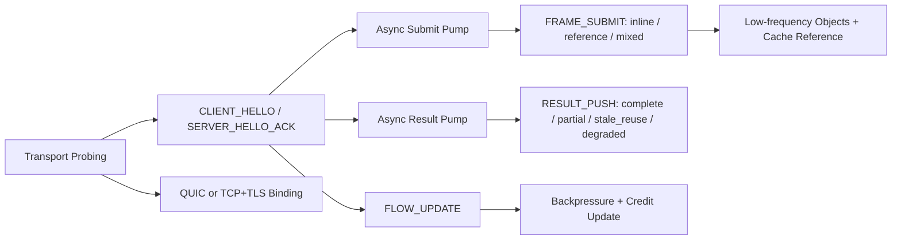

# NNRP/1-preview2 协议设计

## 1. 定位

`NNRP` 在本文中的正式全称是 `Neural Network Runtime Protocol`，即“神经网络运行时协议”。`NNRP/1-preview2` 是在 `NNRP/1-preview1` 之上的第二个预览期 wire contract，目标不是推翻 preview1，而是在保持现有长连接、固定头、低层二进制热路径原则不变的前提下，把后续真正决定端到端时延的协议语义补齐，并把协议定位从“神经渲染专用链路”提升为“面向神经网络运行时场景的轻量实时 AI 领域级应用层协议”。

preview2 关注的问题不再只是“能不能连通”，而是以下四件事：

1. 让客户端与服务端可以复用低频对象，避免热路径每次都全量重发稳定内容。
2. 让协议显式表达 typed payload / extension frame，使 tensor、token、音视频块、结构化事件和工具增量都能走统一的实时会话语义。
3. 让协议显式表达 partial / stale / degrade / supersede 这些低时延场景必需的运行时语义。
4. 让 SDK 与 host runtime 不必各自私下发明流控、预算、降级、对象引用和传输切换规则。

这里的“轻量实时”同样不意味着 `NNRP` 要成为通用实时媒体协议。它主要解决的是神经网络场景里“语义对象、推理预算、结果降级、对象引用、传输切换”这些运行时问题，而不是浏览器媒体栈或视频分发栈本身的问题。

本文冻结的是 `NNRP/1-preview2` 的设计方向、一阶消息语义与兼容边界，不等价于最终正式版 `NNRP/1`。

## 1.1 总览图



这张图对应 preview2 的阅读主线：它不只是补字段，而是把对象引用、异步结果泵、显式流控和传输探测同时拉进协议层。

## 2. preview2 明确负责的主题

`NNRP/1-preview2` 明确负责以下主题：

1. 会话内低频对象的安装、引用、失效与回收语义。
2. `FRAME_SUBMIT` 的 inline / reference / mixed 三种提交模式。
3. `RESULT_PUSH` 的完整结果、局部结果、陈旧结果和降级结果语义。
4. 端到端预算协商、服务端降级回执与结果时延口径。
5. 显式流控与可观测性，用于限制 in-flight、表达服务端拥塞与指导客户端背压。
6. 传输层可插拔设计：定义 TCP+TLS 传输绑定规范，并引入基于吞吐量探测的传输层自动选择机制（Transport Probing Phase）。
7. 类型化载荷与扩展帧设计：在不改公共头的前提下，把 tensor、token、音视频块、结构化事件与工具增量纳入统一的数据面模型。

preview2 不负责以下主题：

1. 多租户与多连接聚合调度。
2. 连接迁移、断点恢复与 resume token 正式化。
3. GPU 侧零拷贝、Unity 渲染管线或 Python runtime 内部线程模型。
4. 最终正式版的多路 QoS 分类与优先级仲裁。
5. 面向传统 Web 音视频通话的 ICE/NAT 穿透、设备采集、A/V sync、AEC/NS/AGC、SFU/MCU 等浏览器媒体能力。
6. 面向泛视频流分发或视频流云游戏的连续媒体传输栈，例如硬件编解码、jitter buffer、ABR、frame pacing 与显示链路优化。

因此，传统 Web 音视频通话、泛视频直播/点播分发以及视频流云游戏都不应被当作 `NNRP/1-preview2` 的主目标业务。即便这些场景也强调实时性，它们的主矛盾依然是媒体处理与分发，而不是神经网络运行时语义；`NNRP` 更适合作为 AI 语义层协议，而不是去直接替代成熟的媒体协议栈。

## 3. 设计原则

preview2 保持以下原则不变：

1. 热路径继续禁止 JSON 与 Protobuf。
2. 公共头继续保持固定长度、小端序、显式长度字段与可直接定位的二进制布局。
3. 低频对象协商继续走可靠 control stream；高频 typed payload 继续走 submit/result stream。
4. 任何对延迟有利的语义都必须先成为协议概念，再落在 SDK 与 runtime 中，而不是只做仓库私有技巧。
5. tensor 仍是首个标准 payload profile，但 preview2 不再把数据面限定为“仅张量”。
6. preview2 的规范会话形态是“单 session 长连接上的异步 submit pump + result pump + control side-channel”，而不是“每次 `FRAME_SUBMIT` 都隐含一次同步 request-response 事务”。
7. `FRAME_SUBMIT` 负责表达提交、预算、依赖与 payload 语义，不应在协议语义上被解释为“提交这一帧并等待匹配结果后才允许继续发送后续帧”。
8. 若 host 或 SDK 仍提供 `submit_and_wait` 一类便捷 API，它只能被视为 smoke / demo / compatibility helper，不得反向定义 preview2 的标准调用模型。

## 4. 与 preview1 的兼容边界

### 4.1 版本与阶段

preview2 固定为：

1. `version_major = 1`
2. `version_stage = 2`
3. ALPN `nnrp/1-preview2`

preview2 与 preview1 不做静默互通。若双方只共同支持 preview1，则必须回退到 `nnrp/1-preview1`；若任一端只支持 preview2，握手应明确失败，而不是在热路径做模糊兼容。

### 4.2 公共头

preview2 继续沿用 40 字节公共头，不改变 header 基本形状：

1. 继续保留 `magic / version_major / version_stage / msg_type / header_len / flags / meta_len / body_len / session_id / frame_id / view_id / route_id / trace_id`。
2. `header_len` 继续固定为 `40`。
3. preview2 的主要演进点放在消息类型、metadata 字段表、body block 组织规则和 flags 语义扩展，而不是更换公共头。

### 4.3 preview1 既有消息复用

preview1 中已有的以下消息继续保留：

1. `CLIENT_HELLO`
2. `SERVER_HELLO_ACK`
3. `SESSION_PATCH`
4. `SESSION_PATCH_ACK`
5. `FRAME_SUBMIT`
6. `FRAME_CANCEL`
7. `RESULT_PUSH`
8. `RESULT_DROP`
9. `CACHE_PUT`
10. `CACHE_ACK`
11. `CACHE_INVALIDATE`
12. `PING`
13. `CLOSE`
14. `ERROR`

preview2 优先扩展既有消息的字段与语义，只有在 preview1 消息无法承载新增语义时才增加新消息类型。

## 5. preview2 必须新增的协议能力

### 5.1 低频对象引用

preview2 引入“对象级引用是热路径一等公民”的约束。

低频对象至少覆盖以下类别：

1. 相机块模板、稳定 camera block 或其他提交上下文模板。
2. tile index block、payload layout 模板或其他可复用索引对象。
3. tensor section descriptor 表，或 token/audio/video/event 的 schema descriptor。
4. 低频 codec table / length table、tokenizer 片段、媒体分片模板或其他编码辅助对象。
5. 结果侧可复用的 layout / residual object、prompt segment、tool schema 或会话内稳定对象。

preview2 约束如下：

1. 低频对象仍通过 `CACHE_PUT / CACHE_ACK / CACHE_INVALIDATE` 生命周期管理。
2. `FRAME_SUBMIT` 和 `RESULT_PUSH` 必须允许同时携带 inline block 与 cache reference block。
3. 同一帧内允许“部分对象引用，部分对象内联”，不得强制 all-or-nothing。
4. cache object 必须有稳定对象类型、命名空间和版本约束；cache miss 必须显式回报，不得静默回退。

### 5.2 mixed submit 模式

preview2 将 `FRAME_SUBMIT` 的提交模式冻结为三种：

1. `inline`：沿用 preview1 兼容路径，全量内联对象块与 typed payload frame。
2. `reference`：主体仅发送引用句柄与少量动态字段，不重复发送稳定对象。
3. `mixed`：部分 block 内联，部分 block 用 cache reference。

协议层必须显式告诉服务端：

1. 哪些 block 是新内联对象。
2. 哪些 block 是对已有 cache object 的引用。
3. 哪些 block 被本帧 supersede 或替换。

### 5.3 partial / stale / degrade 结果语义

preview2 不再把结果简单分成 “有结果” 和 “丢结果”。

`RESULT_PUSH` 必须显式表达以下结果类别：

1. `complete`：完整结果。
2. `partial`：仅返回部分 tile、部分 section、部分 token/audio/video chunk 或低质量结果。
3. `stale_reuse`：结果复用了旧帧或旧对象，但仍可展示。
4. `degraded`：服务端因预算、拥塞或资源限制主动降级。

对应约束：

1. `RESULT_PUSH` 必须能指明本次结果覆盖了哪些 tile。
2. `RESULT_PUSH` 必须能指明结果是否引用了旧对象、旧 frame 或旧 cache object。
3. 客户端必须能区分“可展示的降级结果”和“不可展示的结果丢弃”。

### 5.4 预算与降级协商

preview2 将“预算不是 hint，而是服务端必须可回执的运行时契约”作为明确约束。

协议层至少应覆盖：

1. 客户端提交的 frame latency budget。
2. 服务端实际采用的执行策略，例如 `full / partial / stale / drop`。
3. 服务端拒绝或降级的稳定原因码。
4. 当前结果实际花费的 queue / compute / server_total 指标。

低时延场景下，客户端不能只知道“慢了”，还必须知道“为什么慢了，以及服务端是否已经主动降级”。

### 5.5 显式流控

preview2 将“单连接上能同时飞多少帧、服务端何时建议背压”正式化。

最小要求：

1. 握手中继续协商 `max_concurrent_frames`。
2. 增加运行期 flow update 机制，用于服务端动态收紧或放宽 credit。
3. 客户端必须能区分 `queue_full`、`server_busy`、`budget_exceeded`、`superseded` 等不同拒绝原因。

### 5.5A 持续异步流语义

preview2 额外冻结以下会话级约束：

1. 客户端可以在同一 session 内连续提交多个 `FRAME_SUBMIT`，前提是未超过当前 `max_concurrent_frames` 与运行期 credit。
2. 服务端可以乱序完成不同 `frame_id` 的结果，只要结果元数据能明确声明 `frame_id / dependency_frame_id / reused_frame_id / result_class`。
3. 客户端必须允许在同一长连接上独立接收 `RESULT_PUSH / RESULT_DROP / FLOW_UPDATE / RESULT_HINT`，而不是把结果读取强耦合到某一次 submit 调用的返回路径上。
4. `stale / superseded / degraded / drop` 语义的目标，正是让结果消费可以与提交解耦；旧结果可被显式废弃，但这不应阻塞更新帧继续提交。
5. 因此，preview2 的默认 host / SDK 实现形态应是后台结果泵、显式 in-flight 跟踪和按 deadline 消费，而不是逐帧同步等待。
6. 这些约束属于 preview2 现阶段要落地的运行时语义，不属于必须推迟到 preview3 的版本级主题；只有当后续需要新的 wire-visible 优先级类、恢复语义或更细粒度多队列调度时，才应进入更后续版本讨论。

### 5.6 丢包容忍声明

preview2 引入会话级与帧级**丢包容忍声明**（Loss Tolerance Declaration），允许客户端显式告诉服务端"在当前链路质量下，我允许哪些内容不重传"，从而避免高丢包场景下传输层无限重试打爆 RTT 预算、阻塞服务端推理队列或淹没客户端接收缓冲。

#### 设计目标

1. 客户端在握手时声明全局丢包容忍策略，服务端依此调整重传优先级与 `RESULT_DROP` 时机。
2. 客户端在提交单帧时可以覆盖全局策略，进一步降低或提升该帧的重传要求。
3. 策略只影响服务端对"允许丢弃"的判断阈值，不改变 wire 格式，也不替代 QUIC 或 TCP 的传输层重传控制。

#### 丢包容忍等级枚举

preview2 冻结以下 `loss_tolerance` 枚举值：

| 值 | 名称 | 语义 |
| --- | --- | --- |
| `0` | `strict` | 不允许丢弃，所有结果都必须重传直到送达或超时 |
| `1` | `best_effort` | 超出延迟预算的结果可丢，不强制重传（默认值） |
| `2` | `low_latency` | 优先时延，只要发现 RTT 超过 `latency_budget_ms` 的 50% 即可提前丢弃 |
| `3` | `fire_and_forget` | 完全不要求重传，server 侧每帧结果发一次即止，无论是否收到 ACK |

`strict` 模式下服务端仍受 `latency_budget_ms` 约束，超预算后只能返回 `RESULT_DROP`，而不是无限等待；`fire_and_forget` 只适合高帧率、可接受帧间跳变的场景，不得用于 `frame_class = keyframe` 的关键帧。

#### 会话级声明（握手）

`CLIENT_HELLO` 扩展字段新增 `session_loss_tolerance: u8`，含义为本会话全局默认丢包容忍等级。若该扩展缺失，服务端行为等价于 `best_effort`。

`SERVER_HELLO_ACK` 扩展字段新增 `accepted_loss_tolerance: u8`，返回服务端实际接受的等级；若服务端不支持客户端请求的等级，应向保守方向对齐并在此字段声明实际生效值。

#### 帧级覆盖（提交时）

`FRAME_SUBMIT` v2 metadata 新增 `loss_tolerance_policy: u8` 字段，语义与枚举相同。若值为 `0xFF`，表示继承会话级策略，不做帧级覆盖。

#### 与现有机制的关系

1. `frame_class = discardable` 与 `CAN_DROP flag` 仍有效，`loss_tolerance` 是在这两者之上的更细粒度策略。
2. `latency_budget_ms` 优先于 `loss_tolerance`：哪怕是 `strict` 模式，服务端超出预算后也必须返回 `RESULT_DROP`，而不是继续等。
3. `fire_and_forget` 场景下，服务端不得把未确认的 `RESULT_PUSH` 记入重传队列，但仍必须发出一次 `RESULT_PUSH`。
4. 丢包容忍等级声明不影响控制消息（`CLIENT_HELLO`、`SESSION_PATCH`、`CLOSE` 等）的可靠性要求，这些消息始终必须可靠送达。

### 5.7 类型化载荷与扩展帧

preview2 不再假设请求体和结果体只能承载 tensor。协议层必须允许在同一会话语义下传递多种高频载荷，同时保持固定布局、显式长度、可快速跳过未知非关键块的设计原则。

preview2 首轮至少保留以下 `payload_kind`：

1. `tensor`
2. `token_chunk`
3. `audio_chunk`
4. `video_chunk`
5. `structured_event`
6. `tool_delta`
7. `opaque_bytes`

为避免两个 SDK 在位图定义上各自编号，preview2 冻结 `payload_kind_bitmap` 为 `u32`，位定义如下：

| bit | 掩码 | `payload_kind` |
| --- | --- | --- |
| 0 | `0x00000001` | `tensor` |
| 1 | `0x00000002` | `token_chunk` |
| 2 | `0x00000004` | `audio_chunk` |
| 3 | `0x00000008` | `video_chunk` |
| 4 | `0x00000010` | `structured_event` |
| 5 | `0x00000020` | `tool_delta` |
| 6 | `0x00000040` | `opaque_bytes` |

`payload_kind_bitmap` 的高位（bit 7-31）在 preview2 中保留，发送端必须清零，接收端必须拒绝未知置位。首轮 `critical_extension_frame_bitmap` 同样冻结为 `u32`，但暂不分配具体 bit；在首批标准 extension frame kind 发布前，该位图必须为 `0`，不得私自占用保留位。

约束如下：

1. `FRAME_SUBMIT` 与 `RESULT_PUSH` 的 body 必须允许由一个 typed payload descriptor table 和一个或多个 typed payload frame 组成；descriptor 至少声明 `payload_kind / flags / offset / length / profile_id`。
2. tensor 仍是首个标准 profile；camera block、tile index block、tensor section table 作为 tensor profile 下的标准对象种类继续复用。
3. token、音视频块、结构化事件和工具增量不得伪装成 tensor section；必须使用明确的 `payload_kind` 标识。
4. 扩展帧设计借鉴 HTTP 与 WebRTC 的“类型化帧 + 可跳过扩展”思路，但不引入文本 header map、SDP 风格协商或笨重媒体栈依赖。
5. `CLIENT_HELLO` / `SERVER_HELLO_ACK` 必须协商支持的 `payload_kind` bitmap 与关键扩展帧集合；收到未知且关键的 payload/extension frame 时必须显式返回 `ERROR`，不得静默降级。

## 6. preview2 消息层演进

### 6.1 新消息类型

preview2 新增以下消息类型：

| 值 | 名称 | 方向 | 说明 |
| --- | --- | --- | --- |
| `0x17` | `FLOW_UPDATE` | 双向 | 动态调整 in-flight credit、背压窗口与建议发送速率 |
| `0x18` | `RESULT_HINT` | S -> C | 返回服务端当前预算策略、拥塞状态与建议降级模式 |

preview2 不新增新的热路径大载荷消息类型，`FRAME_SUBMIT` 与 `RESULT_PUSH` 仍是唯一的数据面主体消息；新增的 payload 种类通过 typed payload frame 进入这两类消息，而不是继续增殖顶层 msg_type。

### 6.2 `FRAME_SUBMIT` v2 metadata

preview2 的 `FRAME_SUBMIT` metadata 从 preview1 的固定布局扩展为 v2 版本，新增字段至少包括：

1. `submit_mode`：`inline / reference / mixed`。
2. `object_ref_mask`：声明本帧哪些 body block 采用引用。
3. `budget_policy`：声明客户端允许的降级边界，例如是否接受 partial / stale / drop。
4. `dependency_frame_id`：若本帧依赖旧帧对象，显式标明依赖来源。
5. `loss_tolerance_policy`：帧级丢包容忍等级（`u8`）；`0xFF` 表示继承会话级策略。
6. `payload_kind_bitmap`：声明本帧 body 中包含哪些 `payload_kind`。
7. `payload_frame_count`：声明本帧携带的 typed payload frame 数量。

在完整 v2 metadata 布局冻结前，preview2 先冻结以下字段编码约束，避免两个 SDK 先把局部字段写成不同位宽：

1. `submit_mode: u8`，枚举值固定为 `0=inline`、`1=reference`、`2=mixed`。
2. `budget_policy: u8`，按 bitmask 编码：`0x01=allow_partial`、`0x02=allow_stale_reuse`、`0x04=allow_degraded`、`0x08=allow_drop`；其余 bit 保留且必须为 `0`。
3. `loss_tolerance_policy: u8`，继续复用 `5.6` 中冻结的 `loss_tolerance` 枚举；`0xFF` 表示继承会话级策略。
4. `payload_kind_bitmap: u32`，继续复用 `5.7` 中冻结的 bit 定义。
5. `payload_frame_count: u16`。
6. `object_ref_mask: u32`，首轮只为 submit 侧标准低频 object slot 分配 bit：`bit0=camera_block`、`bit1=tile_index_block`、`bit2=tensor_section_table`、`bit3=payload_layout_template`；`bit4-31` 保留且必须为 `0`。
7. `inline` 模式要求 `object_ref_mask == 0`；`reference` 模式要求 `object_ref_mask != 0` 且被引用的标准 slot 不得再以内联对象块重复发送；`mixed` 模式要求 `object_ref_mask != 0` 且至少保留一个标准 slot 以内联对象块发送。
8. `object_ref_mask` 只是 submit 侧标准 slot 的摘要，不是 body 解码的替代品；真正的引用对象集合仍以 body 中的 object reference block 为准。

### 6.3 `RESULT_PUSH` v2 metadata

preview2 的 `RESULT_PUSH` metadata 从 preview1 的固定布局扩展为 v2 版本，新增字段至少包括：

1. `result_class`：`complete / partial / stale_reuse / degraded`。
2. `applied_budget_policy`：服务端本帧实际采用的处理策略。
3. `reused_frame_id`：若结果复用旧帧，明确标明来源。
4. `covered_tile_count`：本次结果真正覆盖的 tile 数。
5. `dropped_tile_count`：被主动丢弃或未计算的 tile 数。
6. `payload_kind_bitmap`：声明本次结果实际返回了哪些 `payload_kind`。
7. `payload_frame_count`：声明本次结果携带的 typed payload frame 数量。

在完整 v2 metadata 布局冻结前，preview2 同步冻结以下结果侧字段编码约束：

1. `result_class: u8`，枚举值固定为 `0=complete`、`1=partial`、`2=stale_reuse`、`3=degraded`。
2. `applied_budget_policy: u8`，继续复用 `6.2` 中冻结的 `budget_policy` bitmask；服务端返回值必须是客户端声明策略的子集，或显式通过 `RESULT_DROP / ERROR` 失败。
3. `covered_tile_count: u16`。
4. `dropped_tile_count: u16`。
5. `payload_kind_bitmap: u32`，继续复用 `5.7` 中冻结的 bit 定义。
6. `payload_frame_count: u16`。

其中 `covered_tile_count / dropped_tile_count` 在 tensor profile 下继续有效；对于 token、音视频块、结构化事件等非 tensor payload，覆盖范围与顺序信息通过 typed payload descriptor 与对应 profile-specific extension frame 表达。

### 6.4 `CACHE_*` v2 约束

preview2 不改变 `CACHE_PUT / CACHE_ACK / CACHE_INVALIDATE` 的角色，但强化以下要求：

1. cache object 必须带稳定 `object_kind`。
2. `CACHE_ACK` 必须指明对象是否可立即进入热路径引用。
3. `CACHE_INVALIDATE` 必须支持按 `namespace / object_kind / object_key / whole_session` 四种粒度失效。

为避免 cache 语义在不同 SDK 中漂移，preview2 先冻结以下基础枚举与位宽：

1. `object_kind: u16`，首轮标准值为：`0x0001=camera_block`、`0x0002=tile_index_block`、`0x0003=tensor_section_table`、`0x0004=codec_table`、`0x0005=reusable_result_object`、`0x0006=payload_layout_template`、`0x0007=prompt_segment`、`0x0008=tool_schema`、`0x0009=structured_event_schema`。
2. `invalidate_scope: u8`，固定为：`0=whole_session`、`1=namespace`、`2=object_kind`、`3=object_key`。
3. 未分配的 `object_kind` 与 `invalidate_scope` 值均保留，发送端必须拒绝私有占位；若后续需要扩展，应由协议文档追加编号而不是仓库私有约定。

## 7. body block 组织规则

preview2 首轮冻结的数据面 body 统一采用“固定 prelude + 固定顺序 region”的模型。`FRAME_SUBMIT` 与 `RESULT_PUSH` 的 body 均按以下 region 顺序组织：

1. `BodyRegionPrelude`
2. inline low-frequency object region
3. low-frequency object reference region
4. typed payload descriptor table
5. inline typed payload frame region
6. extension frame descriptor table
7. extension frame payload region

其中 tensor-centric session 中的 camera block、tile index block、tensor section table 只是标准 object kind / payload profile 的具体实例；token、音视频块、结构化事件和工具增量通过 `payload_kind` 与 profile-specific payload 解释表达。preview2 首轮不再保留一个单独的“typed payload reference block region”；payload 数据本身的引用式传输不属于本次冻结范围，后续若需要引入，必须在协议文档中追加新的固定布局，而不是在两个 SDK 中私设。

### 7.1 `BodyRegionPrelude` 固定布局

每个 preview2 数据面 body 必须以 32 字节 `BodyRegionPrelude` 开头，字段顺序冻结如下：

1. `inline_object_bytes: u32`
2. `object_reference_bytes: u32`
3. `typed_payload_descriptor_bytes: u32`
4. `typed_payload_frame_bytes: u32`
5. `extension_descriptor_bytes: u32`
6. `extension_payload_bytes: u32`
7. `body_flags: u32`
8. `reserved: u32`

约束如下：

1. 各 region 在 body 中必须严格连续拼接，长度分别由上述字段给出；SDK 不得通过“猜测有没有某类 block”来决定偏移。
2. `body_flags` 在 preview2 首轮必须为 `0`；`reserved` 必须为 `0`。
3. 若 `payload_frame_count == 0`，则 `typed_payload_descriptor_bytes` 与 `typed_payload_frame_bytes` 都必须为 `0`。
4. `typed_payload_descriptor_bytes` 必须等于 `payload_frame_count * 16`。
5. `extension_descriptor_bytes` 必须是 `16` 的整数倍。

### 7.2 inline object block 与 object reference block

preview2 首轮冻结两种低频 object block header：

1. `InlineObjectBlockHeader`，固定 16 字节：`object_kind:u16 + object_flags:u16 + profile_id:u16 + reserved0:u16 + object_bytes:u32 + reserved1:u32`。
2. `ObjectReferenceBlock`，固定 16 字节：`object_kind:u16 + ref_flags:u16 + cache_namespace:u32 + cache_key_hi:u32 + cache_key_lo:u32`。

约束如下：

1. `InlineObjectBlockHeader.object_flags`、`reserved0`、`reserved1` 在 preview2 首轮必须为 `0`。
2. `ObjectReferenceBlock.ref_flags` 在 preview2 首轮必须为 `0`。
3. inline object payload 紧跟在 `InlineObjectBlockHeader` 之后，payload 末尾按 8 字节对齐补零。
4. submit 侧标准低频 object slot 的规范顺序固定为：`camera_block`、`tile_index_block`、`tensor_section_table`、`payload_layout_template`。
5. 若 submit 侧某个标准 slot 在 `object_ref_mask` 中置位，则该 slot 必须在 object reference region 中按上述顺序出现一个且仅一个 `ObjectReferenceBlock`，且不得在 inline object region 中再出现同 slot 的 inline object。
6. 若 submit 侧某个标准 slot 未置位且本帧需要发送该对象，则必须在 inline object region 中按上述顺序出现对应 `InlineObjectBlockHeader + payload`。
7. result 侧不复用 `object_ref_mask`；result body 中出现的 low-frequency object block 或 object reference block 由各自 header 自描述，并按 `(object_kind, cache_namespace, cache_key_hi, cache_key_lo)` 严格递增排序。

### 7.3 `TypedPayloadDescriptor` 固定布局

preview2 首轮冻结 `TypedPayloadDescriptor` 为 16 字节：

1. `payload_kind: u8`
2. `descriptor_flags: u8`
3. `profile_id: u16`
4. `payload_offset: u32`
5. `payload_length: u32`
6. `reserved: u32`

约束如下：

1. `payload_frame_count` 统计的是 logical typed payload frame 数，也就是 `TypedPayloadDescriptor` 条目数；它不统计 tensor section 数，也不统计 extension frame 数。
2. typed payload descriptor table 位于低频 object region 与 object reference region 之后、inline typed payload frame region 之前。
3. `descriptor_flags` 在 preview2 首轮必须为 `0`；`reserved` 必须为 `0`。
4. descriptor 的 `payload_kind` 必须属于 metadata 中声明的 `payload_kind_bitmap`；metadata 中未声明的 payload kind 不得只在 body 中偷偷出现。
5. descriptor 的 `profile_id` 表示该 payload frame 采用的 profile-specific 解释；`0` 表示不额外绑定 profile-specific 语义，后续若为某类 payload 定义标准 profile，再由协议文档追加编号。
6. `payload_offset / payload_length` 的语义冻结为“相对于 inline typed payload frame region 起点的字节偏移与字节长度”；同一张 descriptor table 内的 frame 区间必须按 offset 严格递增、不得重叠。
7. tensor payload 继续走 tensor profile 语义；token、audio、video、structured event、tool delta 与 opaque bytes 不得再伪装成 tensor section、tile coverage 或 tensor 专用 body block。

### 7.4 `ExtensionFrameDescriptor` 固定布局

preview2 首轮冻结 `ExtensionFrameDescriptor` 为 16 字节：

1. `extension_kind: u16`
2. `extension_flags: u16`
3. `profile_id: u16`
4. `reserved0: u16`
5. `payload_offset: u32`
6. `payload_length: u32`

约束如下：

1. `extension_flags.bit0` 冻结为 `critical`；其余 bit 保留且必须为 `0`。
2. `reserved0` 必须为 `0`。
3. `payload_offset / payload_length` 相对于 extension frame payload region 起点解释；descriptor 条目必须按 offset 严格递增、不得重叠。
4. 若 `critical == 0` 且调用方不认识该 `extension_kind`，接收端必须能够在不解码 payload 的前提下快速跳过。
5. 若 `critical == 1`，则该 `extension_kind` 必须已经在握手期通过 `critical_extension_frame_bitmap` 协商；否则必须显式失败。
6. 在 preview2 首轮标准 extension frame kind 尚未分配前，`critical_extension_frame_bitmap` 仍必须为 `0`，因此所有已落地的 extension frame 都必须使用 `critical == 0`。

### 7.5 首轮实现边界

preview2 首轮冻结的是上述 body prelude、low-frequency object block/reference block、typed payload descriptor、extension frame descriptor 的固定字节布局，以及各 region 的顺序与 offset 语义。以下内容不属于本次冻结范围：

1. typed payload 数据本身的独立 reference block 形态；后续若要引入，必须新增明确 region 或 descriptor 规则。
2. `TypedPayloadDescriptor.descriptor_flags` 的语义扩展；preview2 首轮必须为 `0`。
3. 标准 extension frame kind 的具体编号；在编号未分配前不得私设关键扩展。

在该边界内，两个 SDK 与 runtime 可以继续实现 inline typed payload、low-frequency object reference、unknown non-critical extension fast-skip，以及显式 body ordering；超出该边界的 payload-data reference 设计不得再以仓库私有方式推进。

## 8. preview2 成功标准

preview2 的成功标准不是“字段更多”，而是以下结果成立：

1. 两端 SDK 可以在不改公共头的前提下实现 mixed submit / partial result。
2. 低频稳定对象在热路径上可以引用而不是重发。
3. `partial / stale / degraded / drop` 能被协议显式区分并落到客户端行为中。
4. 运行期 flow control 不再完全依赖仓库私有实现，而是成为 wire-visible 语义。
5. 同一套协议可以承载 tensor、token、音视频块、结构化事件和工具增量，而不需要为每类 AI workload 重新发明一条传输链路。
6. 两端 SDK 的规范调用形态应能支持多帧 in-flight 与独立结果泵，而不是把 `FRAME_SUBMIT -> RESULT_PUSH` 固化成逐帧同步 API。

## 9. 实现边界

preview2 设计落地后，各仓库分工如下：

1. `neural-render-runtime` 负责协议设计冻结、后端控制面/数据面解释、结果策略与端到端验证。
2. `nnrp-py` 负责 Python 侧 wire codec、transport helper、replay/export 与跨语言 golden vectors。
3. `nnrp-cs` 负责 Unity-compatible C# codec、native bridge glue、后续高频 worker 化与引用式提交流程。

preview2 的协议语义应先在三个仓库中形成同一口径，再推进正式版 `NNRP/1`。

如果只是把 preview2 已有的 submit/result/control 语义在 SDK façade、helper、host integration 中落成真正的异步持续流调用模型，则这项工作属于 preview2 范围；不应因为现有 helper 仍保留逐帧 `submit_and_wait` 便把该语义推迟到 preview3。

## 10. 传输层可插拔设计与 Transport Probing

### 10.1 设计原则

preview1 的 wire codec（公共头、metadata、body block）已内建传输中立性：header 自描述长度，可在任意可靠字节流上完整解析。preview2 将这一设计意图正式化为单协议多传输绑定规范。

preview2 在 endpoint 语义上只保留一个安全 URI scheme：`nnrps://`。scheme 只表达“这是一个走 TLS 保护的 NNRP endpoint”，不表达具体底层 transport binding；是否走 QUIC、TCP 以及未来其他路径，应由客户端选路策略与服务端能力共同决定，而不是继续为每种路径发明一个新的 scheme。

preview2 首轮冻结两种传输绑定：

1. **QUIC binding**：ALPN `nnrp/1-preview2`。
2. **TCP binding**：TLS 单连接长连接，ALPN `nnrp/1-preview2-tcp`。

两种 binding 在协议层完全等价，客户端应通过 Transport Probing Phase 选择吞吐量与响应时间更优的路径，而不是预设 QUIC 为首选。这与 preview1 的"固定 QUIC"形成对比，也是相比 WebRTC 的核心差异：**我们在握手前进行 RTT、抖动、吞吐量、限流检测，基于实测性能而非配置硬编码来选择传输层**。握手（`CLIENT_HELLO / SERVER_HELLO_ACK`）可以在探测选定的任一传输路径上进行。

若客户端已经知道要强制某条路径，则应在首个包发送前通过本地 dial policy 直接选定该 binding，而不是依赖新的 URI scheme。为让这一意图在协议层可见，preview2 要求 `CLIENT_HELLO` 扩展字段携带 `transport_policy`（例如 `auto / prefer_quic / prefer_tcp / force_quic / force_tcp`）与可选的 `preferred_transport_id`；`SERVER_HELLO_ACK` 返回 `active_transport_id`，必要时回显被接受或降级后的策略。这样既保留自动选路，又允许显式指定 transport，而且不会把 transport 枚举硬编码到 endpoint scheme 里。

为避免各仓库各自发明 `control_extension_block` 的握手扩展编号，preview2 在 `CLIENT_HELLO / SERVER_HELLO_ACK` 中冻结以下扩展类型：

| `ext_type` | 承载消息 | 名称 | payload 说明 |
| --- | --- | --- | --- |
| `0x0101` | `CLIENT_HELLO` | `transport_policy` | `transport_policy:u8 + reserved:u8 + reserved:u16 + preferred_transport_id:u32` |
| `0x0102` | `SERVER_HELLO_ACK` | `transport_policy_ack` | `transport_policy:u8 + accepted_transport_policy:u8 + reserved:u16 + active_transport_id:u32` |
| `0x0103` | `CLIENT_HELLO` | `loss_tolerance` | `session_loss_tolerance:u8 + reserved:u8 + reserved:u16 + reserved:u32` |
| `0x0104` | `SERVER_HELLO_ACK` | `loss_tolerance_ack` | `accepted_loss_tolerance:u8 + reserved:u8 + reserved:u16 + reserved:u32` |
| `0x0105` | `CLIENT_HELLO` | `payload_capabilities` | `payload_kind_bitmap:u32 + critical_extension_frame_bitmap:u32` |
| `0x0106` | `SERVER_HELLO_ACK` | `payload_capabilities_ack` | `accepted_payload_kind_bitmap:u32 + accepted_critical_extension_frame_bitmap:u32` |

其中 `0x0103 / 0x0104` 只冻结 ext_type 与最小 payload 形状，不额外引入新语义字段；后续若需补更多协商信息，应新增新的 ext_type，而不是重解释这些保留位。

`preferred_transport_id / active_transport_id / old_transport_id / new_transport_id` 统一复用同一套 `transport_id: u32` 编号：`0=unspecified`、`1=quic`、`2=tcp`。除 `preferred_transport_id` 可用 `0` 表示“不额外指定绑定”外，其余实际生效的 transport id 不得为 `0`。

两种 binding 共用同一份 wire codec，不引入新的公共头字段；transport 策略放在 `CLIENT_HELLO / SERVER_HELLO_ACK` 的扩展字段中，而不是放进公共头或为每条路径单独创建 scheme。

### 10.2 TCP binding 语义约束

TCP binding 与 QUIC binding 的主要差异：

1. 所有消息共用单一 TLS 字节流，按 `header.msg_type + header.frame_id` 进行应用层路由。
2. 无 QUIC stream 级并发隔离，Head-of-Line blocking 重新出现；这是已知取舍，不是缺陷。
3. Datagram 语义（`FRAME_CANCEL`、`PING` 等）在 TCP binding 下仍通过可靠流发送，不另定义丢包语义。
4. 两种 binding 的 session 状态机、帧生命周期、错误映射完全一致。

### 10.3 Transport Probing Phase

preview2 引入 Transport Probing 作为 `CLIENT_HELLO` 之前的可选前置阶段。

#### 探测目标

客户端不能仅靠 ICMP ping 平均 RTT 判断传输选择，因为 ISP 对 UDP/QUIC 的限速策略作用于 bulk flow，小包不受影响。探测包必须携带接近真实 payload 体量的数据量才能返回有效吞吐量指标。

#### 探测消息类型

preview2 新增两个消息类型：

| 值 | 名称 | 方向 | 说明 |
| --- | --- | --- | --- |
| `0x19` | `TRANSPORT_PROBE` | C → S | 客户端发起传输层探测，body 为填充字节，大小接近真实提交载荷 |
| `0x1a` | `TRANSPORT_PROBE_ACK` | S → C | 服务端回执探测，含接收时间戳 |

`TRANSPORT_PROBE` 的 metadata 冻结为 16 字节：

| 字段 | 类型 | 说明 |
| --- | --- | --- |
| `probe_id` | `u32` | 客户端生成的单起探测标识符 |
| `probe_payload_bytes` | `u32` | 本次探测 body 实际字节数 |
| `client_send_ts_us` | `u64` | 客户端发送时刻（微秒） |

`TRANSPORT_PROBE_ACK` 的 metadata 冻结为 16 字节：

| 字段 | 类型 | 说明 |
| --- | --- | --- |
| `probe_id` | `u32` | 回射客户端的 `probe_id` |
| `reserved` | `u32` | 保留 |
| `server_recv_ts_us` | `u64` | 服务端收到探测包的时刻（微秒） |

#### 探测流程

```
1. 客户端并发向服务端发送多样本探测：
   - QUIC 探测：至少 3 个 scored `TRANSPORT_PROBE`（body ≈ 32KB，走 QUIC binding）
   - TCP 探测：至少 3 个 scored `TRANSPORT_PROBE`（body ≈ 32KB，走 TCP binding）
   - 实现可额外发送 1 个 warm-up probe，但 warm-up sample 不参与最终评分

2. 服务端两路均监听，收到 `TRANSPORT_PROBE` 就回 `TRANSPORT_PROBE_ACK`

3. 客户端对每个成功样本计算：
   - `rtt_us = ack_recv_at - client_send_ts`
   - `throughput = probe_payload_bytes / rtt_us`

4. 客户端按 binding 聚合探测结果，默认排序规则冻结为：
   - 先比较 `success_count`（成功样本数更多者优先）
   - 再比较 `median_throughput`（中位有效吞吐量更高者优先）
   - 如仍并列，再比较 `median_rtt_us`（中位 RTT 更低者优先）

5. 若仅一路存在成功样本，直接选那路；若两路都有成功样本，按上述排序规则选择胜者，并在该路上发起正式 `CLIENT_HELLO`

6. 如果两路均无成功样本，返回连接失败错误
```

以上规则冻结的是 preview2 默认客户端选路策略，而不是新的 wire 字段；`nnrp-py`、`nnrp-cs` 以及后续宿主侧 helper 应默认保持同一排序口径，避免不同 SDK 在同一网络条件下做出不同 transport 决策。

#### 可选性与向后兼容

1. Transport Probing Phase 是可选的。如果客户端已知道平台和网络情况，或本地 dial policy 已强制指定 binding，可以跳过探测阶段直接发起 `CLIENT_HELLO`。
2. preview1 不定义 `TRANSPORT_PROBE`，preview1 客户端不得发送此消息。
3. preview2 服务端必须支持两种 binding 的探测监听，但可以拒绝探测包并返回 `ERROR`。

### 10.4 会话中途断路的不断连 fallback

preview2 需要覆盖“已建立会话后，当前传输路径在运行中退化或中断”的恢复路径，目标是减少用户可见中断，而不是强制重建整个业务状态。

#### 设计目标

1. 当 QUIC 路径被运营商限速或中断时，客户端可在同一业务会话语义下切换到 TCP binding。
2. 切换期间尽量保留最近可展示结果，并避免已确认帧重复提交。
3. 切换行为对 `FRAME_SUBMIT / RESULT_PUSH / RESULT_DROP` 的语义保持一致，不引入新数据面格式。

#### 新增控制消息

| 值 | 名称 | 方向 | 说明 |
| --- | --- | --- | --- |
| `0x1b` | `SESSION_MIGRATE` | C → S | 客户端声明从旧传输路径迁移到新路径，请求继续同一 `session_id` |
| `0x1c` | `SESSION_MIGRATE_ACK` | S → C | 服务端确认迁移窗口与续传游标 |

`SESSION_MIGRATE` metadata 冻结为 24 字节：

| 字段 | 类型 | 说明 |
| --- | --- | --- |
| `old_transport_id` | `u32` | 旧传输路径标识（例如 QUIC） |
| `new_transport_id` | `u32` | 新传输路径标识（例如 TCP） |
| `last_result_frame_id` | `u64` | 客户端最后成功接收结果的 frame_id |
| `client_migrate_ts_us` | `u64` | 客户端发起迁移时间戳 |

`SESSION_MIGRATE_ACK` metadata 冻结为 24 字节：

| 字段 | 类型 | 说明 |
| --- | --- | --- |
| `accept_code` | `u32` | 0=accepted, 非 0 表示拒绝原因 |
| `resume_from_frame_id` | `u64` | 服务端确认的恢复起点 |
| `grace_window_ms` | `u32` | 旧路径保活宽限时间 |
| `server_migrate_ts_us` | `u64` | 服务端确认时间戳 |

#### 迁移流程

```
1. 客户端在活跃路径上持续做轻量健康检查（RTT、超时率、有效吞吐）。

2. 当连续 N 个窗口触发退化阈值（例如有效吞吐低于阈值，或 ACK 超时率超限），客户端并发启动备选路径：
   - 先执行 Transport Probing（若近期无有效探测结果）
   - 在候选路径上建立新连接并发送 SESSION_MIGRATE

3. 服务端校验 session_id 与迁移令牌后返回 SESSION_MIGRATE_ACK，并给出 resume_from_frame_id。

4. 客户端在新路径继续发送 FRAME_SUBMIT；对于 frame_id < resume_from_frame_id 的帧不得重放。

5. 旧路径进入宽限期：
   - 仅允许接收已在途 RESULT_PUSH/RESULT_DROP
   - 宽限期结束或新路径稳定后关闭旧路径

6. 若迁移被拒绝，客户端可回退到“新建 session + 全量握手”作为最终兜底。
```

#### 行为约束

1. 同一时刻最多一个主用传输路径，避免双写导致顺序歧义。
2. `frame_id` 单调递增规则在迁移前后保持不变。
3. 迁移期间允许 `RESULT_DROP(reason=superseded|expired)` 增加，但不得把迁移失败静默映射为普通丢帧。
4. 客户端与服务端必须记录迁移事件埋点：迁移触发原因、切换耗时、恢复帧游标、是否成功。