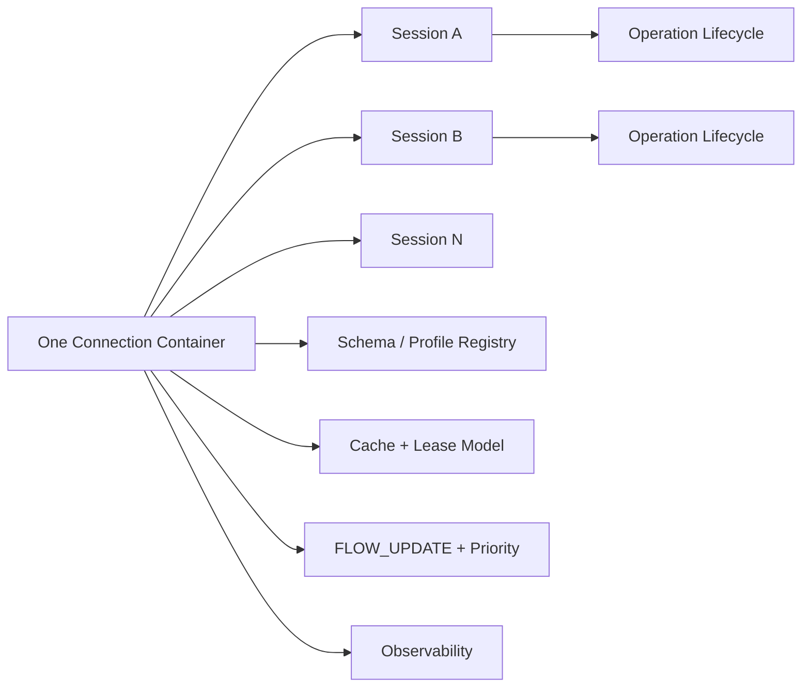

# NNRP/1-preview3 协议设计

## 1. 定位

`NNRP/1-preview3` 不是在 `NNRP/1` 这条线内继续堆叠零散能力，而是用来冻结下一阶段真正缺失的协议主题：多 session 连接容器、profile-neutral 的 schema/profile registry，以及面向 operation/workflow 的统一运行时语义。

preview3 聚焦三类协议问题：

1. 连接与会话模型：把单活 session 心智模型升级为一条连接承载多个 session、多个优先级和多个并发 operation 的统一容器。
2. 扩展与数据语义：把 typed payload、schema/profile、cache/lease 纳入同一套稳定的公共协议边界，而不是继续靠实现侧各自补充。
3. 生命周期与观测：把 operation/workflow 生命周期、流控、恢复和可观测字段冻结为跨语言一致的协议语义。

因此，本文只定义协议层边界：消息类型、fixed metadata、body layout、错误口径、状态机语义和 conformance 基线。

preview3 的正式定位是：`NNRP/1` 下一阶段的协议冻结文档，用来冻结下一阶段的公共协议语义，而不是规定某种具体实现形态。

## 1.1 总览图

这张图先把 preview3 的核心协议对象压缩到一个视图里：连接已经是多 session 容器，operation 成为显式生命周期对象，扩展方式由 schema/profile registry 控制。

## 2. preview3 明确负责的主题

`NNRP/1-preview3` 明确负责以下主题：

1. 将连接模型从 preview2 的单活 session 主心智模型升级为可承载多活 session、多优先级流和多工作流操作的统一连接容器。
2. 将 preview2 的对象缓存升级为带 lease、版本、依赖和可观测性的 AI 运行时缓存。
3. 将 typed payload 从静态枚举扩展为 schema/profile registry 驱动的可协商类型系统。
4. 将 tool delta、structured event 和多步推理结果提升为显式的 operation / workflow 运行时语义，而不是只把它们看成若干 payload frame。
5. 冻结跨语言 conformance、golden vector、错误码、descriptor 布局和状态机口径，确保不同实现消费同一份协议基线。
6. 明确流控、恢复和观测字段的公共边界，避免实现侧私设第二套运行时语义。

preview3 依然保持 preview1/preview2 的核心约束：

1. 热路径继续保持二进制、固定布局、显式长度、可直接定位。
2. 协议继续服务于实时 AI 运行时语义，而不是浏览器媒体栈或通用 RPC。
3. 协议公共层在 preview3 中保持 profile-neutral；首轮标准 profile 至少包含 `tensor` 与 `token`，不再把 tensor 单独视为默认特权 profile。

## 3. preview3 不负责的主题

preview3 明确不负责以下内容：

1. 浏览器媒体采集、回放、A/V sync、AEC、ABR、SFU/MCU 等传统媒体协议栈问题。
2. 某个具体模型或推理框架私有的 GPU 内存页布局、KV-cache page 编码或 runtime 内部线程模型。
3. 具体宿主环境的 UI / game-engine / notebook / web-framework 封装习惯。
4. 具体实现的 API 形状、句柄管理、回调/轮询驱动、打包与发布策略。
5. 把所有高层 AI 业务语义都硬编码成公共协议枚举；preview3 只定义公共运行时语义和标准扩展机制。

preview3 要避免的错误，是把“为了让不同实现都好接入”误解成“协议层必须一次性固化所有上层业务对象”。真正应冻结的是扩展边界、对象生命周期和一致性要求，而不是某个单一产品形态的高层对象树。

## 4. 设计原则

preview3 采用以下设计原则：

1. 单一协议语义源头：跨语言公共语义必须先在协议文档与 conformance 基线上冻结，不允许各实现私设。
2. 热路径零文本化：`FRAME_SUBMIT`、`RESULT_PUSH`、typed payload frame、缓存对象和 schema 描述仍坚持固定布局二进制路径，不引入 JSON/Protobuf 热路径回退。
3. 协议概念先行：多 session、优先级、cache lease、schema registry、operation lifecycle 等一旦会影响跨语言互通，就必须先成为协议概念，而不是留给单个实现私有扩展。
4. profile 与 schema 分层：公共层冻结连接、会话、缓存、预算、优先级和 operation 语义；具体 payload 结构通过 profile/schema registry 扩展，而不是不断膨胀公共枚举。
5. 单一主版本线内覆盖式演进：同一主版本内的 preview 迭代直接覆盖当前 `NNRP/1` 语义，不保留并行双轨 preview 路径。
6. 实现中立：协议只约束消息、metadata、错误口径、状态机和描述符边界，不规定具体实现形态。

## 5. 实现边界

本文只冻结协议对象、固定布局、状态机、错误码和 conformance 口径。

具体实现的 API 形状、句柄管理、回调或轮询驱动、打包和发布策略，不在本文冻结。

协议一致性测试套件本身的跨版本设计、分层结构、case 状态分类和实现接入边界，单独见 `conformance-suite` 设计文档；preview3 在本文中只声明它必须消费同一份公共 conformance 基线，不在这里重复定义整套测试框架。

## 6. NNRP/1 代码层身份与继承约束

### 6.1 代码层版本身份

preview3 作为 NNRP/1 这条线内的一份开发阶段文档，在代码层冻结的发包身份是 `NNRP/1.0`：

1. `version_major = 1`
2. `wire_format = 0`
3. ALPN `nnrp/1`

这不意味着设计阶段名不再叫 preview3，而是指 preview3 不应再引入新的 preview 专用 code-level stage byte 或 preview 专用 ALPN。preview3 的多 session、多优先级和 schema registry 等新增语义，必须通过显式协议概念和能力窗口协商表达，而不是编码成新的 preview 期版本号。

### 6.2 公共头与长度模型

preview3 继续保留 40 字节公共头与 `meta_len + body_len` 自描述长度模型。preview3 的主要演进点仍然放在：

1. metadata 表的字段语义升级；
2. control-plane 消息族的职责划分；
3. body region 的扩展能力和 typed payload / schema 绑定关系；
4. 连接与会话状态机语义。

### 6.3 已冻结主题的延续原则

preview2 中以下设计原则在 preview3 继续成立：

1. 规范 host 形态依然是 `submit pump + result pump + control path`，而不是同步 request-response。
2. `partial / stale_reuse / degraded / drop` 的区别仍必须在协议层显式保留。
3. 低频对象缓存与对象引用继续是一等公民，不回退到“稳定对象每帧全量内联”。
4. typed payload 与 extension frame 继续保留，但扩展方式不再以“继续扩 payload kind 位图”为主要路径。

## 7. preview3 连接与会话模型

### 7.1 连接级 bootstrap 与多 session 容器

preview3 将连接明确视为会话容器，而不是单活 session 的专用通道。

最小要求：

1. 一条连接允许承载多个活跃 session。
2. `CLIENT_HELLO / SERVER_HELLO_ACK` 负责连接级能力协商、鉴权、feature window、基础缓存与 schema 能力声明。
3. 新增 `SESSION_OPEN / SESSION_OPEN_ACK` 作为显式会话创建流程，用于声明 profile、schema、预算窗口、优先级类和缓存/租约要求。
4. `SESSION_PATCH / SESSION_PATCH_ACK` 继续保留为低频会话更新路径。
5. `CLOSE` 继续可用于连接级关闭；preview3 额外要求显式会话关闭语义，避免“关闭一个 session 等于关闭整条连接”的 preview1/2 习惯继续泄漏到多 session 模型中。

### 7.1A `SESSION_OPEN` / `SESSION_OPEN_ACK` fixed metadata 冻结

preview3 首轮将 `SESSION_OPEN` 与 `SESSION_OPEN_ACK` 固定为最小可实现、可扩展的会话打开元数据，而不是让实现侧私自拼装 session open body。

`SESSION_OPEN` fixed metadata 首轮固定为 48 字节：

| 字段 | 类型 | 说明 |
| --- | --- | --- |
| `requested_session_id` | `u32` | 客户端期望的 session id；`0` 表示由服务端分配 |
| `profile_id` | `u16` | 请求使用的标准或扩展 profile |
| `priority_class` | `u8` | 会话优先级类，取值见后文冻结枚举 |
| `session_flags` | `u8` | 会话级能力/行为标志 |
| `schema_id` | `u32` | 默认 schema id；无则为 `0` |
| `schema_version` | `u32` | 默认 schema version；无则为 `0` |
| `default_deadline_ms` | `u32` | 默认 operation deadline 或延迟预算 |
| `max_in_flight_operations` | `u16` | 客户端期望的最大并行 operation 数 |
| `reserved0` | `u16` | 保留，发送端清零 |
| `lease_ttl_hint_ms` | `u32` | 客户端期望的默认 lease TTL；`0` 表示未指定 |
| `resume_token_bytes` | `u32` | `resume_token_block` 长度；无则为 `0` |
| `auth_bytes` | `u32` | `auth_block` 长度；无则为 `0` |
| `session_extension_bytes` | `u32` | `session_extension_block` 长度；无则为 `0` |
| `client_session_tag` | `u64` | 客户端本地可观测 tag，用于日志与跨层关联 |

`SESSION_OPEN_ACK` fixed metadata 首轮固定为 56 字节：

| 字段 | 类型 | 说明 |
| --- | --- | --- |
| `session_id` | `u32` | 实际分配或确认后的 session id |
| `accepted_profile_id` | `u16` | 服务端接受的 profile id |
| `accepted_priority_class` | `u8` | 服务端接受后的优先级类 |
| `session_status` | `u8` | 打开结果状态 |
| `schema_id` | `u32` | 服务端确认后的默认 schema id |
| `schema_version` | `u32` | 服务端确认后的默认 schema version |
| `granted_operation_credit` | `u16` | 初始授予的 operation credit |
| `max_in_flight_operations` | `u16` | 服务端允许的最大并行 operation 数 |
| `lease_ttl_ms` | `u32` | 服务端接受后的默认 lease TTL |
| `resume_window_ms` | `u32` | 恢复窗口；无则为 `0` |
| `resume_token_bytes` | `u32` | `resume_token_block` 长度；无则为 `0` |
| `session_extension_bytes` | `u32` | `session_extension_block` 长度；无则为 `0` |
| `server_session_tag` | `u64` | 服务端本地可观测 tag |
| `route_scope_id` | `u32` | 服务端确认后的最小路由域 |
| `session_error_code` | `u32` | 若 `session_status` 非成功，返回稳定错误码 |
| `session_flags_ack` | `u32` | 服务端接受后的会话标志位 |

首轮额外约束：

1. `SESSION_OPEN` 只负责建立 session 默认上下文，不承载首个 operation 提交正文。
2. `schema_id / schema_version` 表示 session 默认 schema，而不是禁止后续 operation 覆盖。
3. 更高层的 profile 私有 session 参数仍通过 `session_extension_block` 或 schema/profile 对象扩展进入，而不是继续膨胀 fixed metadata。

### 7.1B session open 状态位与错误码冻结

preview3 首轮冻结以下 `session_flags:u8` 位定义：

| bit | 掩码 | 含义 |
| --- | --- | --- |
| 0 | `0x01` | `allow_resume`：客户端请求该 session 支持 resume token / resume window |
| 1 | `0x02` | `allow_background_results`：允许后台结果/事件泵在 submit 调用之外持续投递 |
| 2 | `0x04` | `allow_cache_leases`：允许该 session 创建或续租 cache/schema lease |
| 3 | `0x08` | `allow_schema_override`：允许 operation 级覆盖 session 默认 schema |
| 4-7 | 保留 | 发送端清零，接收端收到非零保留位必须拒绝 |

preview3 首轮冻结以下 `session_status:u8` 枚举值：

| 值 | 名称 | 含义 |
| --- | --- | --- |
| `0` | `opened` | session 成功建立 |
| `1` | `rejected` | 服务端拒绝建立该 session |
| `2` | `retry_later` | 当前无法建立，可按 `retry/reuse` 相关策略稍后重试 |
| `3` | `resumed` | 该 session 以恢复模式建立成功 |

preview3 首轮冻结以下 `session_flags_ack:u32` 位定义：

| bit | 掩码 | 含义 |
| --- | --- | --- |
| 0 | `0x00000001` | `resume_enabled`：服务端允许 resume |
| 1 | `0x00000002` | `background_results_enabled`：服务端允许后台结果/事件泵 |
| 2 | `0x00000004` | `cache_leases_enabled`：服务端允许 cache/schema lease |
| 3 | `0x00000008` | `schema_override_enabled`：服务端允许 operation 级 schema 覆盖 |
| 4 | `0x00000010` | `priority_downgraded`：服务端降低了请求优先级 |
| 5-31 | 保留 | 发送端清零，接收端收到未知置位必须拒绝 |

preview3 首轮冻结以下 `session_error_code:u32` 族：

| 值 | 名称 | 含义 |
| --- | --- | --- |
| `0x00000000` | `none` | 无错误 |
| `0x00010001` | `auth_failed` | 鉴权失败 |
| `0x00010002` | `profile_unsupported` | 请求的 profile 不被支持 |
| `0x00010003` | `schema_unsupported` | 请求的 schema 或版本不被支持 |
| `0x00010004` | `priority_rejected` | 请求的 priority class 不被允许 |
| `0x00010005` | `lease_policy_rejected` | 请求的 lease 策略不被允许 |
| `0x00010006` | `resume_rejected` | 请求的恢复模式或 token 不被允许 |
| `0x00010007` | `session_limit_reached` | 当前连接或服务端的 session 上限已满 |

首轮约束：

1. `session_error_code` 只在 `session_status != opened` 或存在降级/恢复相关异常时返回非零值。
2. `session_flags_ack` 只能确认或降级客户端请求，不能私设未请求的新能力。
3. 后续若要扩展该错误码族，必须按高位 family 预留策略继续扩展，不得重排已冻结值。

### 7.1C `SESSION_CLOSE` / `SESSION_CLOSE_ACK` 与最小路由字段冻结

preview3 首轮将 session close 冻结为标准控制消息对，而不再复用 connection `CLOSE` 的隐含习惯。

`SESSION_CLOSE` fixed metadata 首轮固定为 24 字节：

| 字段 | 类型 | 说明 |
| --- | --- | --- |
| `close_reason` | `u16` | 关闭原因，取值见下文冻结枚举 |
| `in_flight_policy` | `u8` | 对现有 in-flight operation 的处理策略 |
| `reserved0` | `u8` | 保留，发送端清零 |
| `drain_timeout_ms` | `u32` | 允许排空现有 operation 的超时窗口；`0` 表示立即应用策略 |
| `last_operation_id` | `u64` | 发送端最后确认的 operation 水位；无则为 `0` |
| `session_error_code` | `u32` | 若因错误关闭 session，则返回稳定错误码；否则为 `0` |
| `session_close_tag` | `u32` | 本地可观测关闭关联标识 |

`SESSION_CLOSE_ACK` fixed metadata 首轮固定为 16 字节：

| 字段 | 类型 | 说明 |
| --- | --- | --- |
| `close_status` | `u8` | 关闭确认状态，取值见下文冻结枚举 |
| `reserved0` | `u8` | 保留，发送端清零 |
| `reserved1` | `u16` | 保留，发送端清零 |
| `last_operation_id` | `u64` | 服务端确认后的 operation 水位 |
| `session_error_code` | `u32` | 若关闭过程中出现稳定错误，则返回错误码；否则为 `0` |

`close_reason:u16` 首轮冻结为：

| 值 | 名称 | 语义 |
| --- | --- | --- |
| `0` | `normal` | 正常关闭 |
| `1` | `client_shutdown` | 客户端主动关闭 |
| `2` | `server_shutdown` | 服务端主动关闭 |
| `3` | `idle_timeout` | 因空闲超时关闭 |
| `4` | `protocol_error` | 因稳定协议错误关闭 |
| `5` | `auth_revoked` | 因鉴权撤销或凭证失效关闭 |

`in_flight_policy:u8` 首轮冻结为：

| 值 | 名称 | 语义 |
| --- | --- | --- |
| `0` | `drain` | 允许现有 in-flight operation 在 `drain_timeout_ms` 内排空 |
| `1` | `abort` | 立即终止现有 in-flight operation |

`close_status:u8` 首轮冻结为：

| 值 | 名称 | 语义 |
| --- | --- | --- |
| `0` | `acknowledged` | 关闭请求已接受并开始执行 |
| `1` | `draining` | 当前仍在排空已有 operation |
| `2` | `closed` | session 已完成关闭 |
| `3` | `rejected` | 关闭请求被拒绝 |

首轮额外约束：

1. connection-scope 控制消息必须使用 `header.session_id = 0`。
2. session-scope 控制、数据、结果消息必须使用 `header.session_id = 目标 session`。
3. operation-scope 消息必须同时携带 `header.session_id` 与其固定 metadata 中的 `operation_id`。
4. `SESSION_CLOSE` 只关闭单个 session，不隐含关闭整条连接。
5. 若 `SESSION_CLOSE_ACK.close_status = draining`，发送方必须继续按已知 operation 水位处理后续终结事件，直到收到 `closed` 或更高水位的关闭确认。

### 7.2 优先级与流等级

preview3 引入显式优先级与流等级语义，用于同连接多会话和同会话多 operation 的调度。

协议层至少要能表达：

1. 会话优先级类，例如 `interactive / balanced / background`。
2. operation 优先级与 deadline 窗口。
3. 动态 credit 在会话级与连接级的双层约束。
4. 服务端对优先级降级、限流或抢占的显式回执。

preview3 不要求把具体调度算法写死成单一实现，但必须冻结这些语义对象和错误口径，避免不同实现对“背压”“抢占”“过期”的解释继续分叉。

### 7.2A 调度标准枚举冻结

preview3 首轮冻结以下标准枚举值：

`session_priority_class:u8`

| 值 | 名称 | 语义 |
| --- | --- | --- |
| `0` | `interactive` | 面向前台低时延交互，优先保证 deadline 与响应性 |
| `1` | `balanced` | 默认优先级，平衡吞吐与时延 |
| `2` | `background` | 面向后台任务或预取任务，可被更高优先级抢占 |

`operation_state:u8`

| 值 | 名称 | 语义 |
| --- | --- | --- |
| `0` | `accepted` | 已被接受并进入调度系统 |
| `1` | `running` | 已开始执行 |
| `2` | `partial` | 已产生可消费但未终结的部分结果 |
| `3` | `waiting_tool` | 等待工具或外部依赖继续执行 |
| `4` | `superseded` | 被新 operation 或新上下文替代 |
| `5` | `cancelled` | 被显式取消 |
| `6` | `failed` | 以错误终结 |
| `7` | `completed` | 正常完成 |

`cancel_scope:u8`

| 值 | 名称 | 语义 |
| --- | --- | --- |
| `0` | `operation` | 仅取消单个 operation |
| `1` | `subtree` | 取消该 operation 及其子操作树 |
| `2` | `group` | 取消同一 `operation_group_id` 下的所有 operation |
| `3` | `session` | 取消整个 session 下仍活跃的 operation |

首轮约束：

1. 所有实现都必须把这些数值视为协议枚举，而不是局部私有状态码。
2. `partial` 与 `completed` 允许在同一 operation 生命周期中先后出现；`failed / cancelled / superseded / completed` 属于终结状态。
3. `interactive` 只表达调度优先级与 credit 倾向，不保证绝对资源独占。

## 8. preview3 高级缓存模型

preview2 已经有 cache object 与 object reference；preview3 需要把它升级为可租约、可版本化、可依赖追踪的 AI 运行时缓存。

preview3 缓存模型至少包含以下能力：

1. lease：缓存对象或 schema 对象必须能声明 TTL、续租、到期策略和拥有者范围。
2. version：对象引用必须能区分 `object_id` 与 `object_version`，不再把“换内容但沿用旧 key”留给宿主私下约定。
3. dependency：对象、结果和 schema 必须能声明依赖关系，用于结果复用、缓存失效和一致性检查。
4. observability：协议层必须能表达 cache miss、lease expired、dependency invalid、schema mismatch 等稳定错误原因。
5. host-visible policy：客户端可以主动声明 prefetch、touch、lease renew、evict hint 或 result reuse 偏好。

preview3 不要求公共层直接冻结模型私有 KV-cache page 编码；这类对象仍应作为 profile-local 或 runtime-private object kind 存在。公共层负责冻结 lease contract、版本口径、依赖语义和错误行为。

### 8.1 lease / version / 错误口径冻结

preview3 首轮进一步冻结以下缓存公共口径：

1. `object_id` 表示逻辑对象身份；在对象内容更新但逻辑身份不变时保持不变。
2. `object_version` 表示同一 `object_id` 下的内容修订号；语义变化时必须单调递增。
3. `lease_id:u64` 表示一次成功租约授予的稳定身份；续租保持同一 `lease_id`，重新授予产生新的 `lease_id`。
4. `lease_owner_scope:u8` 首轮冻结为 `connection=0 / session=1 / operation=2`。
5. host-visible policy 中的 `prefetch / touch / renew / evict_hint / reuse_preference` 都是显式提示，不得被解释为绕过版本、依赖或 schema 校验的强制命令。

`cache_error_code:u32` 首轮冻结为：

| 值 | 名称 | 含义 |
| --- | --- | --- |
| `0x00030000` | `none` | 无缓存错误 |
| `0x00030001` | `cache_miss` | 请求引用的对象不存在 |
| `0x00030002` | `lease_expired` | 请求引用的租约已过期 |
| `0x00030003` | `version_mismatch` | 请求引用的 `object_version` 与当前可用版本不一致 |
| `0x00030004` | `dependency_invalid` | 依赖对象或依赖 schema 已失效 |
| `0x00030005` | `schema_mismatch` | 对象与所需 schema/profile 解释不兼容 |

首轮约束：

1. `cache_miss / lease_expired / version_mismatch / dependency_invalid / schema_mismatch` 必须在所有实现路径上保持稳定错误口径，不得被局部实现改写成私有字符串错误。
2. 结果复用若依赖某个 `object_id + object_version` 或 schema 版本，则该依赖必须进入可观测关系图；依赖失效时必须返回稳定错误码或显式失效事件。
3. runtime-private object kind 可以继续存在，但不得绕过上述 `object_id / object_version / lease_id / cache_error_code` 公共语义。

## 9. preview3 Schema / Profile Registry

preview3 不再把“继续增加 payload kind 枚举”当作主要扩展方式，而是引入标准 schema/profile registry。

设计目标：

1. 公共层不预设单一默认 profile；首轮标准 profile 至少包含 `tensor` 与 `token`，并继续允许 `structured_event`、`tool_delta`、`opaque_bytes` 等 payload family 挂到 schema/profile registry 上。
2. 具体 payload 语义通过 `schema_id + schema_version + profile_id + stream_semantics` 绑定，而不是每来一种新数据都新增一个公共 payload kind。
3. schema object 进入 cache / lease 生命周期，可预装、引用、失效和版本回退。
4. 不同实现不得各自解释 descriptor 私有字段，必须按统一 schema registry 规则处理。

preview3 因此至少需要标准化以下信息：

1. schema descriptor object 的通用头。
2. schema registry 的协商、安装、失效与版本冲突处理。
3. typed payload descriptor 中与 schema/profile 绑定相关的标准字段。
4. 未知 schema、未知 version、关键 schema 不兼容时的错误处理。

### 9.3 schema descriptor 通用头冻结

preview3 首轮将 schema descriptor 通用头固定为 32 字节，用于在不解析 profile 私有 body 的前提下完成版本、适用范围与路由判断。

| 字段 | 类型 | 说明 |
| --- | --- | --- |
| `schema_id` | `u32` | schema 标识 |
| `schema_version` | `u32` | schema 版本 |
| `profile_id` | `u16` | 该 schema 所属 profile |
| `schema_flags` | `u16` | schema 行为标志 |
| `min_version_major` | `u8` | 最低适用主版本 |
| `max_version_major` | `u8` | 最高适用主版本 |
| `reserved0` | `u16` | 保留，发送端清零 |
| `body_bytes` | `u32` | schema body 长度 |
| `dependency_count` | `u16` | 依赖 schema / object 条目数 |
| `default_stream_semantics` | `u16` | 默认 stream semantics |
| `schema_hash` | `u64` | schema body 的稳定摘要 |

首轮约束：

1. 通用头只解决“这个 schema 是谁、属于哪个 profile、适用于哪个主版本、body 多长、依赖多少对象”这类公共问题。
2. 任何 profile 私有解释字段都必须进入 schema body，不得继续膨胀通用头。
3. `schema_hash` 用于一致性校验与缓存去重，不直接替代 `schema_id + schema_version` 的逻辑身份。
4. `default_stream_semantics` 只提供默认语义；具体 payload descriptor 仍可在单帧或单 operation 上覆盖。

`schema_flags:u16` 首轮冻结以下位定义：

| bit | 掩码 | 含义 |
| --- | --- | --- |
| 0 | `0x0001` | `cacheable`：该 schema 可进入 cache / lease 生命周期 |
| 1 | `0x0002` | `critical`：未知或不兼容时必须拒绝 |
| 2 | `0x0004` | `default_bindable`：允许作为 session 默认 schema |
| 3 | `0x0008` | `hash_stable`：相同 `schema_id + schema_version` 必须与相同 `schema_hash` 绑定 |
| 4-15 | 保留 | 发送端清零，接收端收到未知置位必须拒绝 |

`stream_semantics:u16` / `default_stream_semantics:u16` 首轮冻结为：

| 值 | 名称 | 语义 |
| --- | --- | --- |
| `0` | `default` | 继承 profile/schema 默认解释 |
| `1` | `snapshot` | 当前 payload 为完整快照 |
| `2` | `append` | 当前 payload 追加到既有序列或流 |
| `3` | `replace` | 当前 payload 覆盖既有逻辑片段 |
| `4` | `event` | 当前 payload 表示离散事件语义 |
| `5` | `tool_update` | 当前 payload 表示工具调用或工具结果增量 |

### 9.1 首轮标准 profile 冻结

preview3 首轮标准 profile 先冻结为 `tensor profile` 与 `token profile`，两者在公共层并列成立。

`tensor profile` 的最小标准语义保持：

1. 面向块化或区域化数值载荷，而不是强制绑定渲染场景。
2. 允许通过 schema/profile descriptor 声明 shape、dtype、layout、section/layout 解释与覆盖语义。
3. `partial / degraded / stale_reuse` 在 tensor profile 下仍允许带 coverage 语义，但 coverage 不再是所有 profile 的默认要求。

`token profile` 的最小标准语义冻结为：

1. 面向离散 token 或 token chunk 的增量输出，不要求把 token 序列伪装成 tensor section。
2. 标准结果路径至少允许表达增量 token 片段、序列位置范围、完成状态与 stop/reason 口径。
3. token profile 首轮不强制把 logits、全量候选分布或模型私有采样状态纳入公共必选字段；这些内容只能通过 schema/profile 扩展进入。
4. token profile 的 `partial` 语义默认表示“序列尚未完成但当前 chunk 可消费”，而不是 tensor-style coverage 缺口。

### 9.2 首轮 descriptor 最小字段边界

preview3 首轮要求 typed payload descriptor 至少能稳定绑定以下公共字段：

1. `profile_id`
2. `schema_id`
3. `schema_version`
4. `stream_semantics`
5. `offset`
6. `length`
7. `flags`

在此之上，不同标准 profile 的最小语义字段边界冻结为：

1. tensor profile descriptor 必须能唯一确定 payload 的数值解释方式，包括 shape/layout 解释入口、dtype 解释入口，以及是否存在 profile-local coverage/section 语义。
2. token profile descriptor 必须能唯一确定 payload 的序列解释方式，包括 token 单位、位置/范围口径、增量/终止语义，以及 stop-reason 是否在本帧显式给出。
3. 除上述最小字段外，任何更高层 profile 私有字段都必须通过 schema/profile 扩展进入，不得把某个单一 runtime 的私有采样或张量布局字段直接抬升为公共必选字段。

### 9.2A typed payload descriptor 固定布局冻结

preview3 首轮将 typed payload descriptor 的公共布局固定为 24 字节：

| 字段 | 类型 | 说明 |
| --- | --- | --- |
| `profile_id` | `u16` | 该 payload 所属 profile |
| `descriptor_flags` | `u16` | descriptor 行为标志 |
| `schema_id` | `u32` | 解释该 payload 的 schema id |
| `schema_version` | `u32` | 解释该 payload 的 schema version |
| `stream_semantics` | `u16` | 该 payload 的流语义 |
| `reserved0` | `u16` | 保留，发送端清零 |
| `offset` | `u32` | 相对 typed payload frame region 的字节偏移 |
| `length` | `u32` | payload 字节长度 |

`descriptor_flags:u16` 首轮冻结以下位定义：

| bit | 掩码 | 含义 |
| --- | --- | --- |
| 0 | `0x0001` | `terminal`：该 payload 携带当前 profile/operation 的终止片段 |
| 1 | `0x0002` | `partial`：该 payload 为可消费但未终结的增量片段 |
| 2 | `0x0004` | `schema_override`：本 descriptor 显式覆盖 session 默认 schema |
| 3 | `0x0008` | `profile_hint_present`：profile-local 解释所需的附加 hint 存在于 schema/profile body 中 |
| 4-15 | 保留 | 发送端清零，接收端收到未知置位必须拒绝 |

首轮约束：

1. 所有标准 profile 都必须使用同一 24B descriptor 公共头，不得按语言或 profile 自行改字节布局。
2. tensor 与 token 的最小解释入口由 `profile_id + schema_id + schema_version + stream_semantics + descriptor_flags` 共同决定；更细粒度字段继续走 schema/profile body。
3. `offset / length` 一律相对 typed payload frame region 解释，不允许某个绑定改成相对整包 body 或私有子区域。
4. `terminal` 与 `partial` 可以同时为零，但不能同时表示互相冲突的终结语义；profile 私有终结细节继续由 schema/profile 解释。

这使 preview3 可以支持更多数据类型，但不需要每次都重新冻结一张不断膨胀的公共位图表。

### 9.4 schema registry 流程与错误行为冻结

preview3 首轮将 schema registry 的最小流程冻结为：

1. `install`：当 `schema_id + schema_version + schema_hash` 尚未存在时安装新 schema。
2. `update`：同一 `schema_id` 引入更高 `schema_version` 的新 schema；旧版本是否保留由 policy 决定，但不得改变已安装版本的 `schema_hash`。
3. `invalidate`：按 `schema_id + schema_version` 或依赖关系显式失效 schema。
4. `version_conflict`：若收到相同 `schema_id + schema_version` 但不同 `schema_hash`，必须拒绝并返回稳定错误。

`schema_error_code:u32` 首轮冻结为：

| 值 | 名称 | 含义 |
| --- | --- | --- |
| `0x00040000` | `none` | 无 schema 错误 |
| `0x00040001` | `schema_unknown` | 请求的 `schema_id` 不存在 |
| `0x00040002` | `schema_version_unknown` | 请求的 `schema_version` 不存在 |
| `0x00040003` | `schema_hash_conflict` | 相同 `schema_id + schema_version` 对应不同 `schema_hash` |
| `0x00040004` | `schema_incompatible` | schema 与当前 profile、主版本或关键约束不兼容 |
| `0x00040005` | `schema_dependency_missing` | schema 依赖项不存在或不可用 |
| `0x00040006` | `schema_update_rejected` | schema 更新或失效请求被策略拒绝 |

首轮约束：

1. 当 `schema_flags.critical` 置位且接收方无法识别 schema、版本或依赖时，必须返回稳定 `schema_error_code`，不得静默跳过。
2. typed payload descriptor 与 `schema_id / schema_version / profile_id` 的绑定是强约束；不得在实现侧改写为“看起来差不多就继续解析”。
3. `install / update / invalidate / version_conflict` 的标准流程必须在所有实现中保持一致；宿主封装不得私自改写冲突结果。

## 10. preview3 Agent / Workflow 运行时语义

preview2 已经能携带 `structured_event` 和 `tool_delta`；preview3 要补的是它们在运行时中的生命周期语义。

preview3 至少要表达以下对象：

1. `operation_id`：一次推理、生成、工具调用或多步工作流操作的唯一标识。
2. `parent_operation_id`：用于表达操作树、子任务和依赖链。
3. `operation_group_id`：用于一组操作的调度、取消或结果订阅。
4. `operation_state`：例如 `accepted / running / partial / waiting_tool / superseded / cancelled / failed / completed`。
5. `cancel_scope`：允许取消单 operation、子树、group 或整个 session。

这些语义的目标不是把所有 agent 框架都写成统一 DSL，而是为“多步 AI 工作流在单连接长会话中运行”提供跨语言统一的生命周期语义。

### 10.1 `structured_event` / `tool_delta` 归属冻结

preview3 首轮明确冻结以下边界：

1. `structured_event` 与 `tool_delta` 默认仍是 payload family，不自动提升为独立 profile。
2. 只有当某个事件会影响跨语言可互通的 operation lifecycle 时，它的最小语义才进入公共 operation 模型；否则仍留在 schema/profile payload 层。
3. `operation_id`、`parent_operation_id`、`operation_group_id`、`operation_state`、`cancel_scope` 属于公共 lifecycle 语义，必须可脱离具体 payload 单独解释。
4. 工具调用参数、工具结果正文、富事件负载等高层内容默认继续留在 `structured_event` / `tool_delta` payload 中，通过 schema/profile registry 解释。
5. 因此，preview3 不把工具调用正文或事件正文硬编码成公共固定 metadata；公共层只冻结 lifecycle、路由、取消和状态迁移语义。

## 11. preview3 流控、恢复与观测

preview3 需要把 preview2 的 flow control 与 migration 再向前推进一层。

至少应补齐：

1. 连接级 credit 与会话级 credit 的双层回执。
2. 优先级感知的 `FLOW_UPDATE`，允许服务端对不同 session / operation 单独调整窗口。
3. 多 session 场景下的恢复、resume token 与 `resume_from_operation` 语义。
4. 统一的 result / event / control 观测字段，使多语言宿主可稳定记录 queue、compute、transport、backpressure、cache 命中与 lease 事件。

preview3 首轮将恢复对象明确冻结为 session；frame 不是恢复对象，operation 只是 session 恢复内的水位与可观测边界。

### 11.1 `FLOW_UPDATE` 三层 scope 与 metadata 冻结

preview3 首轮将 `FLOW_UPDATE` 固定为 32 字节 fixed metadata，用于统一表达 connection、session、operation 三层 credit 与 backpressure 更新，而不是让不同实现各自定义私有 credit 包。

| 字段 | 类型 | 说明 |
| --- | --- | --- |
| `scope_kind` | `u8` | 更新作用域，取值见下文冻结枚举 |
| `update_reason` | `u8` | 更新原因，取值见下文冻结枚举 |
| `backpressure_level` | `u8` | 当前背压等级，取值见下文冻结枚举 |
| `reserved0` | `u8` | 保留，发送端清零 |
| `connection_credit` | `u16` | 连接级可并发 credit |
| `session_credit` | `u16` | 会话级可并发 credit |
| `operation_credit` | `u16` | operation 级可并发 credit |
| `reserved1` | `u16` | 保留，发送端清零 |
| `operation_id` | `u64` | 当 `scope_kind=operation` 时指向目标 operation；否则为 `0` |
| `retry_after_ms` | `u32` | 建议重试或重新探测窗口；无则为 `0` |
| `credit_epoch` | `u32` | 单调递增的 credit 更新代号 |
| `flow_flags` | `u32` | flow-control 行为位图 |

`scope_kind:u8` 首轮冻结为：

| 值 | 名称 | 语义 |
| --- | --- | --- |
| `0` | `connection` | 更新整条连接的总 credit 或总背压状态 |
| `1` | `session` | 更新某个 session 的 credit 或背压状态 |
| `2` | `operation` | 更新某个 operation 的 credit 或背压状态 |

`update_reason:u8` 首轮冻结为：

| 值 | 名称 | 语义 |
| --- | --- | --- |
| `0` | `grant` | 新授予 credit 或放宽限制 |
| `1` | `reduce` | 收紧 credit 窗口 |
| `2` | `pause` | 暂停继续发送新操作 |
| `3` | `resume` | 从暂停状态恢复 |
| `4` | `congestion` | 因拥塞进入限流或背压状态 |

`backpressure_level:u8` 首轮冻结为：

| 值 | 名称 | 语义 |
| --- | --- | --- |
| `0` | `none` | 无背压 |
| `1` | `soft` | 建议发送方主动降速，但不强制停止 |
| `2` | `hard` | 发送方应停止提交新 operation，直到收到后续放宽更新 |

`flow_flags:u32` 首轮冻结以下位定义：

| bit | 掩码 | 含义 |
| --- | --- | --- |
| 0 | `0x00000001` | `credit_valid`：对应 scope 的 credit 字段有效 |
| 1 | `0x00000002` | `retry_after_valid`：`retry_after_ms` 有效 |
| 2 | `0x00000004` | `background_only`：只允许后台或低优先级 operation 继续推进 |
| 3 | `0x00000008` | `drain_in_flight_only`：仅允许现有 in-flight operation 排空，不再接受新 operation |
| 4-31 | 保留 | 发送端清零，接收端收到未知置位必须拒绝 |

首轮约束：

1. `scope_kind=connection` 时，header `session_id` 必须为 `0`，`operation_id` 必须为 `0`；发送方只读取 `connection_credit`。
2. `scope_kind=session` 时，header `session_id` 必须为目标 session，`operation_id` 必须为 `0`；发送方优先读取 `session_credit`。
3. `scope_kind=operation` 时，header `session_id` 必须为目标 session，`operation_id` 必须非零；发送方优先读取 `operation_credit`。
4. `credit_epoch` 必须在同一 scope 上单调递增；接收方不得接受比当前 epoch 更旧的 update。
5. `hard` 背压不是错误，它表示新的提交窗口被临时收紧；发送方应等待后续 `grant / resume` 或更高 epoch 的 `FLOW_UPDATE`。
6. 该 fixed metadata 只解决统一 credit/backpressure 路由和控制，不承载 profile 私有排队指标；更细粒度可观测数据仍应通过 schema/profile 或专用 observability 路径扩展。

### 11.2 恢复对象与 `resume_from_operation` 语义冻结

preview3 首轮冻结以下恢复语义：

1. `resume_token` 始终绑定到 session，而不是 connection 或 frame。
2. `resume_from_operation_id` 是 session 恢复内的可选水位，用于声明“从哪个 operation 之后重新同步终结结果与事件”。
3. 成功恢复时，`SESSION_OPEN_ACK.session_status` 必须返回 `resumed`，且服务端必须以恢复后的 session 继续投递未完成或未确认的 operation 生命周期事件。
4. 若 `resume_token` 无效、过期、越权或与请求的 profile/schema/session 能力不兼容，服务端必须返回 `session_error_code = resume_rejected`。
5. 恢复不得把历史 frame 视为独立恢复对象；任何 frame 级或单包级补偿都必须从属于 session 恢复语义。

## 12. 协议冻结摘要

本文档当前冻结的是以下协议主题：

1. `NNRP/1.0` 代码层身份、40B 公共头和 `meta_len + body_len` 长度模型。
2. 连接/会话/operation 的分层边界，以及 `SESSION_OPEN / SESSION_OPEN_ACK`、显式 session close、恢复对象与路由字段语义。
3. `FLOW_UPDATE`、优先级、取消范围、operation 生命周期和恢复水位等运行时语义。
4. cache lease、schema/profile registry、32B schema descriptor、24B typed payload descriptor 及其标准错误口径。
5. `structured_event` / `tool_delta` 与公共 lifecycle 语义之间的边界，以及跨语言 conformance、golden vector、枚举值和错误码基线。

具体实现的 API 形状、打包和发布策略，不属于本文冻结范围。