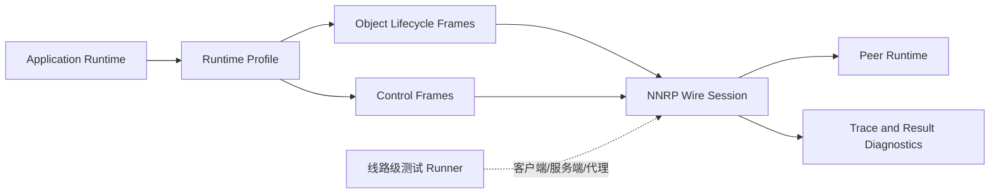
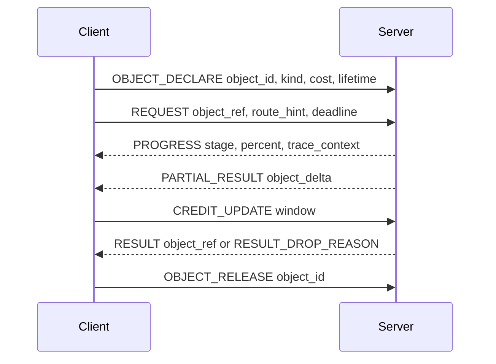

# NNRP/1-preview4 设计：Runtime Object 与控制协议

NNRP/1-preview3 证明了 SDK 可以共享 Rust 侧协议产物，并发出一致的 preview 包。但它没有证明所有场景都能通过替换
HTTP 或 SSE 获得收益。因此 preview4 的重心从“替换传输层”转向“运行时对象效率”：避免大型或快速变化的运行时状态反复退化为
JSON 解析，把调度决策显式化，并让一致性测试套件能在线路层验证协议语义。

## 定位

Preview4 面向协议边界确实承载运行时状态的场景：

- AI Coding Agent 中的 subagent 调度、工具调用、artifact 流和多模态上下文。
- 神经渲染或 runtime 服务中的部分结果、deadline、丢弃原因与分段 trace。
- adapter 生态中，即使模型计算路径占主导，也不能因为推理引擎不支持 NNRP 卡住业务接入。

它不是在宣称 token streaming、vLLM chat completions 或 cache lookup 会自动快过成熟 HTTP 路径。Cache 只是对象生命周期工具之一，不是核心承诺。

## 架构

Preview4 保留 preview3 建立的粗粒度 FFI 与运行时边界。新增的是这些边界之上的协议语义，而不是把边界调用拆成更多细碎字段级调用。

## Runtime Object 生命周期

重载荷应该可以被命名、引用、增量更新和释放。面向小响应的 token JSON profile 仍然有效，但它不能成为 tensor、图像区域、工具
artifact 或可复用上下文的唯一表示。

## 控制帧族

| 帧族 | 作用 |
| --- | --- |
| `CANCEL` / `ABORT` | 停止过期任务。`CANCEL` 是协作式取消；`ABORT` 允许在结果已经无用时硬中断。 |
| `SUPERSEDE` | 用新操作替代旧操作，同时保留 trace 连续性。 |
| `PRIORITY_UPDATE` | 入队后动态调整优先级，让紧急任务可以越过过期任务。 |
| `DEADLINE` / `EXPIRE_AT` | 声明任务何时失效，过期后可以直接丢弃。 |
| `PROGRESS` / `PARTIAL_RESULT` | 在最终结果前返回可用进度与部分 artifact。 |
| `BACKPRESSURE` / `CREDIT_UPDATE` | 让任一侧调整发送窗口，不需要额外发明限流通道。 |
| `CAPABILITY_NEGOTIATION` | 不只声明支持，还要声明成本、偏好、限制与降级行为。 |
| `ROUTE_HINT` / `EXECUTION_HINT` | 为 subagent 和 runtime 调度携带提示，避免再套很重的 JSON 或 protobuf。 |
| `CACHE_REFERENCE` / `CACHE_MISS` / `CACHE_INVALIDATE` | 在确实能复用的场景里正式化缓存引用与失效，不假设所有画面或 prompt 都适合缓存。 |
| `TRACE_CONTEXT` | 跨帧携带 E2E 分段计时与关联 ID。 |
| `RESULT_DROP_REASON` | 解释结果为什么被丢弃，例如 deadline 过期、被新请求替代、背压或对端取消。 |
| `DEGRADE_PROFILE` | 首选 profile 不可用或成本过高时协商更便宜的 profile。 |
| `BUDGET_UPDATE` | 在会话中更新 compute、token、memory 或 bandwidth 预算。 |
| `ERROR_RECOVERABLE` / `RETRY_AFTER` | 区分可重试压力与终止失败。 |

## Profile 扩展

Preview4 应先补 profile 族，而不是把所有场景塞进 token stream profile：

- `runtime.control`：控制帧、deadline、priority、progress、backpressure、trace 与 drop reason。
- `runtime.object`：对象声明、对象引用、delta、release 与成本元数据。
- `coding.agent`：subagent 路由、工具调用 artifact、执行提示与取消策略。
- `multimodal.artifact`：图像、音频、视频、工具 artifact 的类型化描述符与部分结果通道。
- `render.runtime`：帧 deadline、局部区域结果、drop reason 与 trace stage。
- `cache.reference`：适合复用的场景下的 cache reference、miss、invalidate 与 lease。

## 线路级一致性测试

Preview4 的一致性测试必须引入主动线路级 runner。SDK adapter 测试仍然有价值，但 adapter 由实现自己维护，容易把语义漂移藏在本地调用里。

线路级 runner 可以：

- 扮演 NNRP 客户端，连接到实现侧服务端；
- 扮演 NNRP 服务端，接受实现侧客户端；
- 扮演代理，注入帧顺序、超时、背压与关闭行为；
- 断言帧级事件、终止状态、trace 传播与 drop reason。

这样可以在上层 SDK 或 adapter 掩盖问题之前，直接观察语义兼容性。

## 非目标

- 不用额外 wrapper 去“优化”同一条 HTTP/SSE vLLM chat completion 路径。
- 不在没有实测复用的动态画面或 prompt 上承诺 cache 收益。
- 不把粗粒度 Rust FFI 拆成大量细碎边界调用。
- 不让 transport 或 profile 包变成隐藏实现上的空开关。

## 退出标准

- 协议文档中存在 runtime control 与 runtime object profile 基线。
- 线路级一致性测试的 schema、target manifest、execution plan 与 result report 都存在。
- 低代码一致性测试生成器能生成 wire target manifest。
- 至少一个 SDK/runtime 可以被 wire runner 测试，而不是用自己的 adapter 充当语义 oracle。
