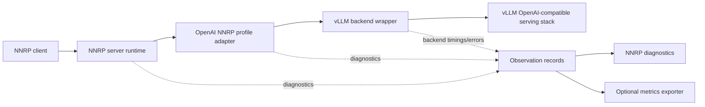
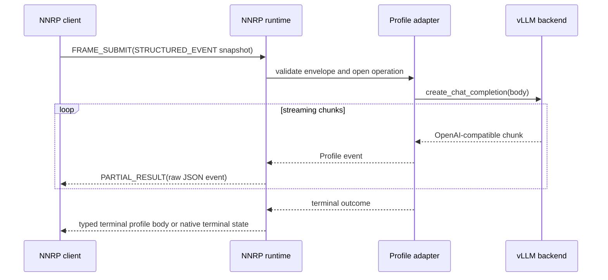
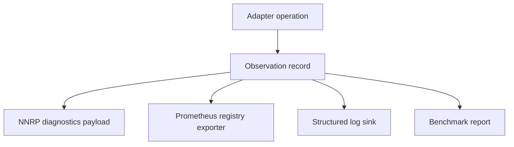

# vLLM NNRP Adapter 设计

## 1. 定位

vLLM NNRP adapter 是 `openai-compatible/1` API Profile 的第一个具体实现目标。

这个 adapter 不创建另一个 OpenAI HTTP server。它把 vLLM 的 OpenAI 兼容 serving surface 绑定到 NNRP
session、frame submit、result stream、cancel、diagnostics 和 profile-level conformance 上。

它的定位不是提升 vLLM token generation 性能。对普通 chat completion 流量来说，端到端耗时主要由
vLLM 生成阶段主导，adapter 首先要证明的是 compatibility、conformance 和 operational parity。它的战略意义
是避免后续业务在使用 NNRP 解决 heavy transport 场景时，被“推理引擎服务端不支持 NNRP”这件事卡住；这些场景
包括 AI Coding subagent、tool orchestration、多模态 payload 交换、大张量或大数据传输，以及
scheduler-to-runtime 协调。

Adapter 必须保留三条边界：

1. **NNRP runtime 边界**：NNRP 负责 session lifecycle、flow control、cancellation、result push、
   transport probing 和 diagnostics delivery。
2. **OpenAI 兼容 API 边界**：`openai-compatible/1` Profile 负责 request envelope、
   operation name、streaming event shape、error body、usage event 和 capability document。
3. **vLLM backend 边界**：vLLM 负责 model loading、token generation、batching、scheduling、model
   policy、tokenizer behavior 和 backend-specific limit。



## 2. 支持版本线

第一条支持线如下：

| 字段             | 值                            |
| ---------------- | ----------------------------- |
| 声明的 vLLM 范围 | `vllm>=0.18.0,<0.27`          |
| 旧版兼容锚点     | `0.18.1`                      |
| 过渡兼容锚点     | `0.22.1`                      |
| 当前兼容锚点     | `0.26.0`                      |
| Profile baseline | `openai-compatible/1` Level 1 |

声明的依赖范围只是允许安装的版本区间，不代表其中每一条 vLLM minor line 都已得到支持。运行时只有
在已安装版本与 serving object 必需能力都通过验证后，才会选择 `0.18.x`、`0.22.x` 或 `0.26.x`
对应的具名兼容 binding。其他 minor line 必须在启动时失败，诊断中包含检测到的版本、缺失能力（如有）和
已测试锚点。

`0.18.0` 保留为可安装版本，因为它是当前区间的起点。`0.18.1`、`0.22.1` 和 `0.26.0` 是精确的 GPU smoke
锚点；这些 minor family 的后续 patch 仍必须通过相同的运行时能力探测。

## 3. 实现切片

第一版只实现 Level 1：

1. `chat.completions.create` request envelope。
2. Streaming text delta。
3. Non-streaming completion body。
4. Cancellation 和 timeout 映射。
5. OpenAI 兼容 error body。
6. Usage summary event。
7. 当 vLLM 与所选模型暴露 tool-call data 时，透传 tool-call event。
8. 为 SDK feature probe 和 conformance selection 生成 capability document。

Level 2 `responses.create` 与 Level 3 `models.list` / `embeddings.create` 是后续能力。只有在 adapter
具备真实行为和对应 conformance recipe 后，才能声明这些 capability。

## 4. 模块设计

| 模块            | 职责                                                                                                            |
| --------------- | --------------------------------------------------------------------------------------------------------------- |
| `profile`       | 冻结 Profile 常量、request envelope validation、event builder、capability document helper。                     |
| `adapter`       | Profile-level async request handler，把 backend response 映射成 profile event。                                 |
| `vllm_backend`  | vLLM serving-object wrapper、method probing、streaming chunk normalization 和 backend error mapping。           |
| `nnrp_server`   | NNRP server/session binding、frame submit handling、result push emission、cancellation 和 diagnostics routing。 |
| `conformance`   | 面向 suite-owned API profile recipe 的 adapter command entry point。                                            |
| `benchmark`     | Throughput、latency、cancellation 和 backend overhead measurement。                                             |
| `observability` | 共享 observation record、diagnostics builder 和可选 metrics exporter。                                          |

Adapter package 应把 vLLM 保持为 optional runtime extra。普通 lint、type check、package build 和
profile mapping test 必须能在不安装 GPU serving 环境的情况下运行。

## 5. vLLM 接入方式

生产路径应是显式 package integration，而不是自动修改进程。

```mermaid
flowchart TD
  install[pip install vllm-nnrp-adapter[vllm]]
  config[Adapter config or CLI entrypoint]
  plugin[vLLM plugin registration when stable]
  serving[vLLM serving object]
  adapter[vLLM NNRP adapter]

  install --> config
  config --> adapter
  plugin --> adapter
  adapter --> serving
```

接入优先级：

1. **显式 package / CLI / config entrypoint**：默认路径。用户安装 adapter，并明确启用 NNRP serving。
2. **vLLM plugin registration**：当所选 vLLM 版本暴露稳定 plugin discovery path 时支持。
3. **Monkeypatch path**：只保留给调度中心实验或紧急兼容，不作为默认 adapter 架构。
4. **`.pth` auto-injection**：不是默认路径。它过于隐式，只能作为单独文档化的部署模式考虑。

Adapter 必须能从 Python import state 和进程配置里被调试。隐藏启动期 mutation 不允许进入 release
path。

## 6. 请求流程

1. NNRP client 使用 Profile 冻结的 Preview4 typed-payload wire 映射提交
   `openai-compatible/1` request envelope。
2. NNRP server binding 校验 envelope，并打开 adapter operation context。
3. Profile adapter 根据 capability document 检查 operation support。
4. vLLM backend wrapper 调用所选 vLLM serving method。
5. Streaming chunk 被转换成 profile event。
6. NNRP runtime 以有序 result payload 推送这些 event。
7. Completion、cancellation 或 error state 关闭 operation context。

Adapter 不得把 NNRP 特有 policy 偷塞进 OpenAI 兼容 `body`
object。Timeout、diagnostics、cache、transport 和 cancellation policy 应保留在 envelope 或 NNRP
runtime metadata 中。



## 7. Streaming Event 映射

| vLLM / OpenAI 兼容 chunk             | Profile event                |
| ------------------------------------ | ---------------------------- |
| `choices[].delta.content`            | `response.output_text.delta` |
| `choices[].delta.tool_calls[]`       | `response.tool_call.delta`   |
| `usage`                              | `response.usage`             |
| final non-streaming body             | `response.completed`         |
| invalid request or backend rejection | `response.error`             |
| observed cancellation                | `response.cancelled`         |

Adapter 可以在 `openai_chunk` 中附带原始 OpenAI 兼容 streaming chunk，但普通消费者不得依赖这个字段。

## 8. Observability 与 Metrics

Adapter 不应默认打开 HTTP `/metrics` endpoint。vLLM 部署通常已经有 metrics server、sidecar exporter
或第三方 exporter，adapter 不应悄悄占用另一个端口。

Adapter 应拥有 observation record 和可选 exporter。



Observation record 应包含：

1. selected model id
2. selected operation
3. 可用时的 NNRP connection、session、operation 和 frame identifiers
4. 可用时的 queue delay
5. first event latency
6. output event count
7. backend error family
8. cancellation reason
9. selected transport
10. 可用时的 backend timing 和 token usage

Diagnostics 支持扩展。除非 client 显式选择 adapter-specific schema，否则未知 diagnostic
字段必须被忽略。

Metrics export 规则：

1. 默认 package 暴露 collector 和 observation record，而不是绑定好的 HTTP server。
2. Prometheus exporter 可以把 metrics 注册到已有 registry。
3. 独立 `/metrics` server 是 opt-in deployment behavior。
4. NNRP diagnostics 和导出的 metrics 应来自同一份 observation record，避免口径分裂。
5. 一致性测试可以验证 diagnostic shape，但 metrics 属于 release diagnostics 和 benchmark
   material，不是正确性 gate。

### 8.1 Trace 传播边界

`TRACE_CONTEXT` 始终属于 NNRP runtime metadata；adapter 不得把它复制进 OpenAI request body。
Adapter 在 operation observation 中记录完整的固定 metadata，但对 attribute body 只记录字节数。
不透明 trace attributes 不得进入日志，也不得被转换成 HTTP headers。

当选中的 vLLM engine-direct binding 接受 W3C trace headers 时，adapter 把符合条件的 NNRP
trace context 转换为唯一的 `traceparent` 值：

```text
00-0000000000000000{trace_id:016x}-{span_id:016x}-{trace_flags:02x}
```

转换规则冻结如下：

1. `trace_id` 和 `span_id` 都必须非零；否则 context 仍进入观测记录，但不传播给 vLLM。
2. 64 位 NNRP `trace_id` 零扩展到 128 位 W3C trace id 的低 64 位。
3. NNRP `span_id` 作为 vLLM 创建的子 span 的 W3C parent id。
4. NNRP flags 的 bit `0` 映射为 W3C sampled flag bit `0`；NNRP error flag bit `1` 只保留在
   observation metadata 中，不改变 W3C trace flags。
5. `parent_span_id`、`stage_code` 和不透明 attribute body 继续作为 NNRP observation metadata。
   Adapter 不根据它们合成 `tracestate`。

Session-scoped context 是它到达后新 admission operation 的默认值。Operation-scoped context 只有在
backend dispatch 前、且关联 active submit frame 时才替换默认值。Backend dispatch 后到达的 context
仍更新 operation observation，但 adapter 不得修改已在执行的 vLLM request trace headers。不接受
`trace_headers` 的 binding 保留相同 observation 行为，不接收合成 request 字段，也不得回退到 HTTP。

## 9. Cancellation 与 Diagnostics

Cancellation 从 NNRP frame cancellation 映射到 active vLLM request path。如果 vLLM 无法立刻
abort，adapter 仍然必须停止为已取消的 NNRP operation 继续发送迟到 result event。

Cancellation diagnostics 应包含 cancellation source、reason、operation id，以及 backend 是否接受
abort。

## 10. API Profile 一致性测试

OpenAI 兼容 provider 经常扩展或调整 OpenAI HTTP API。因此 adapter conformance layer 验证的是
NNRP API Profile 语义，而不是完整复刻 OpenAI HTTP 行为。

一致性测试形态与 SDK adapter 一致性测试类似：adapter 通过 manifest 声明 capability，suite 根据
capability 选择可读 recipe。

### 10.1 能力声明（Capability Manifest）

每个 adapter 提供一个 manifest：

```json
{
  "adapter": "vllm-nnrp-adapter",
  "profile": "openai-compatible",
  "schema_version": "openai-compatible/1",
  "compatibility_levels": [1],
  "operations": [
    {
      "name": "chat.completions.create",
      "streaming": true,
      "non_streaming": true,
      "tool_calls": true
    }
  ],
  "extensions": [
    {
      "name": "vllm.diagnostics",
      "critical": false
    }
  ]
}
```

对于不实现此 Profile 的仓库，这个 manifest 是可选的。对于希望 conformance suite 运行 OpenAI NNRP API
测试的仓库，这个 manifest 是必需的。

### 10.2 Recipe Source

Recipe 是参数化且可读的：

```json
{
  "id": "openai-compatible.chat.streaming-text",
  "profile": "openai-compatible",
  "schema_version": "openai-compatible/1",
  "operation": "chat.completions.create",
  "request": {
    "body": {
      "model": "${MODEL_ID}",
      "messages": [
        { "role": "user", "content": "Say hello." }
      ],
      "stream": true
    }
  },
  "expect": {
    "events": [
      { "type": "response.output_text.delta" },
      { "type": "response.usage", "optional": true },
      { "type": "response.completed", "optional": true }
    ],
    "terminal": "success"
  }
}
```

Suite 可以把 recipe 编译成机器可执行 plan，但 recipe 本身仍然是事实源。

### 10.3 Extension Rules

允许 provider-specific field，但必须遵守：

1. 标准 request 和 event 字段保持 Profile 定义的含义。
2. Extension field 在 manifest 中声明。
3. Non-critical extension field 可被 client 和测试忽略。
4. Critical extension 需要显式 test selection。
5. Extension behavior 不得成为 Level 1 baseline 成功的必要条件。

这样既给 provider 留出模型特化空间，也不允许 custom field 污染共享 Profile 契约。

### 10.4 Required Level 1 Cases

Level 1 conformance 应覆盖：

1. valid streaming chat request
2. valid non-streaming chat request
3. invalid body rejection
4. unsupported operation rejection
5. usage summary shape
6. text delta event ordering
7. advertised tool-call delta pass-through
8. cancellation behavior
9. backend error mapping
10. capability document validation

## 11. Benchmark 策略

Benchmark 必须把 adapter overhead 与模型生成耗时拆开，也不能把 Level 1 包装成 vLLM 原始性能优化。
Long-context chat completion 测试是 release-readiness baseline：它证明 adapter 在真实 vLLM 负载下保留
OpenAI 兼容 streaming behavior、cancellation、diagnostics，并与 HTTP/SSE 路径保持可接受 parity。

| Benchmark                 | 用途                                                            |
| ------------------------- | --------------------------------------------------------------- |
| Profile mapper throughput | 测量不含 vLLM generation 的 request/event mapping overhead。    |
| Streaming event latency   | 测量 backend chunk 到 NNRP result push 的 p50/p95 delay。       |
| Cancellation latency      | 测量 cancellation request 到 adapter stop-emitting 的 latency。 |
| End-to-end vLLM smoke     | 确认真实 vLLM 集成仍然输出 Profile event sequence。             |

首版发布前必须记录 baseline 结果。如果 HTTP/SSE 路径在 token streaming 上更快或大致持平，这本身不代表
NNRP 叙事失败；它代表 benchmark 主要被模型执行耗时主导，而不是 transport 主导。真正的 heavy-transport
NNRP 性能叙事应落到后续 Profile 与 preview4 协议工作，包括显式 control frame、typed/binary payload path，
以及减少 token-profile JSON 形态开销。

## 12. Release Gate

Adapter 只有满足以下条件才可以发布：

1. Level 1 adapter behavior 已实现。
2. API profile conformance recipe 通过。
3. Benchmark baseline 已记录。
4. vLLM lower-bound 与 current-line smoke test 已记录。
5. README 与安装文档说明 vLLM 版本线和 optional dependency model。
