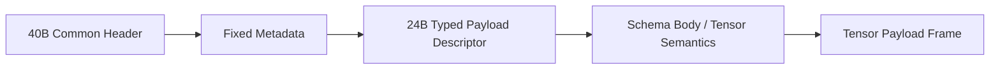

---
prev:
  text: 类型化载荷描述符
  link: /zh/typed-payload-descriptor/
next:
  text: Tensor Descriptor 公共头
  link: /zh/profiles/tensor/descriptor-header/
---

# Tensor Profile

Tensor profile 面向数值块、区域化载荷和需要结构化数值解释的实时结果。

## 适用场景

1. 实时增强渲染。
2. 图像或视频增强中的数值块返回。
3. 需要 shape、layout、dtype 共同解释的结构化数值结果。

## 阅读方式

1. 先看 [Descriptor 公共头](./descriptor-header)，理解 `profile_id / schema_id / stream_semantics / offset / length` 这类跨 profile 共享入口。
2. 再看 [Schema 与 Body](./schema-body)，理解 tensor profile 自己补充了哪些解释字段。
3. 最后看 [Payload Frame](./payload-frame)，理解真实二进制数值载荷如何被 descriptor 和 body 锚定。

## 报文设计骨架



## Mock Dump 示例

下面的代码块不是精确 wire dump，也不是正式协议语法。这里使用 JSON 风格 mock dump，只是为了让结构更容易读，也方便你把 overview 和后面的子页对起来看。

```json
{
  "message_type": "RESULT_PUSH",
  "common_header": {
    "version_major": 1,
    "wire_format": 0,
    "msg_type": "RESULT_PUSH",
    "header_len": 40,
    "meta_len": 32,
    "body_len": 80,
    "session_id": "0x00000012",
    "frame_id": "0x0000048a",
    "view_id": "0x00000007",
    "route_id": "0x00000002",
    "trace_id": "0x4f9c9b31b26d40d2"
  },
  "fixed_metadata": {
    "result_status": "partial",
    "flow_scope": "operation",
    "flow_credit_delta": 2
  },
  "typed_payload_descriptor": {
    "profile_id": "tensor",
    "schema_id": "im.render.tile.v1",
    "schema_version": 1,
    "stream_semantics": "region_partial",
    "offset": 0,
    "length": 3145728,
    "descriptor_flags": ["degraded_allowed", "coverage_present"]
  },
  "profile_body": {
    "tensor": {
      "dtype": "f16",
      "shape": [1, 3, 512, 512],
      "layout": "nchw",
      "coverage": {
        "tile_x": 12,
        "tile_y": 7,
        "width": 512,
        "height": 512
      }
    }
  },
  "payload_frame": {
    "tensor_chunk": "<1536 KiB binary tensor payload>"
  }
}
```

## 使用者最关心的语义

1. `partial` 表示当前数值结果已经可消费，但还没走到完整终态。
2. `degraded` 表示结果仍可消费，但质量、精度或来源发生了退化。
3. `stale_reuse` 表示结果来自旧上下文复用，而不是最新一次完整计算。

## 工程上要避免的误区

1. 不要假设所有 tensor 结果都必须带渲染 tile 语义。
2. 不要把 shape、layout、dtype 私自塞回公共头。
3. 不要把 tensor profile 误当成 NNRP 唯一主线 profile。