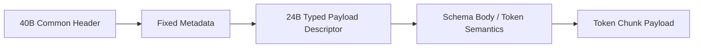

---
prev:
  text: Tensor Payload Frame
  link: /zh/profiles/tensor/payload-frame/
next:
  text: Token Descriptor 公共头
  link: /zh/profiles/token/descriptor-header/
---

# Token Profile

Token profile 面向离散 token 或 token chunk 的增量输出。

## 适用场景

1. AI NPC 对话。
2. AI Coding 多 Agent 协作中的流式文本或工具结果说明。
3. 实时交互式代理返回的文本增量。

## 阅读方式

1. 先看 [Descriptor 公共头](./descriptor-header)，理解 token 序列怎么被 profile、schema 和 chunk 偏移锚定。
2. 再看 [Schema 与 Body](./schema-body)，理解 token 单位、位置范围、终止语义和 stop reason。
3. 最后看 [Payload Frame](./payload-frame)，理解真正的 token chunk 在 wire 上是什么样子。

## 报文设计骨架



## Mock Dump 示例

下面同样使用 JSON 风格 mock dump 做结构示意。重点不是某个字节偏移，而是让你看到 token profile 如何把公共头、descriptor、序列语义和 token chunk 接在一起。

```json
{
  "message_type": "RESULT_PUSH",
  "common_header": {
    "version_major": 1,
    "wire_format": 0,
    "msg_type": "RESULT_PUSH",
    "header_len": 40,
    "meta_len": 24,
    "body_len": 96,
    "session_id": "0x00000034",
    "frame_id": "0x00000c21",
    "view_id": "0x00000000",
    "route_id": "0x00000009",
    "trace_id": "0x8e6a6e6db54a11af"
  },
  "fixed_metadata": {
    "result_status": "partial",
    "flow_scope": "session",
    "flow_credit_delta": 1
  },
  "typed_payload_descriptor": {
    "profile_id": "token",
    "schema_id": "llm.chat.delta.v1",
    "schema_version": 1,
    "stream_semantics": "ordered_incremental",
    "offset": 128,
    "length": 36,
    "descriptor_flags": ["stop_reason_present"]
  },
  "profile_body": {
    "token": {
      "token_unit": "bpe",
      "sequence_start": 128,
      "sequence_end": 136,
      "terminal": false,
      "stop_reason": "none"
    }
  },
  "payload_frame": {
    "token_chunk": " and then retries over TCP"
  }
}
```

## 使用者最关心的语义

1. `partial` 表示当前 token chunk 已可消费，但序列尚未结束。
2. `terminal` 表示本次 operation 或该 profile 下的输出已经到达终止点。
3. stop reason 是否显式给出，取决于 schema 与 profile 解释，而不是公共头硬编码。

## 工程上要避免的误区

1. 不要把 token 流伪装成 tensor section。
2. 不要假设 logits、候选分布和采样状态一定属于公共必选字段。
3. 不要把“文本流”误解成 token profile 的唯一形态；它本质上描述的是离散序列增量语义。