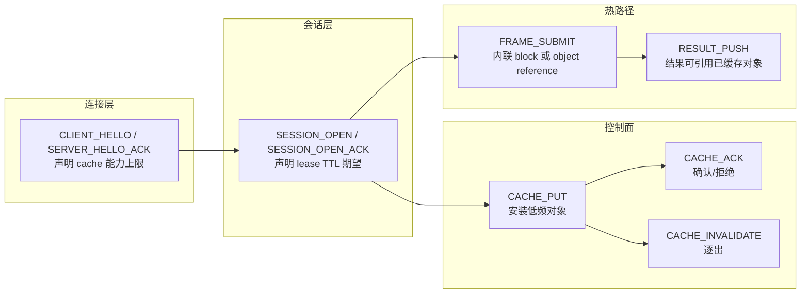
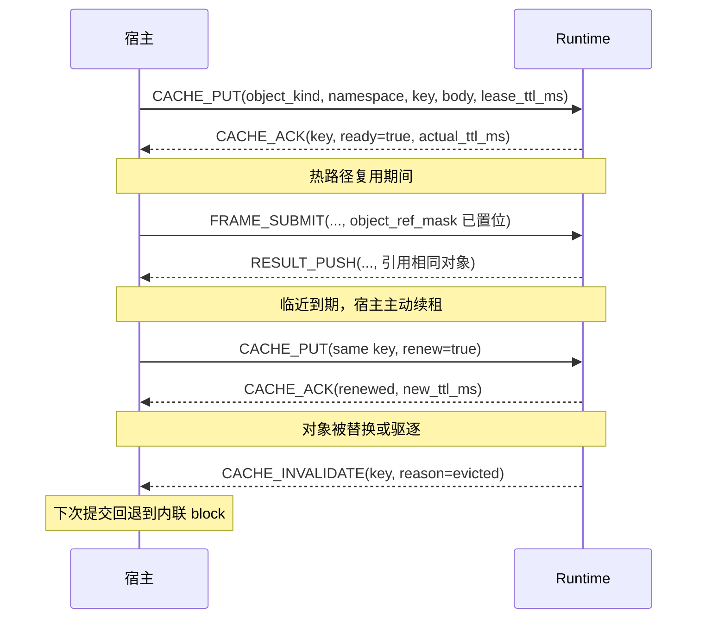

# NNRP/1 缓存能力与租约

缓存不是某个 runtime 的内部优化技巧，而是协议要显式表达的公共能力边界。

## 它在整个协议栈的位置



握手时双方协商缓存能力上限，session 打开时声明租约期望，之后在控制面完成对象安装，热路径帧直接引用而无需重传。

## 规范缓存身份

NNRP/1 的控制面与热路径统一使用同一种缓存身份：

```text
(cache_namespace: u32, cache_key_hi: u64, cache_key_lo: u64)
```

两个 key 字段共同组成一个不透明的 128 位值。实现不得截断任一字段，也不得派生第二套传输层私有 key。namespace 用于限定分配和批量失效范围；即使 key 全局唯一，它仍然是缓存身份的一部分。

`CACHE_INVALIDATE` 按 scope 使用字段：

| Scope | 必填身份字段 | 必须为零的字段 |
| --- | --- | --- |
| `whole_session` | 无 | `cache_namespace`、`cache_key_hi`、`cache_key_lo` |
| `namespace` | `cache_namespace` | `cache_key_hi`、`cache_key_lo` |
| `object_kind` | `cache_namespace`；`cache_key_hi` 低 32 位携带 `u32` object-kind code | `cache_key_hi` 高 32 位、整个 `cache_key_lo` |
| `object_key` | 完整缓存身份 | 无 |

## 缓存 wire metadata

所有整数字段均为小端序。发送方必须把 reserved 字段置零，接收方必须拒绝非零值。

### Object Reference Block

这个 24 字节 block 位于热路径 object-reference region。

| Offset | 字段 | 类型 | 含义 |
| --- | --- | --- | --- |
| `0` | `object_kind` | `u16` | 缓存对象类型。 |
| `2` | `ref_flags` | `u16` | 引用 flags。 |
| `4` | `cache_namespace` | `u32` | 缓存 namespace。 |
| `8` | `cache_key_hi` | `u64` | 缓存 key 高 64 位。 |
| `16` | `cache_key_lo` | `u64` | 缓存 key 低 64 位。 |

### Cache Put Metadata

| Offset | 字段 | 类型 | 含义 |
| --- | --- | --- | --- |
| `0` | `cache_namespace` | `u32` | 缓存 namespace。 |
| `4` | `object_kind` | `u32` | 缓存对象类型。 |
| `8` | `cache_key_hi` | `u64` | 缓存 key 高 64 位。 |
| `16` | `cache_key_lo` | `u64` | 缓存 key 低 64 位。 |
| `24` | `ttl_ms` | `u32` | 请求的租约 TTL。 |
| `28` | `object_bytes` | `u32` | 对象 body 长度。 |
| `32` | `codec_bitmap` | `u32` | 允许的对象 codec。 |
| `36` | `flags` | `u32` | 写入与续租 flags。 |

### Cache Ack Metadata

| Offset | 字段 | 类型 | 含义 |
| --- | --- | --- | --- |
| `0` | `cache_namespace` | `u32` | 缓存 namespace。 |
| `4` | `status` | `u32` | 接受状态。 |
| `8` | `cache_key_hi` | `u64` | 缓存 key 高 64 位。 |
| `16` | `cache_key_lo` | `u64` | 缓存 key 低 64 位。 |
| `24` | `accepted_ttl_ms` | `u32` | 实际授予的租约 TTL。 |
| `28` | `max_object_bytes` | `u32` | 接收方对象大小上限。 |
| `32` | `detail_code` | `u32` | 状态详情。 |
| `36` | `reserved` | `u32` | 必须为零。 |

### Cache Invalidate Metadata

| Offset | 字段 | 类型 | 含义 |
| --- | --- | --- | --- |
| `0` | `invalidate_scope` | `u32` | 失效范围。 |
| `4` | `cache_namespace` | `u32` | namespace selector。 |
| `8` | `cache_key_hi` | `u64` | key 高 64 位或 object-kind selector。 |
| `16` | `cache_key_lo` | `u64` | key 低 64 位。 |
| `24` | `reason_code` | `u32` | 失效原因。 |
| `28` | `reserved` | `u32` | 必须为零。 |

## 对象生命周期时序

下面展示一个低频对象从安装到被引用、再到到期失效的完整流程：



## 为什么还要引入租约

只有"能缓存"还不够。对象池如果没有有效期，会带来三个问题：

- 服务端无法安全回收内存，即使对象已经很久没有被使用。
- 宿主不知道哪些对象还有效，每次提交都得担心 cache miss。
- 当模型更新或上下文切换时，旧对象没有明确的下线路径。

租约给每个对象配了一个可见的 TTL 和续租路径，让双方都能基于协议事件而不是超时猜测做决策。

## 公共层冻结什么，Profile 层冻结什么

| 公共层冻结（所有 profile 共享）| Profile / Runtime 私有 |
|---|---|
| lease contract（TTL、续租、到期策略）| 对象正文的字节布局 |
| object identity（kind、namespace、version）| KV-cache page 编码 |
| dependency 关系语义 | GPU 内存页排布 |
| cache miss / lease expired / dependency invalid 错误 | 模型私有索引结构 |

## 最佳实践

**安装时机**：只把真正被多次引用的大对象放进缓存，单次使用的小 block 直接内联。超过 1 KB 且在同一 session 内会复用两次以上的对象值得进缓存。

**TTL 选择**：`lease_ttl_hint_ms` 应当比你预期的 session 持续时间短 20–30%。如果 session 预计 60 秒，TTL 设到 40 秒并在对象还在用时主动续租，而不是等到到期后再重新安装。

**失效处理**：收到 `CACHE_INVALIDATE` 后，立即把本地引用标记为无效并在下一次提交里切换回内联 block。不要假设同一个 key 仍然有效。

**版本管理**：对象内容变化时换新的 `cache_key`，而不是复用旧 key 覆盖。这样可以避免服务端和宿主之间对"这个 key 指的是哪一版内容"产生分歧。

**观测**：把每次 `CACHE_ACK` 的 `actual_ttl_ms`、每次 `CACHE_INVALIDATE` 的原因字段，以及命中/未命中比例记录下来。这些是判断缓存策略是否有效的唯一稳定依据。

## 这页和其他页的边界

1. 连接、session、operation 的职责边界，继续看"会话与操作模型"。
2. descriptor 与 payload 的固定布局，继续看"类型化载荷描述符"和各 profile 页面。
3. schema 如何成为标准扩展机制，继续看下一页"Schema / Profile Registry"。
