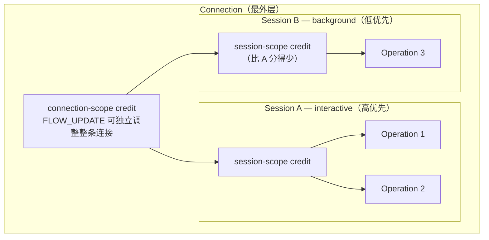
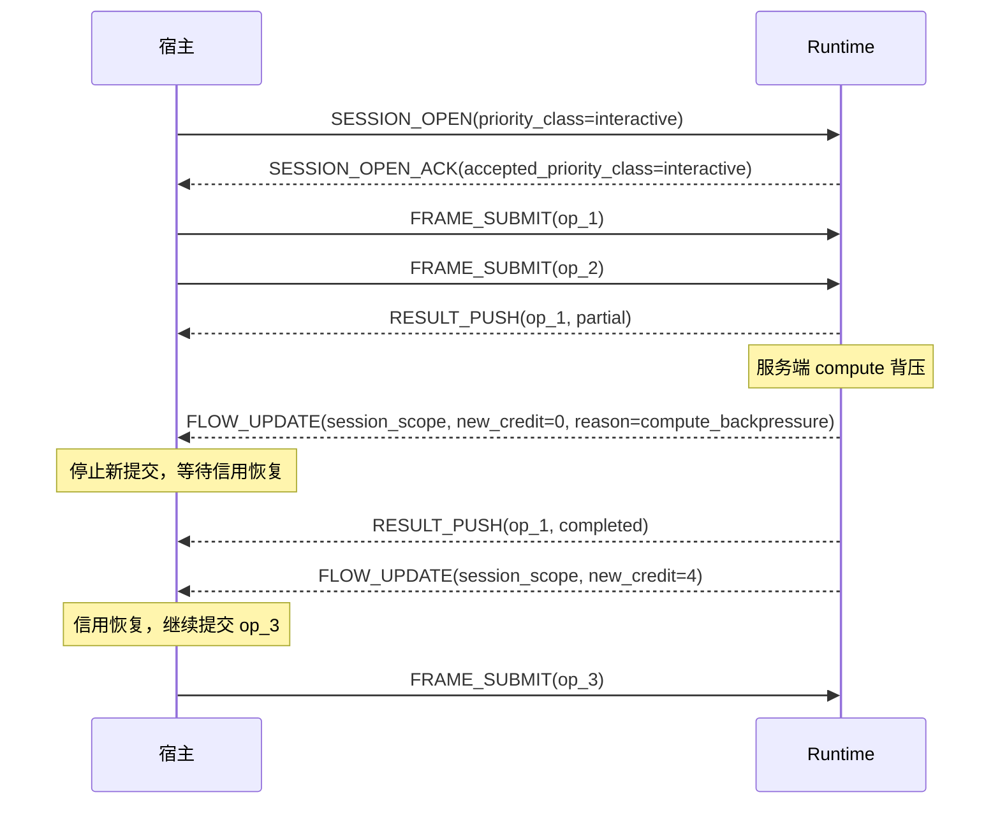
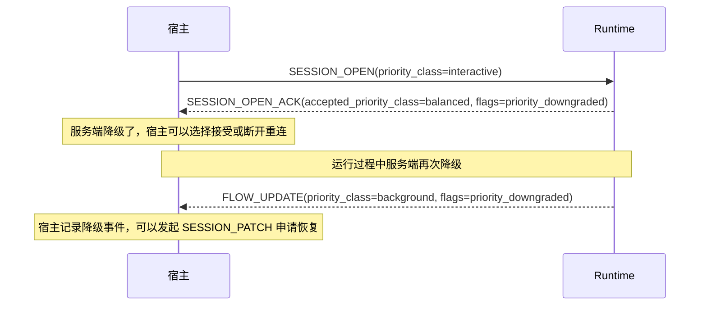

# NNRP/1 流控与优先级

`FLOW_UPDATE` 不是某个 SDK 为了"跑快一点"额外做的内部信道，而是协议级背压、信用和调度语义。

## 三层作用域架构

流控不是一个全局窗口数字，而是分布在三层边界上的信用控制：

每个层级都可以独立收到 `FLOW_UPDATE`。服务端可以只收紧某个 background session，而不影响 interactive session 的正常运行。

## 优先级类与含义

| 优先级类 | 典型场景 | 调度含义 |
|---|---|---|
| `interactive` (0) | 用户直接触发的实时推理 | 优先分配信用，响应延迟最敏感 |
| `balanced` (1) | 批量任务、后台同步 | 默认值，均衡吞吐与延迟 |
| `background` (2) | 离线预处理、预热 | 有空才跑，允许被 interactive session 抢占 |

优先级是调度偏好，不是资源独占承诺。`interactive` session 不保证"永远不排队"，只是在争抢时优先分配信用。

## 背压与恢复时序

## 优先级降级的显式通知

## 最佳实践

**不要把流控当成错误处理**：收到 `FLOW_UPDATE(new_credit=0)` 不是错误，是正常的背压信号。宿主应该暂停提交并等待信用恢复，而不是立刻重连或抛出异常。

**按 session 粒度设置优先级**：把一组逻辑上优先级相同的 operation 放在同一个 session 里，而不是在每个 operation 上重复声明。这样服务端可以对整个会话统一调度。

**区分三种背压来源**：`FLOW_UPDATE` 的 reason 字段会告诉你当前是 `compute_backpressure`、`queue_full` 还是 `transport_congestion`。日志里要记下 reason，不要把三种情况都处理成"等等再试"——它们的恢复策略是不一样的。

**不要轻易申请 interactive 优先级**：如果大部分 session 都声明 `interactive`，服务端调度就失去了意义。只有真正对用户直接可见、延迟敏感的任务才应该用 interactive。

**监控 `priority_downgraded` 事件**：如果你的 interactive session 频繁被降级到 balanced，说明服务端已经过载。这时候应该在应用层减少并发提交量或扩容，而不是继续疯狂重试申请高优先级。

## 这页和其他页的边界

1. connection / session / operation 为何分层，继续看"会话与操作模型"。
2. transport probing 和迁移，继续看"传输策略与探测"。
3. cache miss、lease 事件与 schema mismatch 为什么也会出现在观测面里，分别看"缓存能力与租约"和"Schema / Profile Registry"。