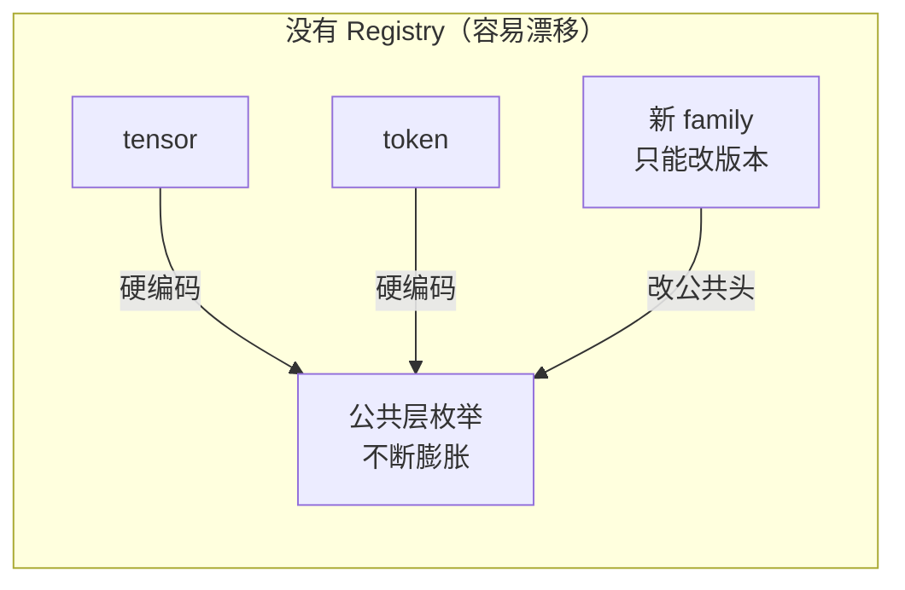
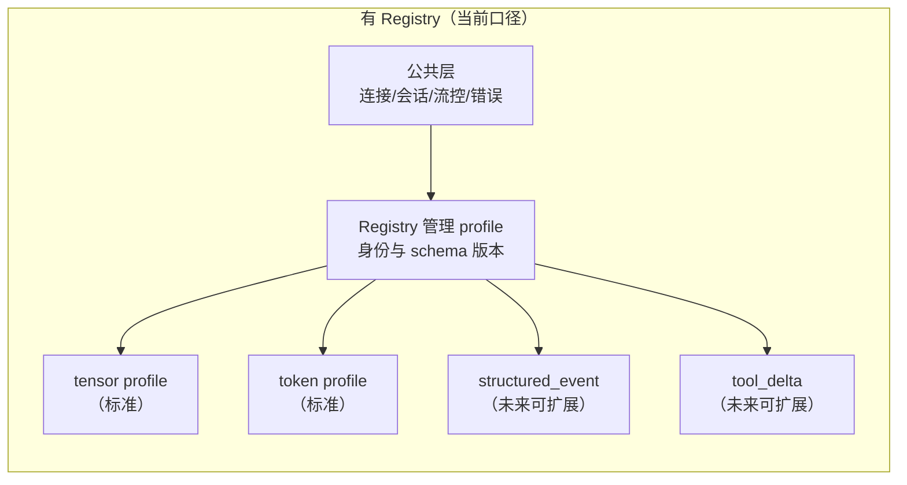
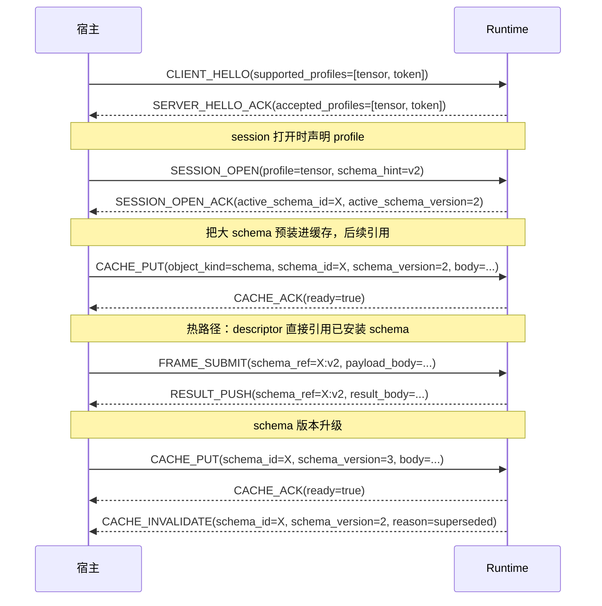

# NNRP/1 Schema / Profile Registry

Typed payload 不应该靠"继续往公共枚举里加新 kind"无限扩展。Registry 把"公共层冻结什么"和"具体 payload 如何扩展"这两件事彻底拆开。

## 没有 Registry 时的问题 vs 有 Registry 时的结构

没有 Registry，每次新增 payload family 都必须修改公共层枚举，导致协议无法稳定：

有了 Registry，公共层冻结，新 payload family 走注册路径接入：

## Registry 在协议交互中的位置

## 公共层 vs Registry 职责边界

| 公共层（所有 profile 共享）| Registry / Profile 私有 |
|---|---|
| connection / session / operation 语义 | profile 逻辑身份与版本 |
| 流控、预算、优先级、错误边界 | descriptor 字段如何被解释 |
| schema object 的 cache / lease 生命周期 | payload 正文格式 |
| schema mismatch / schema miss 错误类型 | 业务专有参数与工具调用正文 |

## 最佳实践

**预装大 schema**：超过几百字节的 schema 定义应该在 session 开始时通过 `CACHE_PUT` 预装，而不是每帧都随 descriptor 内联重发。预装一次，后续所有帧都走 `schema_ref` 引用，节省带宽并保证一致性。

**版本号要稳定**：`schema_id + schema_version` 是逻辑身份，`schema_hash` 只用来做一致性校验。不要把 hash 当 id 用，否则同一 schema 在不同接收端可能算出不同 hash 导致误判 mismatch。

**协商结果要记下来**：`SESSION_OPEN_ACK` 里的 `active_schema_id` 和 `active_schema_version` 就是当前 session 的 schema 事实。宿主侧要把这个记录下来，出现 mismatch 时第一反应是对照这个记录，而不是盲目重试。

**Schema 更新时先装后切换**：在旧 schema 失效之前先把新版本 `CACHE_PUT` 进去，确认 `CACHE_ACK(ready=true)` 后再在后续帧里切换引用。避免"旧 schema 失效了，新 schema 还没装好"的窗口期导致 schema miss 错误。

**扩展新 payload family 走 Registry，不改公共头**：如果你需要支持一种新的 payload 类型，应该走 profile/schema registry 扩展路径，而不是在公共枚举里增加新常量。这样不支持这个 family 的实现可以安全跳过，而不是直接报协议解析错误。

## 这页和其他页的边界

1. descriptor 自身的固定布局，继续看"类型化载荷描述符"。
2. tensor / token 具体字段定义，继续看标准 profiles。
3. cache 和 lease 如何工作，回看上一页"缓存能力与租约"。
4. 多 session 下如何表达背压和优先级，继续看下一页"流控与优先级"。