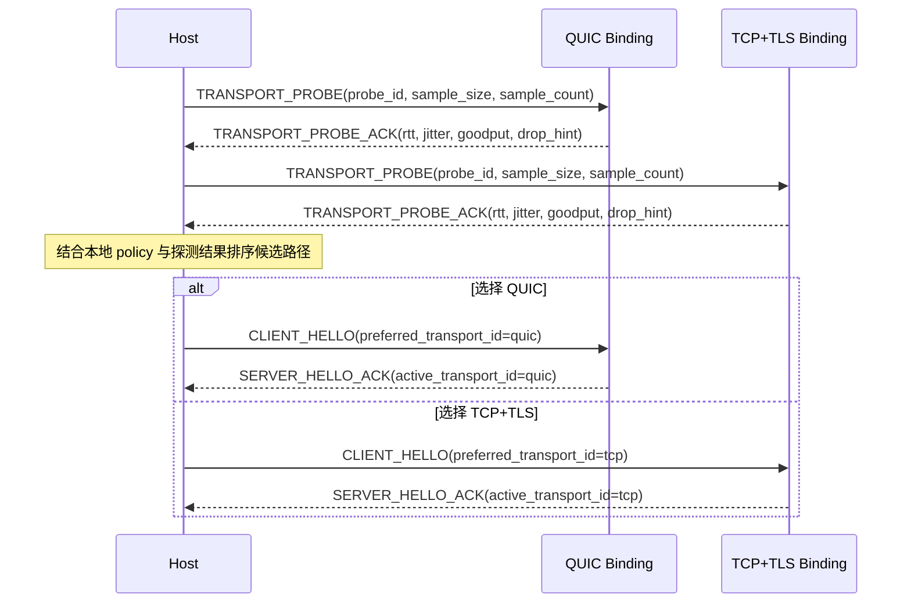

# NNRP/1 传输策略与探测

这不是某个局部实现的优化技巧，而是协议本身必须讲清楚的能力边界。

NNRP 里的“传输”指 NNRP wire protocol 下方的帧承载边界，不是在断言每一种承载都属于传统网络分层里的传输层协议。
TCP、QUIC、IPC、WebSocket 是不同环境下的 carrier binding；它们共同承担的是可靠移动有序 NNRP frame，并提供协议需要的流控、观测和恢复语义。

## 为什么不能把帧承载写死

现实网络并不总是奖励 UDP / QUIC。以中国市场为例，一些运营商并不愿意兼容适配 UDP 业务，会把大量 UDP 流量识别为 PCDN 流量，从而触发限速、惩罚甚至封禁。其他国家和网络环境里，也可能出现类似的商业策略、网络治理策略或设备兼容问题。

如果一个现代应用层协议把自己硬绑定到单一 carrier，它的可达性、吞吐量和稳定性就会直接受制于局部网络政策、宿主运行时和部署环境。NNRP 的目标恰恰相反：把提交、结果、流控和状态语义稳定在应用层，再根据实际环境选择最合适的 carrier binding。

## 协议里长什么样

NNRP 不通过“每种 carrier 一个新的用户侧 scheme”的方式表达选路，而是把 transport 策略做成显式协议语义：

1. endpoint 只保留一个安全入口 `nnrps://`，不把 QUIC、TCP、IPC、WebSocket 等 binding 写进用户侧 URI scheme。
2. 主握手前可以执行 `TRANSPORT_PROBE / TRANSPORT_PROBE_ACK`，用接近真实提交载荷大小的样本测 RTT、抖动和吞吐。
3. `CLIENT_HELLO` 可携带 `transport_policy` 与 `preferred_transport_id`，表达自动选择、偏好某条路径或强制某条路径。
4. `SERVER_HELLO_ACK` 返回被接受的策略和最终生效的 `active_transport_id`，让选路结果变成协议可见事实。
5. 如果链路质量变化，`SESSION_MIGRATE / SESSION_MIGRATE_ACK` 允许在不同 binding 之间延续同一 session，而不是只能断开重连再重建全部上下文。

`unix://`、`npipe://`、`ws://`、`wss://` 这类 URI 是 provider-local locator，适合出现在诊断、conformance fixture
或显式 provider override 中。普通应用侧 NNRP endpoint 应继续保持 `nnrp://` 或 `nnrps://`，除非 SDK 明确暴露了低层 provider API。

## 最小探测时序图



## 探测到底怎么做

最小实现不需要把 probe 做成复杂测速系统，但至少要遵守下面这条顺序：

1. 先根据本地 dial policy 过滤候选 binding，例如 `force_tcp` 时直接跳过 QUIC，不做无意义探测。
2. 对每条候选路径发送一组 `TRANSPORT_PROBE`，每组至少带上 `probe_id`、接近真实业务的 `sample_size`，以及避免偶然值的 `sample_count`。
3. 等每条路径返回 `TRANSPORT_PROBE_ACK` 后，收集往返时间、抖动、有效吞吐和服务端给出的丢包或限速提示。
4. 按统一排序规则比较候选路径，选出本次连接真正要进入主握手的 binding。
5. 把选中的 `preferred_transport_id` 带进 `CLIENT_HELLO`，并以 `SERVER_HELLO_ACK` 返回的 `active_transport_id` 作为最终事实。

## 探测至少要比较什么

probe 不是只看一个 RTT 数字，而是至少要比较四类信号：

1. 可达性：这条路径能不能稳定收发 probe，而不是偶发通一次就算成功。
2. 延迟稳定性：不仅看平均 RTT，还要看抖动和尾延迟，避免选到“均值好看、抖动很大”的路径。
3. 接近真实载荷时的有效吞吐：样本体量要尽量贴近真实提交，否则测出来的只是小包友好度。
4. 退化信号：包括超时、重传、显式 `drop_hint`、服务端限速提示，以及连续 probe 的成功率。

## 冻结的 Provider 元数据

transport provider 元数据属于本地 artifact 元数据，不是 session 级 `CAPABILITY_NEGOTIATION` payload，
实现不得在两者之间自行推导。每个官方 native 或 WASM provider artifact 的 manifest 必须携带一个
`provider` 对象：

```json
{
  "provider": {
    "id": "nnrp.transport.quic.native",
    "cost": { "model_id": 0, "units": "0" },
    "preference_rank": 1,
    "limits": { "max_frame_bytes": "67108864" },
    "limitations": ["requires-udp", "native-host-only"]
  }
}
```

| 字段 | 类型 | 规则 |
|---|---|---|
| `id` | 非空 ASCII 字符串 | 稳定的 provider 标识。官方取值为 `nnrp.transport.<transport>.native` 和 `nnrp.transport.websocket.browser-wasm`。 |
| `cost.model_id` | `u16` | 使用已冻结的 `cost_model_id` 注册表；`0` 表示未指定。 |
| `cost.units` | 规范十进制 `u64` 字符串 | 在指定模型下的静态成本。`model_id` 为 `0` 时必须为 `"0"`。 |
| `preference_rank` | `u16` | 路径质量与可比较成本相同时，值越小越优先。官方默认值为 IPC `0`、QUIC `1`、TCP `2`、WebSocket `3`。 |
| `limits.max_frame_bytes` | 正规范十进制 `u64` 字符串 | provider 可接受的最大完整 NNRP packet。Preview4 官方 artifact 固定为 `"67108864"`。 |
| `limitations` | 已注册字符串数组 | 稳定的部署限制；出现未知值时 artifact 无效。 |

规范十进制 `u64` 字符串只能是 `"0"`，或以 `1` 开头的 ASCII 数字序列；符号、空白、小数点、指数记法和
前导零均无效，解析值不得超过 `18446744073709551615`。

Preview4 limitation 注册表精确固定为：`requires-udp`、`requires-tcp`、`local-host-only`、
`native-host-only`、`browser-host-only`、`unix-domain-socket`、`windows-named-pipe`。SDK 可以应用部署侧
cost 或 preference override，但诊断必须保留 artifact 原始值，并且不得把 `max_frame_bytes` 静默提高到
artifact 限制以上。

官方 artifact 使用下列精确默认值；全部使用 cost `{ "model_id": 0, "units": "0" }` 与
`max_frame_bytes = "67108864"`：

| Artifact | Provider id | Preference rank | Limitations |
|---|---|---:|---|
| Native TCP | `nnrp.transport.tcp.native` | 2 | `requires-tcp`、`native-host-only` |
| Native QUIC | `nnrp.transport.quic.native` | 1 | `requires-udp`、`native-host-only` |
| Unix Native IPC | `nnrp.transport.ipc.native` | 0 | `local-host-only`、`native-host-only`、`unix-domain-socket` |
| Windows Native IPC | `nnrp.transport.ipc.native` | 0 | `local-host-only`、`native-host-only`、`windows-named-pipe` |
| Native WebSocket | `nnrp.transport.websocket.native` | 3 | `requires-tcp`、`native-host-only` |
| Browser WASM WebSocket | `nnrp.transport.websocket.browser-wasm` | 3 | `requires-tcp`、`browser-host-only` |

## 冻结的 Candidate 诊断

四个 SDK 必须暴露语义相同的 candidate 信息，只允许使用各语言惯用的命名风格：

| 规范字段 | 类型 | 含义 |
|---|---|---|
| `transport_id` | `tcp | quic | ipc | websocket` | 当前候选 carrier。 |
| `provider` | provider 元数据 | 上述完整元数据对象。 |
| `local_available` | boolean | artifact 已加载且运行时前置条件通过。 |
| `peer_supported` | boolean | peer capability 交集包含该 carrier。 |
| `within_limits` | boolean | 请求的最大 frame 不超过 `limits.max_frame_bytes`。 |
| `probe_state` | `not-run | succeeded | failed | missing` | 本次选择中的 probe 生命周期。 |
| `probe.sample_count` | `u32` | 参与评分的样本数。 |
| `probe.success_count` | `u32` | 成功样本数。 |
| `probe.median_throughput_bytes_per_sec` | `u64` | 有效吞吐中位数。 |
| `probe.median_rtt_us` | `u64` | 成功样本 RTT 中位数。 |
| `selection_rank` | 可选 `u32` | 确定性排序后，在可用候选中的零基位置。 |
| `rejection_reason` | 已注册字符串或无 | 不能选择该候选的原因。 |
| `diagnostic` | 类型化诊断或无 | 实现侧结构化诊断。 |

`probe` 只在 `probe_state = succeeded` 时存在。`selection_rank` 只为可用且已成功排序的候选提供；被拒绝
候选没有 rank。`sample_count` 必须为正数，`success_count` 必须处于 `1..sample_count`，两个中位数只根据
成功且参与评分的样本计算。

原始 probe sample 归属于 `provider.id`，而不是 package 展示名。仅当 `failed` 与 `timed_out` 均为 false、
`rtt_us` 存在且 `elapsed_us` 为正时，sample 才算成功。单个 sample 的有效吞吐为
`floor(saturating_add(bytes_sent, bytes_received) * 1_000_000 / elapsed_us)`，并饱和到 `u64`。计算任一 median
时，必须将成功 sample 的逐样本值升序排列；奇数个取中间值，偶数个取
`lower + floor((upper - lower) / 2)`。实现不得先聚合 bytes 与 elapsed time 再计算吞吐 median。

rejection 注册表精确固定为：`policy-disallowed`、`local-unavailable`、`peer-unsupported`、
`limit-exceeded`、`probe-missing`、`probe-failed`。SDK 公共 API 不得暴露各语言私有的不透明 `score`；
相同观测必须在所有实现中产生相同排序和诊断。

### 跨 SDK 类型映射

| 规范模型 | Rust | Python | JavaScript / TypeScript | C# |
|---|---|---|---|---|
| Provider cost | `ProviderCost` | `NativeTransportProviderCost` | `NnrpTransportProviderCost` | `NnrpTransportProviderCost` |
| Provider limits | `ProviderLimits` | `NativeTransportProviderLimits` | `NnrpTransportProviderLimits` | `NnrpTransportProviderLimits` |
| Provider limitation | `ProviderLimitation` | `NativeTransportProviderLimitation` | `NnrpTransportProviderLimitation` | `NnrpTransportProviderLimitation` |
| Provider metadata | `TransportProviderMetadata` | `NativeTransportProviderMetadata` | `NnrpTransportProviderMetadata` | `NnrpTransportProviderMetadata` |
| Provider observation | `TransportProviderDescriptor` | `NativeTransportProvider` | `NnrpTransportProviderObservation` | `NnrpTransportProviderDescriptor` |
| Probe state | `ProbeState` | `NativeTransportProbeState` | `NnrpTransportProbeState` | `NnrpTransportProbeState` |
| Probe metrics | `ProbeMetrics` | `NativeTransportProbeMetrics` | `NnrpTransportProbeMetrics` | `NnrpTransportProbeMetrics` |
| Candidate diagnostic | `TransportCandidateDiagnostic` | `NativeTransportCandidateDiagnostic` | `NnrpTransportCandidate` | `NnrpTransportCandidate` |
| Rejection reason | `TransportRejectionReason` | `NativeTransportRejectionReason` | `NnrpTransportRejectionReason` | `NnrpTransportRejectionReason` |

本表中的名称是具有约束力的公共 API 名称。TODO 项只有在每个公共字段都能映射到本规范模型或另一张精确
SDK API 表时，才算已经冻结。

## 冻结的确定性排序

选择必须遵守以下顺序：

1. 先拒绝不满足 policy、本地可用性、peer 支持或 provider limit 的候选。
2. 只有一个可用候选时直接选择，并报告 `probe_state = not-run`。
3. 存在两个或更多可用候选时全部 probe；仅当 `force-*` 已经把候选收敛为一个时跳过。
4. 成功候选依次按 `success_count` 降序、吞吐中位数降序、RTT 中位数升序排列。
5. 上述值相同时，仅在双方非零 `cost.model_id` 相等的情况下，按 `cost.units` 升序比较。
6. 剩余并列依次由显式 `prefer-*` 目标、`provider.preference_rank` 升序、`transport_id` 数值升序和
   `provider.id` 字节序升序打破。
7. 排序后写入 `selection_rank`，选择 rank `0`。

Probe sample 按 `(transport_id, provider.id)` 二元组匹配。Candidate 输出先列出成功排序的 candidates，再按
数字 `transport_id` 与逐字节 `provider.id` 排列被拒绝 candidates。选择错误必须携带完整 candidate 列表，包括
本地、对端、上限、缺少 probe 和 probe 失败诊断。

`force-*` 绝不回退。`prefer-*` 是确定性并列裁决，不允许实现选择已经明确失败或质量显著更差的路径。
Preview4 跨 SDK 契约是这套 comparator，而不是某个实现私有的加权公式。

## 为什么 probe 不能只是 ping

仅看 ICMP ping 或极小包 RTT，无法反映真实业务流量会遭遇的限速策略。很多网络对小包宽松，对大体量 UDP 或持续流量严格得多。

因此，probe 的关键不是“能不能通”，而是“在接近真实载荷体量时，哪条路径的吞吐、抖动和恢复表现更好”。这也是为什么 `TRANSPORT_PROBE` 的 body 要尽量接近真实提交数据量，而不是只发一个很小的心跳包。

## 宿主侧会看到什么

从宿主或客户端视角，通常会经历下面这条链路：

1. 本地 dial policy 先决定是 `auto`、`prefer_quic`、`prefer_tcp` 还是 `force_*`。
2. 如果策略允许自动选路，客户端先在候选 binding 上跑 probe。
3. 选出更合适的路径后，再在该路径上执行 `CLIENT_HELLO / SERVER_HELLO_ACK` 与后续 session 建立。
4. 若运行中网络退化，客户端可以重新探测并发起 `SESSION_MIGRATE`；若迁移失败，再退回到“新建连接 + 新建 session”的保底路径。

## 为什么这必须是协议能力

这件事不能只留给本地选路逻辑，因为它至少涉及四个协议级一致性问题：

1. 客户端与服务端都要看得见 transport 策略和最终结果，不能只靠本地猜测。
2. 所有客户端实现都需要在相似网络条件下做出相近决策，否则同一协议会表现出实现依赖行为差异。
3. 观测、审计和故障定位必须能记录“探测了什么、选了什么、为什么迁移”，这需要统一的协议事件语义。
4. 未来不只是 transport binding，更多内部组件也可能需要策略模式化；如果 transport 已经被正确放进协议层，后续扩展会更干净。
