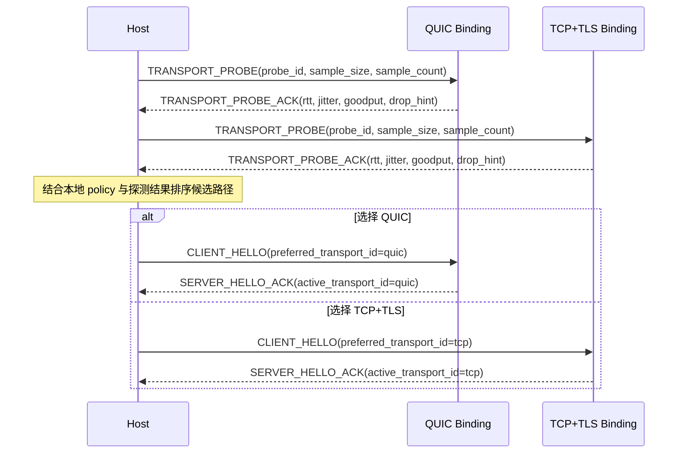

# NNRP/1 传输策略与探测

这不是某个局部实现的优化技巧，而是协议本身必须讲清楚的能力边界。

NNRP 里的“传输”指 NNRP wire protocol 下方的帧承载边界，不是在断言每一种承载都属于传统网络分层里的传输层协议。
TCP、QUIC、IPC、WebSocket 是不同环境下的 carrier binding；它们共同承担的是可靠移动有序 NNRP frame，并提供协议需要的流控、观测和恢复语义。

## 为什么不能把帧承载写死

现实网络并不总是奖励 UDP / QUIC。以中国市场为例，一些运营商并不愿意兼容适配 UDP 业务，会把大量 UDP 流量识别为 PCDN 流量，从而触发限速、惩罚甚至封禁。其他国家和网络环境里，也可能出现类似的商业策略、网络治理策略或设备兼容问题。

如果一个现代应用层协议把自己硬绑定到单一 carrier，它的可达性、吞吐量和稳定性就会直接受制于局部网络政策、宿主运行时和部署环境。NNRP 的目标恰恰相反：把提交、结果、流控和状态语义稳定在应用层，再根据实际环境选择最合适的 carrier binding。

## 协议里长什么样

NNRP 不通过“每种 carrier 一个新的用户侧 scheme”的方式表达选路，而是把 transport 策略做成显式协议语义：

1. 应用 endpoint 始终使用与 carrier 无关的 `nnrp://` / `nnrps://` scheme 族，不把 QUIC、TCP、IPC、WebSocket 等 binding 写进用户侧 URI scheme。
2. 主握手前可以执行 `TRANSPORT_PROBE / TRANSPORT_PROBE_ACK`，用接近真实提交载荷大小的样本测 RTT、抖动和吞吐。
3. `CLIENT_HELLO` 可携带 `transport_policy` 与 `preferred_transport_id`，表达自动选择、偏好某条路径或强制某条路径。
4. `SERVER_HELLO_ACK` 返回被接受的策略和最终生效的 `active_transport_id`，让选路结果变成协议可见事实。
5. 如果链路质量变化，`SESSION_MIGRATE / SESSION_MIGRATE_ACK` 允许在不同 binding 之间延续同一 session，而不是只能断开重连再重建全部上下文。

`unix://`、`npipe://`、`ws://`、`wss://` 这类 URI 是 provider-local locator，适合出现在诊断、conformance fixture
或显式 provider override 中。普通应用侧 NNRP endpoint 应继续保持 `nnrp://` 或 `nnrps://`，除非 SDK 明确暴露了低层 provider API。

## 冻结的宿主 Route 契约

应用 endpoint 无法独自配置每一种 carrier。宿主角色必须持有一个 **provider route set**，而不是让所有
provider 共用一个 provider-local locator 和一份 security。route set 以 `transport_id` 为键；每个键最多
出现一次，并解析到该 transport 在本地注册的 provider。

| 规范字段 | 类型 | 规则 |
|---|---|---|
| `transport_id` | `tcp | quic | ipc | websocket` | Route 标识与查找键，必须匹配已注册 provider descriptor。 |
| `locator` | 可选 provider-local locator | TCP 与 QUIC 可以从应用 endpoint 派生 host 和 port；IPC 与 WebSocket 必须显式提供 locator。 |
| `security` | 可选角色专用 security 对象 | Client route 使用对端校验材料，server route 使用证书和私钥；不同 route 之间绝不隐式共用 security。 |

policy 允许的每个已安装 provider 都必须进入诊断。缺少 route 不等于关闭这个已安装包。客户端在无法
派生 locator 时可以用 `route-unresolved` 拒绝该 candidate，再继续评估其他 Auto/Prefer candidate；强制
选择的 route 无法解析时必须失败且不回退。服务端使用 Auto/Prefer 时必须解析并绑定全部允许的已安装
provider；route 无法解析属于配置错误，因为静默少开一个 listener 会让声明的逻辑服务端不完整。

Route 规范化规则是精确契约。未知 transport key 属于无效配置。为已知但未安装的 transport 提供 route 时，
必须生成 `local-unavailable` candidate，不能凭空安装或合成 provider。已安装 TCP/QUIC 在 route 或 route
locator 缺失时可以派生 locator；已安装 IPC/WebSocket 无法派生 locator。Registry 必须拒绝同一 transport ID
注册多个 provider，因此一个宿主角色对每个规范 transport 最多只有一个 candidate。

Provider 注册同时受两条独立唯一性约束：`transport_id` 必须唯一，因为一个宿主角色对每种规范 carrier
最多持有一个 provider；`provider.id` 也必须唯一，因为诊断和 probe evidence 使用它作为稳定身份。重复注册
属于错误，实现不得静默覆盖先前 provider。

客户端 Auto/Prefer 必须 probe 每个 route 已解析且满足安全要求的 candidate，最终只把选中的 carrier
交给 runtime connection。服务端 Auto/Prefer 必须把全部允许的 provider route 原子地打开成一个逻辑
listener set；Force 只保留指定 transport。任一必需 bind 或 runtime adoption 失败时，服务端必须关闭本次
操作已经打开的全部 listener 并报告失败。Preference 只影响确定性元数据与并列裁决，不能阻止已经打开的
低优先级 listener 接受连接。

宿主 route 层与 runtime carrier 层必须保持分离。选路和多 listener 所有权属于 SDK 宿主 API；
`NnrpClient`、`NnrpServer` 与 native FFI 继续让每个 runtime handle 只接管一个已选连接或一个 provider
listener。实现 route set 时不得引入逐帧跨多个 native library 调用。

### 角色基数不变量

单数 native handle 是实现边界，不是公开角色的基数。每个 SDK 都必须保持下面的区别：

| Surface | Client 基数 | Server 基数 |
|---|---|---|
| 宿主角色 API | 一个应用 endpoint 加一个 route set；Auto/Prefer 可以评估多条 route。 | 一个应用 endpoint 加一个 route set；Auto/Prefer 原子持有全部 eligible listener 组成的集合。 |
| 已选 runtime session | 只接管一条 carrier connection。 | 每个已接受 session 只接管一条 carrier connection。 |
| Native FFI handle | 每个 client handle 只持有一条 carrier connection。 | 每个低层 listener handle 只持有一个 provider listener；每个已接受 session handle 只持有一条 carrier connection。 |

逻辑 server 必须公开每个已打开 listener 的实际 provider endpoint。`accept` 在完整 listener set 上等待；多个
listener 在同一调度轮次 ready 时，使用 policy 的稳定 provider 顺序打破并列。Peer handshake 或 session
拒绝只影响该 accepted carrier；provider listener 的致命失败必须让逻辑 server 进入失败状态、取消 pending
accept 并关闭其余 listener，运行中的 server 不得静默缩成更少 carrier。逻辑 server 的 close 必须幂等，并
关闭其持有的全部 listener 与 accepted session。

Python、JavaScript、C# 与 Rust 的生产 client/server 宿主选项都不得暴露单数 route override。低层 provider
`connect` 或 `listen` 调用仍然接受一个 locator，因为它只操作一个 provider；这个低层单数形式不得向上泄漏并
把宿主 route set 压成单路。

### 应用安全意图

`nnrps://` 声明最低的认证加密要求。`nnrp://` 不强制加密，但也不禁止某条 route 使用加密。candidate
必须在 probe 前完成下列校验：

规范 client security 对象精确包含非空 `server_name` 字符串和非空、由对象持有的
`trusted_certificate_der` bytes。规范 server security 对象精确包含非空、由对象持有的 `certificate_der`
与 `private_key_pkcs8_der` bytes。SDK 可以使用语言惯用大小写，但不得增加 role-wide credential，也不得
静默改用 native 宿主的环境 trust store；浏览器 WebSocket 是下表明确列出的唯一例外。

| Carrier route | 满足 `nnrps://` 的条件 |
|---|---|
| QUIC | 已提供并通过校验的 QUIC TLS client/server 凭据。 |
| TCP | TCP provider 使用 TLS，且 route 带有匹配的 client/server 凭据；明文 TCP 不满足。 |
| IPC | Preview4 不满足；本地文件系统权限或 pipe 访问本身不等于已冻结的认证加密契约。 |
| Native WebSocket | provider locator 使用 `wss://`，且带有匹配的 client/server 凭据；`ws://` 不满足。 |
| Browser WebSocket | provider locator 使用 `wss://`，并由浏览器完成正常的平台 TLS 校验；route 不接受 native DER 凭据字段。 |

不满足安全意图的 candidate 必须以 `security-unsatisfied` 保留在诊断中。给明文 TCP、IPC 或 `ws://`
提供 security、给 server route 提供 client 凭据、或给 client route 提供 server 凭据均为无效配置。
浏览器 WebSocket 的信任由宿主持有，但 `nnrps://` 对应的浏览器 route 仍必须使用 `wss://`。

安全过滤属于 eligibility 判定。server 使用 Auto/Prefer 时，只绑定经过 policy、可用性、locator、平台、limit
与安全检查后仍 eligible 的全部 route。安全不兼容的已安装 provider 仍保留在 diagnostics 中，但不会打开。
对于本来 eligible 的 server provider，缺少 locator 仍是硬配置错误，并触发原子回滚。

### 跨 SDK Route 类型映射

| 规范模型 | Rust | Python | JavaScript / TypeScript | C# |
|---|---|---|---|---|
| Client provider route | `ClientProviderRoute` | `NativeClientProviderRoute` | `NnrpClientProviderRoute` | `NnrpClientProviderRoute` |
| Server provider route | `ServerProviderRoute` | `NativeServerProviderRoute` | `NnrpServerProviderRoute` | `NnrpServerProviderRoute` |
| Client route set | `ClientProviderRoutes` | `Mapping[str, NativeClientProviderRoute]` | `NnrpClientProviderRoutes` | `IReadOnlyDictionary<TransportId, NnrpClientProviderRoute>` |
| Server route set | `ServerProviderRoutes` | `Mapping[str, NativeServerProviderRoute]` | `NnrpServerProviderRoutes` | `IReadOnlyDictionary<TransportId, NnrpServerProviderRoute>` |

| 规范字段 | Rust | Python | JavaScript / TypeScript | C# |
|---|---|---|---|---|
| Route locator | `provider_endpoint` | `provider_endpoint` | `endpoint` | `ProviderEndpoint` |
| Client security | `security: Option<ClientTransportSecurity>` | `security: NativeTransportClientSecurity \| None` | `security?: NnrpTransportClientSecurity` | `Security: NnrpTransportClientSecurity?` |
| Server security | `security: Option<ServerTransportSecurity>` | `security: NativeTransportServerSecurity \| None` | `security?: NnrpTransportServerSecurity` | `Security: NnrpTransportServerSecurity?` |
| 已接受 session carrier | `active_transport_id()` | `active_transport_name` | `activeTransport` | `ActiveTransportId` |
| 实际绑定的 provider endpoint | `bound_provider_endpoints()` | `bound_provider_endpoints` | `boundProviderEndpoints` | `BoundProviderEndpoints` |

Python mapping 的键使用规范 transport 名称；JavaScript route set 是按 `NnrpTransportKind` 索引的只读
partial record；Rust 与 C# 使用 `TransportId`。允许使用各语言惯用大小写，但单数的
`provider_endpoint` / `providerEndpoint` / `ProviderEndpoint` 和角色级共享 `security` 不属于 Preview4
宿主 API。

### 必须执行的宿主级一致性测试

只证明每个 provider 单独可以 connect/listen，并不等于 transport conformance 完整。每个生产 SDK 都必须执行
下列宿主级 E2E 场景：

1. client 至少配置两条可解析 route，按冻结 comparator 探测和选择，并且 runtime session 最终只接管选中的
   carrier。
2. forced client route 绝不 fallback；无法解析或不满足安全要求的 route 使用冻结 rejection reason 留在
   diagnostics 中。
3. server 至少有两条 eligible route 时同时绑定两者，报告两条实际 provider endpoint，分别通过每个 listener
   接受真实 session，并为每个已接受 session 报告 active transport。
4. 任意 server bind 失败时，回滚同一次逻辑 listen 已打开的全部 listener。
5. route-local security 不得在 TCP、QUIC、IPC 与 WebSocket route 之间泄漏。
6. `nnrps://` 必须拒绝明文 TCP、IPC 与 `ws://`；native TLS route 与浏览器 `wss://` 分别遵守各自的凭据所有权规则。
7. 运行中任一 provider listener 发生致命失败时，必须让完整逻辑 listener set 失败并关闭，不能静默降低
   server 基数。

这些场景的 reference 一侧必须是测试套件持有的 wire 行为，不能只让同一 SDK 自己的 client/server adapter 互连后
就判定通过。

## 最小探测时序图



## 探测到底怎么做

最小实现不需要把 probe 做成复杂测速系统，但至少要遵守下面这条顺序：

1. 先根据本地 dial policy 过滤候选 binding，例如 `force_tcp` 时直接跳过 QUIC，不做无意义探测。
2. 对每条候选路径发送一组 `TRANSPORT_PROBE`，每组至少带上 `probe_id`、接近真实业务的 `sample_size`，以及避免偶然值的 `sample_count`。
3. 等每条路径返回 `TRANSPORT_PROBE_ACK` 后，收集往返时间、抖动、有效吞吐和服务端给出的丢包或限速提示。
4. 按统一排序规则比较候选路径，选出本次连接真正要进入主握手的 binding。
5. 把选中的 `preferred_transport_id` 带进 `CLIENT_HELLO`，并以 `SERVER_HELLO_ACK` 返回的 `active_transport_id` 作为最终事实。

## 探测至少要比较什么

probe 不是只看一个 RTT 数字，而是至少要比较四类信号：

1. 可达性：这条路径能不能稳定收发 probe，而不是偶发通一次就算成功。
2. 延迟稳定性：不仅看平均 RTT，还要看抖动和尾延迟，避免选到“均值好看、抖动很大”的路径。
3. 接近真实载荷时的有效吞吐：样本体量要尽量贴近真实提交，否则测出来的只是小包友好度。
4. 退化信号：包括超时、重传、显式 `drop_hint`、服务端限速提示，以及连续 probe 的成功率。

## 冻结的 Provider 元数据

transport provider 元数据属于本地 artifact 元数据，不是 session 级 `CAPABILITY_NEGOTIATION` payload，
实现不得在两者之间自行推导。每个官方 native 或 WASM provider artifact 的 manifest 必须携带一个
`provider` 对象：

```json
{
  "provider": {
    "id": "nnrp.transport.quic.native",
    "cost": { "model_id": 0, "units": "0" },
    "preference_rank": 1,
    "limits": { "max_frame_bytes": "67108864" },
    "limitations": ["requires-udp", "native-host-only"]
  }
}
```

| 字段 | 类型 | 规则 |
|---|---|---|
| `id` | 非空 ASCII 字符串 | 稳定的 provider 标识。官方取值为 `nnrp.transport.<transport>.native` 和 `nnrp.transport.websocket.browser-wasm`。 |
| `cost.model_id` | `u16` | 使用已冻结的 `cost_model_id` 注册表；`0` 表示未指定。 |
| `cost.units` | 规范十进制 `u64` 字符串 | 在指定模型下的静态成本。`model_id` 为 `0` 时必须为 `"0"`。 |
| `preference_rank` | `u16` | 路径质量与可比较成本相同时，值越小越优先。官方默认值为 IPC `0`、QUIC `1`、TCP `2`、WebSocket `3`。 |
| `limits.max_frame_bytes` | 正规范十进制 `u64` 字符串 | provider 可接受的最大完整 NNRP packet。Preview4 官方 artifact 固定为 `"67108864"`。 |
| `limitations` | 已注册字符串数组 | 稳定的部署限制；出现未知值时 artifact 无效。 |

规范十进制 `u64` 字符串只能是 `"0"`，或以 `1` 开头的 ASCII 数字序列；符号、空白、小数点、指数记法和
前导零均无效，解析值不得超过 `18446744073709551615`。

Preview4 limitation 注册表精确固定为：`requires-udp`、`requires-tcp`、`local-host-only`、
`native-host-only`、`browser-host-only`、`unix-domain-socket`、`windows-named-pipe`。SDK 可以应用部署侧
cost 或 preference override，但诊断必须保留 artifact 原始值，并且不得把 `max_frame_bytes` 静默提高到
artifact 限制以上。

官方 artifact 使用下列精确默认值；全部使用 cost `{ "model_id": 0, "units": "0" }` 与
`max_frame_bytes = "67108864"`：

| Artifact | Provider id | Preference rank | Limitations |
|---|---|---:|---|
| Native TCP | `nnrp.transport.tcp.native` | 2 | `requires-tcp`、`native-host-only` |
| Native QUIC | `nnrp.transport.quic.native` | 1 | `requires-udp`、`native-host-only` |
| Unix Native IPC | `nnrp.transport.ipc.native` | 0 | `local-host-only`、`native-host-only`、`unix-domain-socket` |
| Windows Native IPC | `nnrp.transport.ipc.native` | 0 | `local-host-only`、`native-host-only`、`windows-named-pipe` |
| Native WebSocket | `nnrp.transport.websocket.native` | 3 | `requires-tcp`、`native-host-only` |
| Browser WASM WebSocket | `nnrp.transport.websocket.browser-wasm` | 3 | `requires-tcp`、`browser-host-only` |

## 冻结的 Candidate 诊断

四个 SDK 必须暴露语义相同的 candidate 信息，只允许使用各语言惯用的命名风格：

| 规范字段 | 类型 | 含义 |
|---|---|---|
| `transport_id` | `tcp | quic | ipc | websocket` | 当前候选 carrier。 |
| `provider` | provider 元数据 | 上述完整元数据对象。 |
| `local_available` | boolean | artifact 已加载且运行时前置条件通过。 |
| `peer_supported` | boolean | peer capability 交集包含该 carrier。 |
| `within_limits` | boolean | 请求的最大 frame 不超过 `limits.max_frame_bytes`。 |
| `probe_state` | `not-run | succeeded | failed | missing` | 本次选择中的 probe 生命周期。 |
| `probe.sample_count` | `u32` | 参与评分的样本数。 |
| `probe.success_count` | `u32` | 成功样本数。 |
| `probe.median_throughput_bytes_per_sec` | `u64` | 有效吞吐中位数。 |
| `probe.median_rtt_us` | `u64` | 成功样本 RTT 中位数。 |
| `selection_rank` | 可选 `u32` | 确定性排序后，在可用候选中的零基位置。 |
| `rejection_reason` | 已注册字符串或无 | 不能选择该候选的原因。 |
| `diagnostic` | 类型化诊断或无 | 实现侧结构化诊断。 |

`probe` 只在 `probe_state = succeeded` 时存在。`selection_rank` 只为可用且已成功排序的候选提供；被拒绝
候选没有 rank。`sample_count` 必须为正数，`success_count` 必须处于 `1..sample_count`，两个中位数只根据
成功且参与评分的样本计算。

### 冻结的选择证据

宿主在调用确定性 selector 前解析 provider-local route 并执行 probe。结果必须通过两个显式 evidence record
跨越 selector 边界；SDK 不得把它们藏在实现私有 closure 中、不得在选择完成后回写 candidate，也不得把失败
probe 退化成缺少 metrics。

| Record | 规范字段 | 类型 | 规则 |
|---|---|---|---|
| Candidate readiness | `transport_id` | 已注册 transport ID | 必须标识 candidate provider 的 carrier。 |
| Candidate readiness | `provider_id` | 非空 ASCII 字符串 | 必须等于 candidate provider metadata id。 |
| Candidate readiness | `route_resolved` | boolean | False 产生 `route-unresolved`。 |
| Candidate readiness | `security_satisfied` | boolean | route 解析成功后，False 产生 `security-unsatisfied`。 |
| Candidate readiness | `diagnostic` | 可选 typed diagnostic | 保留到 candidate。 |
| Probe observation | `transport_id` | 已注册 transport ID | 必须标识被观测 candidate 的 carrier。 |
| Probe observation | `provider_id` | 非空 ASCII 字符串 | 必须等于被观测 candidate provider metadata id。 |
| Probe observation | `state` | `succeeded | failed` | 没有匹配 observation 表示 `missing`；`not-run` 只由 selector 输出。 |
| Probe observation | `metrics` | 可选 probe metrics | `succeeded` 时必需，`failed` 时禁止。 |
| Probe observation | `diagnostic` | 可选 typed diagnostic | 失败时保留，也可以伴随成功 observation。 |

Evidence 按 `(transport_id, provider_id)` 匹配。重复或无法匹配的 readiness/probe observation 都是无效输入。
角色级选择必须为每个已注册 provider 提供一条 readiness；缺失 readiness 不代表可以假定 route 存在。低层
诊断或 conformance API 在 route/security 检查不属于自身职责时，可以显式构造 ready record。

无效 evidence 必须在 candidate selection 开始前通过该语言类型化的 transport-selection 契约错误拒绝。
由于 selection 尚未运行，这类契约错误不得伪造 candidate diagnostic。完整 candidate 列表要求适用于
evidence 有效、已经进入 selection、但最终没有 provider 可选的失败。

过滤后只有一个 eligible candidate 时，selector 直接选择并输出 `probe_state = not-run`，probe observation
不参与排序。保留两个及以上 candidate 时，每个 eligible candidate 都需要一条 probe observation；缺失产生
`probe-missing`，失败产生 `probe-failed`，成功 observation 的 metrics 进入确定性排序。

原始 probe sample 归属于 `provider.id`，而不是 package 展示名。仅当 `failed` 与 `timed_out` 均为 false、
`rtt_us` 存在且 `elapsed_us` 为正时，sample 才算成功。单个 sample 的有效吞吐为
`floor(saturating_add(bytes_sent, bytes_received) * 1_000_000 / elapsed_us)`，并饱和到 `u64`。计算任一 median
时，必须将成功 sample 的逐样本值升序排列；奇数个取中间值，偶数个取
`lower + floor((upper - lower) / 2)`。实现不得先聚合 bytes 与 elapsed time 再计算吞吐 median。

rejection 注册表精确固定为：`policy-disallowed`、`local-unavailable`、`peer-unsupported`、
`limit-exceeded`、`route-unresolved`、`security-unsatisfied`、`probe-missing`、`probe-failed`。SDK 公共 API 不得暴露各语言私有的不透明 `score`；
相同观测必须在所有实现中产生相同排序和诊断。

每个 candidate 最多携带一个 rejection reason。多个条件同时失败时，严格采用上面 registry 顺序中第一个
适用项。Locator 解析因此先于 security 校验：缺少必需 locator 的 IPC/WebSocket candidate 是
`route-unresolved`；route 已解析后，`nnrps://` 下的 IPC 或明文 WS 才是 `security-unsatisfied`。
`probe-missing` 与 `probe-failed` 只在全部 pre-probe 检查通过后参与判定。

### 跨 SDK 类型映射

| 规范模型 | Rust | Python | JavaScript / TypeScript | C# |
|---|---|---|---|---|
| Provider cost | `ProviderCost` | `NativeTransportProviderCost` | `NnrpTransportProviderCost` | `NnrpTransportProviderCost` |
| Provider limits | `ProviderLimits` | `NativeTransportProviderLimits` | `NnrpTransportProviderLimits` | `NnrpTransportProviderLimits` |
| Provider limitation | `ProviderLimitation` | `NativeTransportProviderLimitation` | `NnrpTransportProviderLimitation` | `NnrpTransportProviderLimitation` |
| Provider metadata | `TransportProviderMetadata` | `NativeTransportProviderMetadata` | `NnrpTransportProviderMetadata` | `NnrpTransportProviderMetadata` |
| Provider observation | `TransportProviderDescriptor` | `NativeTransportProvider` | `NnrpTransportProviderObservation` | `NnrpTransportProviderDescriptor` |
| Candidate readiness | `TransportCandidateReadiness` | `NativeTransportCandidateReadiness` | `NnrpTransportCandidateReadiness` | `NnrpTransportCandidateReadiness` |
| Probe observation | `TransportProbeObservation` | `NativeTransportProbeObservation` | `NnrpTransportProbeObservation` | `NnrpTransportProbeObservation` |
| Probe state | `ProbeState` | `NativeTransportProbeState` | `NnrpTransportProbeState` | `NnrpTransportProbeState` |
| Probe metrics | `ProbeMetrics` | `NativeTransportProbeMetrics` | `NnrpTransportProbeMetrics` | `NnrpTransportProbeMetrics` |
| Candidate diagnostic | `TransportCandidateDiagnostic` | `NativeTransportCandidateDiagnostic` | `NnrpTransportCandidate` | `NnrpTransportCandidate` |
| Rejection reason | `TransportRejectionReason` | `NativeTransportRejectionReason` | `NnrpTransportRejectionReason` | `NnrpTransportRejectionReason` |
| Selection failure | `TransportSelectionError` | `NativeTransportSelectionError` | `NnrpTransportSelectionError` | `NnrpTransportSelectionException` |

本表中的名称是具有约束力的公共 API 名称。TODO 项只有在每个公共字段都能映射到本规范模型或另一张精确
SDK API 表时，才算已经冻结。

## 冻结的确定性排序

选择必须遵守以下顺序：

1. 先拒绝不满足 policy、本地可用性、peer 支持、provider limit、route 解析或应用安全意图的候选。
2. 只有一个可用候选时直接选择，并报告 `probe_state = not-run`。
3. 存在两个或更多可用候选时全部 probe；仅当 `force-*` 已经把候选收敛为一个时跳过。
4. 成功候选依次按 `success_count` 降序、吞吐中位数降序、RTT 中位数升序排列。
5. 上述值相同时，仅在双方非零 `cost.model_id` 相等的情况下，按 `cost.units` 升序比较。
6. 剩余并列依次由显式 `prefer-*` 目标、`provider.preference_rank` 升序、`transport_id` 数值升序和
   `provider.id` 字节序升序打破。
7. 排序后写入 `selection_rank`，选择 rank `0`。

Probe observation 与原始 sample 按 `(transport_id, provider.id)` 二元组匹配。Candidate 输出先列出成功排序的 candidates，再按
数字 `transport_id` 与逐字节 `provider.id` 排列被拒绝 candidates。选择错误必须携带完整 candidate 列表，包括
本地、对端、上限、缺少 probe 和 probe 失败诊断。

`force-*` 绝不回退。`prefer-*` 是确定性并列裁决，不允许实现选择已经明确失败或质量显著更差的路径。
Preview4 跨 SDK 契约是这套 comparator，而不是某个实现私有的加权公式。

## 为什么 probe 不能只是 ping

仅看 ICMP ping 或极小包 RTT，无法反映真实业务流量会遭遇的限速策略。很多网络对小包宽松，对大体量 UDP 或持续流量严格得多。

因此，probe 的关键不是“能不能通”，而是“在接近真实载荷体量时，哪条路径的吞吐、抖动和恢复表现更好”。这也是为什么 `TRANSPORT_PROBE` 的 body 要尽量接近真实提交数据量，而不是只发一个很小的心跳包。

## 宿主侧会看到什么

从宿主或客户端视角，通常会经历下面这条链路：

1. 本地 dial policy 先决定是 `auto`、`prefer_quic`、`prefer_tcp` 还是 `force_*`。
2. 如果策略允许自动选路，客户端先在候选 binding 上跑 probe。
3. 选出更合适的路径后，再在该路径上执行 `CLIENT_HELLO / SERVER_HELLO_ACK` 与后续 session 建立。
4. 若运行中网络退化，客户端可以重新探测并发起 `SESSION_MIGRATE`；若迁移失败，再退回到“新建连接 + 新建 session”的保底路径。

## 为什么这必须是协议能力

这件事不能只留给本地选路逻辑，因为它至少涉及四个协议级一致性问题：

1. 客户端与服务端都要看得见 transport 策略和最终结果，不能只靠本地猜测。
2. 所有客户端实现都需要在相似网络条件下做出相近决策，否则同一协议会表现出实现依赖行为差异。
3. 观测、审计和故障定位必须能记录“探测了什么、选了什么、为什么迁移”，这需要统一的协议事件语义。
4. 未来不只是 transport binding，更多内部组件也可能需要策略模式化；如果 transport 已经被正确放进协议层，后续扩展会更干净。
